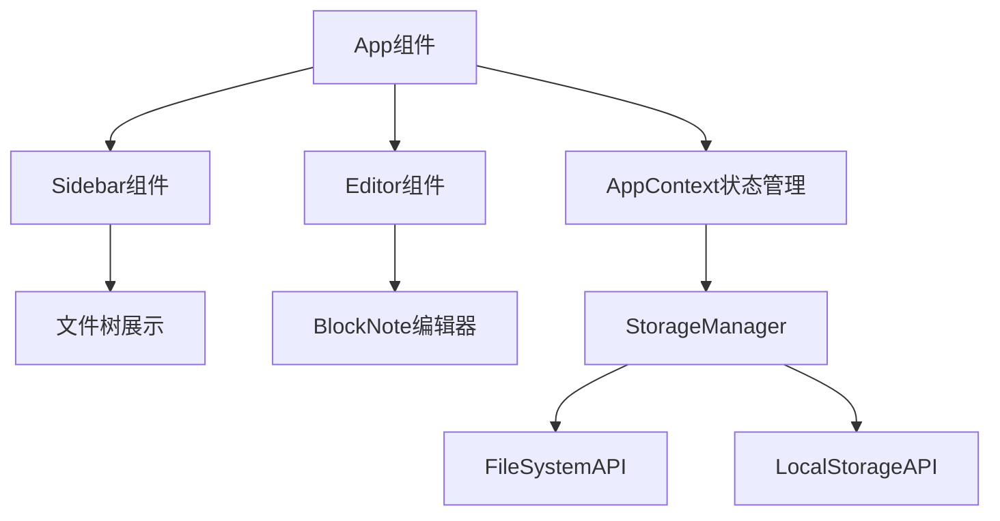
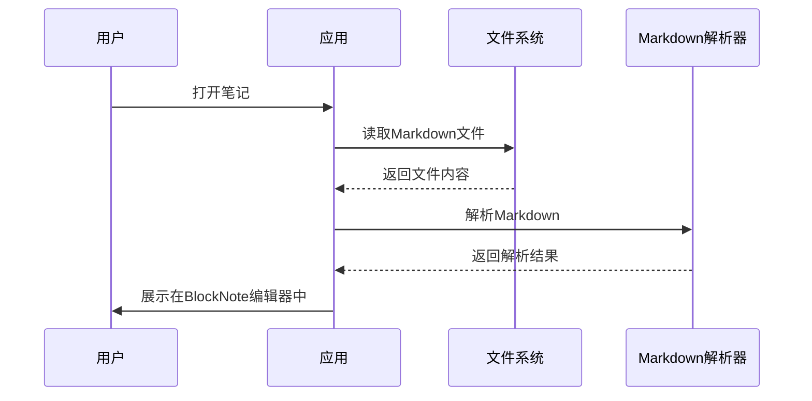
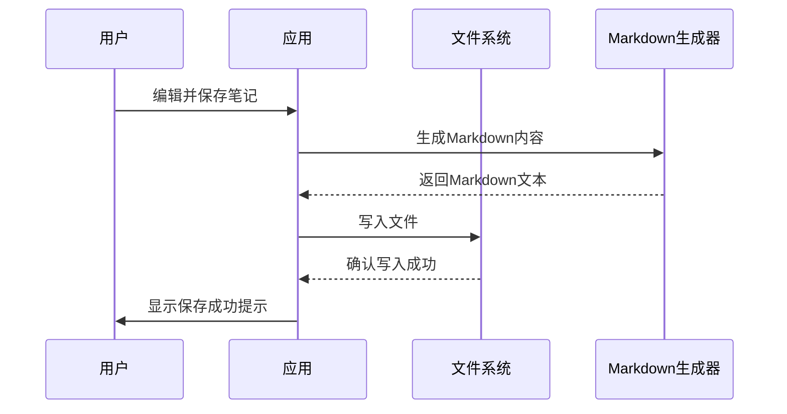
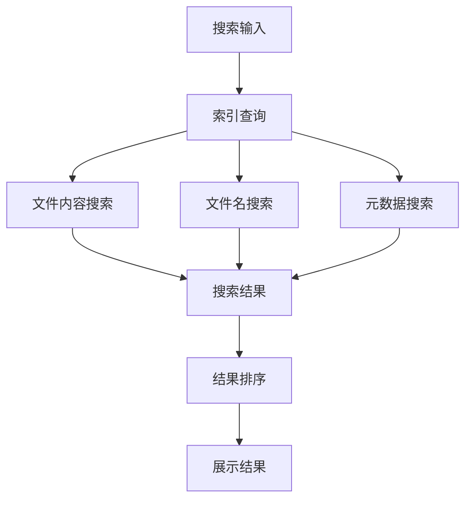
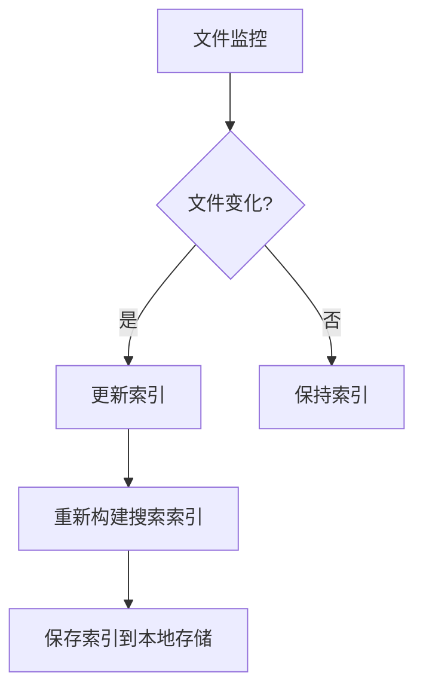

# 基于本地Markdown的笔记管理与搜索系统设计

## 1. 概述

### 1.1 项目背景
本项目旨在构建一个类似Obsidian的笔记应用，使用本地Markdown文件作为笔记存储格式。用户可以将现有的Markdown笔记文件组织在`notes-md`目录中，并通过应用进行浏览、编辑和搜索。

### 1.2 核心功能
- 本地Markdown文件读取与展示
- 笔记目录结构映射
- 全文搜索功能
- 笔记编辑与保存
- 文件夹组织结构

### 1.3 技术栈
- 前端框架: React + TypeScript + Vite
- 富文本编辑器: BlockNote
- 语法高亮: Shiki
- 状态管理: React Context API + useReducer
- 本地存储: localStorage + 文件系统API

## 2. 架构设计

### 2.1 整体架构图
```mermaid
graph TD
    A[用户界面] --> B[应用状态管理]
    B --> C[文件系统API]
    B --> D[本地存储(localStorage)]
    C --> E[notes-md目录]
    D --> F[应用数据(笔记状态等)]
    B --> G[搜索引擎]
    G --> H[索引数据库]
```

### 2.2 组件架构


### 2.3 数据流向
1. 应用启动时扫描`notes-md`目录，构建文件树结构
2. 用户选择笔记时，读取对应的Markdown文件内容
3. 编辑内容通过BlockNote编辑器处理
4. 保存时将内容写回原Markdown文件
5. 搜索时建立索引并查询匹配内容

## 3. 文件系统集成设计

### 3.1 目录结构映射
将本地文件系统中的目录结构映射为应用中的笔记组织结构：

| 本地路径 | 应用中表示 |
|---------|-----------|
| notes-md/Learn/AI/Ollama.md | Learn/AI/Ollama.md |
| notes-md/Learn/Cloud/Docker/DockerFile.md | Learn/Cloud/Docker/DockerFile.md |

### 3.2 文件读取机制


### 3.3 文件写入机制


## 4. 搜索功能设计

### 4.1 搜索架构


### 4.2 索引策略
为了提高搜索性能，采用以下索引策略：

1. **文件名索引**：对所有文件名建立索引
2. **内容索引**：对文件内容建立全文索引
3. **元数据索引**：对文件修改时间、大小等元数据建立索引

### 4.3 索引更新机制


### 4.4 搜索算法
采用多维度搜索算法：
1. 文件名匹配（权重最高）
2. 内容关键词匹配
3. 元数据匹配（如修改时间）

## 5. 数据模型设计

### 5.1 笔记数据结构
| 字段 | 类型 | 描述 |
|------|------|------|
| id | string | 笔记唯一标识符 |
| title | string | 笔记标题 |
| filePath | string | 文件在系统中的路径 |
| content | string | 笔记内容(Markdown格式) |
| parentId | string (可选) | 父文件夹ID |
| isFolder | boolean | 是否为文件夹 |
| createdAt | Date | 创建时间 |
| updatedAt | Date | 更新时间 |

### 5.2 索引数据结构
| 字段 | 类型 | 描述 |
|------|------|------|
| fileId | string | 关联的文件ID |
| fileName | string | 文件名 |
| contentPreview | string | 内容预览 |
| keywords | string[] | 提取的关键词 |
| lastModified | Date | 最后修改时间 |

## 6. 性能优化策略

### 6.1 文件读取优化
1. 懒加载：仅在用户打开笔记时才读取文件内容
2. 缓存机制：将最近访问的文件内容缓存在内存中
3. 分页加载：对于大型目录，采用分页方式加载文件列表

### 6.2 搜索性能优化
1. 索引预构建：应用启动时构建初始索引
2. 增量更新：仅对发生变化的文件更新索引
3. 搜索结果缓存：缓存最近的搜索结果
4. 异步搜索：避免阻塞UI线程

### 6.3 内存管理
1. 定时清理：定期清理未使用的缓存数据
2. 内容压缩：对大文件内容进行压缩存储
3. 虚拟滚动：对于长列表使用虚拟滚动技术

## 7. 安全与权限设计

### 7.1 文件访问权限
- 仅允许访问`notes-md`目录下的文件
- 防止路径遍历攻击
- 验证文件扩展名（仅允许.md文件）

### 7.2 数据保护
- 用户编辑的内容自动保存到本地存储
- 提供数据导出功能
- 实现版本控制机制（可选）

## 8. 测试策略

### 8.1 单元测试
1. 文件系统API接口测试
2. Markdown解析与生成测试
3. 搜索功能测试
4. 索引更新机制测试

### 8.2 集成测试
1. 文件读取与展示流程测试
2. 编辑与保存流程测试
3. 搜索功能全流程测试
4. 大型目录性能测试

### 8.3 用户界面测试
1. 文件树导航测试
2. 编辑器功能测试
3. 搜索界面交互测试