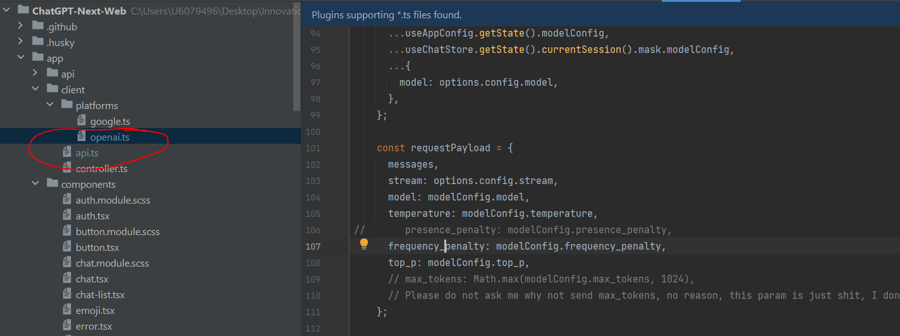

```
docker run -d -p 3000:3000 \
   -e OPENAI_API_KEY=sk-87-jkSfpDpI7sOmo_9vmBQ \
   -e CODE=#11223344.@ \
   -e BASE_URL=http://10.35.45.98:8000 \
   -e CUSTOM_MODELS=-all,+phi,+gemma,+mistral,+mixtral,+yi-34b,+llama2-70b \
   my-chat:latest yidadaa/chatgpt-next-web
   
docker run -d -p 3000:3000 \
   -e OPENAI_API_KEY=sk-87-jkSfpDpI7sOmo_9vmBQ \
   -e CODE=#11223344.@ \
   -e BASE_URL=http://10.35.45.98:8000 \
   -e CUSTOM_MODELS=-all,+phi,+gemma,+mistral,+mixtral,+yi-34b,+llama2-70b \
```

修改代码：ollama暂时不支持这个参数presence_penalty

