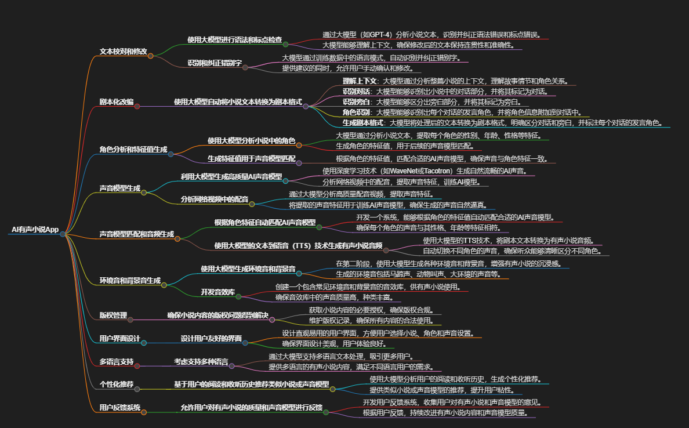

```


- **AI有声小说App**
  - **文本校对和修改**
    - **使用大模型进行语法和标点检查**
      - 通过大模型（如GPT-4）分析小说文本，识别并纠正语法错误和标点错误。
      - 大模型能够理解上下文，确保修改后的文本保持连贯性和准确性。
    - **识别和纠正错别字**
      - 大模型通过训练数据中的语言模式，自动识别并纠正错别字。
      - 提供建议的同时，允许用户手动确认和修改。

  - **剧本化改编**
    - **使用大模型自动将小说文本转换为剧本格式**
      - **理解上下文**：大模型通过分析整篇小说的上下文，理解故事情节和角色关系。
      - **识别对话**：大模型能够识别出小说中的对话部分，并将其标记为对话。
      - **识别旁白**：大模型能够区分出旁白部分，并将其标记为旁白。
      - **角色识别**：大模型能够识别出每个对话的发言角色，并将角色信息附加到对话中。
      - **生成剧本格式**：大模型将处理后的文本转换为剧本格式，明确区分对话和旁白，并标注每个对话的发言角色。

  - **角色分析和特征值生成**
    - **使用大模型分析小说中的角色**
      - 大模型通过分析小说文本，提取每个角色的性别、年龄、性格等特征。
      - 生成角色的特征值，用于后续的声音模型匹配。
    - **生成特征值用于声音模型匹配**
      - 根据角色的特征值，匹配合适的AI声音模型，确保声音与角色特征一致。

  - **声音模型生成**
    - **利用大模型生成高质量AI声音模型**
      - 使用深度学习技术（如WaveNet或Tacotron）生成自然流畅的AI声音。
      - 分析网络视频中的配音，提取声音特征，训练AI模型。
    - **分析网络视频中的配音**
      - 通过大模型分析高质量配音视频，提取声音特征。
      - 将提取的声音特征用于训练AI声音模型，确保生成的声音自然逼真。

  - **声音模型匹配和音频生成**
    - **根据角色特征自动匹配AI声音模型**
      - 开发一个系统，能够根据角色的特征值自动匹配合适的AI声音模型。
      - 确保每个角色的声音与其性格、年龄等特征相符。
    - **使用大模型的文本到语音（TTS）技术生成有声小说音频**
      - 使用大模型的TTS技术，将剧本文本转换为有声小说音频。
      - 自动切换不同角色的声音，确保听众能够清晰区分不同角色。

  - **环境音和背景音生成**
    - **使用大模型生成环境音和背景音**
      - 在第二阶段，使用大模型生成各种环境音和背景音，增强有声小说的沉浸感。
      - 生成的环境音包括马蹄声、动物叫声、大环境的声音等。
    - **开发音效库**
      - 创建一个包含常见环境音和背景音的音效库，供有声小说使用。
      - 确保音效库中的声音质量高，种类丰富。

  - **版权管理**
    - **确保小说内容的版权问题得到解决**
      - 获取小说内容的必要授权，确保版权合规。
      - 维护版权记录，确保所有内容的合法使用。

  - **用户界面设计**
    - **设计用户友好的界面**
      - 设计直观易用的用户界面，方便用户选择小说、角色和声音设置。
      - 确保界面设计美观，用户体验良好。

  - **多语言支持**
    - **考虑支持多种语言**
      - 通过大模型支持多语言文本处理，吸引更多用户。
      - 提供多语言的有声小说内容，满足不同语言用户的需求。

  - **个性化推荐**
    - **基于用户的阅读和收听历史推荐类似小说或声音模型**
      - 使用大模型分析用户的阅读和收听历史，生成个性化推荐。
      - 提供类似小说或声音模型的推荐，提升用户粘性。

  - **用户反馈系统**
    - **允许用户对有声小说的质量和声音模型进行反馈**
      - 开发用户反馈系统，收集用户对有声小说和声音模型的意见。
      - 根据用户反馈，持续改进有声小说内容和声音模型质量。

```

