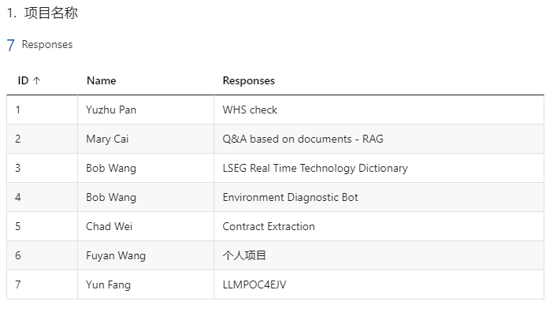

[https://forms.office.com/Pages/DesignPageV2.aspx?prevorigin=shell&origin=NeoPortalPage&subpage=design&id=Dp9-KOyR8Ey3pMY4mAchgQxrs5xSIXlIuYOrft1vjBNUOEpRR08xVUJVME1BWFUxTjBTWUtOMk5ORC4u&analysis=false&tab=0](https://forms.office.com/Pages/DesignPageV2.aspx?prevorigin=shell&origin=NeoPortalPage&subpage=design&id=Dp9-KOyR8Ey3pMY4mAchgQxrs5xSIXlIuYOrft1vjBNUOEpRR08xVUJVME1BWFUxTjBTWUtOMk5ORC4u&analysis=false&tab=0)

[https://lsegroup.sharepoint.com/teams/ChinaInnovationForum/SitePages/Beijing-AI-Lab-Cookbook.aspx?promotedState=0](https://lsegroup.sharepoint.com/teams/ChinaInnovationForum/SitePages/Beijing-AI-Lab-Cookbook.aspx?promotedState=0)

2024-04-01 + yun.fang total: 7

2024-04-29 + venus.liu total 8



```
[
    {
        "token": "2c064ea241fbd3bfdc4644eda5b5501713add92cf87ae6d9c4f31d232d141000",
        "key_name": null,
        "key_alias": null,
        "spend": 0.0,
        "expires": null,
        "models": [],
        "aliases": {},
        "config": {},
        "user_id": "default_user_id",
        "team_id": "None",
        "max_parallel_requests": null,
        "metadata": {},
        "tpm_limit": null,
        "rpm_limit": null,
        "max_budget": null,
        "budget_duration": null,
        "budget_reset_at": null
    },
    {
        "token": "0d4967d118e996d35eeb785c11932f3bc1cd9d40ce77a97fefaf6a3b43b5d1a2",
        "key_name": null,
        "key_alias": null,
        "spend": 0.0,
        "expires": "2026-11-24T03:48:38.801000Z",
        "models": [],
        "aliases": {},
        "config": {},
        "user_id": "cb106724-dcfe-4c13-8adc-451d290339c4",
        "team_id": "haiyang.wang",
        "max_parallel_requests": null,
        "metadata": {
            "user": "haiyang.wang"
        },
        "tpm_limit": null,
        "rpm_limit": null,
        "max_budget": null,
        "budget_duration": null,
        "budget_reset_at": null
    },
    {
        "token": "35527642e6716f9ed6d4046f3f7e8b20cf70dcfc9e08f1e7b29a7c5951b06216",
        "key_name": null,
        "key_alias": null,
        "spend": 0.0,
        "expires": "2026-11-24T03:53:50.008000Z",
        "models": [],
        "aliases": {},
        "config": {},
        "user_id": "1254e4c3-ff86-43cf-9ffb-3e4da8b76034",
        "team_id": "ning.tang",
        "max_parallel_requests": null,
        "metadata": {
            "user": "ning.tang"
        },
        "tpm_limit": null,
        "rpm_limit": null,
        "max_budget": null,
        "budget_duration": null,
        "budget_reset_at": null
    },
    {
        "token": "f480e7b4a92dbea715fa0bc29610109d81e322cf687ec55980ae3d798c33163a",
        "key_name": null,
        "key_alias": null,
        "spend": 0.0,
        "expires": "2026-12-07T04:11:17.702000Z",
        "models": [],
        "aliases": {},
        "config": {},
        "user_id": "44606855-2da6-4ed3-93f4-29443971b192",
        "team_id": "qianyi.xu",
        "max_parallel_requests": null,
        "metadata": {
            "user": "qianyi.xu"
        },
        "tpm_limit": null,
        "rpm_limit": null,
        "max_budget": null,
        "budget_duration": null,
        "budget_reset_at": null
    },
    {
        "token": "a786f5a87b2f512207034e7b6e2991cc55910a93c98c96fcb6f16ff0a84ff262",
        "key_name": null,
        "key_alias": null,
        "spend": 0.0,
        "expires": "2026-12-01T06:42:59.402000Z",
        "models": [],
        "aliases": {},
        "config": {},
        "user_id": "8130fbf6-685a-47b7-adf0-9158cddb7b49",
        "team_id": "fuyan.wang",
        "max_parallel_requests": null,
        "metadata": {
            "user": "fuyan.wang"
        },
        "tpm_limit": null,
        "rpm_limit": null,
        "max_budget": null,
        "budget_duration": null,
        "budget_reset_at": null
    },
    {
        "token": "86d09a2acaf3f29d047c5c89fd95e6b09e7e7b6a47a0db127fc28f9ebf7ac12e",
        "key_name": null,
        "key_alias": null,
        "spend": 0.0,
        "expires": "2026-12-01T09:55:24.358000Z",
        "models": [],
        "aliases": {},
        "config": {},
        "user_id": "84504942-2bc6-471c-b2c9-d1604607e711",
        "team_id": "tiffany.gong",
        "max_parallel_requests": null,
        "metadata": {
            "user": "tiffany.gong"
        },
        "tpm_limit": null,
        "rpm_limit": null,
        "max_budget": null,
        "budget_duration": null,
        "budget_reset_at": null
    },
    {
        "token": "0b8c6848a0893fc092cfc60a51eda0379011cf534133f0dc1f09a4a41d964f08",
        "key_name": null,
        "key_alias": null,
        "spend": 0.0,
        "expires": "2026-11-25T07:24:44.215000Z",
        "models": [],
        "aliases": {},
        "config": {},
        "user_id": "32972ce4-920d-4f79-b501-264ca2c97ebc",
        "team_id": "bob.wang",
        "max_parallel_requests": null,
        "metadata": {
            "user": "bob.wang"
        },
        "tpm_limit": null,
        "rpm_limit": null,
        "max_budget": null,
        "budget_duration": null,
        "budget_reset_at": null
    },
    {
        "token": "da4d7118a5c41877ddc86bf9bd938eb96965a38b044181d3408211c219152fdb",
        "key_name": null,
        "key_alias": null,
        "spend": 0.0,
        "expires": "2026-11-24T03:53:15.478000Z",
        "models": [],
        "aliases": {},
        "config": {},
        "user_id": "6d7124da-e615-4984-86a4-6839977cac0d",
        "team_id": "zansong.zhu",
        "max_parallel_requests": null,
        "metadata": {
            "user": "zansong.zhu"
        },
        "tpm_limit": null,
        "rpm_limit": null,
        "max_budget": null,
        "budget_duration": null,
        "budget_reset_at": null
    },
    {
        "token": "b571126bb87247250835c270ce2027df7d23481078f07f8a4ba1b1d665c19a02",
        "key_name": null,
        "key_alias": null,
        "spend": 0.0,
        "expires": "2026-11-25T07:25:18.978000Z",
        "models": [],
        "aliases": {},
        "config": {},
        "user_id": "fef9599d-e500-4a82-a4bb-a2dea4b7305a",
        "team_id": "mary.cai",
        "max_parallel_requests": null,
        "metadata": {
            "user": "mary.cai"
        },
        "tpm_limit": null,
        "rpm_limit": null,
        "max_budget": null,
        "budget_duration": null,
        "budget_reset_at": null
    },
    {
        "token": "4a597c5bcb27d529d727900752a8717fcbd3f00ce31fd6e6c7d0f300c7c53601",
        "key_name": null,
        "key_alias": null,
        "spend": 0.0,
        "expires": "2026-11-25T07:25:57.481000Z",
        "models": [],
        "aliases": {},
        "config": {},
        "user_id": "f1c7ee26-7df8-438a-9ac8-74a1b52916a6",
        "team_id": "yuzhu.pan",
        "max_parallel_requests": null,
        "metadata": {
            "user": "yuzhu.pan"
        },
        "tpm_limit": null,
        "rpm_limit": null,
        "max_budget": null,
        "budget_duration": null,
        "budget_reset_at": null
    },
    {
        "token": "df28321a93b0b6989a8bd0f144374c14e51919d515a399d630317b234095680f",
        "key_name": null,
        "key_alias": null,
        "spend": 0.0,
        "expires": "2026-11-24T03:52:24.976000Z",
        "models": [],
        "aliases": {},
        "config": {},
        "user_id": "e5f14708-bf84-4c7a-9e95-b9f82ee4d5e1",
        "team_id": "chad.wei",
        "max_parallel_requests": null,
        "metadata": {
            "user": "chad.wei"
        },
        "tpm_limit": null,
        "rpm_limit": null,
        "max_budget": null,
        "budget_duration": null,
        "budget_reset_at": null
    },
    {
        "token": "5e54ed0f00074a688bebbfb5a691dc26f949650992a31f4fa428183c8b642907",
        "key_name": null,
        "key_alias": null,
        "spend": 0.0,
        "expires": "2026-11-24T02:02:20.208000Z",
        "models": [],
        "aliases": {},
        "config": {},
        "user_id": "a59922cb-b068-49ac-843e-0968eca2d098",
        "team_id": "jason.guo",
        "max_parallel_requests": null,
        "metadata": {
            "user": "jason.guo"
        },
        "tpm_limit": null,
        "rpm_limit": null,
        "max_budget": null,
        "budget_duration": null,
        "budget_reset_at": null
    },
    {
        "token": "a8575c6b1b66e735175d41e7065c767a079d06e2d54330320c9878d8209a0bc1",
        "key_name": null,
        "key_alias": null,
        "spend": 0.0,
        "expires": "2026-11-25T07:23:53.856000Z",
        "models": [],
        "aliases": {},
        "config": {},
        "user_id": "83e5ebea-c8f9-4533-9ef7-217e9866633c",
        "team_id": "josh.yang",
        "max_parallel_requests": null,
        "metadata": {
            "user": "josh.yang"
        },
        "tpm_limit": null,
        "rpm_limit": null,
        "max_budget": null,
        "budget_duration": null,
        "budget_reset_at": null
    },
    {
        "token": "859dc16e55838371d268a614f5a26b1ffbb8a810cd1e8b5116370cdbc662290c",
        "key_name": null,
        "key_alias": null,
        "spend": 0.0,
        "expires": "2026-12-26T06:25:19.396000Z",
        "models": [],
        "aliases": {},
        "config": {},
        "user_id": "52ab88cf-2991-4e40-baf5-15ac2455ffe1",
        "team_id": "yun.fang",
        "max_parallel_requests": null,
        "metadata": {
            "user": "yun.fang"
        },
        "tpm_limit": null,
        "rpm_limit": null,
        "max_budget": null,
        "budget_duration": null,
        "budget_reset_at": null
    }
]
```