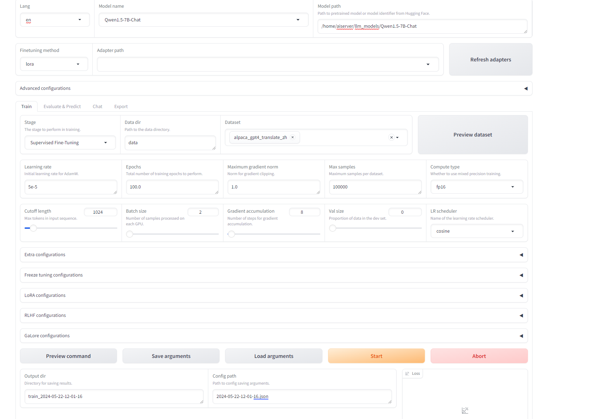

10.35.45.98:7860

```
在大型模型的训练过程中，这些术语代表不同的训练方法和策略：
Supervised Fine-Tuning (SFT): 这是一种有监督的微调方法，通常用于在预训练模型的基础上进一步训练，以适应特定的任务或数据集。通过SFT，模型可以学习理解领域内的问题并进行回答。
Reward Modeling: 这是一种训练策略，通过模拟人类的偏好来训练一个评分模型。这个模型可以用来指导强化学习算法，使其生成的回答更符合人类的偏好。
Proximal Policy Optimization (PPO): PPO是一种强化学习算法，用于优化策略，使其在给定的环境中获得最大的预期回报。它通过限制策略更新的幅度来避免训练过程中的不稳定性。
Direct Policy Optimization (DPO): DPO是一种相对简单的直接策略优化方法，它直接在策略空间中寻找最优策略，而不是通过模拟人类反馈来优化。
Pre-Training: 预训练是训练大型模型的第一步，通常在大量的通用数据上进行，目的是让模型学习语言、知识和任务执行的基本能力。

LoRA（Low-Rank Adaptation of Large Language Models）和QLoRA都是用于大型语言模型微调的技术。
LoRA的核心思想是基于大模型的内在低秩特性，增加旁路矩阵来模拟全参数微调123。在训练过程中，原始预训练语言模型的参数被固定，只训练降维矩阵A和升维矩阵B1。训练完成后，将B矩阵与A矩阵相乘后合并预训练模型参数作为微调后的模型参数1。这种方法显著降低了计算和存储成本，同时保持了模型性能3。
QLoRA是一种将高精度计算技术与低精度存储方法相结合的微调技术456。QLoRA通过一个冻结的4位量化预训练语言模型向低秩适配器（LoRA）反向传播梯度6。这使得在单个48GB的GPU上微调65B的参数模型成为可能，同时保留完整的16位微调任务性能6。
这两种技术都有助于在保持模型性能的同时，降低微调大型语言模型的计算和存储成本。这对于资源有限但需要微调大型模型的场景非常有用。例如，对于一些特定的NLP任务，如文本生成、情感分析、问答系统等，这些技术可以帮助提高模型的效率和性能。

```

```
git clone https://github.com/hiyouga/LLaMA-Factory.git
conda create -n llama_factory python=3.10
conda activate llama_factory
cd LLaMA-Factory
pip install -r requirements.txt
pip install -e .[metrics]
```

如果报找不到bitedanceso, libbitsandbytes_cuda128.so

那需要重新编译

[bitsandbytes](https://huggingface.co/docs/bitsandbytes/main/en/installation)

启动web

```
nohup llamafactory-cli webui > llamafactory-cli.log 2>&1 &
```



多GPU训练

```
CUDA_VISIBLE_DEVICES=0,1,2,3 accelerate launch \
    --config_file examples/accelerate/single_config.yaml \
    src/train_bash.py \
    --stage sft \
    --do_train True \
    --model_name_or_path /home/aiserver/llm_models/Qwen1.5-7B-Chat \
    --finetuning_type lora \
    --template qwen \
    --dataset_dir data \
    --dataset alpaca_gpt4_translate_zh \
    --cutoff_len 1024 \
    --learning_rate 5e-05 \
    --num_train_epochs 100.0 \
    --max_samples 100000 \
    --per_device_train_batch_size 2 \
    --gradient_accumulation_steps 8 \
    --lr_scheduler_type cosine \
    --max_grad_norm 1.0 \
    --logging_steps 5 \
    --save_steps 100 \
    --warmup_steps 0 \
    --optim adamw_torch \
    --report_to none \
    --output_dir saves/Qwen1.5-7B-Chat/lora/train_2024-04-02-22-15-33 \
    --fp16 True \
    --lora_rank 8 \
    --lora_alpha 16 \
    --lora_dropout 0.1 \
    --lora_target q_proj,v_proj \
    --plot_loss True
```

```
CUDA_VISIBLE_DEVICES=0,1,2,3 accelerate launch \
    --config_file examples/accelerate/single_config.yaml \
    src/train_bash.py \
    --stage sft \
    --do_train True \
    --model_name_or_path /home/aiserver/llm_models/Qwen1.5-7B-Chat \
    --finetuning_type lora \
    --template qwen \
    --dataset_dir data \
    --dataset alpaca_gpt4_translate_zh_10w \
    --cutoff_len 1024 \
    --learning_rate 5e-05 \
    --num_train_epochs 100.0 \
    --max_samples 500000 \
    --per_device_train_batch_size 2 \
    --gradient_accumulation_steps 8 \
    --lr_scheduler_type cosine \
    --max_grad_norm 1.0 \
    --logging_steps 5 \
    --save_steps 100 \
    --warmup_steps 0 \
    --optim adamw_torch \
    --report_to none \
    --output_dir saves/Qwen1.5-7B-Chat/lora/train_2024-04-03-13-04-44 \
    --fp16 True \
    --lora_rank 8 \
    --lora_alpha 16 \
    --lora_dropout 0.1 \
    --lora_target q_proj,v_proj \
    --plot_loss True
```

预训练可以用c4_demo.json,

```
[
  {
  "text": "Don’t think you need all the bells and whistles? No problem. McKinley Heating Service Experts Heating & Air Conditioning offers basic air cleaners that work to improve the quality of the air in your home without breaking the bank. It is a low-cost solution that will ensure you and your family are living comfortably.\nIt’s a good idea to understand the efficiency rate of the filters, which measures what size of molecules can get through the filter. Basic air cleaners can filter some of the dust, dander and pollen that need to be removed. They are 85% efficient, and usually have a 6-inch cleaning surface.\nBasic air cleaners are not too expensive and do the job well. If you do want to hear more about upgrading from a basic air cleaner, let the NATE-certified experts at McKinley Heating Service Experts in Edmonton talk to you about their selection.\nEither way, now’s a perfect time to enhance and protect the indoor air quality in your home, for you and your loved ones.\nIf you want expert advice and quality service in Edmonton, give McKinley Heating Service Experts a call at 780-800-7092 to get your questions or concerns related to your HVAC system addressed."  
    },  
    {
    "text": "To the apparent surprise of everyone, the Walt Disney Company has announced a deal to purchase Lucasfilm Ltd. According to the official press release, Disney has agreed to fork over $4.05 billion in cash and stock for George Lucas’ studio in a deal that brings together two of the world’s most important intellectual property libraries.\nAs you might expect, Disney is itching to take advantage of its new toys. “This transaction combines a world-class portfolio of content including Star Wars, one of the greatest family entertainment franchises of all time, with Disney’s unique and unparalleled creativity across multiple platforms, businesses, and markets to generate sustained growth and drive significant long-term value,” said Disney CEO Robert Iger in this afternoon’s announcement.\nUnder the terms of this agreement Disney will acquire control over all Lucasfilm iterations. This includes both its traditional film-making studio facilities, as well as the various technologies Lucasfilm has created over the years to further its various media properties. Thus, the gigantic Disney family now includes Lucasfilm itself, special effects house Industrial Light & Magic, Skywalker Sound and LucasArts, the company’s video game creation division.\nThis acquisition alone would be huge news, but as if to pre-empt fan speculation on the future of Star Wars the same announcement also mentions that a new Star Wars movie is scheduled to appear in 2015. Though the vast majority of recent Star Wars media has been focused on the property’s various animated iterations and LEGO crossovers, this new film will be the first official cinematic continuation of George Lucas’ original Star Wars trilogy. Though very few details are offered on this film, it has officially been dubbed Star Wars: Episode VII, and barring any major catastrophes it should hit theaters at some point in 2015 (if we had to guess, we’d assume an early summer release in keeping with the tradition established by its predecessors).\nPerhaps even more intriguing however, is the announcement’s claim that Episode VII’s release will herald a new era in which new Star Wars movies hit theaters “every two to three years.” It specifically mentions Episodes VIII and IX by name, though offers no solid details on either film.\nWhile the effects of the move won’t be fully known for at least a few months, we can think of a number of a things this new union might change. For instance, currently Dark Horse Comics publishes all Star Wars comic books, but with Disney owning Marvel Comics we can’t see that agreement lasting for long. Likewise, both Disney and Lucasfilm have sizable divisions dedicated to creating video games based on their various media properties. Normally these companies have had to seek outside publishing agreements, but now that they’ve joined forces and massively expanded the number of games either company is capable of releasing in any given year, it makes a lot of sense for Disney to invest in its own games publishing wing.\nFinally, this agreement almost certainly heralds future crossovers between Disney and Lucasfilm characters. We don’t know any specifics, but it’s only a matter of time before we see toys depicting Mickey Mouse dressed as Darth Vader. Whether that sounds awesome or stomach-churningly disgusting is entirely up to your rapidly waning sense of childhood whimsy.\nUpdate: Scratch that last prediction. Apparently Disney characters dressed as Star Wars characters is already a thing.\nOur partnership with LucasFilm has produced over 20 yrs worth of stories. We have Star Wars for the near future, and hope for years to come."  
    }
]
```

SFT alpaca_data_*.json

```
[
  {
    "instruction": "将BSIC Group翻译成中文。",    "input": "",    "output": "BSIC 集团"  
  },  
  {
    "instruction": "将Emirates NBD翻译成中文。",    "input": "",    "output": "阿联酋迪拜国民银行"  
  }
]
```