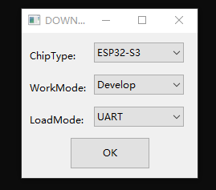
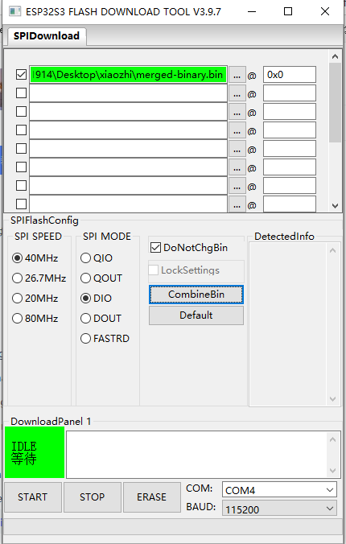

[https://github.com/78/xiaozhi-esp32](https://github.com/78/xiaozhi-esp32)

烧录

编译

vscode 插件 esp-idf

安装idf后

 idf.py set-target esp32s3 

idf.py menuconfig ==》进入Xiaozhi Assistant选项==》选择需要编译的板子固件后按键盘的‘S’键保存 然后Esc退出menuconfig==》idf.py build==》输入idf.py build flash monitor进行下载和显示日志

idf.py -p COM5 build flash monitor 