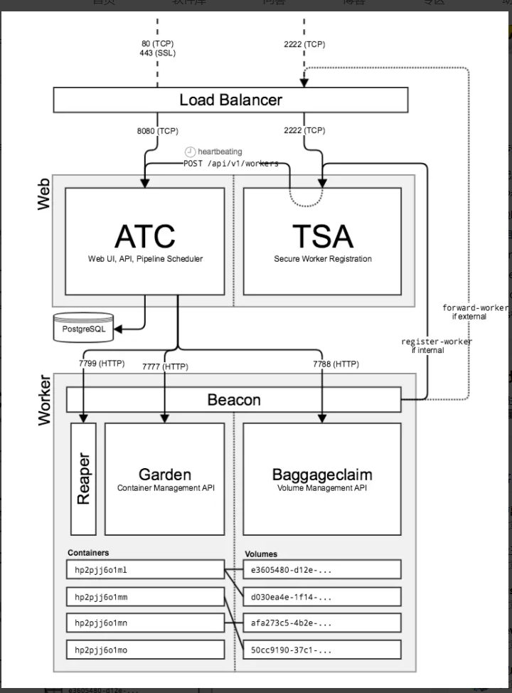

https://vleue.com/docs/architecture.html

https://docs.pivotal.io/p-concourse/v3/architecture/

组件

1，ATC，在8080端口运行concourse web UI，规划pipeline运行的vms

2，TSA，一个自定义的ssh服务器，侦听于2222端口，为ATC和外部worker vms间通信提供ssh tunnel，并每隔30秒心跳检查workers

3，beacon，发送garden和baggageclaim的地址给ATC，为ATC和worker间通信联系TSA开启ssh tunnel

worker运行两种服务：garden和baggageclaim

4，garden，一个容器runtime，侦听于7777端口，提供http api给ATC管理容器

5，baggageclaim，侦听于7788端口，提供http api给ATC管理disk或挂在到容器的卷资源，提供缓存

6，postgresql，存储worker VMs用到的构建配置、日志和资源版本等pipeline信息

7，fly，用于配置pipeline，和ATC互动的CLI

concourse服务有一个web节点、一个worker节点和一个postgresql节点组成。