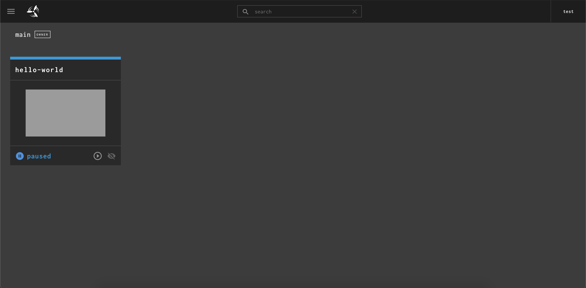
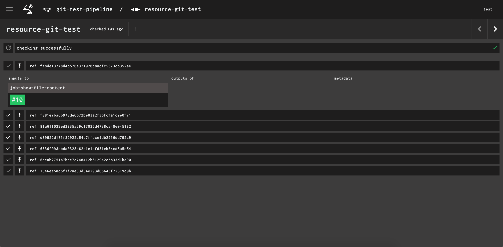
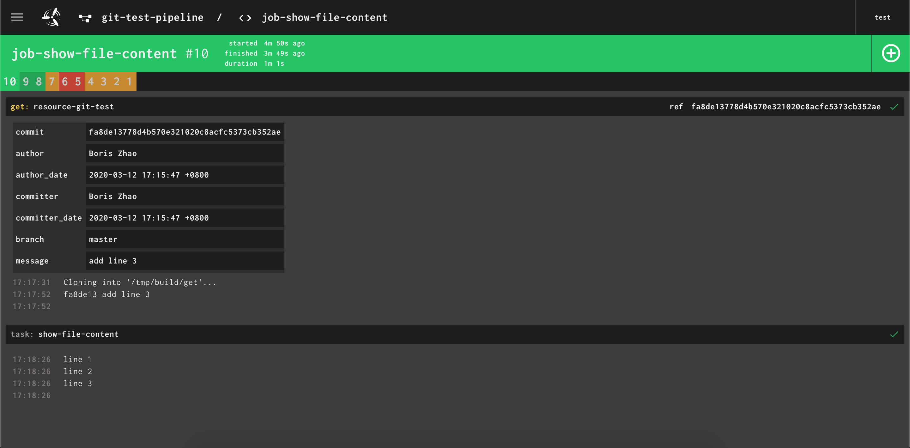

https://www.boris1993.com/tools/concourse/concourse-quick-start.html

最近公司需要用到一个名叫 Concourse CI 的 CI/CD 工具，那么我当然就要学习一下啦。顺便还能水一篇，啊不，写一篇博客，当作学习过程中的笔记。

安装 Concourse CI

Concourse 在 concourse-docker - GitHub提供了现成的 docker-compose 配置文件。

首先需要克隆这个库：

|   |   |
| - | - |
| 1 2 3 4 5 6 7 8 | $ git clone https://github.com/concourse/concourse-docker.git Cloning into 'concourse-docker'... remote: Enumerating objects: 3, done. remote: Counting objects: 100% (3/3), done. remote: Compressing objects: 100% (3/3), done. remote: Total 388 (delta 0), reused 1 (delta 0), pack-reused 385 Receiving objects: 100% (388/388), 66.29 KiB | 205.00 KiB/s, done. Resolving deltas: 100% (200/200), done. |

进入 concourse-docker，分别执行下面两个命令完成密钥生成和系统启动：

|   |   |
| - | - |
| 1 2 3 4 5 6 7 8 9 10 11 12 13 14 15 | $ cd concourse-docker \# 生成密钥 $ ./keys/generate \# 第一次运行时会先下载concourse的Docker镜像，Docker输出这里略掉 wrote private key to /keys/session\_signing\_key wrote private key to /keys/tsa\_host\_key wrote ssh public key to /keys/tsa\_host\_key.pub wrote private key to /keys/worker\_key wrote ssh public key to /keys/worker\_key.pub \# 启动concourse $ docker-compose up -d Creating network "concourse-docker\_default" with the default driver Creating concourse-docker\_db\_1 ... done Creating concourse-docker\_web\_1 ... done Creating concourse-docker\_worker\_1 ... done |

然后，用浏览器打开 http://localhost:8080，检查 Concourse 是否启动成功。

安装 Fly CLI

虽然 Concourse 带有一个 Web 界面，但是我们在 Web 界面里面干不了什么，因为它的所有管理操作都需要通过它的 Fly CLI 来完成。

要安装 Fly CLI，你可以从刚才打开的 Dashboard 里面下载，也可以到 Concourse 的 GitHub Releases中下载。

macOS 用户可能会想，我能不能用 Homebrew 来安装这个东西？一开始我也是这么想的，但是后面我发现，在 Homebrew 官方源里面的版本并没有随着 Concourse 的发布而更新，虽然我在 Issues 里翻出来一个个人维护的 tap，但最后还是不想用。

所以，最后我选择直接从 Dashboard 里面下载，然后将其移动到 /usr/local/bin 中。

Hello World

世间万物都可以从一个 hello world 学起，Concourse 也不例外。

首先，需要在 Fly CLI 中登陆。

|   |   |
| - | - |
| 1 2 3 4 5 | $ fly -t tutorial login -c http://localhost:8080 -u test -p test logging in to team 'main'   target saved |

上面命令中，我们创建了一个叫做 tutorial 的目标 (target)，地址是 http://localhost:8080，也就是我们刚才启动的这个节点，以 test:test 登陆。如果要想看一下 Fly CLI 中已保存的 target，可以执行这条命令：

|   |   |
| - | - |
| 1 2 3 | $ fly targets name      url                    team  expiry tutorial  http://localhost:8080  main  Wed, 11 Mar 2020 07:40:34 UTC |

然后，我们跟着 Concourse Tutorial[3] 中 Hello World 一节的描述，把这个 task 执行起来。

|   |   |
| - | - |
| 1 2 3 4 5 6 7 8 9 10 11 12 13 14 15 16 17 18 19 20 21 22 23 24 25 26 27 28 | $ git clone https://github.com/starkandwayne/concourse-tutorial.git Cloning into 'concourse-tutorial'... remote: Enumerating objects: 5, done. remote: Counting objects: 100% (5/5), done. remote: Compressing objects: 100% (5/5), done. remote: Total 3794 (delta 0), reused 4 (delta 0), pack-reused 3789 Receiving objects: 100% (3794/3794), 11.18 MiB | 25.00 KiB/s, done. Resolving deltas: 100% (2270/2270), done. $ cd concourse-tutorial/tutorials/basic/task-hello-world $ fly -t tutorial execute -c task\_hello\_world.yml uploading task-hello-world done executing build 1 at http://localhost:8080/builds/1 initializing waiting for docker to come up... Pulling busybox@sha256:afe605d272837ce1732f390966166c2afff5391208ddd57de10942748694049d... sha256:afe605d272837ce1732f390966166c2afff5391208ddd57de10942748694049d: Pulling from library/busybox 0669b0daf1fb: Pulling fs layer 0669b0daf1fb: Verifying Checksum 0669b0daf1fb: Download complete 0669b0daf1fb: Pull complete Digest: sha256:afe605d272837ce1732f390966166c2afff5391208ddd57de10942748694049d Status: Downloaded newer image for busybox@sha256:afe605d272837ce1732f390966166c2afff5391208ddd57de10942748694049d  Successfully pulled busybox@sha256:afe605d272837ce1732f390966166c2afff5391208ddd57de10942748694049d.  running echo hello world hello world succeeded |

可以看到，Concourse 收到这个 task 之后，下载了一个 Busybox 的 Docker 镜像，然后执行了 echo hello world 这条命令。那么，Concourse 是怎么知道要如何执行一个 task 呢？这就得从上面运行的 task_hello_world.yml 说起了。

一个 task 的配置文件

Task 是 Concourse 的流水线 (pipeline) 中最小的配置单元，我们可以把它理解成一个函数，在我们配置好它的行为之后，它将永远按照这个固定的逻辑进行操作。

上面的 task_hello_world.yml 就是配置了一个 task 所要进行的操作，它的内容不多，我们一块一块拆开来看。

|   |   |
| - | - |
| 1 2 3 4 5 6 7 8 9 10 | --- platform: linux  image\_resource:   type: docker-image   source: {repository: busybox}  run:   path: echo   args: [hello world] |

platform 属性指定了这个 task 要运行在哪种环境下。需要注意，这里指的是 worker 运行的环境，比如这里指定的 linux，就意味着 Concourse 将会挑选一个运行在 Linux 中的 worker。

image_resource 属性指定了这个 task 将会运行在一个镜像容器中。其中的 type 属性说明这个镜像是一个 Docker 镜像，source 中 {repository: busybox} 说明了要使用 Docker 仓库中的 busybox 作为基础镜像。

run 属性就是这个 task 实际要执行的任务，其中的 path 指定了要运行的命令，这里可以是指向命令的绝对路径、相对路径，如果命令在 $PATH 中，那么也可以直接写命令的名称；args 就是要传递给这个命令的参数。

如果要执行的命令非常复杂，我们也可以把命令写在一个 shell 脚本中，然后在 run.path 中指向这个脚本，比如这样：

|   |   |
| - | - |
| 1 2 | run:   path: ./hello-world.sh |

这样一来，就很清楚了。这个 task 会在一台 Linux 宿主机中执行，它将在一个 busybox 镜像中运行 echo hello world 这条命令。

把多个 task 串起来

虽然我们在上面已经有了一个能用的 task，但是上面说了，task 只是一个 pipeline 的最小组成部分。而且在正式环境中，一个 CI/CD 任务可能会用到多个 task 来完成完整的构建任务。那么，怎么把多个 task 串起来呢？手动去做这件事显然不现实，所以就有了 pipeline。

这里我们还是用 Concourse Tutorial[3] 中的示例来演示。

首先我们先看一下这个配置文件的内容：

|   |   |
| - | - |
| 1 2 3 4 5 6 7 8 9 10 11 12 13 14 | --- jobs:   - name: job-hello-world     public: true     plan:       - task: hello-world         config:           platform: linux           image\_resource:             type: docker-image             source: {repository: busybox}           run:             path: echo             args: [hello world] |

一个 pipeline 可以有多个 job，这些 job 决定了这个 pipeline 将会以怎样的形式来执行。而一个 job 中最重要的配置，是 plan，即需要执行的步骤。一个 plan 中的作业步，可以用来获取或更新某个资源，也可以用来执行某一个 task。

上面这个 pipeline 只有一个名为 job-hello-world 的 job，这个 job 里面只有一个作业步，名为 hello-world，是一个 task，操作是在一个 busybox 镜像中执行 echo hello world 命令。

在使用这个 pipeline 之前，我们需要把它注册到 Concourse 中。

|   |   |
| - | - |
| 1 2 3 4 5 6 7 8 9 10 11 12 13 14 15 16 17 18 19 20 21 22 23 24 25 26 27 28 29 30 | \# -t 指明要操作的target \# -c 指明pipeline的配置文件 \# -p 指明pipeline的名字 $ fly -t tutorial set-pipeline -c pipeline.yml -p hello-world jobs:   job job-hello-world has been added: + name: job-hello-world + plan: + - config: +     container\_limits: {} +     image\_resource: +       source: +         repository: busybox +       type: docker-image +     platform: linux +     run: +       args: +       - hello world +       path: echo +   task: hello-world + public: true  apply configuration? [yN]: y pipeline created! you can view your pipeline here: http://localhost:8080/teams/main/pipelines/hello-world  the pipeline is currently paused. to unpause, either:   - run the unpause-pipeline command:     fly -t tutorial unpause-pipeline -p hello-world   - click play next to the pipeline in the web ui |

现在一个新的 pipeline 就被注册到 Concourse 中了。在它的 Web UI 中也能看到这个 pipeline。

Pipeline

但是，这个 pipeline 现在还是暂停状态的，需要把它恢复之后才能使用。那么怎么恢复呢？其实上面 set-pipeline 操作的输出已经告诉我们了。

the pipeline is currently paused. to unpause, either:

- run the unpause-pipeline command:

fly -t tutorial unpause-pipeline -p hello-world

- click play next to the pipeline in the web ui

这个 pipeline 目前是被暂停的，如果要恢复，可以使用下面两种方法之一：

- 运行 unpause-pipeline 命令：

fly -t tutorial unpause-pipeline -p hello-world

- 在 Web UI 中点击 pipeline 的播放按钮

在成功恢复 pipeline 之后，我们可以看到原来蓝色的 paused 字样变成了灰色的 pending 字样，说明现在这个 pipeline 正在等待任务。

接下来我们就可以手动执行一下这个 pipeline，来检查它是否正常。具体操作说起来太啰嗦，我直接借用 Concourse Tutorial 里面的一个动图来替我说明。

Manually start a pipeline

自动触发 job

虽然我们在 Web UI 上点一下加号就能触发 job 开始执行，但是 CI/CD 讲究的就是一个自动化，每次更新都手动去点一下，显然谁都受不了这么折腾。所以，Concourse 也提供了几种自动触发 job 执行的方法。

一种方法是向 Concourse API 发送一个 POST 请求。这种就是 webhook，没什么特殊的，在版本控制系统里面配置好 webhook 的参数就好了。

另一种方法是让 Concourse 监视某一个资源，在资源发生改变之后自动触发 job 执行。下面我详细说说这个功能。

这里我们假设一个场景：我们有一个 Git 仓库，里面有一个名为 test.txt 的文件。我们想在每次这个仓库收到新 commit 之后，打印出 test.txt 的内容。

按照这个思路，我在 Concourse 中注册了如下的 pipeline：

|   |   |
| - | - |
| 1 2 3 4 5 6 7 8 9 10 11 12 13 14 15 16 17 18 19 20 21 22 23 24 25 26 27 28 29 30 31 32 33 34 35 36 37 38 39 40 41 42 43 44 45 46 47 | --- \# 先定义一个Git资源 resources:   - name: resource-git-test     type: git     source:       \# 这里换成你自己的一个Git仓库       uri: https://gitee.com/boris1993/git-test.git       branch: master   \# 如果想要这个任务定期执行，那么可以在这里定义一个计时器   - name: timer     type: time     source:       \# 这里定义这个计时器       interval: 2m  jobs:   \# 定义一个job   - name: job-show-file-content     public: true     plan:       \# 第一步：获取resource-git-test中定义的资源       - get: resource-git-test         \# 在资源发生更新的时候触发         trigger: true       \# 如果要让任务定期重复执行，那么这里也要将定时器作为一个资源       \# 并打开trigger开关       - get: timer         trigger: true       \# 第二步：在控制台打印文件内容       - task: show-file-content         config:           platform: linux           inputs:             \# resource-git-test中定义的资源将作为这个步骤的输入资源             \# 即让resource-git-test中的文件对该步骤可见             - name: resource-git-test           image\_resource:             type: docker-image             \# 因为我们都懂的原因，Docker中心仓库有可能会连不上             \# 而在执行构建的时候，Concourse会到仓库检查镜像的版本             \# 所以这里用registry\_mirror配置了一个Docker仓库的镜像站             source: {repository: busybox, registry\_mirror: https://dockerhub.azk8s.cn}           run:             path: cat             \# 在引入input资源后，工作目录下就可以看到这个资源相关的文件夹             args: ["./resource-git-test/test.txt"] |

创建 git-test 仓库、编辑 test.txt 等等操作不是重点，也没啥难度，这里不啰嗦了。在完成编辑文件，和 push 到远程仓库后，我们等待 Concourse 检查远程仓库更新，并执行构建步骤。

在 pipeline 视图中点击 resource-git-test 这个资源，就可以看到这个资源的检查历史，展开某条记录后，还可以看到这条历史相关的构建。

Git resource trigger

在 Concourse 检查到 git 仓库的更新后，就会执行下面指定的构建步骤。结果大概会是这个样子的：

Git resource trigger execution result

结束语

至此，我们完整的配置了一个简单的 pipeline。后面我会根据文档，或者根据工作中遇到的情况，继续补充权限管理、复杂的 case 等相关的博文。

---

1. 1.Concourse CI ↩

1. 2.Concourse - GitHub ↩

1. 3.Concourse Tutorial ↩