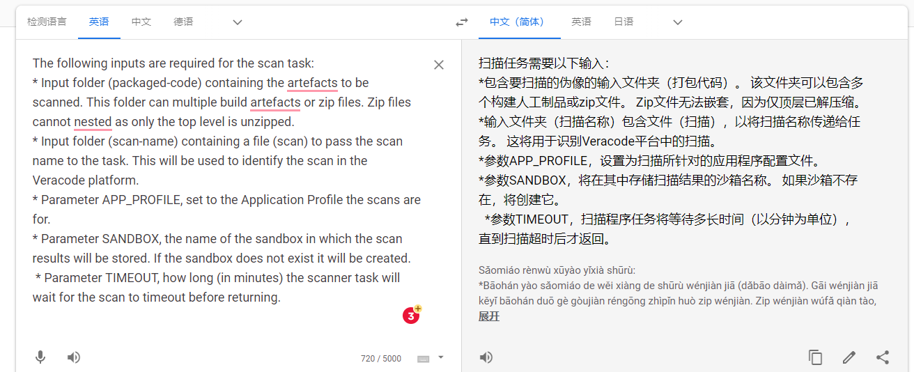

https://confluence.refinitiv.com/display/TSDEV/How+to+do+VeraCode+Scan

login

https://refinitiv.sharepoint.com/sites/CSTR-SecureDevelopment


https://refinitiv.sharepoint.com/sites/CyberInformationSecurity/SitePages/Onboard-Code.aspx


api wrapper

https://help.veracode.com/r/c_wrapper_composite_actions

https://help.veracode.com/r/orRWez4I0tnZNaA_i0zn9g/s0qc3PCFxqBF~fzkFrc20Q


reference

https://help.veracode.com/r/compilation_java

https://help.veracode.com/r/compilation_nix

https://help.veracode.com/r/api_creds_plugins


```javascript
java -jar veracode-wrapper.jar -action summaryreport \
      -vid df7d61d2b34a74258636f45f2f494f68 -vkey 9b51be4e77f3ce28a2d70f968bd149f47de89a3fef80d1d471a28aa5ee47f17eb3b97fc91e672ddd8832c99f75619de8abb0d99b881023e4d106958cac005dda \
      -buildid 10145071 -format xml -outputfilepath summary.txt
      
java -jar veracode-wrapper.jar -action detailedreport \
      -vid df7d61d2b34a74258636f45f2f494f68 -vkey 9b51be4e77f3ce28a2d70f968bd149f47de89a3fef80d1d471a28aa5ee47f17eb3b97fc91e672ddd8832c99f75619de8abb0d99b881023e4d106958cac005dda \
      -buildid 10145071 -format xml -outputfilepath detailedreport.xml
```


```javascript
---
platform: linux

image_resource:
  type: docker-image
  source: 
    repository: bams.sdp.refinitiv.com/docker-remote/ubuntu

inputs:
  - name: packaged-code
outputs:
  - name: scan-results
run:
  path: bash
  args:
    - "-c"
    - |
      apt-get update
      java -version
      echo [******* installing zip unzip jq *******]
      apt-get install -q -y zip jq curl
      echo [******* installing java *******]
      apt-get install -q -y openjdk-8-jre-headless
      echo [******* fetching API Wrapper *******]
      echo curl -sS "https://repo1.maven.org/maven2/com/veracode/vosp/api/wrappers/vosp-api-wrappers-java/20.3.6.1/vosp-api-wrappers-java-20.3.6.1.jar" > veracode-wrapper.jar
      curl -sS "https://search.maven.org/solrsearch/select?q=g:%22com.veracode.vosp.api.wrappers%22&rows=20&wt=json" | jq -r '.["response"]["docs"][0].latestVersion' > wrapper-version
      VERACODE_WRAPPER_VERSION=$(cat wrapper-version); curl -sS "https://repo1.maven.org/maven2/com/veracode/vosp/api/wrappers/vosp-api-wrappers-java/${VERACODE_WRAPPER_VERSION}/vosp-api-wrappers-java-${VERACODE_WRAPPER_VERSION}.jar" > veracode-wrapper.jar
      java -jar veracode-wrapper.jar -wrapperversion
      ls
      find .
      NOW=$(date +"%d-%m-%y,%H:%M")
      echo $NOW
      SCAN=$"SDP sandbox scan ${NOW}"
      echo SCAN = $SCAN
      env
      echo [******* Upload and Scan *******]
      java -jar veracode-wrapper.jar -action uploadandscan \
      -vid ((veracode:id)) -vkey ((veracode:key)) \
      -createprofile false -scantimeout $TIMEOUT \
      -appname $APP_PROFILE \
      -version "$SCAN" -filepath packaged-code -logfilepath scan.txt
      result=$?
      echo [******* scan result $result *******]
      ls
      buildid=$(grep "analysis id" scan.txt | cut -d ' ' -f 11 | cut -c 2-9)
      echo $buildid
      echo [*******  Summary Report *******]
      java -jar veracode-wrapper.jar -action summaryreport \
      -vid ((veracode:id)) -vkey ((veracode:key)) \
      -buildid $buildid -format pdf -outputfilepath summary.pdf
      echo [******* Detailed Report *******]
      java -jar veracode-wrapper.jar -action detailedreport \
      -vid ((veracode:id)) -vkey ((veracode:key)) \
      -buildid $buildid -format pdf -outputfilepath detailedreport.pdf
      mv summary.pdf scan-results/summary.pdf
      mv detailedreport.pdf scan-results/detailedreport.pdf
      exit $result
```


```javascript
---
platform: linux

image_resource:
  type: docker-image
  source: 
    repository: ubuntu

inputs:
  - name: packaged-code
outputs:
- name: scan-results
run:
  user: root
  path: bash
  args:
    - "-c"
    - |
      apt-get update
      java -version
      echo --- installing zip unzip jq curl ---
      apt-get install -q -y zip jq curl
      echo --- installing java ---
      apt-get install -q -y openjdk-8-jre-headless
      echo --- get and install pipeline scanner ---
      curl -O -s https://downloads.veracode.com/securityscan/pipeline-scan-LATEST.zip
      unzip pipeline-scan-LATEST.zip pipeline-scan.jar
      java -jar pipeline-scan.jar -v
      pwd
      find .
      env
      java -jar pipeline-scan.jar \
      --veracode_api_id ((kv/rft/veracode.id)) \
      --veracode_api_key ((kv/rft/veracode.key)) \
      --timeout $TIMEOUT \
      --file packaged-code/* \
      --fail_on_severity "$FAIL_ON_SEVERITY" \
      --fail_on_cwe "$FAIL_ON_CWE" \
      --summary_display $SHOW_SUMMARY \
      --issue_details $SHOW_DETAILS \
      --json_display $SHOW_JSON \
      --summary_output true \
      --summary_output_file results.txt \
      --json_output true \
      --json_output_file results.json
      result=$?
      echo --- scan result $result
      echo --- moving result files---
      mv results.txt scan-results/results.txt
      mv results.json scan-results/results.json
      find .
      exit $result

```

