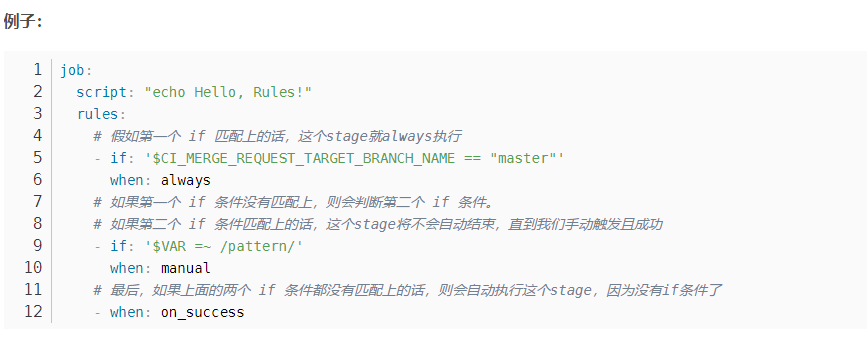
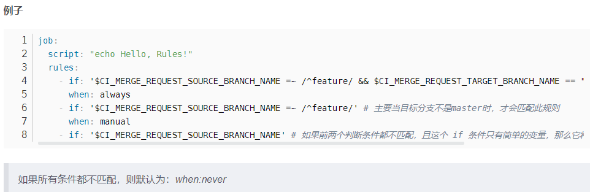

https://gitlab.sdp.refinitiv.com/help/ci/yaml/index.md#keywords


https://gitlab.sdp.refinitiv.com/help/ci/yaml/yaml_optimization.md#use-extends-to-reuse-configuration-sections

```javascript
.tests:
  rules:
    - if: $CI_PIPELINE_SOURCE == "push"

.rspec:
  extends: .tests
  script: rake rspec

rspec 1:
  variables:
    RSPEC_SUITE: '1'
  extends: .rspec

rspec 2:
  variables:
    RSPEC_SUITE: '2'
  extends: .rspec

spinach:
  extends: .tests
  script: rake spinach

```


https://gitlab.sdp.refinitiv.com/help/ci/yaml/yaml_optimization.md#reference-tags

```javascript
.vars:
  variables:
    URL: "http://my-url.internal"
    IMPORTANT_VAR: "the details"

test-vars-1:
  variables: !reference [.vars, variables]
  script:
    - printenv

test-vars-2:
  variables:
    MY_VAR: !reference [.vars, variables, IMPORTANT_VAR]
  script:
    - printenv

```


Include, https://gitlab.sdp.refinitiv.com/help/ci/yaml/index.md#include

gitlab.yml 的配置会覆盖include里面的


rules 






