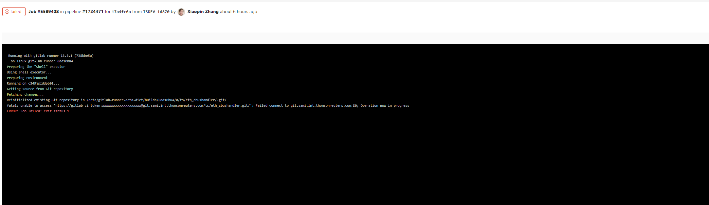
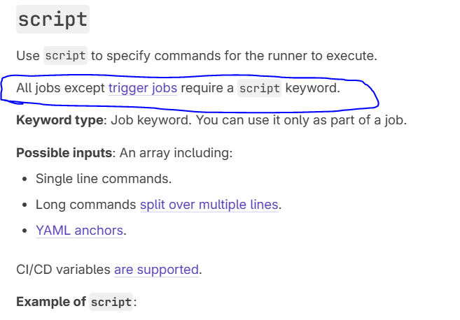

代理问题，su - gitlab-runner

vi ~/.bashrc proxy

如果看不到runner,解决方案是，在任意一个已经enable这个runner的project,把你设成master,然后你就能看到了

如果遇到报错

This GitLab CI configuration is invalid: jobs euw1-int-deploy config should implement a script: or a trigger: keyword

config contains unknown keys: before_script

那实际是这个job里面只有before script，而没有script. CI/CD YAML syntax reference | GitLab

