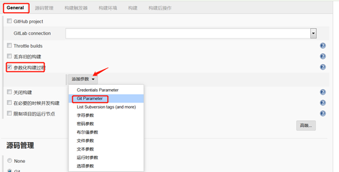
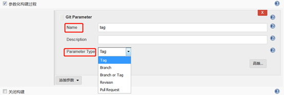
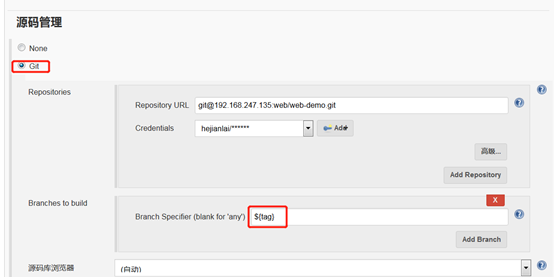
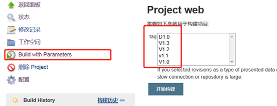

plugin

https://www.cnblogs.com/Dev0ps/p/9125232.html

https://plugins.jenkins.io/git-parameter/

Jenkins系列之六——拉取指定branch或tag

一、安装插件

Build With Parameters

Git Paramet

系统管理——>管理插件——>可选插件——>右上角过滤框中输入上面两个插件的名字——>直接安装

或者手动安装：插件下载地址：http://updates.jenkins-ci.org/download/plugins/git-parameter/

二、配置jenkins

1.【参数化构建过程】--【添加Git Parameter参数】

2. 【name】-自定义即可 【Description】-自定义描述 【Parameter Type】-目前类型为Tag，也可以选择其他类型。

 

3.【源码管理】--【Git】--【Branches to build】

 

|   |   |
| - | - |
| 1 | 注意：Branch Specifier的变量名与Git parameter 的name要一致，$tag或${tag}都可以，这是通过变量去获取git中的所有标签 |

4.下来我们把我们的任务保存，此时我们的立即构建变成【Build with Parameters】，然后选择我们需要发布的tag，点击【开始构建】，这样就会发布我们对应的tag代码。

 

