Steps to Configure Jenkins With Microsoft Teams for Notifications

1. Create a team

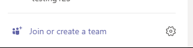

1. Click Add channel

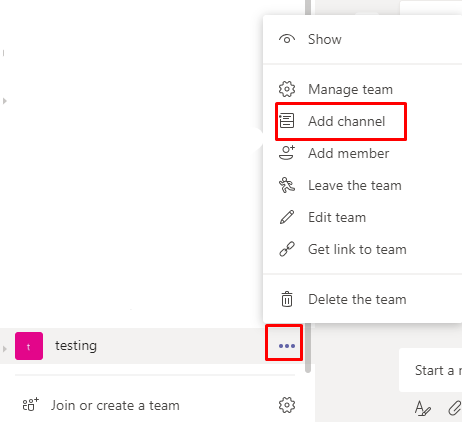

3. Once the channel is created, click connector

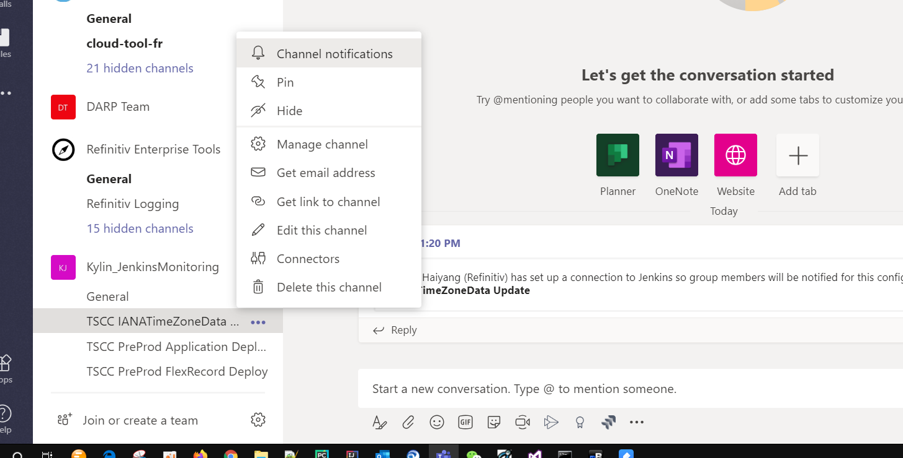

3. Select Jenkins and click Configure.

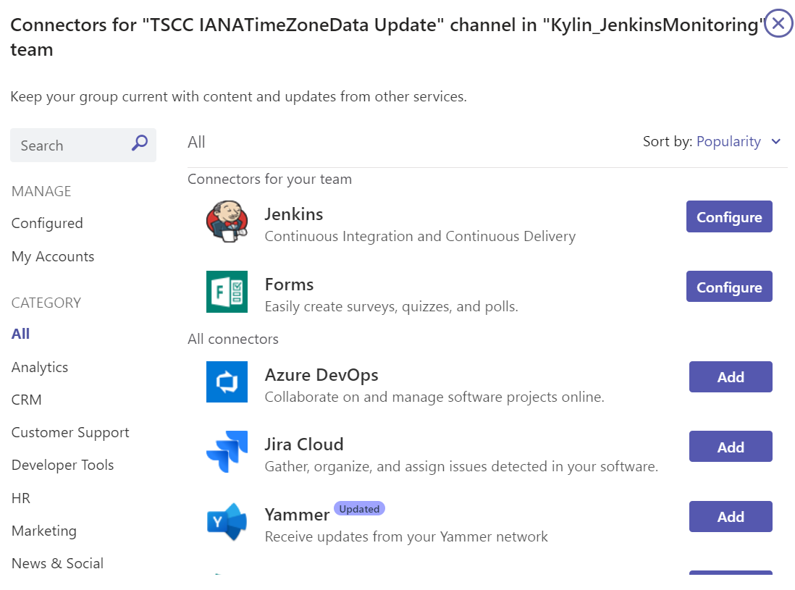

4. Enter a name for the Jenkins connection.

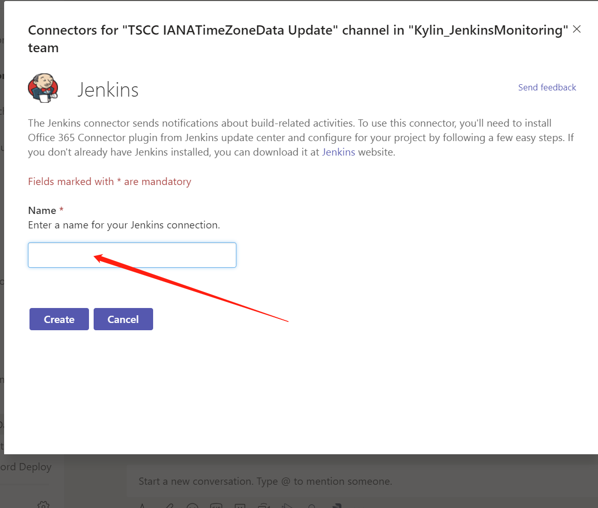

5. Copy the webhook URL and save it to the clipboard.

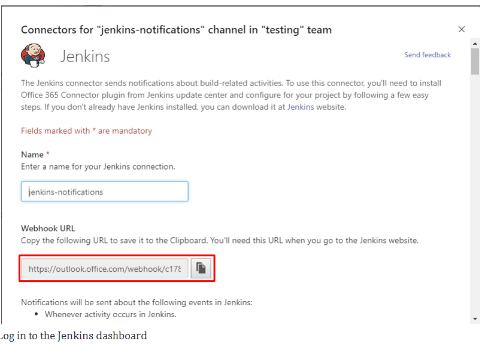

6. Log in to the Jenkins dashboard

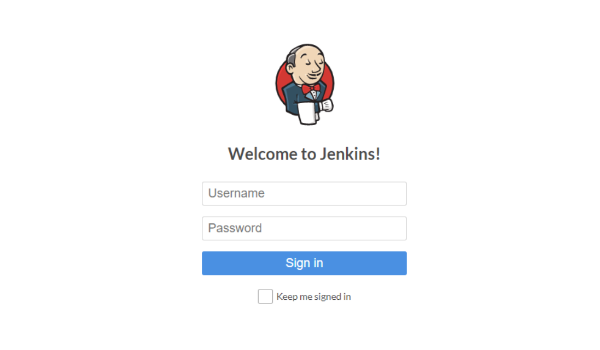

7. Click Manage Jenkins from the left-hand side menu.

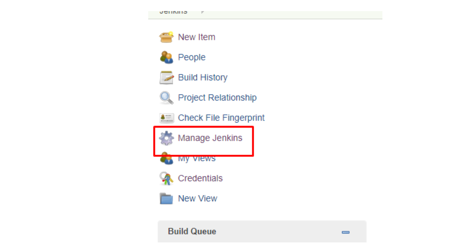

8. Click on Manage Plugins from the right-hand side.

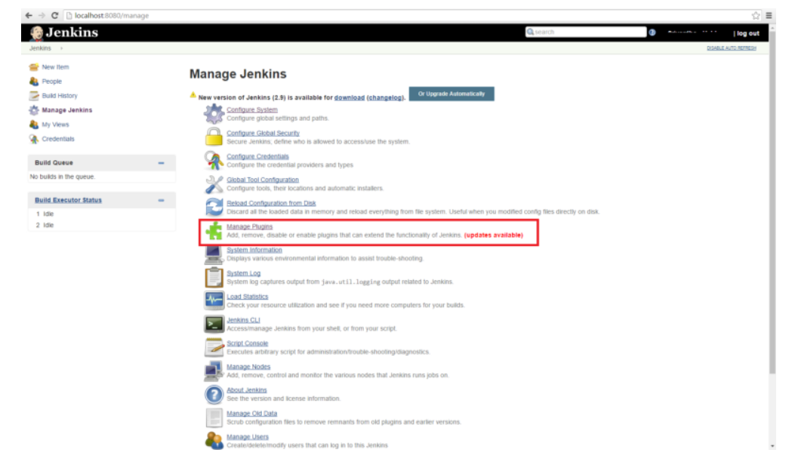

9. Click on the Available tab.

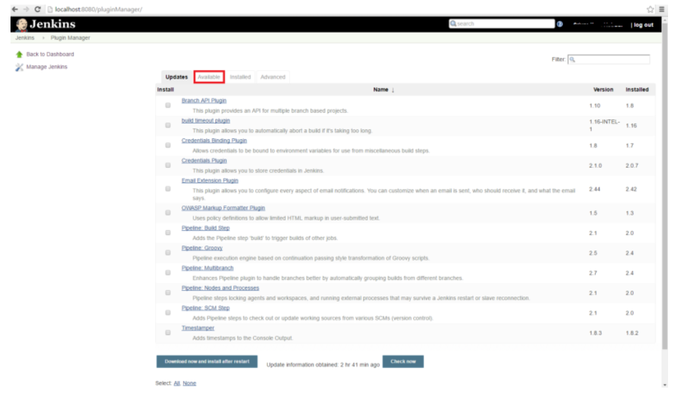

10. Search for Office 365 Connector and then check the checkbox and click the Install without restart button.

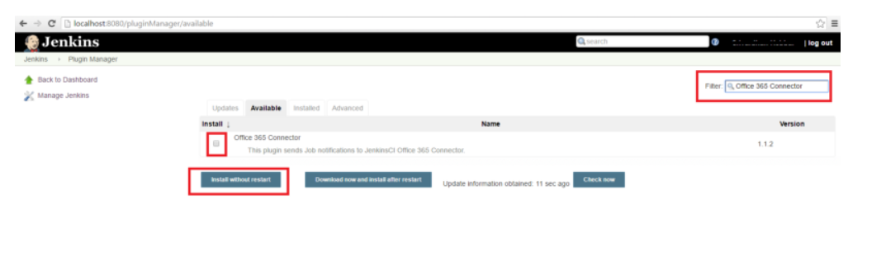

11. Go to your project and click on the Configure button.

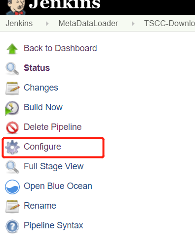

12. Click on the Office 365 Connector tab.

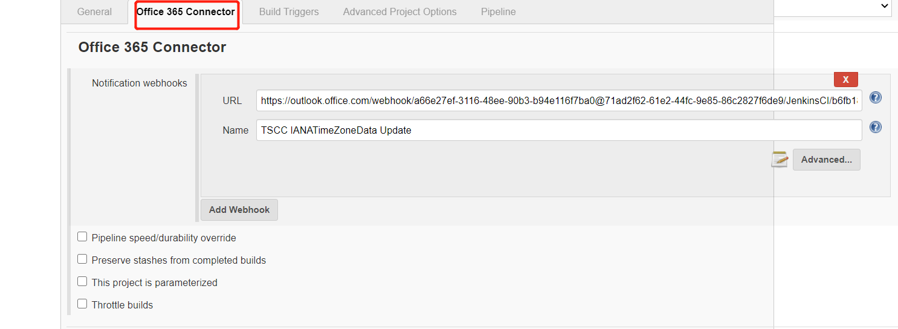

13. Click on the Add Webhook button.

14. Paste the webhook URL in the URL box and check for all those boxes for which you want to receive events and then click the Save button.

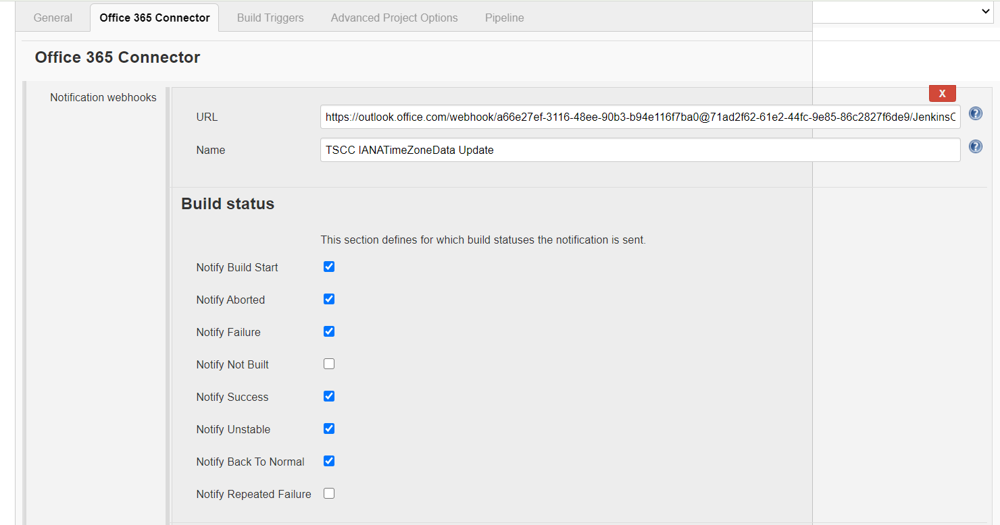

15. Click the Build Now button.

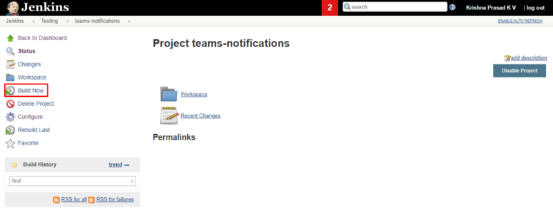

16. Once the build starts, you'll get notifications in the teams-notification channel.

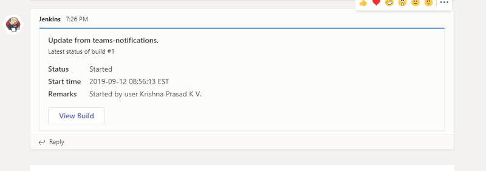

17. After the build is completed, you will get notifications in the teams-notification channel.

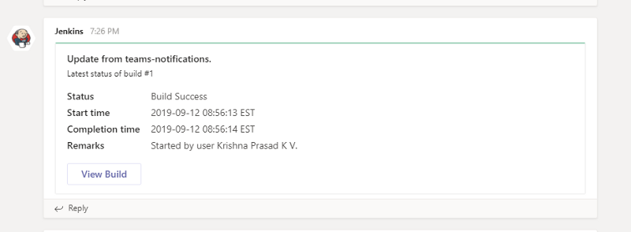

Conclusion

Jenkins can send notification from all your jobs to your team. It can use channels to send specific notifications for specific teams.

Further Reading

How to Integrate Your GitHub Repository to Your Jenkins Project

Continuous Integration With Jenkins on Alibaba Cloud

