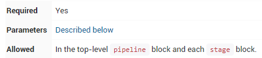
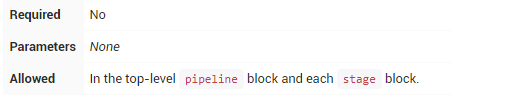
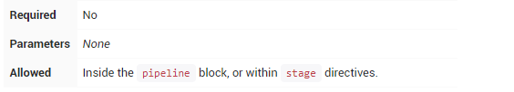

|   |
| - |
|  |

| 编辑推荐: |
| - |
| 本文来自于YatHo,Jenkins 2.0的到来，pipline进入了视野，jenkins2.0的核心特性. 也是最适合持续交付的feature,本文简单介绍了pipeline，希望对您的学习有帮助。 |

一、引言

Jenkins 2.0的到来，pipline进入了视野，jenkins2.0的核心特性. 也是最适合持续交付的feature。

简单的来说，就是把Jenkins1.0版本中，Project中的相关配置信息，如SVN/Git的配置，Parameter的配置等都变成Code，即Pipeline as Code。

随着pipeline交付流水线在团队中的推广，使用pipeline脚本的job也迅速增加。

优势：

通过写代码的形式配置Project，且Jenkins中内置了常用的steps。

实现了构建步骤代码化、构建过程视图化。

二、语法简介

Pipeline最基本的部分是“step”。基本上，step告诉Jenkins 要做什么，并且作为Declarative Pipeline和Scripted Pipeline语法的基本构建块。

Pipeline支持两种语法：Declarative Pipeline（在Pipeline 2.5中引入，结构化方式）和Scripted Pipeline，两者都支持建立连续输送的Pipeline。

选择Declarative Pipeline还是Scripted Pipeline

最开始的Pipeline plugin，支持的只有一种脚本类型，就是Scripted Pipeline；

Declarative Pipeline为Pipeline plugin在2.5版本之后新增的一种脚本类型，与原先的Scripted Pipeline一样，都可以用来编写脚本。

相关资料：

从检索的资料来看，Declarative Pipeline 是后续Open Blue Ocean所支持的类型。相对而言，Declarative Pipeline比较简单，Declarative Pipeline中，也是可以内嵌Scripted Pipeline代码的。

为与BlueOcean脚本编辑器兼容，通常建议使用Declarative Pipeline的方式进行编写,从jenkins社区的动向来看，很明显这种语法结构也会是未来的趋势。

三、Declarative Pipeline

Declarative Pipeline是Jenkins Pipeline 的一个相对较新的补充， 它在Pipeline子系统之上提出了一种更为简化和有意义的语法。

所有有效的Declarative Pipeline必须包含在一个pipeline块内，例如：

pipeline { /* insert Declarative Pipeline here */ }

Declarative Pipeline中的基本语句和表达式遵循与Groovy语法相同的规则 ，但有以下例外：

a.Pipeline的顶层必须是块，具体来说是：pipeline { }

b.没有分号作为语句分隔符。每个声明必须在自己的一行

c.块只能包含Sections, Directives, Steps或赋值语句。

d.属性引用语句被视为无参方法调用。所以例如，输入被视为input（）

1.Sections（章节）

Declarative Pipeline里的Sections通常包含一个或多个Directives或 Steps

agent

agent部分指定整个Pipeline或特定阶段将在Jenkins环境中执行的位置，具体取决于该agent 部分的放置位置。该部分必须在pipeline块内的顶层定义 ，但stage级使用是可选的。

为了支持Pipeline可能拥有的各种用例，该agent部分支持几种不同类型的参数。这些参数可以应用于pipeline块的顶层，也可以应用在每个stage指令内。

参数

any

在任何可用的agent 上执行Pipeline或stage。例如：agent any

none

当在pipeline块的顶层使用none时，将不会为整个Pipeline运行分配全局agent ，每个stage部分将需要包含其自己的agent部分。

label

使用提供的label标签，在Jenkins环境中可用的代理上执行Pipeline或stage。例如：agent { label 'my-defined-label' }

node

agent { node { label 'labelName' } }，等同于 agent { label 'labelName' }，但node允许其他选项（如customWorkspace）。

docker

定义此参数时，执行Pipeline或stage时会动态供应一个docker节点去接受Docker-based的Pipelines。 docker还可以接受一个args，直接传递给docker run调用。例如：agent { docker 'maven:3-alpine' }或

|   |
| - |
| docker agent { docker { image 'maven:3-alpine' label 'my-defined-label' args '-v /tmp:/tmp' } } |

使用从Dockerfile源存储库中包含的容器来构建执行Pipeline或stage 。为了使用此选项，Jenkinsfile必须从Multibranch Pipeline或“Pipeline from SCM"加载。

默认是在Dockerfile源库的根目录：agent { dockerfile true }。如果Dockerfile需在另一个目录中建立，请使用以下dir选项：agent { dockerfile { dir 'someSubDir' } }。您可以通过docker build ...使用additionalBuildArgs选项，如agent { 　　　　dockerfile { additionalBuildArgs '--build-arg foo=bar' } }。

参数

any

在任何可用的agent 上执行Pipeline或stage。例如：agent any

none

当在pipeline块的顶层使用none时，将不会为整个Pipeline运行分配全局agent ，每个stage部分将需要包含其自己的agent部分。

label

使用提供的label标签，在Jenkins环境中可用的代理上执行Pipeline或stage。例如：agent { label 'my-defined-label' }

node

agent { node { label 'labelName' } }，等同于 agent { label 'labelName' }，但node允许其他选项（如customWorkspace）。

docker

定义此参数时，执行Pipeline或stage时会动态供应一个docker节点去接受Docker-based的Pipelines。 docker还可以接受一个args，直接传递给docker run调用。例如：agent { docker 'maven:3-alpine' }或

|   |
| - |
| docker agent { docker { image 'maven:3-alpine' label 'my-defined-label' args '-v /tmp:/tmp' } } |

使用从Dockerfile源存储库中包含的容器来构建执行Pipeline或stage 。为了使用此选项，Jenkinsfile必须从Multibranch Pipeline或“Pipeline from SCM"加载。

默认是在Dockerfile源库的根目录：agent { dockerfile true }。如果Dockerfile需在另一个目录中建立，请使用以下dir选项：agent { dockerfile { dir 'someSubDir' } }。您可以通过docker build ...使用additionalBuildArgs选项，如agent { dockerfile { additionalBuildArgs '--build-arg foo=bar' } }。

常用选项

这些是可以应用于两个或多个agent的选项。除非明确定义，否则不需要。

label

一个字符串。标记在哪里运行pipeline或stage

此选项适用于node，docker和dockerfile，并且 node是必需的。

customWorkspace

一个字符串。自定义运行的工作空间内。它可以是相对路径，在这种情况下，自定义工作区将位于节点上的工作空间根目录下，也可以是绝对路径。例如：

|   |
| - |
| agent { node { label 'my-defined-label' customWorkspace '/some/other/path' } } |

一个布尔值，默认为false。如果为true，则在同一工作空间中。

此选项适用于docker和dockerfile，并且仅在 individual stage中使用agent才有效。

|   |
| - |
| pipeline { //Execute all the steps defined in this Pipeline within a newly created container of the given name and tag (maven:3-alpine). agent { docker 'maven:3-alpine' } stages { stage('Example Build') { steps { sh 'mvn -B clean verify' } } } } |

|   |
| - |
| pipeline { agent none stages { stage('Example Build') { agent { docker 'maven:3-alpine' } steps { echo 'Hello, Maven' sh 'mvn --version' } } stage('Example Test') { agent { docker 'openjdk:8-jre' } steps { echo 'Hello, JDK' sh 'java -version' } } } } |

post

定义Pipeline或stage运行结束时的操作。post-condition块支持post部件：always，changed，failure，success，unstable，和aborted。这些块允许在Pipeline或stage运行结束时执行步骤，具体取决于Pipeline的状态。

conditions项：

always

运行，无论Pipeline运行的完成状态如何。

changed

只有当前Pipeline运行的状态与先前完成的Pipeline的状态不同时，才能运行。

failure

仅当当前Pipeline处于“失败”状态时才运行，通常在Web UI中用红色指示表示。

success

仅当当前Pipeline具有“成功”状态时才运行，通常在具有蓝色或绿色指示的Web UI中表示。

|   |
| - |
| pipeline { agent any stages { stage('Example') { steps { echo 'Hello World' } } } post { always { echo 'I will always say Hello again!' } } } |

unstable

只有当前Pipeline具有“不稳定”状态，通常由测试失败，代码违例等引起，才能运行。通常在具有黄色指示的Web UI中表示。

aborted

只有当前Pipeline处于“中止”状态时，才会运行，通常是由于Pipeline被手动中止。通常在具有灰色指示的Web UI中表示。

包含一个或多个stage的序列，Pipeline的大部分工作在此执行。建议stages至少包含至少一个stage指令，用于连接各个交付过程，如构建，测试和部署等。

steps

steps包含一个或多个在stage块中执行的step序列。

|   |
| - |
| pipeline { agent any stages { stage('Example') { steps { echo 'Hello World' } } } } |

2.Directives （指令）

environment

environment指令指定一系列键值对，这些键值对将被定义为所有step或stage-specific step的环境变量，具体取决于environment指令在Pipeline中的位置。

该指令支持一种特殊的方法credentials()，可以通过其在Jenkins环境中的标识符来访问预定义的凭据。

对于类型为“Secret Text”的凭据，该 credentials()方法将确保指定的环境变量包含Secret Text内容；对于“标准用户名和密码”类型的凭证，指定的环境变量将被设置为username:password。

|   |
| - |
| pipeline { agent any environment { CC = 'clang' } stages { stage('Example') { environment { AN\_ACCESS\_KEY = credentials('my-prefined-secret-text') } steps { sh 'printenv' } } } } |

options

options指令允许在Pipeline本身内配置Pipeline专用选项。Pipeline本身提供了许多选项，例如buildDiscarder，但它们也可能由插件提供，例如 timestamps。

可用选项

buildDiscarderpipeline保持构建的最大个数。例如：options { buildDiscarder(logRotator(numToKeepStr: '1')) }

disableConcurrentBuilds

不允许并行执行Pipeline,可用于防止同时访问共享资源等。例如：options { disableConcurrentBuilds() }

skipDefaultCheckout

默认跳过来自源代码控制的代码。例如：options { skipDefaultCheckout() }

skipStagesAfterUnstable

一旦构建状态进入了“Unstable”状态，就跳过此stage。例如：options { skipStagesAfterUnstable() }

timeout

设置Pipeline运行的超时时间。例如：options { timeout(time: 1, unit: 'HOURS') }

retry

失败后，重试整个Pipeline的次数。例如：options { retry(3) }

timestamps

预定义由Pipeline生成的所有控制台输出时间。例如：options { timestamps() }

|   |
| - |
| pipeline { agent any options { timeout(time: 1, unit: 'HOURS') } stages { stage('Example') { steps { echo 'Hello World' } } } } |

parameters

parameters指令提供用户在触发Pipeline时的参数列表。这些参数值通过该params对象可用于Pipeline步骤，具体用法如下

可用参数

string

目前只支持[booleanParam, choice, credentials, file, text, password, run, string]这几种参数类型，其他高级参数化类型还需等待社区支持。

|   |
| - |
| pipeline { agent any parameters { string(name: 'PERSON', defaultValue: 'Mr Jenkins', description: 'Who should I say hello to?') } stages { stage('Example') { steps { echo "Hello ${params.PERSON}" } } } } |

triggers

triggers指令定义了Pipeline自动化触发的方式。对于与源代码集成的Pipeline，如GitHub或BitBucket，triggers可能不需要基于webhook的集成也已经存在。目前只有两个可用的触发器：cron和pollSCM。

cron

接受一个cron风格的字符串来定义Pipeline触发的常规间隔，例如： triggers { cron('H 4/* 0 0 1-5') }

pollSCM

接受一个cron风格的字符串来定义Jenkins检查SCM源更改的常规间隔。如果存在新的更改，则Pipeline将被重新触发。例如：triggers { pollSCM('H 4/* 0 0 1-5') }

|   |
| - |
| pipeline { agent any triggers { cron('H 4/\* 0 0 1-5') } stages { stage('Example') { steps { echo 'Hello World' } } } } |

stage

stage指令在stages部分中，应包含stop部分，可选agent部分或其他特定于stage的指令。实际上，Pipeline完成的所有实际工作都将包含在一个或多个stage指令中。

|   |
| - |
| pipeline { agent any stages { stage('Example') { steps { echo 'Hello World' } } } }　 |

通过tools可自动安装工具，并放置环境变量到PATH。如果agent none，这将被忽略。

|   |
| - |
| pipeline { agent any tools { //工具名称必须在Jenkins 管理Jenkins → 全局工具配置中预配置。 maven 'apache-maven-3.0.1' } stages { stage('Example') { steps { sh 'mvn --version' } } } } 　　 |

when

when指令允许Pipeline根据给定的条件确定是否执行该阶段。该when指令必须至少包含一个条件。如果when指令包含多个条件，则所有子条件必须为stage执行返回true。这与子条件嵌套在一个allOf条件中相同（见下面的例子）。

更复杂的条件结构可使用嵌套条件建：not，allOf或anyOf。嵌套条件可以嵌套到任意深度。

内置条件

branch

当正在构建的分支与给出的分支模式匹配时执行，例如：when { branch 'master' }。请注意，这仅适用于多分支Pipeline。

environment

当指定的环境变量设置为给定值时执行，例如： when { environment name: 'DEPLOY_TO', value: 'production' }

expression

当指定的Groovy表达式求值为true时执行，例如： when { expression { return params.DEBUG_BUILD } }

not

当嵌套条件为false时执行。必须包含一个条件。例如：when { not { branch 'master' } }

allOf

当所有嵌套条件都为真时执行。必须至少包含一个条件。例如：when { allOf { branch 'master'; environment name: 'DEPLOY_TO', value: 'production' } }

anyOf

当至少一个嵌套条件为真时执行。必须至少包含一个条件。例如：when { anyOf { branch 'master'; branch 'staging' } }

|   |
| - |
| pipeline { agent any stages { stage('Example Build') { steps { echo 'Hello World' } } stage('Example Deploy') { when { allOf { branch 'production' environment name: 'DEPLOY\_TO', value: 'production' } } steps { echo 'Deploying' } } } } |

3.Parallel(并行)

Declarative Pipeline近期新增了对并行嵌套stage的支持，对耗时长，相互不存在依赖的stage可以使用此方式提升运行效率。除了parallel stage，单个parallel里的多个step也可以使用并行的方式运行。

|   |
| - |
| pipeline { agent any stages { stage('Non-Parallel Stage') { steps { echo 'This stage will be executed first.' } } stage('Parallel Stage') { when { branch 'master' } parallel { stage('Branch A') { agent { label "for-branch-a" } steps { echo "On Branch A" } } stage('Branch B') { agent { label "for-branch-b" } steps { echo "On Branch B" } } } } } } |

4.Steps（步骤）

Declarative Pipeline可以使用 Pipeline Steps reference中的所有可用步骤 ，并附加以下仅在Declarative Pipeline中支持的步骤。

script

script步骤需要一个script Pipeline，并在Declarative Pipeline中执行。对于大多数用例，script在Declarative Pipeline中的步骤不是必须的，但它可以提供一个有用的加强。

|   |
| - |
| pipeline { agent any stages { stage('Example') { steps { echo 'Hello World'  script { def browsers = ['chrome', 'firefox'] for (int i = 0; i &lt; browsers.size(); ++i) { echo "Testing the ${browsers[i]} browser" } } } } } } |

四、Scripted Pipeline

Groovy脚本不一定适合所有使用者，因此jenkins创建了Declarative pipeline，为编写Jenkins管道提供了一种更简单、更有主见的语法。但是不可否认，由于脚本化的pipeline是基于groovy的一种DSL语言，所以与Declarative pipeline相比为jenkins用户提供了更巨大的灵活性和可扩展性。

1.流程控制

pipeline脚本同其它脚本语言一样，从上至下顺序执行，它的流程控制取决于Groovy表达式，如if/else条件语句，举例如下：

|   |
| - |
| Jenkinsfile (Scripted Pipeline) node { stage('Example') { if (env.BRANCH\_NAME == 'master') { echo 'I only execute on the master branch' } else { echo 'I execute elsewhere' } } } |

pipeline脚本流程控制的另一种方式是Groovy的异常处理机制。当任何一个步骤因各种原因而出现异常时，都必须在Groovy中使用try/catch/finally语句块进行处理，举例如下：

|   |
| - |
| Jenkinsfile (Scripted Pipeline) node { stage('Example') { try { sh 'exit 1' } catch (exc) { echo 'Something failed, I should sound the klaxons!' throw } } } |

2.Steps

pipeline最核心和基本的部分就是“step”，从根本上来说，steps作为Declarative pipeline和Scripted pipeline语法的最基本的语句构建块来告诉jenkins应该执行什么操作。

Scripted pipeline没有专门将steps作为它的语法的一部分来介绍，但是在Pipeline Steps reference这篇文档中对pipeline及其插件涉及的steps做了很详细的介绍。如有需要可参考jenkins官网对该部分的介绍Pipeline Steps reference

3.Differences

from plain Groovy由于pipeline的一些个性化需求，比如在重新启动jenkins后要求pipeline脚本仍然可以运行，那么pipeline脚本必须将相关数据做序列化，然而这一点 Groovy并不能完美的支持，例如collection.each { item -> /* perform operation */ }

4.Declarative

pipeline和Scripted pipeline的比较

共同点：

两者都是pipeline代码的持久实现，都能够使用pipeline内置的插件或者插件提供的steps，两者都可以利用共享库扩展。

区别：

两者不同之处在于语法和灵活性。Declarative pipeline对用户来说，语法更严格，有固定的组织结构，更容易生成代码段，使其成为用户更理想的选择。但是Scripted pipeline更加灵活，因为Groovy本身只能对结构和语法进行限制，对于更复杂的pipeline来说，用户可以根据自己的业务进行灵活的实现和扩展。

