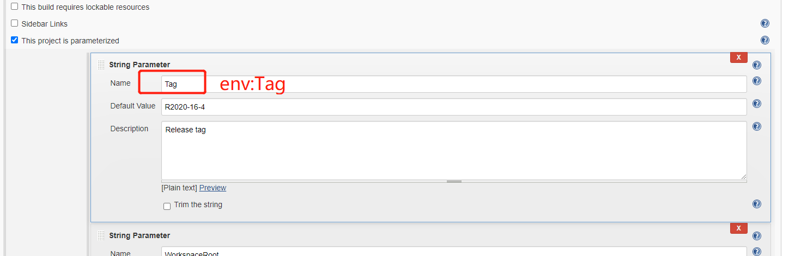
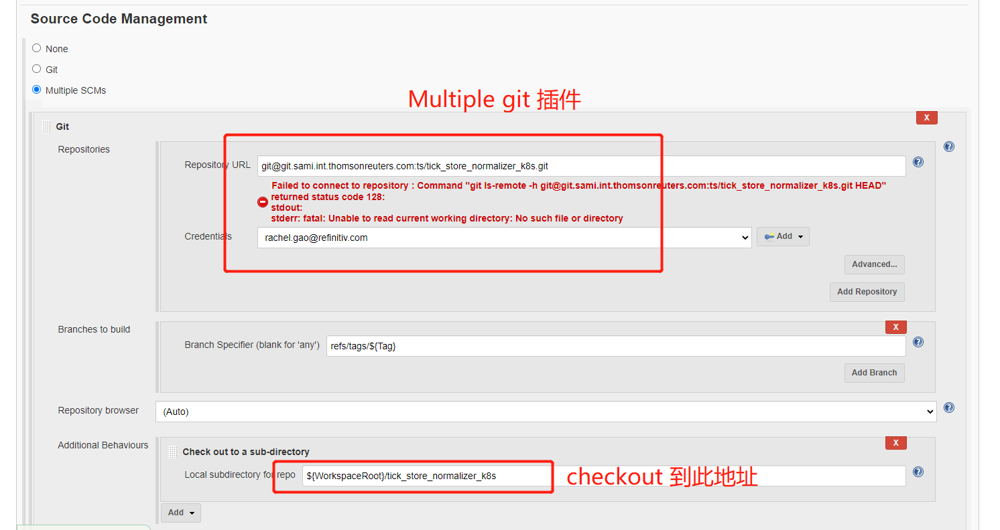

Powershell 插件


```javascript
echo "################## deploy normalizer ##################"

$ErrorActionPerference = 'STOP'
trap{throw $_;exit -1}
set http_proxy=webproxy.int.westgroup.com:80
set https_proxy=webproxy.int.westgroup.com:80

echo "################## whoami ##################"
whoami

echo "################## HOME ##################"
$HOME

if($env:WorkspaceRoot -eq $null) {throw 'Test workspace could not be empty!'}

cd $env:WorkspaceRoot\tick_store_normalizer_k8s\kustomize\normalizer

echo "################## pwd ##################"
pwd

Start-Sleep -Seconds 5

$Env:KUBECONFIG="$Env:KUBECONFIG;$env:WorkspaceRoot\tick_store_normalizer_test\thirdparty\kube\config"
$Env:path=$Env:path+";$env:WorkspaceRoot\tick_store_normalizer_test\thirdparty"

#[int]$pod_num1 = $env:pod_nums
#[int]$pod_num1 = $pod_num1 - 1
echo "################## modify .\on-premise\$env:deploy_env\patch.yaml ##################"
& "$env:WorkspaceRoot\tick_store_normalizer_test\thirdparty\sed.exe" -i "s/  replicas: 5/  replicas: $env:pod_nums/g" .\on-premise\$env:deploy_env\patch.yaml

echo "################## get-content .\on-premise\$env:deploy_env\patch.yaml ##################"
get-content .\on-premise\$env:deploy_env\patch.yaml

Start-Sleep -Seconds 2

echo "################## modify .\on-premise\$env:deploy_env\normalizer-svc.sh ##################"
& "$env:WorkspaceRoot\tick_store_normalizer_test\thirdparty\sed.exe" -i 's/for i in $(seq 0 4); do/for($i=0;$i -lt pod_nums;$i++){/g' .\on-premise\$env:deploy_env\normalizer-svc.sh
& "$env:WorkspaceRoot\tick_store_normalizer_test\thirdparty\sed.exe" -i "s/pod_nums/$env:pod_nums/g" .\on-premise\$env:deploy_env\normalizer-svc.sh
& "$env:WorkspaceRoot\tick_store_normalizer_test\thirdparty\sed.exe" -i 's/  cat << EOF | kubectl apply -f -/  write-Output \"/g' .\on-premise\$env:deploy_env\normalizer-svc.sh
& "$env:WorkspaceRoot\tick_store_normalizer_test\thirdparty\sed.exe" -i 's/EOF/  \" | kubectl apply -f - /g' .\on-premise\$env:deploy_env\normalizer-svc.sh
& "$env:WorkspaceRoot\tick_store_normalizer_test\thirdparty\sed.exe" -i 's/  done/}/g' .\on-premise\$env:deploy_env\normalizer-svc.sh

Get-Content .\on-premise\$env:deploy_env\normalizer-svc.sh | out-file -filepath .\on-premise\$env:deploy_env\normalizer-svc.ps1

echo "################## .\on-premise\$env:deploy_env\normalizer-svc.sh ##################"
get-content .\on-premise\$env:deploy_env\normalizer-svc.sh

Start-Sleep -Seconds 2

echo "\n################## kubectl get pods $env:deploy_env ##################"
& "$env:WorkspaceRoot\tick_store_normalizer_test\thirdparty\kubectl.exe" get pods -n $env:deploy_env

Start-Sleep -Seconds 5

echo "\n################## kubectl apply -k .\on-premise\$env:deploy_env ##################"
& "$env:WorkspaceRoot\tick_store_normalizer_test\thirdparty\kubectl.exe" apply -k .\on-premise\$env:deploy_env

Start-Sleep -Seconds 2

echo "################## .\on-premise\$env:deploy_env\normalizer-svc.ps1 ##################"
& ".\on-premise\$env:deploy_env\normalizer-svc.ps1"

Start-Sleep -Seconds 300

echo "################## kubectl get pods $env:deploy_env ##################"
& "$env:WorkspaceRoot\tick_store_normalizer_test\thirdparty\kubectl.exe" get pods -n $env:deploy_env

Start-Sleep -Seconds 5
```


```javascript
echo "################## normalizer test ##################"

$ErrorActionPerference = 'STOP'
trap{throw $_;exit -1}
set http_proxy=webproxy.int.westgroup.com:80
set https_proxy=webproxy.int.westgroup.com:80

echo "################## whoami ##################"
whoami

echo "################## HOME ##################"
$HOME

if($env:WorkspaceRoot -eq $null) {throw 'Test workspace could not be empty!'}

cd $env:WorkspaceRoot\tick_store_normalizer_test

echo "################## pwd ##################"
pwd

Start-Sleep -Seconds 5

& ".\Start-TSAutomation.ps1" -Smoke:$smoke -Dirty:$dirty -RerunFailed:$rerunFailed

Start-Sleep -Seconds 5

"******************   FAILED CASE STARTED   *******************"
Get-Content "$env:WorkspaceRoot\tick_store_normalizer_test\Workspace\ROBOT_FAILED.log" -ErrorAction SilentlyContinue | Out-Host

"******************   FAILED CASE STOPPED   *******************"
exit 0
```

