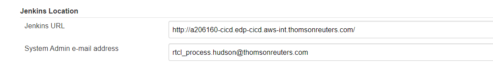
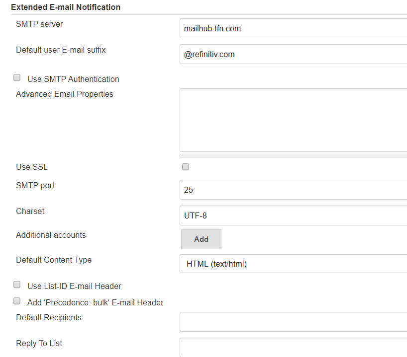
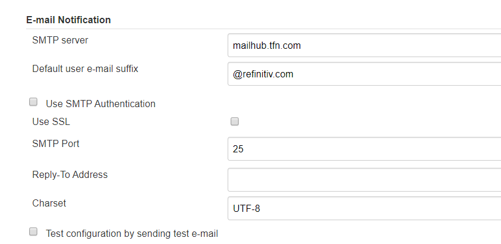

这个系统地址可以不用指定，no email  ::  address not configured yet <nobody@nowhere>







2、pipeline 脚本，添加 post 部分，job 构建成功或者失败时发送邮件

- subject：邮件主题，可以自定义

- body：邮件正文，可以自定义

- to：收件人列表，根据实际情况定义

- from：发件人，要和步骤 1 配置的发件人一致


emailext attachLog: true, body: text, subject: subject,  mimeType: 'text/html', to: to_email_address_list,from: "rtcl_process.hudson@thomsonreuters.com" 扩展邮件，能发附件

```javascript
pipeline { 
    agent any 

    parameters {
        省略内容……
    }
    environment {
        省略内容……
    }
    stages {
        省略内容……
    }
    post {
        success {
            emailext (
                subject: "SUCCESSFUL: Job '${env.JOB_NAME} [${env.BUILD_NUMBER}]'",
                body: """<p>SUCCESSFUL: Job '${env.JOB_NAME} [${env.BUILD_NUMBER}]':</p>
                    <p>Check console output at "<a href="${env.BUILD_URL}">${env.JOB_NAME} [${env.BUILD_NUMBER}]</a>"</p>""",
                to: "user1@qq.com,user2@qq.com",
                from: "admin@sina.com"
            )
        }
        failure {
            emailext (
                subject: "FAILED: Job '${env.JOB_NAME} [${env.BUILD_NUMBER}]'",
                body: """<p>FAILED: Job '${env.JOB_NAME} [${env.BUILD_NUMBER}]':</p>
                    <p>Check console output at "<a href="${env.BUILD_URL}">${env.JOB_NAME} [${env.BUILD_NUMBER}]</a>"</p>""",
                to: "user1@qq.com,user2@qq.com",
                from: "admin@sina.com"
            )
        }
    }
}
```


https://www.jianshu.com/p/c8fab60ed58e


https://blog.csdn.net/u011541946/article/details/84034272

https://blog.csdn.net/fly910905/article/details/80544832


https://www.linuxea.com/1767.html

https://medium.com/@gustavo.guss/jenkins-sending-email-on-post-build-938b236545d2

https://www.cnblogs.com/imyalost/p/8781759.html


