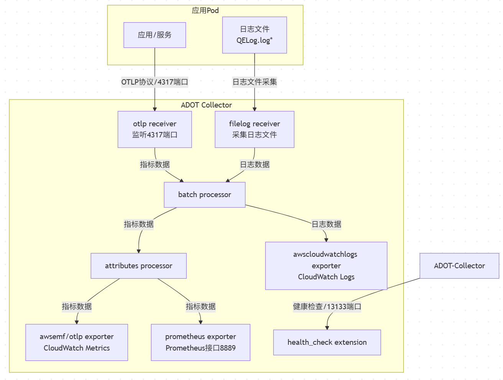
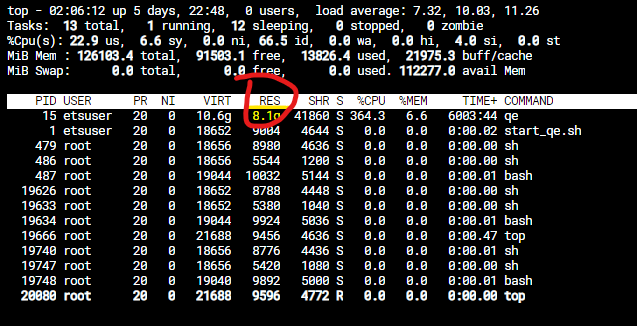

```
flowchart TD
    subgraph 应用Pod
        A1[应用/服务]
        A2[日志文件<br/>QELog.log*]
    end

    subgraph ADOT Collector
        B1[otlp receiver<br/>监听4317端口]
        B2[filelog receiver<br/>采集日志文件]
        C1[batch processor]
        C2[attributes processor]
        D1[awsemf/otlp exporter<br/>CloudWatch Metrics]
        D2[awscloudwatchlogs exporter<br/>CloudWatch Logs]
        D3[prometheus exporter<br/>Prometheus接口8889]
        E1[health_check extension]
    end

    A1 -- OTLP协议/4317端口 --> B1
    A2 -- 日志文件采集 --> B2

    B1 -- 指标数据 --> C1
    B2 -- 日志数据 --> C1

    C1 -- 指标数据 --> C2
    C2 -- 指标数据 --> D1
    C2 -- 指标数据 --> D3

    C1 -- 日志数据 --> D2

    ADOT-Collector -- 健康检查/13133端口 --> E1
```



[https://github.com/aws-observability/aws-otel-collector?tab=readme-ov-file#adot-collector-built-in-components](https://github.com/aws-observability/aws-otel-collector?tab=readme-ov-file#adot-collector-built-in-components)

涉及到 OpenTelemetry Collector（包括 ADOT）组件的识别机制。虽然你可以自定义组件的名字，但系统是通过组件类型前缀来识别它们的功能和后端类型的。

✅ 系统如何识别使用哪个后端（如 awsemf、statsd）？

OpenTelemetry Collector 是通过 **组件名称的前缀** 来识别其类型的，而不是通过你起的名字本身。

📌 组件名称格式：

```shell
<component_type>/<custom_name>
```

- component_type 是系统识别的关键，比如：

	- receiver：otlp, prometheus, statsd

	- exporter：awsemf, logging, prometheus, otlp

	- processor：batch, attributes, filter

✅ 示例：你可以这样写

在 pipelines 中引用时：

```shell
exporters:
  awsemf/my_cloudwatch_exporter:
    region: us-west-2

  statsd/my_statsd_exporter:
    endpoint: "localhost:8125"
```

🧠 总结：

| 名称部分 | 作用 | 
| -- | -- |
| awsemf | 系统识别的 exporter 类型（导出到 CloudWatch Embedded Metric Format） | 
| /xxx | 你自定义的实例名，用于区分多个配置 | 
| statsd | 系统识别的 receiver/exporter 类型（处理 StatsD 协议） | 


所以：**你可以随便起名字，但前缀必须是合法的组件类型，Collector 才知道该用哪个后端逻辑。**

验证metric, 可以通过暴露出来的prometheus

curl [http://localhost:8889/metrics](http://localhost:8889/metrics) | grep memory

我当前能获取到两个类型的memory

# HELP container_memory_usage_bytes Current memory usage in bytes, including all memory regardless of when it was accessed
# TYPE container_memory_usage_bytes gauge**container_memory_usage_bytes**{container="**query-engine**",environment="int",instance="kubernetes.default.svc:443",job="cadvisor-via-apiserver",namespace="ets-intraday-qe",pod_name="ets-qe-0"} 2.2249705472e+10**container_memory_usage_bytes**{container="**query-thrift**",environment="int",instance="kubernetes.default.svc:443",job="cadvisor-via-apiserver",namespace="ets-intraday-qe",pod_name="ets-qe-0"} 2.860417024e+09 

还有一个 

# HELP container_memory_rss Size of RSS in bytes.
# TYPE container_memory_rss gauge**container_memory_rss**{container="**query-engine**",environment="int",instance="kubernetes.default.svc:443",job="cadvisor-via-apiserver",namespace="ets-intraday-qe",pod_name="ets-qe-0"} 8.652509184e+09**container_memory_rss**{container="**query-thrift**",environment="int",instance="kubernetes.default.svc:443",job="cadvisor-via-apiserver",namespace="ets-intraday-qe",pod_name="ets-qe-0"} 2.659700736e+09

top命令能看到进程真正占用的是， 应该就是**container_memory_rss**



statefulset里面设置的limits, 对比的是container_memory_usage_bytes

**📌 container_memory_usage_bytes含义**：

容器当前使用的总内存，包括：
RSS（常驻内存）缓存（cache）缓冲区（buffers）slab 内存（内核数据结构）用途：用于衡量容器整体内存占用，包括可回收的缓存。✅ 适合用于资源限制、报警、容量规划等场景。

**📌 container_memory_rss含义**：

容器的 常驻内存（Resident Set Size），即实际占用的物理内存，不包括缓存和共享内存。用途：用于衡量容器“真实”占用的物理内存。✅ 适合用于分析内存泄漏、程序实际占用等场景。

cat /sys/fs/cgroup/memory/memory.limit_in_bytes
cat /sys/fs/cgroup/memory/memory.usage_in_bytes

所以最好的办法是是**暴露这两个metrics**来做监控

1. **Pod 的主网络接口是 ****eth0**

- 每个 Pod 在 Kubernetes 中通过 CNI 插件（如 AWS VPC CNI）创建一个虚拟网络接口，通常命名为 eth0。

- 这个接口连接到宿主机的 veth pair，承载了 Pod 的所有入站和出站流量。

2. **Service（IPVS 模式）不会改变 Pod 的网络接口**

- 你创建的 Service（ets-qe-ipvs-svc）使用 IPVS 模式进行负载均衡；

- IPVS 只在 **Node 层** 处理流量转发，不会改变 Pod 内部的网络接口；

- 所以，**无论流量是否通过 Service 进入 Pod，最终都还是通过 Pod 的 ****eth0**** 接口接收和发送**。

3. **其他接口的含义**

| 接口名 | 说明 | 是否代表 Pod | 
| -- | -- | -- |
| eth0 | Pod 的主网络接口 | ✅ 是 | 
| kube-ipvs0 | Node 上的虚拟 IPVS 接口，用于 Service 负载均衡 | ❌ 否 | 
| eni* | AWS 弹性网卡，属于 Node，不是 Pod | ❌ 否 | 


ADOT当前的prometheus exporter只支持/metrics, 不支持 /api/v1/query, keda是通过后者执行的PromQL， 所以ADOT-->prometheus server --> KEDA才行

```
[root@ets-qe-0 ets-qe]# curl http://localhost:8889/api/v1/query
404 page not found
```