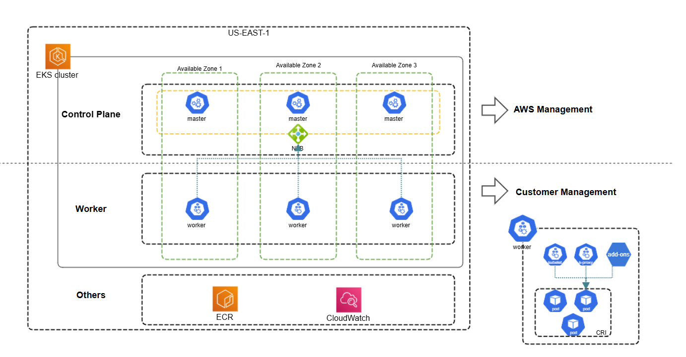

[https://jimmysong.io/book/kubernetes-handbook/architecture/](https://jimmysong.io/book/kubernetes-handbook/architecture/)

[https://jimmysong.io/kubernetes-handbook/cloud-native/cloud-native-definition.html](https://jimmysong.io/kubernetes-handbook/cloud-native/cloud-native-definition.html)

[https://kubernetes.io/docs/concepts/architecture/](https://kubernetes.io/docs/concepts/architecture/)

[https://docs.aws.amazon.com/eks/latest/userguide/eks-architecture.html](https://docs.aws.amazon.com/eks/latest/userguide/eks-architecture.html)

[https://docs.aws.amazon.com/eks/latest/userguide/eks-add-ons.html](https://docs.aws.amazon.com/eks/latest/userguide/eks-add-ons.html)

[https://github.com/terraform-aws-modules/terraform-aws-eks](https://github.com/terraform-aws-modules/terraform-aws-eks)

[https://docs.aws.amazon.com/eks/latest/userguide/kubernetes-versions.html](https://docs.aws.amazon.com/eks/latest/userguide/kubernetes-versions.html)

[https://docs.aws.amazon.com/eks/latest/userguide/update-cluster.html](https://docs.aws.amazon.com/eks/latest/userguide/update-cluster.html)

[https://aws.github.io/aws-eks-best-practices/cluster-autoscaling/](https://aws.github.io/aws-eks-best-practices/cluster-autoscaling/)

[https://karpenter.sh/docs/getting-started/](https://karpenter.sh/docs/getting-started/)

