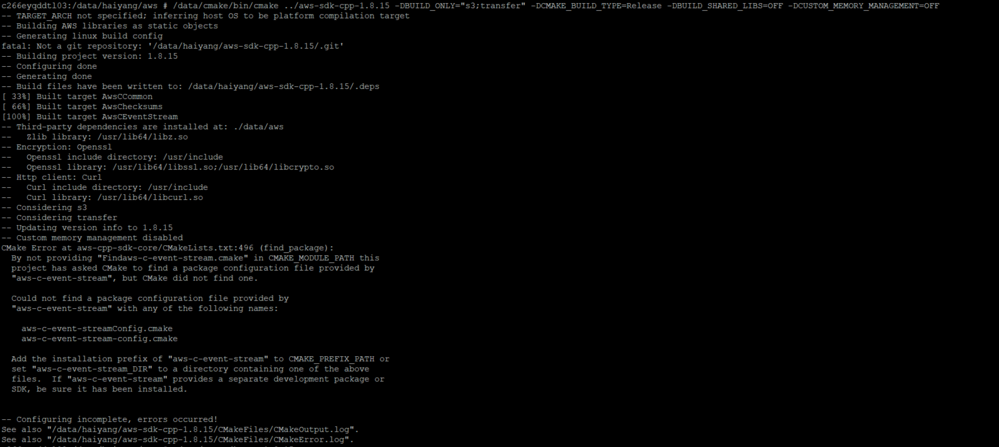

```javascript
Linux:
vi cmake/compiler_settings.cmake  Line 52
Change "-Werror" into "-Wno-error"
cmake ../aws-sdk-cpp-1.7.178 -DBUILD_ONLY="s3;elasticache;sns;sqs;lambda" -DCMAKE_BUILD_TYPE=Release -DCMAKE_INSTALL_PREFIX=/data/aws -DBUILD_SHARED_LIBS=OFF/ON -DCUSTOM_MEMORY_MANAGEMENT=OFF
make make install
```


-DBUILD_SHARED_LIBS=OFF 静态库 .a

-DBUILD_SHARED_LIBS=ON 动态库 .so


https://github.com/aws/aws-sdk-cpp/releases/tag/1.8.15

https://docs.aws.amazon.com/sdk-for-cpp/v1/developer-guide/setup.html


```javascript
Windows:
https://www.megalacant.com/techblog/2019/02/28/building-aws-cpp-sdk-windows.html
cmake D:\running\aws-sdk-cpp-1.7.178 -G "Visual Studio 14 Win64" -DBUILD_ONLY="s3;elasticache;sns;sqs;lambda" -DBUILD_SHARED_LIBS=OFF -DCUSTOM_MEMORY_MANAGEMENT=OFF
cmake -DCMAKE_BUILD_TYPE=Release -DCMAKE_INSTALL_PREFIX=D:\awssdk -DCMAKE_PREFIX_PATH=D:\awssdk --build .
msbuild INSTALL.vcxproj /p:Configuration=Release
msbuild INSTALL.vcxproj /p:Configuration=Debug
```


notes:



解决方案：

```javascript
rm -rf CMakeFile.cache
```


在sourcecode 同级新建文件夹，运行

```javascript
/data/cmake/bin/cmake ../aws-sdk-cpp-1.8.15 -DBUILD_ONLY="s3;transfer" -DCMAKE_BUILD_TYPE=Release -DBUILD_SHARED_LIBS=OFF -DCUSTOM_MEMORY_MANAGEMENT=OFF
/data/cmake/bin/cmake ../aws-sdk-cpp-1.8.15 -DBUILD_ONLY="s3;transfer" -DCMAKE_BUILD_TYPE=Release -DBUILD_SHARED_LIBS=ON -DCUSTOM_MEMORY_MANAGEMENT=OFF
```


```javascript
 vim cmake_install.cmake set install prefix
 if(NOT DEFINED CMAKE_INSTALL_PREFIX)
  set(CMAKE_INSTALL_PREFIX "/data/haiyang/release_aws")
endif()

```


https://cmake.org/download/

```javascript
Download:
$ wget http://www.cmake.org/files/v2.8/cmake-2.8.3.tar.gz
Extration of cmake source code from downloaded file:
$ tar xzf cmake-2.8.3.tar.gz
$ cd cmake-2.8.3
Configuration:
If you want to see the available conifuration options, run command below.
$ ./configure --help
In order to configure cmake before installation, run command below.
$ ./configure --prefix=/opt/cmake
We basically instructed the install script to install CMake in /opt/cmake.
Compilation:
$ make
Installation:
# make install
Verification:
After installation without any errors you can verify the installation by running the command below:
$ /opt/cmake/bin/cmake -version
The output should look something like below (depending upon cmake version you are installing).
cmake version 2.8.3
```


Additional Requirements for Linux Systems

To compile on Linux, you must have the header files (-dev packages) for libcurl, libopenssl, libuuid, zlib, and, optionally, libpulse for Amazon Polly support. The packages are typically found by using the system’s package manager.

To install the packages on Debian/Ubuntu-based systems

```javascript
sudo apt-get install libcurl4-openssl-dev libssl-dev uuid-dev zlib1g-dev libpulse-dev
```

To install the packages on Redhat/Fedora-based systems

```javascript
sudo dnf install libcurl-devel openssl-devel libuuid-devel pulseaudio-devel
```

To install the packages on CentOS-based systems

```javascript
sudo yum install libcurl-devel openssl-devel libuuid-devel pulseaudio-libs-devel
```

