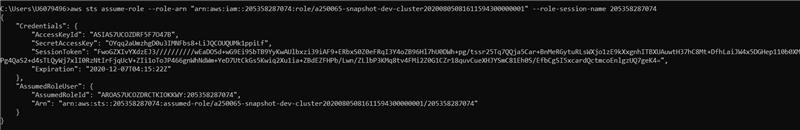
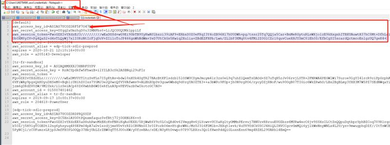

Delete nlb

需要把developer role 加到 trust relationship 里

```javascript
{
  "Version": "2012-10-17",
  "Statement": [
    {
      "Sid": "EKSClusterAssumeRole",
      "Effect": "Allow",
      "Principal": {
        "Service": [
          "eks.amazonaws.com",
          "lambda.amazonaws.com"
        ]
      },
      "Action": "sts:AssumeRole"
    },
    {
      "Sid": "Trusted250065DeveloperRoles",
      "Effect": "Allow",
      "Principal": {
        "AWS": "arn:aws:iam::205358287074:role/human-role/a250065-Developer"
      },
      "Action": "sts:AssumeRole"
    }
  ]
}
```

1. get credentials

aws sts assume-role --role-arn "arn:aws:iam::205358287074:role/a250065-snapshot-ppe-use120220125074121285200000002" --role-session-name 205358287074

aws sts assume-role --role-arn "arn:aws:iam::205358287074:role/a250065-snapshot-ppe-use120220125074121285200000002" --role-session-name 205358287074


PROD

aws sts assume-role --role-arn "arn:aws:iam::259431915815:role/a250065-snapshot-prod-use120211217123424980100000002"  --role-session-name 259431915815





1. cpoy and paste to your .aws/credentials default section



3. run aws cli command

a. (prefer) aws elbv2 delete-load-balancer --load-balancer-arn arn:aws:elasticloadbalancing:us-east-1:205358287074:loadbalancer/net/a058e18d3a23b44058d695f02ae637f4/1f3975dc1bbde6c4 --region us-east-1

b. aws elb delete-load-balancer --load-balancer-name a2b7ad224c9874007aea4dd1a6a18992 --region us-east-1


aws elbv2 delete-target-group --target-group-arn