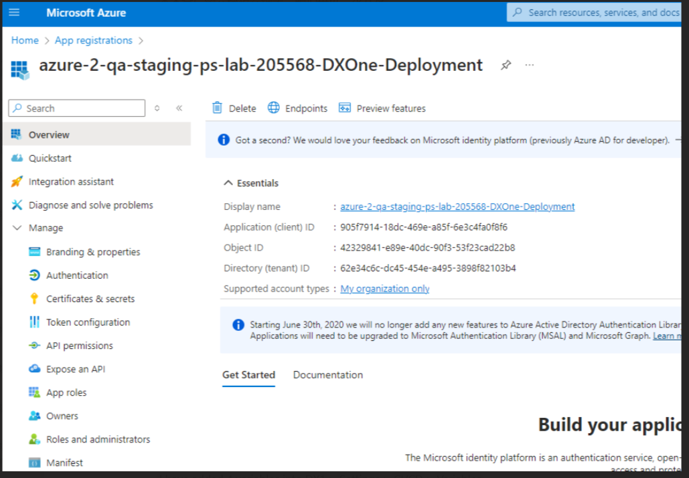

I have added 4 variables into DX1 > Settings > CI/CD > Variables

According to this page: [How do I setup a new project in DX1 to deploy a pipeline to Azure? - LSEG Stack Overflow (stackenterprise.co)](https://lseg.stackenterprise.co/questions/3647)

```
default:
  image: mcr.microsoft.com/azure-cli
  before_script:
    - az login --service-principal --username $SP_ID --password $SP_SECRET --tenant $TENANT_ID
    - az account set --subscription $SUBSCRIPTION_ID
```

 