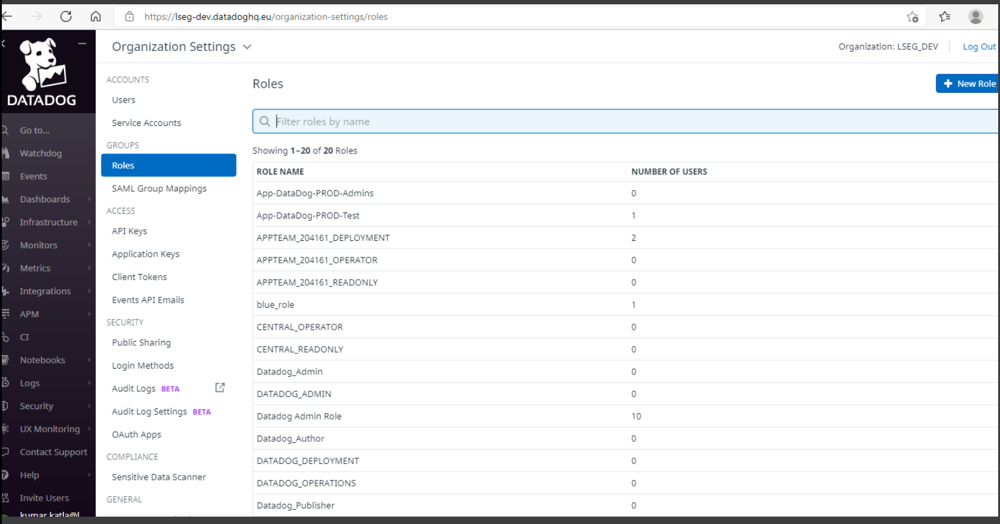
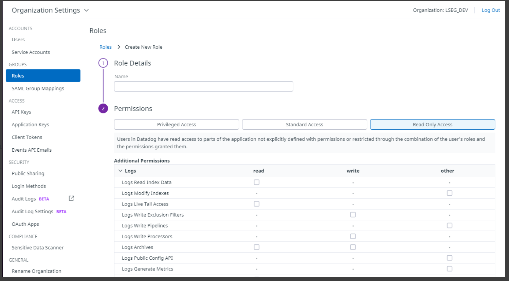
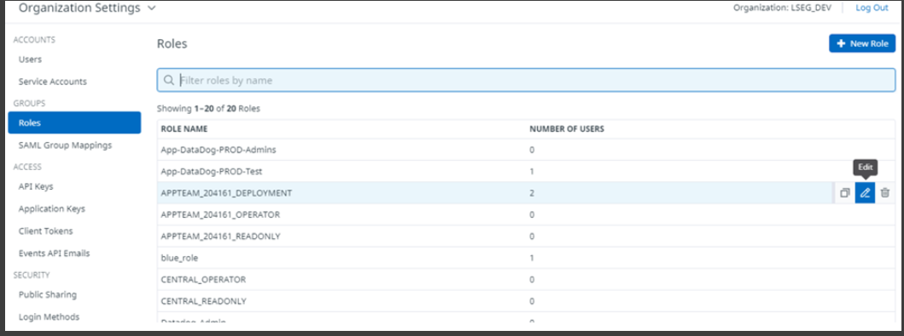
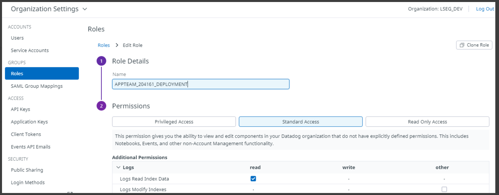
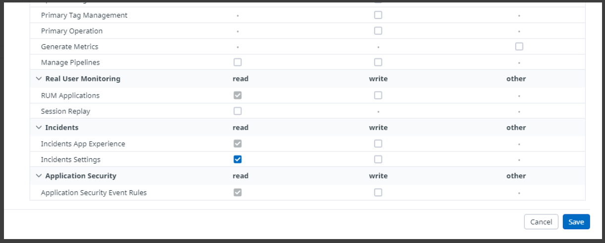
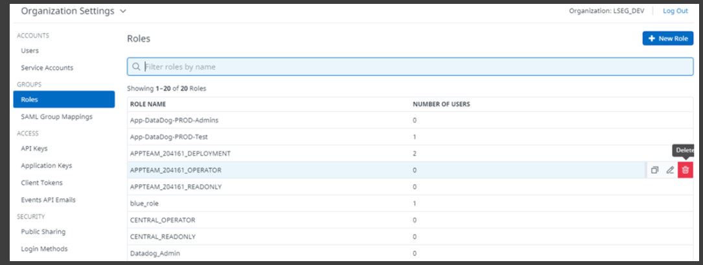
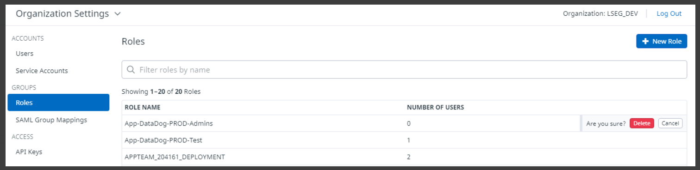

https://confluence.refinitiv.com/display/PCP/How+to+Manage+Datadog+Roles

Skip to end of metadata

- Created by Kumar Katla, last modified on Feb 06, 2022

Go to start of metadata

- Manage Datadog Roles

- Custom roles

- Create a custom role

- Update a role

- Delete a role

Manage Datadog Roles

Custom roles

Creating and modifying custom roles is an opt-in Enterprise feature. 

Manage your custom roles through the Datadog application, the Datadog Role API, or SAML directly.

Only users with the Access Management permission can create or edit roles in Datadog

Find below how to create, update, delete a role. 

| AD Group Name | Role Name in Datadog |
| - | - |
| Lseg-Dev\_DataDog-XXXXXX-Administrator | APPTEAM\_XXXXXX\_ADMINISTRATOR |
| Lseg-Dev\_DataDog-XXXXXX-Operations | APPTEAM\_XXXXXX\_OPERATOR |
| Lseg-Dev\_DataDog-XXXXXX-Deployment | APPTEAM\_XXXXXX\_DEPLOYMENT |
| Lseg-Dev\_DataDog-XXXXXX-Readonly | APPTEAM\_XXXXXX\_READONLY |

Create a custom role

You can create custom roles with Datadog application

To create a custom role:

Go to Orgnisation settings  and click on Roles.

Select New Role in the upper right corner of the page.

Give a name to your role.

Optional - Assigning a set of permissions to your Role. See the Datadog Role permissions documentation for more information about available permissions.

Update a role

To edit a custom role:

Go to Orgnisation settings  and click on Roles.

Select the edit button on the Role you would like to modify.

Modify the set of permissions to your Role.   

See the Datadog Role permissions documentation for more information about available permissions.

Save your changes.

Delete a role

To delete a custom role:

Go to Orgnisation settings  and click on Roles.

Select the delete button on the Role you would like to delete.

Confirm your decision.

Find the attached Role to Permission mapping sheet Role_To_Permission_Mappings.xlsx

Please refer to Datadog documentation for more details regarding Custom Roles

[Role_To_Permission_Mappings.xlsx](attachments/F46556963C7143C58B59677C97FE42A3Role_To_Permission_Mappings.xlsx)

