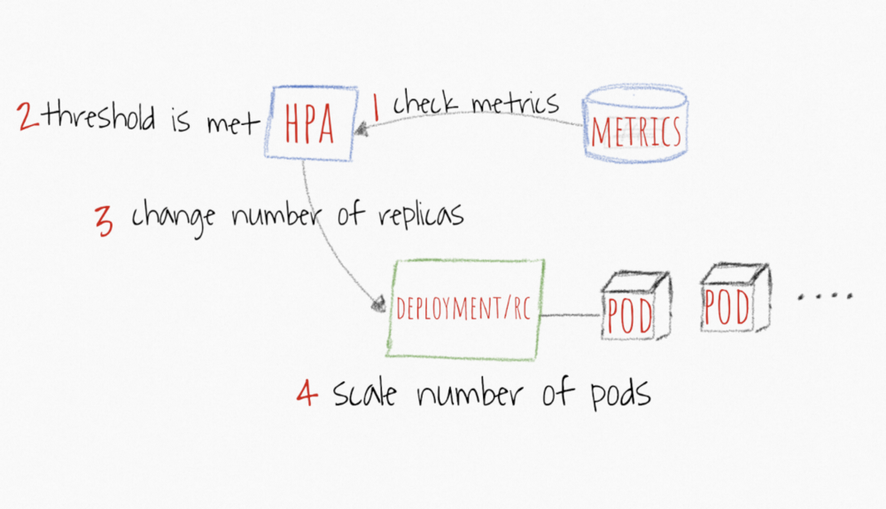
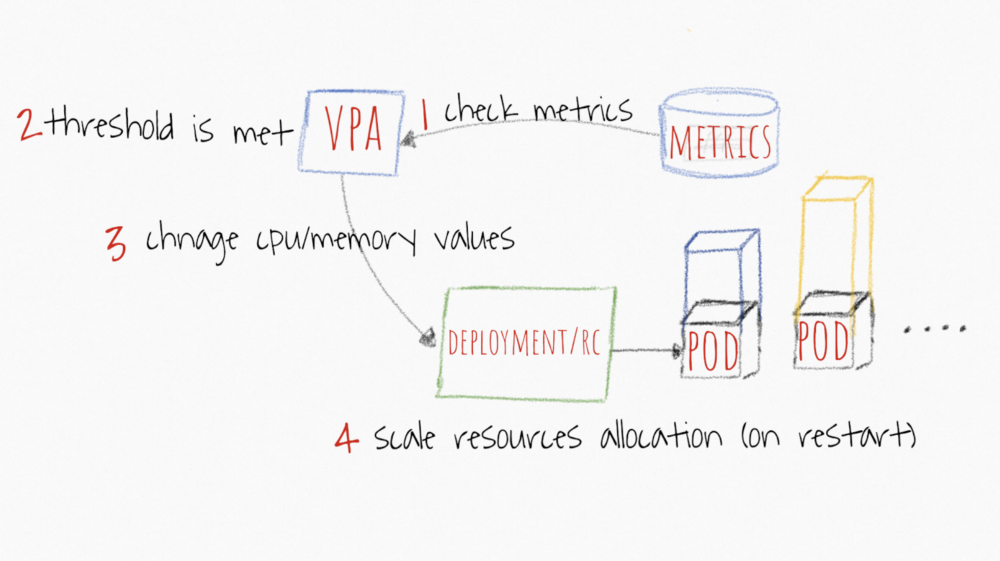
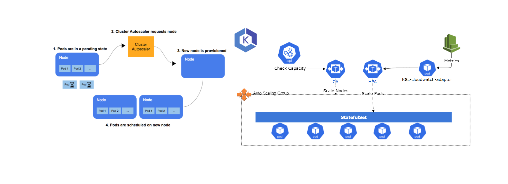
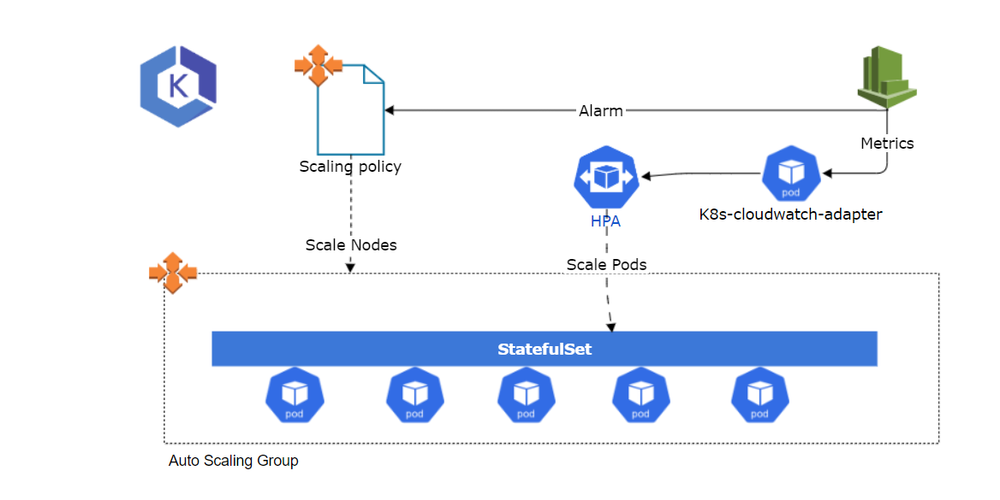

Skip to end of metadata

- Created by Tiffany Gong, last modified about an hour ago

Go to start of metadata

Background

We expect to scale the web server proactively to handle spike requests of the extreme amount of RICs 

Pod Level Scaling

Option 1: Horizontal Pod Autoscaler（HPA)

The Horizontal Pod Autoscaler automatically scales the number of Pods in a replication controller, deployment, replica set or stateful set based on observed CPU utilization (or, with custom metrics support, on some other application-provided metrics).

And it also supports configurable scaling behaviour, such as Scaling Policies and Stabilization Window.

The Horizontal Pod Autoscaler controller operates on the ratio between desired metric value and current metric value:

desiredReplicas = ceil[currentReplicas * ( currentMetricValue / desiredMetricValue )]

K8s-CloudWatch-Adapte is an implementation of the custom metrics API that allows retrieving arbitrary metrics from AWS Cloudwatch. It defines a custom resource named ExternalMetric.

1. Need to add all dimensions of one metric. 

2. The details of parameters can refer to get-metric-statistics.

3.It is not an official docker image.

|   |
| - |
| apiVersion: metrics.aws/v1alpha1 kind: ExternalMetric metadata:   name: web-metrics spec:   name: web-metrics   queries:     - id: test\_metric       metricStat:         metric:           namespace: "a250065-pricingsnapshot-qa"           metricName: "TestMetric"           dimensions:             - name: metric\_type               value: "counter"         period: 60         stat: Average         unit: None       returnData: true |

Option 2: Vertical Pod Autoscaler（VPA）

VPA frees the users from the necessity of setting up-to-date resource limits and requests for the containers in their pods.

When configured, it will set the requests automatically based on usage and thus allow proper scheduling onto nodes so that appropriate resource amount is available for each pod.

The pod will restart when resources are insufficient. It has a risk that most of the web servers restart at the moment when high resource usage.

Discussion Point:

|  | Point | Solution |
| - | - | - |
| 1 | Which metric suitable to trigger the scale of HPA?  This metric should be a service level instead of the pod level.  |  |
| 2 | Do we use VPA? It needs to install a metric server. |  |
| 3 | Can we use an unofficial image? Do we need to maintain it in ECR of BAMS? |  |

Node Level Scaling

Option 1 - Scaling with Cluster scaler

The cluster scaler will monitor those Pods in the cluster that cannot run properly due to insufficient resource allocation. Once such a situation occurs, the Cluster Autoscaler will automatically update the ASGs, adding a certain number of nodes to the cluster. Also, Cluster Autoscaler will detect nodes with low resource utilization and schedule the Pods among them on other nodes. Then reduce the number of nodes required by the ASGs to achieve cluster scale down.

Cluster scaler scale up a new node normally takes about 5-10 minutes.

 

Option 2 - Scaling with AWS Autoscaling

AWS autoscaling supports dynamic scaling and Predictive Scaling.

A scaling policy instructs Amazon EC2 Auto Scaling to track a specific CloudWatch metric, and it defines what action to take when the associated CloudWatch alarm is in ALARM.

Amazon EC2 Auto Scaling supports the following types of scaling policies:

- Target tracking scaling—With target tracking scaling policies, you select a scaling metric and set a target value. Amazon EC2 Auto Scaling creates and manages the CloudWatch alarms that trigger the scaling policy and calculates the scaling adjustment based on the metric and the target value. The scaling policy adds or removes capacity as required to keep the metric at, or close to, the specified target value. In addition to keeping the metric close to the target value, a target tracking scaling policy also adjusts to changes in the metric due to a changing load pattern.

- Step scaling—With step scaling and simple scaling, you choose scaling metrics and threshold values for the CloudWatch alarms that trigger the scaling process.

- Simple scaling—Increase or decrease the current capacity of the group based on a single scaling adjustment.

 

Cons and Pros

|  | Cons | Pros |
| - | - | - |
| Option 1 | No need to change infrastructure，separate scaling logic from infrastructure Easy to implement | Cannot support Predictive Scaling Need some time to scale up and down (5-10 minutes) |
| Option 2 | Support predictive scaling May saving time to scaling up a node. Need testing | Need to change infrastructure and set alarms Need test accuracy of prediction Cost of alarms |

Discussion Point:

|  | Point | Solution |
| - | - | - |
| 1 | If metrics are enough to trigger scaling up and down? Do we need to support predictive scaling? (It may scale up a node due to the prediction, but actually, there is no pod need be scaled up.) |  |
| 2 | If we want to scale predictive, how to trigger pod scaling and scheduling? |  |

Preference

https://kubernetes.io/docs/tasks/run-application/horizontal-pod-autoscale

https://github.com/awslabs/k8s-cloudwatch-adapter

https://aws.amazon.com/blogs/aws/new-predictive-scaling-for-ec2-powered-by-machine-learning/

https://aws.amazon.com/cloudwatch/pricing/?nc1=h_ls