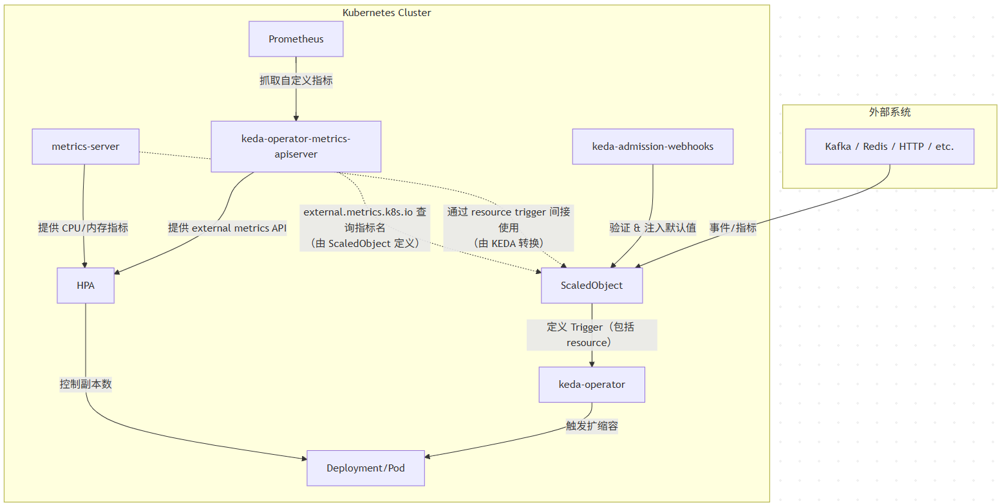

https://keda.sh/docs/2.17/reference/

| 组件名称 | Pod 名称 | 功能 | 备注 | 
| -- | -- | -- | -- |
| keda-metrics-apiserver | keda-operator-metrics-apiserver | 提供  | 当前标准部署方式 | 
| keda-operator | keda-operator | 管理 ScaledObject、触发扩缩容 | 控制器组件 | 
| keda-admission-webhooks | keda-admission-webhooks | 验证和修改 CRD | 可选但推荐 | 


```
 graph TD
    subgraph Kubernetes Cluster
        A[metrics-server] -->|提供 CPU/内存指标| B[HPA]
        B -->|控制副本数| D[Deployment/Pod]

        C[Prometheus] -->|抓取自定义指标| E[keda-operator-metrics-apiserver]
        E -->|提供 external metrics API| B

        H[ScaledObject] -->|定义 Trigger（包括 resource）| F[keda-operator]
        F -->|触发扩缩容| D

        E -.->|external.metrics.k8s.io 查询指标名<br/>（由 ScaledObject 定义）| H
        A -.->|通过 resource trigger 间接使用<br/>（由 KEDA 转换）| H

        I[keda-admission-webhooks] -->|验证 & 注入默认值| H
    end

    subgraph 外部系统
        G[Kafka / Redis / HTTP / etc.] -->|事件/指标| H
    end 
```



ScaledObject

使用metric server时， 这里面它只会去取scaleTargetRef指定的cpu,而不是集群所有的cpu

下面是使用prometheus

```shell
apiVersion: keda.sh/v1alpha1
kind: ScaledObject
metadata:
  name: ets-qe-scaledobject
  labels:
    app: ets-qe
spec:
  scaleTargetRef:
    apiVersion: apps/v1
    kind: StatefulSet
    name: ets-qe
  pollingInterval: 30                                      # Optional, the interval KEDA to check each trigger on. Default: 30 seconds
  advanced: # Optional. Section to specify advanced options
    restoreToOriginalReplicaCount: true          # Optional. Default: false
    horizontalPodAutoscalerConfig: # Optional. Section to specify HPA related options
      behavior:
        scaleDown:
          stabilizationWindowSeconds: 300
          policies:
            - type: Percent
              value: 20
              periodSeconds: 300
            - type: Pods
              value: 1
              periodSeconds: 300
        scaleUp:
          stabilizationWindowSeconds: 60
          policies:
            - type: Percent
              value: 20
              periodSeconds: 600
            - type: Pods
              value: 1
              periodSeconds: 300
          selectPolicy: Max
  minReplicaCount: 2
  maxReplicaCount: 4
  triggers:
    - type: prometheus
      metadata:
        serverAddress: http://prometheus-service.ets-intraday-qe.svc.cluster.local:9091
        metricName: container_cpu_usage_seconds_total
        threshold: "75"
        query: sum(rate(container_cpu_usage_seconds_total{container="query-engine"}[1m]))/(count(container_cpu_usage_seconds_total{container="query-engine"}) * 12) * 100

    - type: prometheus
      metadata:
        serverAddress: http://prometheus-service.ets-intraday-qe.svc.cluster.local:9091
        metricName: task_queue_size
        threshold: "20"
        query: max(task_queue_size)

#https://keda.sh/docs/2.15/scalers/aws-cloudwatch/
#    - type: aws-cloudwatch
#      metadata:
#        namespace: TEST/KEDA
#        dimensionName: InstanceId
#        dimensionValue: i-12345abcdf
#        metricName: TestKedaMetric
#        targetMetricValue: "5"
#        minMetricValue: "0"
#        awsRegion: "us-east-1"
#        # Optional: Collection Time
#        metricCollectionTime: "180" # default 300
#        # Optional: Metric Statistic
#        metricStat: "Average" # default "Average"
#        # Optional: Metric Statistic Period,  must be a value supported by Cloudwatch (1, 5, 10, 30, or a multiple of 60)
#        metricStatPeriod: "60" # default 300
#        # Optional: Metric EndTime Offset
#        metricEndTimeOffset: "0" # default 0
#      authenticationRef:
#        name: keda-trigger-auth-aws-credentials
#---
#apiVersion: keda.sh/v1alpha1
#kind: TriggerAuthentication
#metadata:
#  name: keda-trigger-auth-aws-credentials
#  namespace: default
#spec:
#  podIdentity:
#    provider: aws
```

Prometheus不能通过scaleTargetRef来抓指定的pod的metric, 但它也是从kubelet内嵌的cadvisor里面拿到的metric

[https://github.com/prometheus/prometheus/blob/main/documentation/examples/prometheus-kubernetes.yml](https://github.com/prometheus/prometheus/blob/main/documentation/examples/prometheus-kubernetes.yml)

### triggers 

里面的多个条件是or的逻辑，扩容是 OR，缩容是 AND。

[https://keda.sh/docs/2.17/reference/faq/#best-practices](https://keda.sh/docs/2.17/reference/faq/#best-practices)

### stabilizationWindowSeconds

举个例子：scaleDown 的稳定窗口

```
scaleDown:
  stabilizationWindowSeconds: 300
```

- 表示在过去 **5 分钟（300 秒）** 内，HPA 会记录所有的缩容建议。

- 它不会立刻执行最新的缩容建议，而是从这 5 分钟内的建议中选择 **最小的副本数** 来执行。

🧪 示例场景

假设当前副本数是 4，过去 5 分钟内 Prometheus 指标波动，HPA 给出的缩容建议如下：

| 时间点 | 推荐副本数 | 
| -- | -- |
| T-5min | 3 | 
| T-4min | 2 | 
| T-3min | 3 | 
| T-2min | 2 | 
| T-1min | 3 | 


- 如果没有稳定窗口，HPA 可能会在每次指标下降时就立刻缩容，造成频繁波动。

- 有了 stabilizationWindowSeconds: 300，HPA 会从过去 5 分钟的建议中选择 **最小值 2**，然后再决定是否缩容到 2。

再举个例子：scaleUp 的稳定窗口

```
scaleUp:
  stabilizationWindowSeconds: 60
```

- 表示在过去 **1 分钟** 内，HPA 会记录所有的扩容建议。

- 它会选择这段时间内的 **最大推荐副本数** 来扩容。

🧪 示例场景

当前副本数是 2，过去 1 分钟内的扩容建议如下：

| 时间点 | 推荐副本数 | 
| -- | -- |
| T-60s | 3 | 
| T-30s | 4 | 
| T-10s | 3 | 


- HPA 会选择最大值 **4**，然后扩容到 4。

✅ 总结

| 类型 | stabilizationWindowSeconds | 作用方式 | 
| -- | -- | -- |
| scaleUp | 60 秒 | 取过去 60 秒内的最大推荐值 | 
| scaleDown | 300 秒 | 取过去 300 秒内的最小推荐值 | 


这个机制的好处是：

- 避免因指标短时间波动而频繁扩缩容。

- 提高系统的稳定性和资源使用效率。

### Ploicy的用处

基本是透传的[https://kubernetes.io/docs/tasks/run-application/horizontal-pod-autoscale/#configurable-scaling-behavior](https://kubernetes.io/docs/tasks/run-application/horizontal-pod-autoscale/#configurable-scaling-behavior)

[https://kubernetes.io/docs/reference/kubernetes-api/workload-resources/horizontal-pod-autoscaler-v2/#HorizontalPodAutoscalerSpec](https://kubernetes.io/docs/reference/kubernetes-api/workload-resources/horizontal-pod-autoscaler-v2/#HorizontalPodAutoscalerSpec)

selectPolicy不论scaleup还是down, 默认值都是max

🧪 假设当前副本数是 5：

🔽 缩容策略（scaleDown）

- Percent: 20 → 最多缩容 20%：5×20%=15×20%=1（向下取整）

- Pods: 1 → 最多缩容 1 个 Pod

- periodSeconds: 300 → 每 5 分钟最多执行一次缩容

**最终效果**：每 5 分钟最多缩容 1 个 Pod（因为两个策略都限制为 1）

🔼 扩容策略（scaleUp）

- Percent: 20 → 最多扩容 1 个 Pod（5×20%=15×20%=1）

- Pods: 1 → 最多扩容 1 个 Pod

- selectPolicy: Max → 选择两个策略中允许的最大值

**最终效果**：每次扩容最多增加 1 个 Pod

效果举例， 默认scale desired的建议是15秒更新一次。


在 HPA 中，stabilizationWindowSeconds 会让控制器在扩容时参考过去窗口内的最小推荐副本数，在缩容时参考最大推荐副本数，以此来稳定扩缩容行为。

[https://github.com/kubernetes/kubernetes/blob/master/pkg/controller/podautoscaler/horizontal.go#L1134](https://github.com/kubernetes/kubernetes/blob/master/pkg/controller/podautoscaler/horizontal.go#L1134)

```python
# hpa_scaleup_bucket_switch.py
# -*- coding: utf-8 -*-
"""
HPA scale-up simulation & plotting:
- Sync period = 15s (one scale action at most per sync)
- scaleUp policies (selectPolicy=Max):
    * Percent = 10% per 60s
    * Pods    = +1   per 90s
  Each policy uses its own "bucket" (quota) within its periodSeconds window.
  The bucket does NOT grow inside the window; it resets when the window expires.
  This produces realistic policy switching rather than always picking percent.
- Compare scaleUp.stabilizationWindowSeconds = 0s vs 300s
- desired replicas fixed to 20, start replicas 10
- Step lines drawn with explicit vertical jumps at t, arrow tip placed at the
  midpoint of each vertical jump (precise alignment).

Dependencies: numpy, matplotlib
> pip install numpy matplotlib
"""

import math
import numpy as np
import matplotlib.pyplot as plt
from matplotlib.ticker import MultipleLocator, FuncFormatter

# -----------------------------
# Parameters (tweak as needed)
# -----------------------------
SYNC_S = 15          # HPA sync period in seconds
START = 10           # initial replicas
DESIRED = 20         # desired replicas (kept constant for this demo)

# scaleUp policies
PERCENT_VALUE   = 10   # 10%
PERCENT_PERIOD  = 60   # seconds
PODS_VALUE      = 1    # +1
PODS_PERIOD     = 90   # seconds

# Compare two scaleUp windows
WIN_A = 0            # seconds
WIN_B = 300          # seconds

# Total simulation length
T_TOTAL = 15 * 60    # 15 minutes in seconds

# -----------------------------
# Simulation with per-policy "buckets"
# -----------------------------
def simulate_bucket(scaleup_window_seconds: int):
    """
    Simulate HPA scale-up using independent per-policy buckets (quota).
    - For each policy, we compute 'remaining allowance' inside its window.
    - selectPolicy=Max: among policies with remaining allowance > 0,
      pick the one with larger allowance (tie-breaker: one with sooner expiry).
    - One scaling action per sync cycle.
    Returns:
      X_path (np.array seconds), Y_path (replicas with vertical jumps),
      events: list[(t, old, new, policy_str)]
    """
    cur = START

    # Percent bucket
    p_bucket_start = None  # window start timestamp
    p_used = 0             # used replicas within current window
    p_baseline = None      # replicas at first scale within current 60s window

    # Pods bucket
    n_bucket_start = None
    n_used = 0

    # For drawing exact vertical jumps at x=t
    X_path, Y_path = [], []
    events = []  # (t, old, new, policy_str)

    for t in range(0, T_TOTAL + 1, SYNC_S):
        old = cur

        # record plateau value BEFORE any potential scaling at this tick
        X_path.append(t)
        Y_path.append(old)

        # gate by stabilization window and desired
        if cur < DESIRED and t >= scaleup_window_seconds:

            # Reset percent bucket if window expired; freeze baseline for new window
            if p_bucket_start is None or (t - p_bucket_start) >= PERCENT_PERIOD:
                p_bucket_start = t
                p_used = 0
                p_baseline = cur  # <= the baseline is frozen for this 60s window

            # Reset pods bucket if window expired
            if n_bucket_start is None or (t - n_bucket_start) >= PODS_PERIOD:
                n_bucket_start = t
                n_used = 0

            # Remaining allowances
            p_limit = max(1, math.ceil(p_baseline * PERCENT_VALUE / 100.0))
            p_allow = max(0, p_limit - p_used)

            n_limit = PODS_VALUE
            n_allow = max(0, n_limit - n_used)

            # Collect candidates (allow > 0)
            candidates = []
            if p_allow > 0:
                time_to_expire_p = p_bucket_start + PERCENT_PERIOD - t
                candidates.append((p_allow, "10%/60s", time_to_expire_p))
            if n_allow > 0:
                time_to_expire_n = n_bucket_start + PODS_PERIOD - t
                candidates.append((n_allow, "+1/90s", time_to_expire_n))

            if candidates:
                # selectPolicy=Max: pick larger allowance; tie→window that expires sooner
                candidates.sort(key=lambda z: (-z[0], z[2]))
                allow, policy, _ = candidates[0]
                inc = min(allow, DESIRED - cur)
                if inc > 0:
                    cur += inc
                    # Update the chosen bucket's usage
                    if policy == "10%/60s":
                        p_used += inc
                    else:
                        n_used += inc

                    # Insert a duplicate x=t with AFTER value -> visible vertical jump
                    X_path.append(t)
                    Y_path.append(cur)
                    events.append((t, old, cur, policy))

    return np.array(X_path), np.array(Y_path), events


# Run both scenarios
X0, Y0, E0 = simulate_bucket(WIN_A)
X300, Y300, E300 = simulate_bucket(WIN_B)

# -----------------------------
# Plot
# -----------------------------
plt.figure(figsize=(13.5, 6.7))

# Step curves (we already inserted vertical jumps at exact t)
plt.plot(X0 / 60.0, Y0, drawstyle="steps-post",
         label=f"scaleUp window = {WIN_A}s", linewidth=2, color="#1f77b4")
plt.plot(X300 / 60.0, Y300, drawstyle="steps-post",
         label=f"scaleUp window = {WIN_B}s", linewidth=2, color="#ff7f0e")

# Desired & Stabilization area
plt.hlines(DESIRED, 0, T_TOTAL / 60.0, colors="crimson",
           linestyles="--", linewidth=2, label=f"desired = {DESIRED} (fixed)")
plt.axvspan(0, WIN_B / 60.0, color="orange", alpha=0.08,
            label=f"{WIN_B}s stabilization window")

# Annotate: arrow tip at the midpoint of the vertical jump
COLOR = {"10%/60s": "#2ca02c", "+1/90s": "#d62728"}

def annotate(events, side="right", y_jitter=0.0):
    for t, old, new, pol in events:
        x = t / 60.0
        y_mid = (old + new) / 2.0 + y_jitter
        c = COLOR[pol]
        # small mid-point marker (sanity check)
        plt.scatter([x], [y_mid], s=22, facecolor="white", edgecolor=c, zorder=4)
        # place label to right/left to avoid overlap
        xytext = (10, 0) if side == "right" else (-10, 0)
        ha     = "left"  if side == "right" else "right"
        plt.annotate(
            f"{int(new)} ← {pol}",
            xy=(x, y_mid), xytext=xytext, textcoords="offset points",
            ha=ha, va="center", fontsize=9, color=c,
            arrowprops=dict(arrowstyle="->", color=c, lw=0.9),
        )

# 分别把两条曲线的标注放在不同侧（并微抖 y），避免遮挡
annotate(E0,   side="right", y_jitter=+0.00)  # window=0s
annotate(E300, side="left",  y_jitter=-0.06)  # window=300s

# X 轴：mm:ss（主刻度 1 分钟、次刻度 15 秒）
ax = plt.gca()
ax.xaxis.set_major_locator(MultipleLocator(1))
ax.xaxis.set_minor_locator(MultipleLocator(0.25))  # 0.25 min = 15s
def fmt_mmss(x, pos):
    total_sec = int(round(x * 60))
    m, s = divmod(total_sec, 60)
    return f"{m:02d}:{s:02d}"
ax.xaxis.set_major_formatter(FuncFormatter(fmt_mmss))

plt.xlabel("Time (mm:ss)")
plt.ylabel("Replicas")
plt.title(
    "HPA scale-up (15s sync) with per-policy buckets (policy switching)\n"
    "Policies: 10%/60s & +1/90s (selectPolicy=Max); start=10, desired=20\n"
    "Arrows point to midpoint of vertical jump at x=t (exact alignment)"
)
plt.xlim(0, T_TOTAL / 60.0)
plt.ylim(9, 22)
plt.grid(True, which="major", axis="x", alpha=0.35)
plt.grid(True, which="minor", axis="x", alpha=0.15)
plt.grid(True, which="major", axis="y", alpha=0.25)
plt.legend(loc="lower right")
plt.tight_layout()

out_path = "hpa_scaleup_bucket_switch.png"
plt.savefig(out_path, dpi=240)
print(f"Saved figure: {out_path}")

# -----------------------------
# Print events (optional)
# -----------------------------
def dump(events, title):
    print("\n" + title)
    for t, old, new, pol in events:
        m, s = divmod(t, 60)
        print(f"{m:02d}:{s:02d}  {old}->{new}  {pol}")

dump(E0,   f"Events (scaleUp window = {WIN_A}s)")
dump(E300, f"Events (scaleUp window = {WIN_B}s)")

```