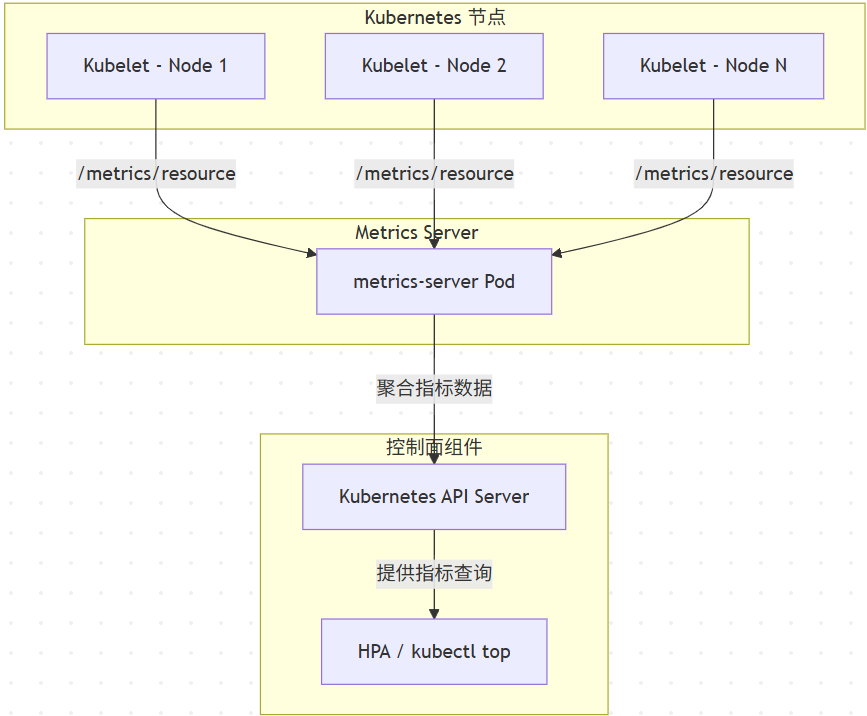

### 指标汇总（Metrics Summary）

| 级别 | 指标名称 | 描述 | 
| -- | -- | -- |
| Node | cpu.usage | 节点 CPU 使用率（非累计） | 
|   | memory.usage | 节点内存使用量 | 
|   | memory.available | 节点可用内存 | 
|   | network.rx/tx | 网络接收/发送速率 | 
| Pod | cpu.usage | Pod 的 CPU 使用率 | 
|   | memory.usage | Pod 的内存使用量 | 


这些指标是通过访问每个节点上的 kubelet 的 /metrics/resource 接口获取的。

1. **Node 级别指标**

Kubelet 运行在每个节点上，能够直接访问该节点的资源使用情况，包括：

- CPU 使用率

- 内存使用量

- 可用内存

- 网络和磁盘 I/O（部分暴露）

这些数据通常来自于 **cAdvisor**，它是内嵌在 Kubelet 中的一个组件，专门用于收集容器和主机的资源使用数据。

✅ 2. **Pod / 容器级别指标**

Kubelet 也会收集每个 Pod（具体来说是 Pod 中的每个容器）的资源使用情况，包括：

- 每个容器的 CPU 使用率

- 每个容器的内存使用量

这些数据同样来自 cAdvisor，并通过 Kubelet 的 /metrics/resource 接口暴露给 metrics-server。

```
 flowchart TD
    subgraph "Kubernetes 节点"
        K1[Kubelet - Node 1]
        K2[Kubelet - Node 2]
        K3[Kubelet - Node N]
    end

    subgraph "Metrics Server"
        MS[metrics-server Pod]
    end

    subgraph "控制面组件"
        APIServer[Kubernetes API Server]
        HPA[HPA / kubectl top]
    end

    K1 -->|"/metrics/resource"| MS
    K2 -->|"/metrics/resource"| MS
    K3 -->|"/metrics/resource"| MS

    MS -->|聚合指标数据| APIServer
    APIServer -->|提供指标查询| HPA
```

