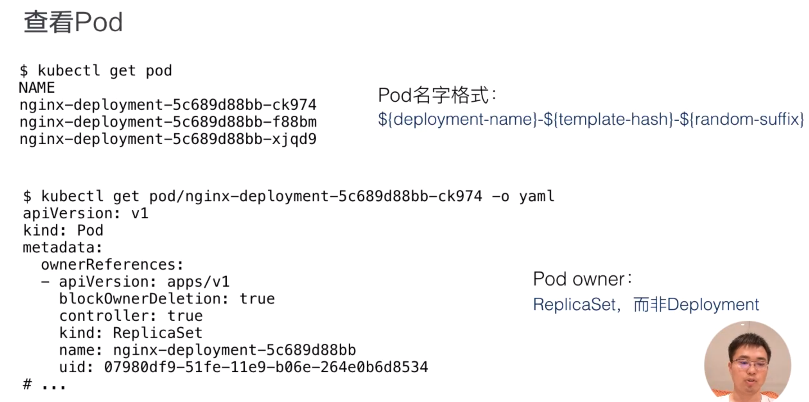
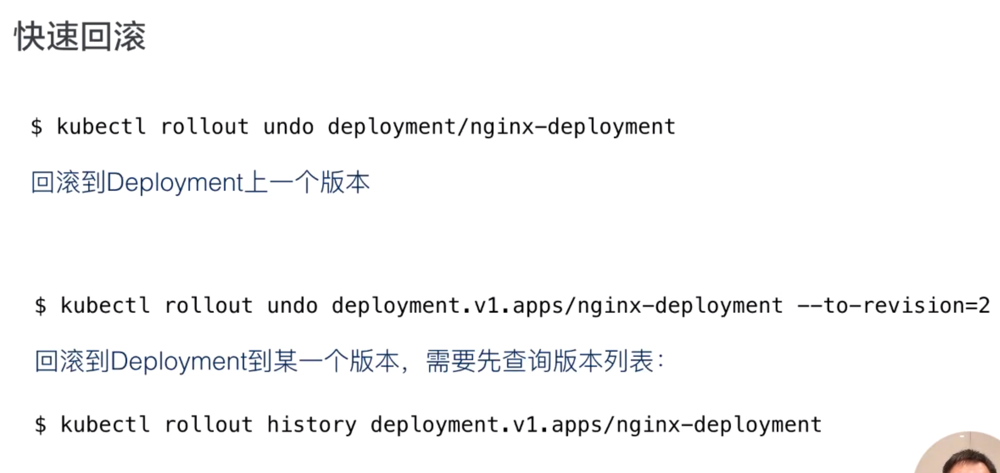

minikube start

minikube status


kubectl get nodes

kubectl get deployments

kubectl get --watch deployments


kubectl apply -f deployment.yaml

kubectl describe deployment deployment_name

kubectl delete deployment  deployment_name


查看pods的yaml

kubectl get pods pod_name -o yaml | less

查看所有pod的label

kubectl get pods --show-labels

查看指定label的pods 

kubectl get pods --show-labels -l env=test

kubectl get pods  --show-labels -l 'env in (test,dev)'

kubectl get pods --show-labels -l env-test,tie=front

设置label

kubectl label pods pod_name env=test --overwrite

移除label

kubectl label pods pod_name env-


delete namespace hang

PS C:\Users\U6079496\Desktop\Code\Release\DXOne\pricingsnapshot\pricingsnapshot_k8s> kubectl get apiservice


NAME                                   SERVICE                                 AVAILABLE                  AGE


v1.                                    Local                                   True                       70m


v1.admissionregistration.k8s.io        Local                                   True                       70m


v1.apiextensions.k8s.io                Local                                   True                       70m


v1.apps                                Local                                   True                       70m


v1.authentication.k8s.io               Local                                   True                       70m


v1.storage.k8s.io                      Local                                   True                       70m


v1alpha1.crd.k8s.amazonaws.com         Local                                   True                       65m


v1alpha1.metrics.aws                   Local                                   True                       47m


v1beta1.batch                          Local                                   True                       70m


v1beta1.discovery.k8s.io               Local                                   True                       70m


v1beta1.events.k8s.io                  Local                                   True                       70m


v1beta1.external.metrics.k8s.io        custom-metrics/k8s-cloudwatch-adapter   False (MissingEndpoints)   47m


v1beta1.flowcontrol.apiserver.k8s.io   Local                                   True                       70m


v1beta1.metrics.k8s.io                 kube-system/metrics-server              False (MissingEndpoints)   44m


v1beta1.node.k8s.io                    Local                                   True                       70m


v1beta1.policy                         Local                                   True                       70m


v1beta1.storage.k8s.io                 Local                                   True                       70m


v1beta1.vpcresources.k8s.aws           Local                                   True                       65m


v1beta2.flowcontrol.apiserver.k8s.io   Local                                   True                       70m


v2.autoscaling                         Local                                   True                       70m


v2beta1.autoscaling                    Local                                   True                       70m


v2beta2.autoscaling                    Local                                   True                       70m


PS C:\Users\U6079496\Desktop\Code\Release\DXOne\pricingsnapshot\pricingsnapshot_k8s> kubectl delete apiservice v1beta1.external.metrics.k8s.io


apiservice.apiregistration.k8s.io "v1beta1.external.metrics.k8s.io" deleted


PS C:\Users\U6079496\Desktop\Code\Release\DXOne\pricingsnapshot\pricingsnapshot_k8s> kubectl delete apiservice v1beta1.metrics.k8s.io


apiservice.apiregistration.k8s.io "v1beta1.metrics.k8s.io" deleted


PS C:\Users\U6079496\Desktop\Code\Release\DXOne\pricingsnapshot\pricingsnapshot_k8s> kubectl delete namespace ingress-nginx


namespace "ingress-nginx" deleted


pod name format



更新pod


回滚

https://edu.aliyun.com/lesson_1651_13081?spm=5176.10731542.0.0.145920beVG4UVh#_13081




https://jamesdefabia.github.io/docs/user-guide/kubectl/kubectl/

http://docs.kubernetes.org.cn/683.html


打开yaml

kubectl edit deployment nginx-deployment -o yaml


kubectl get replicaset


kubectl delete -k .\local\

kubectl apply -k ./local/


创建docker config


kubectl create secret docker-registry regcred --docker-server=bams-aws.refinitiv.com:5001 --docker-username=-s.ts.auto --docker-password=TSAut0mat10n -n haiyang


kubectl set env ds aws-node -n kube-system WARM_IP_TARGET=<value>


修改annotation

kubectl annotate ingresses snapshot-web-ingress nginx.ingress.kubernetes.io/limit-rps-

kubectl annotate ingresses snapshot-web-ingress nginx.ingress.kubernetes.io/limit-rps=2500

kubectl annotate --overwrite service ingress-nginx-controller service.beta.kubernetes.io/load-balancer-source-ranges='10.25.145.0/24,10.25.146.0/24,10.184.30.0/24,10.184.72.0/24,10.184.74.0/24,10.184.75.0/24,10.184.12.0/24,10.187.13.0/24,10.187.18.0/24,10.53.8.0/24,10.53.9.0/24,10.187.22.0/24,10.181.236.0/24' -n ingress-nginx


kubectl scale statefulsets snapshot-cache-l-common-a --replicas=16


get kubelet version(node image version) 

kubectl get nodes -o yaml | grep kubelet

```javascript
kubectl drain ip-10-107-88-117.ec2.internal --ignore-daemonsets --delete-emptydir-data
kubectl drain ip-10-107-88-23.ec2.internal --ignore-daemonsets --delete-emptydir-data
kubectl drain ip-10-107-88-53.ec2.internal --ignore-daemonsets --delete-emptydir-data
kubectl drain ip-10-107-88-81.ec2.internal --ignore-daemonsets --delete-emptydir-data
kubectl drain ip-10-107-88-93.ec2.internal --ignore-daemonsets --delete-emptydir-data
kubectl drain ip-10-107-89-163.ec2.internal --ignore-daemonsets --delete-emptydir-data
kubectl drain ip-10-107-89-176.ec2.internal --ignore-daemonsets --delete-emptydir-data
kubectl drain ip-10-107-89-205.ec2.internal --ignore-daemonsets --delete-emptydir-data
kubectl drain ip-10-107-89-65.ec2.internal --ignore-daemonsets --delete-emptydir-data

kubectl uncordon <node-name>
```

kubectl exec -i -t -n default snapshot-web-0 -c webserver "--" sh -c "clear; (bash || ash || sh)"