在前一篇文章中详细介绍了Kubernetes容器集群管理环境 - 完整部署（中篇），这里继续记录下Kubernetes集群插件等部署过程：

十一、Kubernetes集群插件

插件是Kubernetes集群的附件组件，丰富和完善了集群的功能，这里分别介绍的插件有coredns、Dashboard、Metrics Server，需要注意的是：kuberntes 自带插件的 manifests yaml 文件使用 gcr.io 的 docker registry，国内被墙，需要手动替换为其它registry 地址或提前在翻墙服务器上下载，然后再同步到对应的k8s部署机器上。

11.1 - Kubernetes集群插件 - coredns

可以从微软中国提供的 gcr.io 免费代理下载被墙的镜像；下面部署命令均在k8s-master01节点上执行。

|   |   |
| - | - |
| 1 2 3 4 5 6 7 8 9 10 11 12 13 14 15 16 17 18 19 20 21 22 23 24 25 26 27 28 29 30 31 32 33 34 35 36 37 38 39 40 41 42 43 44 45 46 47 48 49 50 51 52 53 54 55 56 57 58 59 60 61 62 63 64 65 66 67 68 69 70 71 72 73 74 75 76 77 78 79 80 81 82 83 84 85 86 87 88 89 90 91 92 93 94 95 96 97 98 99 100 101 102 103 104 105 106 107 108 109 110 111 112 113 114 115 116 117 118 119 120 121 122 123 124 125 126 127 128 129 130 131 132 133 134 135 136 137 138 139 140 141 142 143 144 145 146 147 148 149 150 151 152 153 154 155 156 157 158 159 160 161 162 163 164 165 166 167 168 169 170 171 172 173 174 175 176 177 178 179 180 181 182 183 184 185 186 187 188 189 190 191 192 193 194 195 196 197 198 199 200 201 202 203 204 205 206 207 208 | 1）修改配置文件 将下载的 kubernetes-server-linux-amd64.tar.gz 解压后，再解压其中的 kubernetes-src.tar.gz 文件。 [root@k8s-master01 ~]\# cd /opt/k8s/work/kubernetes [root@k8s-master01 kubernetes]\# tar -xzvf kubernetes-src.tar.gz   解压之后，coredns 目录是 cluster/addons/dns。   [root@k8s-master01 kubernetes]\# cd /opt/k8s/work/kubernetes/cluster/addons/dns/coredns [root@k8s-master01 coredns]\# cp coredns.yaml.base coredns.yaml [root@k8s-master01 coredns]\# source /opt/k8s/bin/environment.sh [root@k8s-master01 coredns]\# sed -i -e "s/\_\_PILLAR\_\_DNS\_\_DOMAIN\_\_/${CLUSTER\_DNS\_DOMAIN}/" -e "s/\_\_PILLAR\_\_DNS\_\_SERVER\_\_/${CLUSTER\_DNS\_SVC\_IP}/" coredns.yaml   2）创建 coredns [root@k8s-master01 coredns]\# fgrep "image" ./\* ./coredns.yaml:        image: k8s.gcr.io/coredns:1.3.1 ./coredns.yaml:        imagePullPolicy: IfNotPresent ./coredns.yaml.base:        image: k8s.gcr.io/coredns:1.3.1 ./coredns.yaml.base:        imagePullPolicy: IfNotPresent ./coredns.yaml.in:        image: k8s.gcr.io/coredns:1.3.1 ./coredns.yaml.in:        imagePullPolicy: IfNotPresent ./coredns.yaml.sed:        image: k8s.gcr.io/coredns:1.3.1 ./coredns.yaml.sed:        imagePullPolicy: IfNotPresent   提前翻墙下载"k8s.gcr.io/coredns:1.3.1"镜像，然后上传到node节点上, 执行"docker load ..."命令导入到node节点的images镜像里面 或者从微软中国提供的gcr.io免费代理下载被墙的镜像，然后在修改yaml文件里更新coredns的镜像下载地址   然后确保对应yaml文件里的镜像拉取策略为IfNotPresent，即本地有则使用本地镜像,不拉取   接着再次进行coredns的创建 [root@k8s-master01 coredns]\# kubectl create -f coredns.yaml   3）检查coredns功能 (执行下面命令后，稍微等一会儿，确保READY状态都是可用的) [root@k8s-master01 coredns]\# kubectl get all -n kube-system NAME                           READY   STATUS    RESTARTS   AGE pod/coredns-5b969f4c88-pd5js   1/1     Running   0          55s   NAME               TYPE        CLUSTER-IP   EXTERNAL-IP   PORT(S)                  AGE service/kube-dns   ClusterIP   10.254.0.2   &lt;none&gt;        53/UDP,53/TCP,9153/TCP   56s   NAME                      READY   UP-TO-DATE   AVAILABLE   AGE deployment.apps/coredns   1/1     1            1           57s   NAME                                 DESIRED   CURRENT   READY   AGE replicaset.apps/coredns-5b969f4c88   1         1         1       56s   查看创建的coredns的pod状态,确保没有报错 [root@k8s-master01 coredns]\# kubectl describe pod/coredns-5b969f4c88-pd5js -n kube-system ............. ............. Events:   Type    Reason     Age    From                 Message   ----    ------     ----   ----                 -------   Normal  Scheduled  2m12s  default-scheduler    Successfully assigned kube-system/coredns-5b969f4c88-pd5js to k8s-node03   Normal  Pulled     2m11s  kubelet, k8s-node03  Container image "k8s.gcr.io/coredns:1.3.1" already present on machine   Normal  Created    2m10s  kubelet, k8s-node03  Created container coredns   Normal  Started    2m10s  kubelet, k8s-node03  Started container coredns   4）新建一个 Deployment [root@k8s-master01 coredns]\# cd /opt/k8s/work [root@k8s-master01 work]\# cat &gt; my-nginx.yaml &lt;&lt;EOF apiVersion: extensions/v1beta1 kind: Deployment metadata:   name: my-nginx spec:   replicas: 2   template:     metadata:       labels:         run: my-nginx     spec:       containers:       - name: my-nginx         image: nginx:1.7.9         ports:         - containerPort: 80 EOF   接着执行这个Deployment的创建 [root@k8s-master01 work]\# kubectl create -f my-nginx.yaml   export 该 Deployment, 生成 my-nginx 服务： [root@k8s-master01 work]\# kubectl expose deploy my-nginx   [root@k8s-master01 work]\# kubectl get services --all-namespaces |grep my-nginx default       my-nginx     ClusterIP   10.254.170.246   &lt;none&gt;        80/TCP                   19s   创建另一个 Pod，查看 /etc/resolv.conf 是否包含 kubelet 配置的 --cluster-dns 和 --cluster-domain， 是否能够将服务 my-nginx 解析到上面显示的 Cluster IP 10.254.170.246   [root@k8s-master01 work]\# cd /opt/k8s/work [root@k8s-master01 work]\# cat &gt; dnsutils-ds.yml &lt;&lt;EOF apiVersion: v1 kind: Service metadata:   name: dnsutils-ds   labels:     app: dnsutils-ds spec:   type: NodePort   selector:     app: dnsutils-ds   ports:   - name: http     port: 80     targetPort: 80 --- apiVersion: extensions/v1beta1 kind: DaemonSet metadata:   name: dnsutils-ds   labels:     addonmanager.kubernetes.io/mode: Reconcile spec:   template:     metadata:       labels:         app: dnsutils-ds     spec:       containers:       - name: my-dnsutils         image: tutum/dnsutils:latest         command:           - sleep           - "3600"         ports:         - containerPort: 80 EOF   接着创建这个pod [root@k8s-master01 work]\# kubectl create -f dnsutils-ds.yml   查看上面创建的pod状态（需要等待一会儿，确保STATUS状态为"Running"。如果状态失败，可以执行"kubectl describe pod ...."查看原因） [root@k8s-master01 work]\# kubectl get pods -lapp=dnsutils-ds NAME                READY   STATUS    RESTARTS   AGE dnsutils-ds-5sc4z   1/1     Running   0          52s dnsutils-ds-h546r   1/1     Running   0          52s dnsutils-ds-jx5kx   1/1     Running   0          52s   [root@k8s-master01 work]\# kubectl get svc NAME          TYPE        CLUSTER-IP       EXTERNAL-IP   PORT(S)        AGE dnsutils-ds   NodePort    10.254.185.211   &lt;none&gt;        80:32767/TCP   7m14s kubernetes    ClusterIP   10.254.0.1       &lt;none&gt;        443/TCP        7d13h my-nginx      ClusterIP   10.254.170.246   &lt;none&gt;        80/TCP         9m11s nginx-ds      NodePort    10.254.41.83     &lt;none&gt;        80:30876/TCP   27h   然后验证coredns 功能。 先依次登陆上面创建的dnsutils的pod里面进行验证，确保pod容器中/etc/resolv.conf里的nameserver地址为"CLUSTER\_DNS\_SVC\_IP"变量值（即environment.sh脚本中定义的） [root@k8s-master01 work]\# kubectl -it exec dnsutils-ds-5sc4z bash root@dnsutils-ds-5sc4z:/\# cat /etc/resolv.conf nameserver 10.254.0.2 search default.svc.cluster.local svc.cluster.local cluster.local localdomain options ndots:5   [root@k8s-master01 work]\# kubectl exec dnsutils-ds-5sc4z nslookup kubernetes Server:         10.254.0.2 Address:        10.254.0.2\#53   Name:   kubernetes.default.svc.cluster.local Address: 10.254.0.1   [root@k8s-master01 work]\# kubectl exec dnsutils-ds-5sc4z nslookup www.baidu.com Server:         10.254.0.2 Address:        10.254.0.2\#53   Non-authoritative answer: www.baidu.com   canonical name = www.a.shifen.com. www.a.shifen.com        canonical name = www.wshifen.com. Name:   www.wshifen.com Address: 103.235.46.39   发现可以将服务 my-nginx 解析到上面它对应的 Cluster IP 10.254.170.246 [root@k8s-master01 work]\# kubectl exec dnsutils-ds-5sc4z nslookup my-nginx Server:         10.254.0.2 Address:        10.254.0.2\#53   Non-authoritative answer: Name:   my-nginx.default.svc.cluster.local Address: 10.254.170.246   [root@k8s-master01 work]\# kubectl exec dnsutils-ds-5sc4z nslookup kube-dns.kube-system.svc.cluster Server:         10.254.0.2 Address:        10.254.0.2\#53   \*\* server can't find kube-dns.kube-system.svc.cluster: NXDOMAIN   command terminated with exit code 1   [root@k8s-master01 work]\# kubectl exec dnsutils-ds-5sc4z nslookup kube-dns.kube-system.svc Server:         10.254.0.2 Address:        10.254.0.2\#53   Name:   kube-dns.kube-system.svc.cluster.local Address: 10.254.0.2   [root@k8s-master01 work]\# kubectl exec dnsutils-ds-5sc4z nslookup kube-dns.kube-system.svc.cluster.local Server:         10.254.0.2 Address:        10.254.0.2\#53   Name:   kube-dns.kube-system.svc.cluster.local Address: 10.254.0.2   [root@k8s-master01 work]\# kubectl exec dnsutils-ds-5sc4z nslookup kube-dns.kube-system.svc.cluster.local. Server:         10.254.0.2 Address:        10.254.0.2\#53   Name:   kube-dns.kube-system.svc.cluster.local Address: 10.254.0.2 |

11.2 - Kubernetes集群插件 - dashboard

可以从微软中国提供的 gcr.io 免费代理下载被墙的镜像；下面部署命令均在k8s-master01节点上执行。

|   |   |
| - | - |
| 1 2 3 4 5 6 7 8 9 10 11 12 13 14 15 16 17 18 19 20 21 22 23 24 25 26 27 28 29 30 31 32 33 34 35 36 37 38 39 40 41 42 43 44 45 46 47 48 49 50 51 52 53 54 55 56 57 58 59 60 61 62 63 64 65 66 67 68 69 70 71 72 73 74 75 76 77 78 79 80 81 82 83 84 85 86 87 88 89 90 91 92 93 94 95 96 97 98 99 100 101 102 103 104 105 106 107 108 109 110 111 112 113 114 115 116 117 118 119 120 121 122 123 124 125 126 127 128 129 130 131 132 133 134 135 136 137 138 139 140 141 142 143 144 145 146 147 148 149 150 151 152 153 154 155 156 157 158 159 160 161 162 163 164 165 166 167 168 169 170 171 172 173 174 175 176 177 178 179 | 1）修改配置文件 将下载的 kubernetes-server-linux-amd64.tar.gz 解压后，再解压其中的 kubernetes-src.tar.gz 文件 (上面在coredns部署阶段已经解压过了) [root@k8s-master01 ~]\# cd /opt/k8s/work/kubernetes/ [root@k8s-master01 kubernetes]\# ls -d cluster/addons/dashboard cluster/addons/dashboard   dashboard 对应的目录是：cluster/addons/dashboard [root@k8s-master01 kubernetes]\# cd /opt/k8s/work/kubernetes/cluster/addons/dashboard   修改 service 定义，指定端口类型为 NodePort，这样外界可以通过地址 NodeIP:NodePort 访问 dashboard； [root@k8s-master01 dashboard]\# vim dashboard-service.yaml apiVersion: v1 kind: Service metadata:   name: kubernetes-dashboard   namespace: kube-system   labels:     k8s-app: kubernetes-dashboard     kubernetes.io/cluster-service: "true"     addonmanager.kubernetes.io/mode: Reconcile spec:   type: NodePort                    \# 添加这一行内容   selector:     k8s-app: kubernetes-dashboard   ports:   - port: 443     targetPort: 8443   2) 执行所有定义文件 需要提前翻墙将k8s.gcr.io/kubernetes-dashboard-amd64:v1.10.1镜像下载下来，然后上传到node节点上，然后执行"docker load ......" 导入到node节点的images镜像里 或者从微软中国提供的gcr.io免费代理下载被墙的镜像，然后在修改yaml文件里更新dashboard的镜像下载地址   [root@k8s-master01 dashboard]\# fgrep "image" ./\* ./dashboard-controller.yaml:        image: k8s.gcr.io/kubernetes-dashboard-amd64:v1.10.1   [root@k8s-master01 dashboard]\# ls \*.yaml dashboard-configmap.yaml  dashboard-controller.yaml  dashboard-rbac.yaml  dashboard-secret.yaml  dashboard-service.yaml   [root@k8s-master01 dashboard]\# kubectl apply -f  .   3）查看分配的 NodePort [root@k8s-master01 dashboard]\# kubectl get deployment kubernetes-dashboard  -n kube-system NAME                   READY   UP-TO-DATE   AVAILABLE   AGE kubernetes-dashboard   1/1     1            1           48s   [root@k8s-master01 dashboard]\# kubectl --namespace kube-system get pods -o wide NAME                                    READY   STATUS    RESTARTS   AGE   IP            NODE         NOMINATED NODE   READINESS GATES coredns-5b969f4c88-pd5js                1/1     Running   0          33m   172.30.72.3   k8s-node03   &lt;none&gt;           &lt;none&gt; kubernetes-dashboard-85bcf5dbf8-8s7hm   1/1     Running   0          63s   172.30.72.6   k8s-node03   &lt;none&gt;           &lt;none&gt;   [root@k8s-master01 dashboard]\# kubectl get services kubernetes-dashboard -n kube-system NAME                   TYPE       CLUSTER-IP       EXTERNAL-IP   PORT(S)         AGE kubernetes-dashboard   NodePort   10.254.164.208   &lt;none&gt;        443:30284/TCP   104s   可以看出：NodePort 30284 映射到 dashboard pod 443 端口；   4）查看 dashboard 支持的命令行参数 [root@k8s-master01 dashboard]\# kubectl exec --namespace kube-system -it kubernetes-dashboard-85bcf5dbf8-8s7hm -- /dashboard --help 2019/06/25 16:54:04 Starting overwatch Usage of /dashboard:       --alsologtostderr                  log to standard error as well as files       --api-log-level string             Level of API request logging. Should be one of 'INFO|NONE|DEBUG'. Default: 'INFO'. (default "INFO")       --apiserver-host string            The address of the Kubernetes Apiserver to connect to in the format of protocol://address:port, e.g., http://localhost:8080. If not specified, the assumption is that the binary runs inside a Kubernetes cluster and local discovery is attempted.       --authentication-mode strings      Enables authentication options that will be reflected on login screen. Supported values: token, basic. Default: token.Note that basic option should only be used if apiserver has '--authorization-mode=ABAC' and '--basic-auth-file' flags set. (default [token])       --auto-generate-certificates       When set to true, Dashboard will automatically generate certificates used to serve HTTPS. Default: false.       --bind-address ip                  The IP address on which to serve the --secure-port (set to 0.0.0.0 for all interfaces). (default 0.0.0.0)       --default-cert-dir string          Directory path containing '--tls-cert-file' and '--tls-key-file' files. Used also when auto-generating certificates flag is set. (default "/certs")       --disable-settings-authorizer      When enabled, Dashboard settings page will not require user to be logged in and authorized to access settings page.       --enable-insecure-login            When enabled, Dashboard login view will also be shown when Dashboard is not served over HTTPS. Default: false.       --enable-skip-login                When enabled, the skip button on the login page will be shown. Default: false.       --heapster-host string             The address of the Heapster Apiserver to connect to in the format of protocol://address:port, e.g., http://localhost:8082. If not specified, the assumption is that the binary runs inside a Kubernetes cluster and service proxy will be used.       --insecure-bind-address ip         The IP address on which to serve the --port (set to 0.0.0.0 for all interfaces). (default 127.0.0.1)       --insecure-port int                The port to listen to for incoming HTTP requests. (default 9090)       --kubeconfig string                Path to kubeconfig file with authorization and master location information.       --log\_backtrace\_at traceLocation   when logging hits line file:N, emit a stack trace (default :0)       --log\_dir string                   If non-empty, write log files in this directory       --logtostderr                      log to standard error instead of files       --metric-client-check-period int   Time in seconds that defines how often configured metric client health check should be run. Default: 30 seconds. (default 30)       --port int                         The secure port to listen to for incoming HTTPS requests. (default 8443)       --stderrthreshold severity         logs at or above this threshold go to stderr (default 2)       --system-banner string             When non-empty displays message to Dashboard users. Accepts simple HTML tags. Default: ''.       --system-banner-severity string    Severity of system banner. Should be one of 'INFO|WARNING|ERROR'. Default: 'INFO'. (default "INFO")       --tls-cert-file string             File containing the default x509 Certificate for HTTPS.       --tls-key-file string              File containing the default x509 private key matching --tls-cert-file.       --token-ttl int                    Expiration time (in seconds) of JWE tokens generated by dashboard. Default: 15 min. 0 - never expires (default 900)   -v, --v Level                          log level for V logs       --vmodule moduleSpec               comma-separated list of pattern=N settings for file-filtered logging pflag: help requested command terminated with exit code 2   5）访问dashboard 从1.7版本开始，dashboard只允许通过https访问，如果使用kube proxy则必须监听localhost或127.0.0.1。 对于NodePort没有这个限制，但是仅建议在开发环境中使用。 对于不满足这些条件的登录访问，在登录成功后浏览器不跳转，始终停在登录界面。   有三种访问dashboard的方式： -&gt; kubernetes-dashboard 服务暴露了 NodePort，可以使用 https://NodeIP:NodePort 地址访问 dashboard； -&gt; 通过 kube-apiserver 访问 dashboard； -&gt; 通过 kubectl proxy 访问 dashboard：   第一种方式： kubernetes-dashboard 服务暴露了NodePort端口，可以通过https://NodeIP+NodePort 来访问dashboard [root@k8s-master01 dashboard]\# kubectl get services kubernetes-dashboard -n kube-system NAME                   TYPE       CLUSTER-IP       EXTERNAL-IP   PORT(S)         AGE kubernetes-dashboard   NodePort   10.254.164.208   &lt;none&gt;        443:30284/TCP   14m   则可以通过访问https://172.16.60.244:30284，https://172.16.60.245:30284，https://172.16.60.246:30284 来打开dashboard界面   第二种方式：通过 kubectl proxy 访问 dashboard 启动代理（下面命令会一直在前台执行，可以选择使用tmux虚拟终端执行） [root@k8s-master01 dashboard]\# kubectl proxy --address='localhost' --port=8086 --accept-hosts='^\*$' Starting to serve on 127.0.0.1:8086   需要注意： --address 必须为 localhost 或 127.0.0.1； 需要指定 --accept-hosts 选项，否则浏览器访问 dashboard 页面时提示 &quot;Unauthorized”； 这样就可以在这个服务器的浏览器里访问 URL：http://127.0.0.1:8086/api/v1/namespaces/kube-system/services/https:kubernetes-dashboard:/proxy   第三种方式：通过 kube-apiserver 访问 dashboard 获取集群服务地址列表： [root@k8s-master01 dashboard]\# kubectl cluster-info Kubernetes master is running at https://172.16.60.250:8443 CoreDNS is running at https://172.16.60.250:8443/api/v1/namespaces/kube-system/services/kube-dns:dns/proxy kubernetes-dashboard is running at https://172.16.60.250:8443/api/v1/namespaces/kube-system/services/https:kubernetes-dashboard:/proxy   To further debug and diagnose cluster problems, use 'kubectl cluster-info dump'.   需要注意： 必须通过 kube-apiserver 的安全端口(https)访问 dashbaord，访问时浏览器需要使用自定义证书，否则会被 kube-apiserver 拒绝访问。 创建和导入自定义证书的操作已经在前面"部署node工作节点"环节介绍过了，这里就略过了～～～   浏览器访问 URL：https://172.16.60.250:8443/api/v1/namespaces/kube-system/services/https:kubernetes-dashboard:/proxy 即可打开dashboard界面   6）创建登录 Dashboard 的 token 和 kubeconfig 配置文件 dashboard 默认只支持 token 认证（不支持 client 证书认证），所以如果使用 Kubeconfig 文件，需要将 token 写入到该文件。   方法一：创建登录 token [root@k8s-master01 ~]\# kubectl create sa dashboard-admin -n kube-system serviceaccount/dashboard-admin created   [root@k8s-master01 ~]\# kubectl create clusterrolebinding dashboard-admin --clusterrole=cluster-admin --serviceaccount=kube-system:dashboard-admin clusterrolebinding.rbac.authorization.k8s.io/dashboard-admin created   [root@k8s-master01 ~]\# ADMIN\_SECRET=$(kubectl get secrets -n kube-system | grep dashboard-admin | awk '{print $1}')   [root@k8s-master01 ~]\# DASHBOARD\_LOGIN\_TOKEN=$(kubectl describe secret -n kube-system ${ADMIN\_SECRET} | grep -E '^token' | awk '{print $2}')   [root@k8s-master01 ~]\# echo ${DASHBOARD\_LOGIN\_TOKEN} eyJhbGciOiJSUzI1NiIsImtpZCI6IiJ9.eyJpc3MiOiJrdWJlcm5ldGVzL3NlcnZpY2VhY2NvdW50Iiwia3ViZXJuZXRlcy5pby9zZXJ2aWNlYWNjb3VudC9uYW1lc3BhY2UiOiJrdWJlLXN5c3RlbSIsImt1YmVybmV0ZXMuaW8vc2VydmljZWFjY291bnQvc2VjcmV0Lm5hbWUiOiJkYXNoYm9hcmQtYWRtaW4tdG9rZW4tcmNicnMiLCJrdWJlcm5ldGVzLmlvL3NlcnZpY2VhY2NvdW50L3NlcnZpY2UtYWNjb3VudC5uYW1lIjoiZGFzaGJvYXJkLWFkbWluIiwia3ViZXJuZXRlcy5pby9zZXJ2aWNlYWNjb3VudC9zZXJ2aWNlLWFjY291bnQudWlkIjoiZGQ1Njg0OGUtOTc2Yi0xMWU5LTkwZDQtMDA1MDU2YWM3YzgxIiwic3ViIjoic3lzdGVtOnNlcnZpY2VhY2NvdW50Omt1YmUtc3lzdGVtOmRhc2hib2FyZC1hZG1pbiJ9.Kwh\_zhI-dA8kIfs7DRmNecS\_pCXQ3B2ujS\_eooR-Gvoaz29cJTzD\_Z67bRDS1qlJ8oyIQjW2\_m837EkUCpJ8LRiOnTMjwBPMeBPHHomDGdSmdj37UEc7YQa5AmkvVWIYiUKgTHJjgLaKlk6eH7Ihvcez3IBHWTFXlULu24mlMt9XP4J7M5fIg7I5-ctfLIbV2NsvWLwiv6JAECocbGX1w0fJTmn9LlheiDQP1ByxU\_WavsFYWOYPEqdUQbqcZ7iovT1ZUVyFuGS5rxzSHm86tcK\_ptEinYO1dGLjMrLRZ3tB1OAOW8\_u-VnHqsNwKjbZJNUljfzCGy1YoI2xUB7V4w   则可以使用上面输出的token 登录 Dashboard。   方法二：创建使用 token 的 KubeConfig 文件 （推荐使用这种方式） [root@k8s-master01 ~]\# source /opt/k8s/bin/environment.sh   设置集群参数 [root@k8s-master01 ~]\# kubectl config set-cluster kubernetes \\   --certificate-authority=/etc/kubernetes/cert/ca.pem \\   --embed-certs=true \\   --server=${KUBE\_APISERVER} \\   --kubeconfig=dashboard.kubeconfig   设置客户端认证参数，使用上面创建的 Token [root@k8s-master01 ~]\# kubectl config set-credentials dashboard\_user \\   --token=${DASHBOARD\_LOGIN\_TOKEN} \\   --kubeconfig=dashboard.kubeconfig   设置上下文参数 [root@k8s-master01 ~]\# kubectl config set-context default \\   --cluster=kubernetes \\   --user=dashboard\_user \\   --kubeconfig=dashboard.kubeconfig   设置默认上下文 [root@k8s-master01 ~]\# kubectl config use-context default --kubeconfig=dashboard.kubeconfig   将上面生成的 dashboard.kubeconfig文件拷贝到本地，然后使用这个文件登录 Dashboard。 [root@k8s-master01 ~]\# ll dashboard.kubeconfig -rw------- 1 root root 3025 Jun 26 01:14 dashboard.kubeconfig |

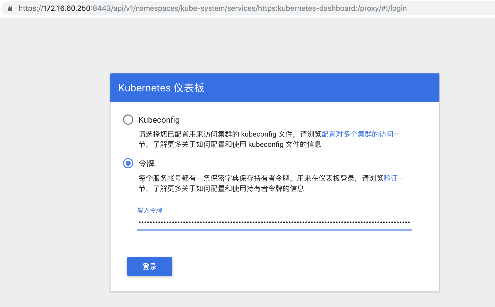

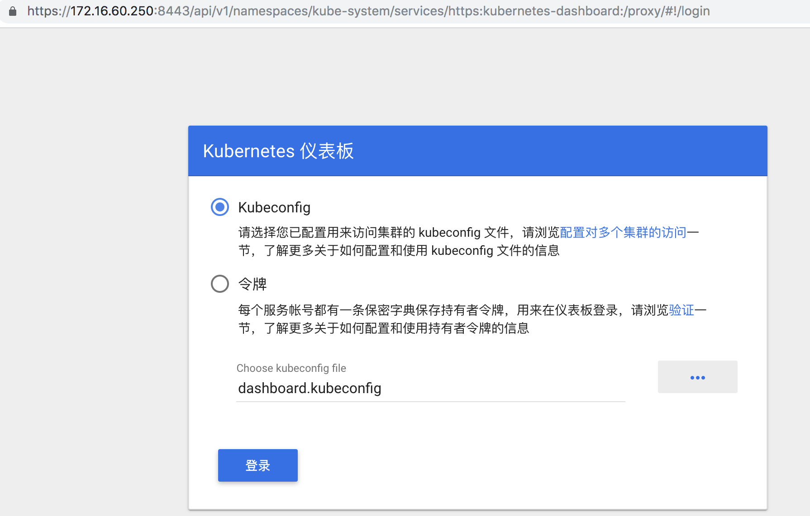

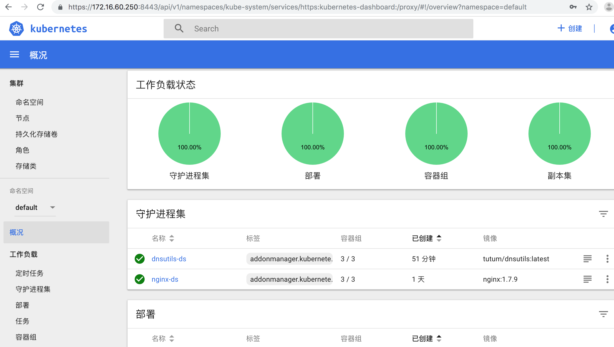

这里由于缺少Heapster或metrics-server插件，当前dashboard还不能展示 Pod、Nodes 的 CPU、内存等统计数据和图表。

11.3 - 部署 metrics-server 插件

metrics-server 通过 kube-apiserver 发现所有节点，然后调用 kubelet APIs（通过 https 接口）获得各节点（Node）和 Pod 的 CPU、Memory 等资源使用情况。从 Kubernetes 1.12 开始，kubernetes 的安装脚本移除了 Heapster，从 1.13 开始完全移除了对 Heapster 的支持，Heapster 不再被维护。替代方案如下：

-> 用于支持自动扩缩容的 CPU/memory HPA metrics：metrics-server；

-> 通用的监控方案：使用第三方可以获取 Prometheus 格式监控指标的监控系统，如 Prometheus Operator；

-> 事件传输：使用第三方工具来传输、归档 kubernetes events；

从 Kubernetes 1.8 开始，资源使用指标（如容器 CPU 和内存使用率）通过 Metrics API 在 Kubernetes 中获取, metrics-server 替代了heapster。Metrics Server 实现了Resource Metrics API，Metrics Server 是集群范围资源使用数据的聚合器。 Metrics Server 从每个节点上的 Kubelet 公开的 Summary API 中采集指标信息。

在了解Metrics-Server之前，必须要事先了解下Metrics API的概念。Metrics API相比于之前的监控采集方式(hepaster)是一种新的思路，官方希望核心指标的监控应该是稳定的，版本可控的，且可以直接被用户访问(例如通过使用 kubectl top 命令)，或由集群中的控制器使用(如HPA)，和其他的Kubernetes APIs一样。官方废弃heapster项目，就是为了将核心资源监控作为一等公民对待，即像pod、service那样直接通过api-server或者client直接访问，不再是安装一个hepater来汇聚且由heapster单独管理。

假设每个pod和node我们收集10个指标，从k8s的1.6开始，支持5000节点，每个节点30个pod，假设采集粒度为1分钟一次，则"10 x 5000 x 30 / 60 = 25000 平均每分钟2万多个采集指标"。因为k8s的api-server将所有的数据持久化到了etcd中，显然k8s本身不能处理这种频率的采集，而且这种监控数据变化快且都是临时数据，因此需要有一个组件单独处理他们，k8s版本只存放部分在内存中，于是metric-server的概念诞生了。其实hepaster已经有暴露了api，但是用户和Kubernetes的其他组件必须通过master proxy的方式才能访问到，且heapster的接口不像api-server一样，有完整的鉴权以及client集成。

有了Metrics Server组件，也采集到了该有的数据，也暴露了api，但因为api要统一，如何将请求到api-server的/apis/metrics请求转发给Metrics Server呢，

解决方案就是：kube-aggregator,在k8s的1.7中已经完成，之前Metrics Server一直没有面世，就是耽误在了kube-aggregator这一步。kube-aggregator（聚合api）主要提供：

-> Provide an API for registering API servers;

-> Summarize discovery information from all the servers;

-> Proxy client requests to individual servers;

Metric API的使用：

-> Metrics API 只可以查询当前的度量数据，并不保存历史数据

-> Metrics API URI 为 /apis/metrics.k8s.io/，在 k8s.io/metrics 维护

-> 必须部署 metrics-server 才能使用该 API，metrics-server 通过调用 Kubelet Summary API 获取数据

Metrics server定时从Kubelet的Summary API(类似/ap1/v1/nodes/nodename/stats/summary)采集指标信息，这些聚合过的数据将存储在内存中，且以metric-api的形式暴露出去。Metrics server复用了api-server的库来实现自己的功能，比如鉴权、版本等，为了实现将数据存放在内存中吗，去掉了默认的etcd存储，引入了内存存储（即实现Storage interface)。因为存放在内存中，因此监控数据是没有持久化的，可以通过第三方存储来拓展，这个和heapster是一致的。

Kubernetes Dashboard 还不支持 metrics-server，如果使用 metrics-server 替代 Heapster，将无法在 dashboard 中以图形展示 Pod 的内存和 CPU 情况，需要通过 Prometheus、Grafana 等监控方案来弥补。kuberntes 自带插件的 manifests yaml 文件使用 gcr.io 的 docker registry，国内被墙，需要手动替换为其它 registry 地址（本文档未替换）；可以从微软中国提供的 gcr.io 免费代理下载被墙的镜像；下面部署命令均在k8s-master01节点上执行。

监控架构

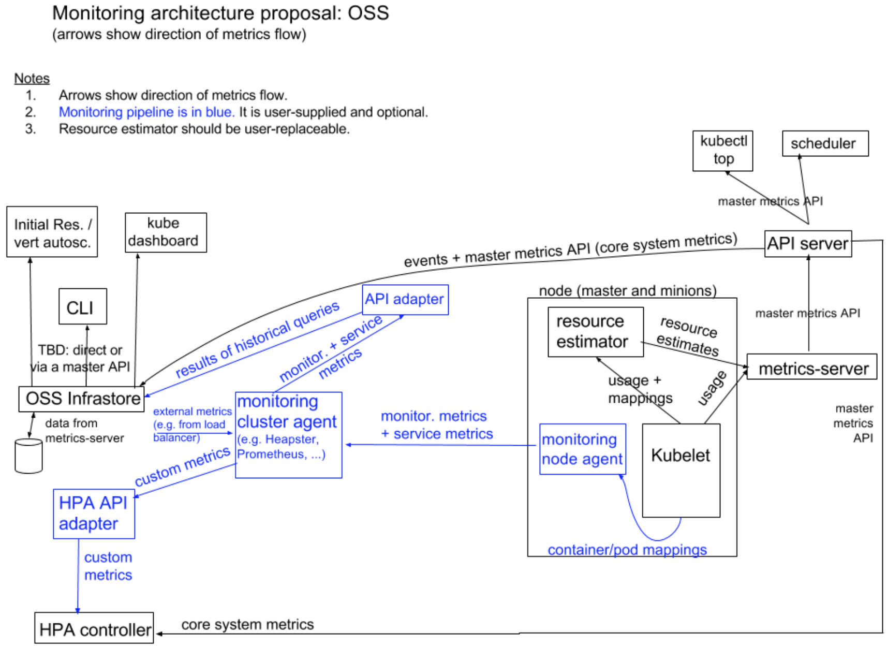

|   |   |
| - | - |
| 1 2 3 4 5 6 7 8 9 10 11 12 13 14 15 16 17 18 19 20 21 22 23 24 25 26 27 28 29 30 31 32 33 34 35 36 37 38 39 40 41 42 43 44 45 46 47 48 49 50 51 52 53 54 55 56 57 58 59 60 61 62 63 64 65 66 67 68 69 70 71 72 73 74 75 76 77 78 79 80 81 82 83 84 85 86 87 88 89 90 91 92 93 94 95 96 97 98 99 100 101 102 103 104 105 106 107 108 109 110 111 112 113 114 115 116 117 118 119 120 121 122 123 124 125 126 127 128 129 130 131 132 133 134 135 136 137 138 139 140 141 142 143 144 145 146 147 148 149 150 151 152 153 154 155 156 157 158 159 160 161 162 163 | 1）安装 metrics-server 从 github clone 源码： [root@k8s-master01 ~]\# cd /opt/k8s/work/ [root@k8s-master01 work]\# git clone https://github.com/kubernetes-incubator/metrics-server.git [root@k8s-master01 work]\# cd metrics-server/deploy/1.8+/ [root@k8s-master01 1.8+]\# ls aggregated-metrics-reader.yaml  auth-reader.yaml         metrics-server-deployment.yaml  resource-reader.yaml auth-delegator.yaml             metrics-apiservice.yaml  metrics-server-service.yaml   修改 metrics-server-deployment.yaml 文件，为 metrics-server 添加三个命令行参数(在"imagePullPolicy"行的下面添加)： [root@k8s-master01 1.8+]\# cp metrics-server-deployment.yaml metrics-server-deployment.yaml.bak [root@k8s-master01 1.8+]\# vim metrics-server-deployment.yaml .........         args:         - --metric-resolution=30s         - --kubelet-preferred-address-types=InternalIP,Hostname,InternalDNS,ExternalDNS,ExternalIP   这里需要注意： --metric-resolution=30s：从 kubelet 采集数据的周期； --kubelet-preferred-address-types：优先使用 InternalIP 来访问 kubelet，这样可以避免节点名称没有 DNS 解析记录时，通过节点名称调用节点 kubelet API 失败的情况（未配置时默认的情况）；   另外： 需要提前FQ将k8s.gcr.io/metrics-server-amd64:v0.3.3镜像下载下来，然后上传到node节点上，然后执行"docker load ......" 导入到node节点的images镜像里 或者从微软中国提供的gcr.io免费代理下载被墙的镜像，然后在修改yaml文件里更新dashboard的镜像下载地址.   [root@k8s-master01 1.8+]\# fgrep "image" metrics-server-deployment.yaml       \# mount in tmp so we can safely use from-scratch images and/or read-only containers         image: k8s.gcr.io/metrics-server-amd64:v0.3.3         imagePullPolicy: Always   由于已经提前将相应镜像导入到各node节点的image里了，所以需要将metrics-server-deployment.yaml文件中的镜像拉取策略修改为"IfNotPresent". 即：本地有则使用本地镜像,不拉取   [root@k8s-master01 1.8+]\# fgrep "image" metrics-server-deployment.yaml       \# mount in tmp so we can safely use from-scratch images and/or read-only containers         image: k8s.gcr.io/metrics-server-amd64:v0.3.3         imagePullPolicy: IfNotPresent   部署 metrics-server： [root@k8s-master01 1.8+]\# kubectl create -f .   2）查看运行情况 [root@k8s-master01 1.8+]\# kubectl -n kube-system get pods -l k8s-app=metrics-server NAME                              READY   STATUS    RESTARTS   AGE metrics-server-54997795d9-4cv6h   1/1     Running   0          50s   [root@k8s-master01 1.8+]\# kubectl get svc -n kube-system  metrics-server NAME             TYPE        CLUSTER-IP       EXTERNAL-IP   PORT(S)   AGE metrics-server   ClusterIP   10.254.238.208   &lt;none&gt;        443/TCP   65s   3）metrics-server 的命令行参数 （在任意一个node节点上执行下面命令） [root@k8s-node01 ~]\# docker run -it --rm k8s.gcr.io/metrics-server-amd64:v0.3.3 --help   4）查看 metrics-server 输出的 metrics -&gt; 通过 kube-apiserver 或 kubectl proxy 访问： https://172.16.60.250:8443/apis/metrics.k8s.io/v1beta1/nodes https://172.16.60.250:8443/apis/metrics.k8s.io/v1beta1/nodes/ https://172.16.60.250:8443/apis/metrics.k8s.io/v1beta1/pods https://172.16.60.250:8443/apis/metrics.k8s.io/v1beta1/namespace//pods/   -&gt; 直接使用 kubectl 命令访问 ： \# kubectl get --raw apis/metrics.k8s.io/v1beta1/nodes \# kubectl get --raw apis/metrics.k8s.io/v1beta1/pods kubectl \# get --raw apis/metrics.k8s.io/v1beta1/nodes/ kubectl \# get --raw apis/metrics.k8s.io/v1beta1/namespace//pods/   [root@k8s-master01 1.8+]\# kubectl get --raw "/apis/metrics.k8s.io/v1beta1" | jq . {   "kind": "APIResourceList",   "apiVersion": "v1",   "groupVersion": "metrics.k8s.io/v1beta1",   "resources": [     {       "name": "nodes",       "singularName": "",       "namespaced": false,       "kind": "NodeMetrics",       "verbs": [         "get",         "list"       ]     },     {       "name": "pods",       "singularName": "",       "namespaced": true,       "kind": "PodMetrics",       "verbs": [         "get",         "list"       ]     }   ] }   [root@k8s-master01 1.8+]\# kubectl get --raw "/apis/metrics.k8s.io/v1beta1/nodes" | jq . {   "kind": "NodeMetricsList",   "apiVersion": "metrics.k8s.io/v1beta1",   "metadata": {     "selfLink": "/apis/metrics.k8s.io/v1beta1/nodes"   },   "items": [     {       "metadata": {         "name": "k8s-node01",         "selfLink": "/apis/metrics.k8s.io/v1beta1/nodes/k8s-node01",         "creationTimestamp": "2019-06-27T17:11:43Z"       },       "timestamp": "2019-06-27T17:11:36Z",       "window": "30s",       "usage": {         "cpu": "47615396n",         "memory": "2413536Ki"       }     },     {       "metadata": {         "name": "k8s-node02",         "selfLink": "/apis/metrics.k8s.io/v1beta1/nodes/k8s-node02",         "creationTimestamp": "2019-06-27T17:11:43Z"       },       "timestamp": "2019-06-27T17:11:38Z",       "window": "30s",       "usage": {         "cpu": "42000411n",         "memory": "2496152Ki"       }     },     {       "metadata": {         "name": "k8s-node03",         "selfLink": "/apis/metrics.k8s.io/v1beta1/nodes/k8s-node03",         "creationTimestamp": "2019-06-27T17:11:43Z"       },       "timestamp": "2019-06-27T17:11:40Z",       "window": "30s",       "usage": {         "cpu": "54095172n",         "memory": "3837404Ki"       }     }   ] }   这里需要注意：/apis/metrics.k8s.io/v1beta1/nodes 和 /apis/metrics.k8s.io/v1beta1/pods 返回的 usage 包含 CPU 和 Memory；   5）使用 kubectl top 命令查看集群节点资源使用情况 [root@k8s-master01 1.8+]\# kubectl top node NAME         CPU(cores)   CPU%   MEMORY(bytes)   MEMORY%   k8s-node01   45m          1%     2357Mi          61%       k8s-node02   44m          1%     2437Mi          63%       k8s-node03   54m          1%     3747Mi          47%   ======================================================================================================================================= 报错解决： [root@k8s-master01 1.8+]\# kubectl top node Error from server (Forbidden): nodes.metrics.k8s.io is forbidden: User "aggregator" cannot list resource "nodes" in API group "metrics.k8s.io" at the cluster scope   出现上述错误的原因主要是未对aggregator这个sa进行rbac授权! 偷懒的解决方案，直接将这个sa和cluster-admin进行绑定，但不符合最小权限原则。   [root@k8s-master01 1.8+]\# kubectl create clusterrolebinding  custom-metric-with-cluster-admin --clusterrole=cluster-admin --user=aggregator |

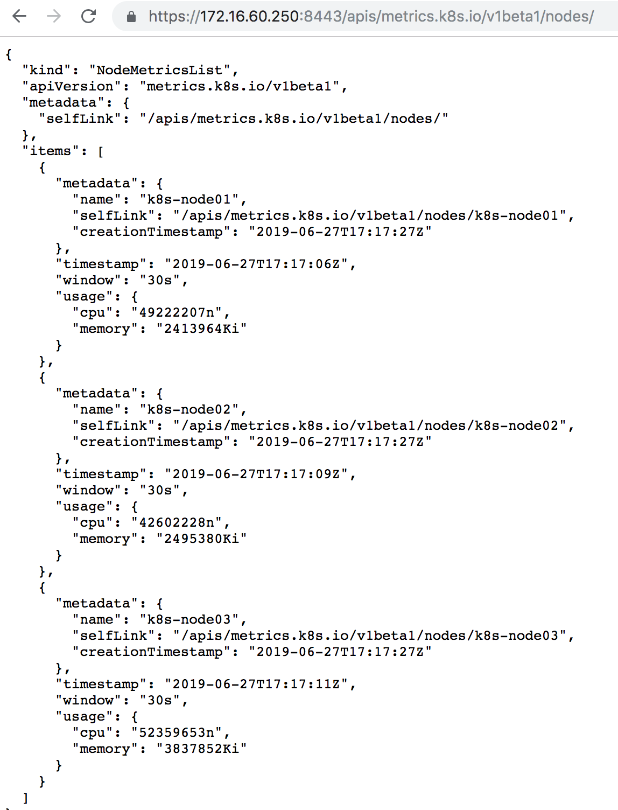

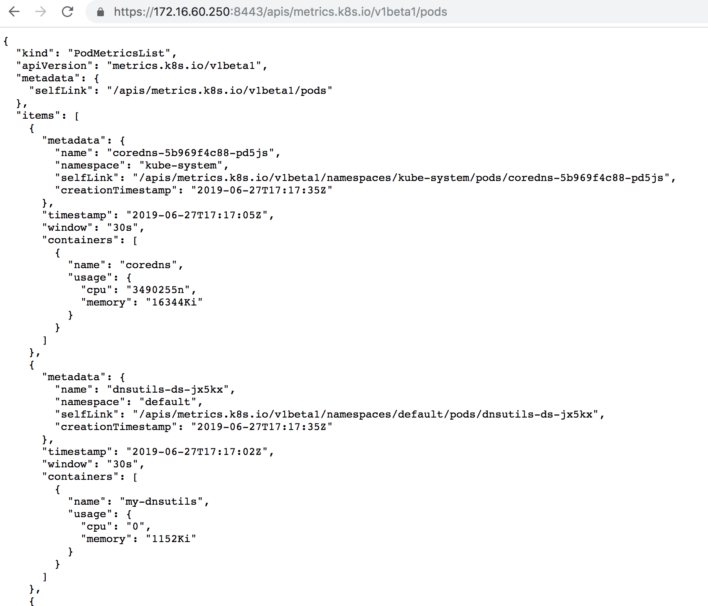

 

11.4 - 部署 kube-state-metrics 插件

上面已经部署了metric-server，几乎容器运行的大多数指标数据都能采集到了，但是下面这种情况的指标数据的采集却无能为力：

-> 调度了多少个replicas？现在可用的有几个？

-> 多少个Pod是running/stopped/terminated状态？

-> Pod重启了多少次？

-> 当前有多少job在运行中？

这些则是kube-state-metrics提供的内容，它是K8S的一个附加服务，基于client-go开发的。它会轮询Kubernetes API，并将Kubernetes的结构化信息转换为metrics。kube-state-metrics能够采集绝大多数k8s内置资源的相关数据，例如pod、deploy、service等等。同时它也提供自己的数据，主要是资源采集个数和采集发生的异常次数统计。

kube-state-metrics 指标类别包括：

CronJob Metrics

DaemonSet Metrics

Deployment Metrics

Job Metrics

LimitRange Metrics

Node Metrics

PersistentVolume Metrics

PersistentVolumeClaim Metrics

Pod Metrics

Pod Disruption Budget Metrics

ReplicaSet Metrics

ReplicationController Metrics

ResourceQuota Metrics

Service Metrics

StatefulSet Metrics

Namespace Metrics

Horizontal Pod Autoscaler Metrics

Endpoint Metrics

Secret Metrics

ConfigMap Metrics

以pod为例的指标有：

kube_pod_info

kube_pod_owner

kube_pod_status_running

kube_pod_status_ready

kube_pod_status_scheduled

kube_pod_container_status_waiting

kube_pod_container_status_terminated_reason

..............

kube-state-metrics与metric-server (或heapster)的对比

1）metric-server是从api-server中获取cpu,内存使用率这种监控指标，并把它们发送给存储后端，如influxdb或云厂商，它当前的核心作用是：为HPA等组件提供决策指标支持。

2）kube-state-metrics关注于获取k8s各种资源的最新状态，如deployment或者daemonset，之所以没有把kube-state-metrics纳入到metric-server的能力中，是因为它们的关注点本质上是不一样的。metric-server仅仅是获取、格式化现有数据，写入特定的存储，实质上是一个监控系统。而kube-state-metrics是将k8s的运行状况在内存中做了个快照，并且获取新的指标，但它没有能力导出这些指标

3）换个角度讲，kube-state-metrics本身是metric-server的一种数据来源，虽然现在没有这么做。

4）另外，像Prometheus这种监控系统，并不会去用metric-server中的数据，它都是自己做指标收集、集成的（Prometheus包含了metric-server的能力），但Prometheus可以监控metric-server本身组件的监控状态并适时报警，这里的监控就可以通过kube-state-metrics来实现，如metric-serverpod的运行状态。

kube-state-metrics本质上是不断轮询api-server，其性能优化：

kube-state-metrics在之前的版本中暴露出两个问题：

1）/metrics接口响应慢(10-20s)

2）内存消耗太大，导致超出limit被杀掉

问题一的方案：就是基于client-go的cache tool实现本地缓存，具体结构为：var cache = map[uuid][]byte{}

问题二的的方案是：对于时间序列的字符串，是存在很多重复字符的（如namespace等前缀筛选），可以用指针或者结构化这些重复字符。

kube-state-metrics优化点和问题

1）因为kube-state-metrics是监听资源的add、delete、update事件，那么在kube-state-metrics部署之前已经运行的资源的数据是不是就拿不到了？其实kube-state-metric利用client-go可以初始化所有已经存在的资源对象，确保没有任何遗漏；

2）kube-state-metrics当前不会输出metadata信息(如help和description）；

3）缓存实现是基于golang的map，解决并发读问题当期是用了一个简单的互斥锁，应该可以解决问题，后续会考虑golang的sync.Map安全map；

4）kube-state-metrics通过比较resource version来保证event的顺序；

5）kube-state-metrics并不保证包含所有资源；

下面部署命令均在k8s-master01节点上执行。

|   |   |
| - | - |
| 1 2 3 4 5 6 7 8 9 10 11 12 13 14 15 16 17 18 19 20 21 22 23 24 25 26 27 28 29 30 31 32 33 34 35 36 37 38 39 40 41 42 43 44 45 46 47 48 49 50 51 52 53 54 55 56 57 58 59 60 61 62 63 64 65 66 67 68 69 70 71 72 73 74 75 76 77 78 79 80 81 82 83 84 85 86 | 1）修改配置文件 将下载的 kube-state-metrics.tar.gz 放到/opt/k8s/work目录下解压 [root@k8s-master01 ~]\# cd /opt/k8s/work/ [root@k8s-master01 work]\# tar -zvxf kube-state-metrics.tar.gz [root@k8s-master01 work]\# cd kube-state-metrics   kube-state-metrics目录下，有所需要的文件 [root@k8s-master01 kube-state-metrics]\# ll total 32 -rw-rw-r-- 1 root root  362 May  6 17:31 kube-state-metrics-cluster-role-binding.yaml -rw-rw-r-- 1 root root 1076 May  6 17:31 kube-state-metrics-cluster-role.yaml -rw-rw-r-- 1 root root 1657 Jul  1 17:35 kube-state-metrics-deployment.yaml -rw-rw-r-- 1 root root  381 May  6 17:31 kube-state-metrics-role-binding.yaml -rw-rw-r-- 1 root root  508 May  6 17:31 kube-state-metrics-role.yaml -rw-rw-r-- 1 root root   98 May  6 17:31 kube-state-metrics-service-account.yaml -rw-rw-r-- 1 root root  404 May  6 17:31 kube-state-metrics-service.yaml   [root@k8s-master01 kube-state-metrics]\# fgrep -R "image" ./\* ./kube-state-metrics-deployment.yaml:        image: quay.io/coreos/kube-state-metrics:v1.5.0 ./kube-state-metrics-deployment.yaml:        imagePullPolicy: IfNotPresent ./kube-state-metrics-deployment.yaml:        image: k8s.gcr.io/addon-resizer:1.8.3 ./kube-state-metrics-deployment.yaml:        imagePullPolicy: IfNotPresent   [root@k8s-master01 kube-state-metrics]\# cat kube-state-metrics-service.yaml apiVersion: v1 kind: Service metadata:   name: kube-state-metrics   namespace: kube-system   labels:     k8s-app: kube-state-metrics   annotations:     prometheus.io/scrape: 'true' spec:   ports:   - name: http-metrics     port: 8080     targetPort: http-metrics     protocol: TCP   - name: telemetry     port: 8081     targetPort: telemetry     protocol: TCP   type: NodePort                                    \#添加这一行   selector:     k8s-app: kube-state-metrics   注意两点： 其中有个是镜像是"k8s.gcr.io/addon-resizer:1.8.3"在国内因为某些原因无法拉取，可以更换为"ist0ne/addon-resizer"即可正常使用。或者通过翻墙下载。 service 如果需要集群外部访问，需要改为NodePort   2）执行所有定义文件 需要提前FQ将quay.io/coreos/kube-state-metrics:v1.5.0 和 k8s.gcr.io/addon-resizer:1.8.3镜像下载下来，然后上传到node节点上，然后执行"docker load ......" 导入到node节点的images镜像里 或者从微软中国提供的gcr.io免费代理下载被墙的镜像，然后在修改yaml文件里更新dashboard的镜像下载地址。由于已经提前将相应镜像导入到各node节点的image里了， 所以需要将kube-state-metrics-deployment.yaml文件中的镜像拉取策略修改为"IfNotPresent".即本地有则使用本地镜像,不拉取。   [root@k8s-master01 kube-state-metrics]\# kubectl create -f .   执行后检查一下： [root@k8s-master01 kube-state-metrics]\# kubectl get pod -n kube-system|grep kube-state-metrics      kube-state-metrics-5dd55c764d-nnsdv     2/2     Running   0          9m3s   [root@k8s-master01 kube-state-metrics]\# kubectl get svc -n kube-system|grep kube-state-metrics     kube-state-metrics     NodePort    10.254.228.212   &lt;none&gt;        8080:30978/TCP,8081:30872/TCP   9m14s   [root@k8s-master01 kube-state-metrics]\# kubectl get pod,svc -n kube-system|grep kube-state-metrics pod/kube-state-metrics-5dd55c764d-nnsdv     2/2     Running   0          9m12s service/kube-state-metrics     NodePort    10.254.228.212   &lt;none&gt;        8080:30978/TCP,8081:30872/TCP   9m18s   3）验证kube-state-metrics数据采集 通过上面的检查，可以得知映射到外部访问的NodePort端口是30978，通过任意一个node工作节点即可验证访问： [root@k8s-master01 kube-state-metrics]\# curl http://172.16.60.244:30978/metrics|head -10   % Total    % Received % Xferd  Average Speed   Time    Time     Time  Current                                  Dload  Upload   Total   Spent    Left  Speed   0     0    0     0    0     0      0      0 --:--:-- --:--:-- --:--:--     0\# HELP kube\_configmap\_info Information about configmap. \# TYPE kube\_configmap\_info gauge kube\_configmap\_info{namespace="kube-system",configmap="extension-apiserver-authentication"} 1 kube\_configmap\_info{namespace="kube-system",configmap="coredns"} 1 kube\_configmap\_info{namespace="kube-system",configmap="kubernetes-dashboard-settings"} 1 \# HELP kube\_configmap\_created Unix creation timestamp \# TYPE kube\_configmap\_created gauge kube\_configmap\_created{namespace="kube-system",configmap="extension-apiserver-authentication"} 1.560825764e+09 kube\_configmap\_created{namespace="kube-system",configmap="coredns"} 1.561479528e+09 kube\_configmap\_created{namespace="kube-system",configmap="kubernetes-dashboard-settings"} 1.56148146e+09 100 73353    0 73353    0     0   9.8M      0 --:--:-- --:--:-- --:--:-- 11.6M curl: (23) Failed writing body (0 != 2048) |

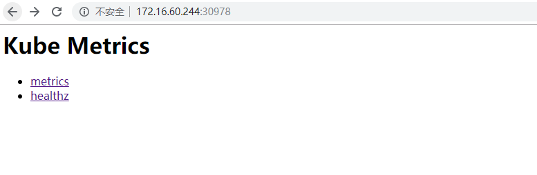

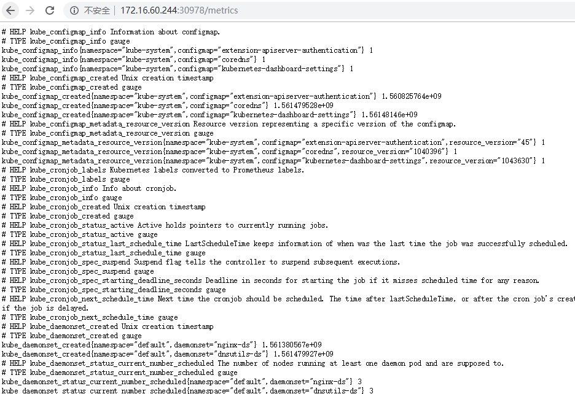

11.5 - 部署 harbor 私有仓库

安装的话，可以参考Docker私有仓库Harbor介绍和部署记录，需要在两台节点机172.16.60.247、172.16.60.248上都安装harbor私有仓库环境。上层通过Nginx+Keepalived实现Harbor的负载均衡+高可用，两个Harbor相互同步（主主复制）。 harbor上远程同步的操作：1）"仓库管理"创建目标，创建后可以测试是否正常连接目标。2）"同步管理"创建规则，在规则中调用上面创建的目标。3）手动同步或定时同步。

例如：已经在172.16.60.247这台harbor节点的私有仓库library和kevin_img的项目里各自存放了镜像，如下：

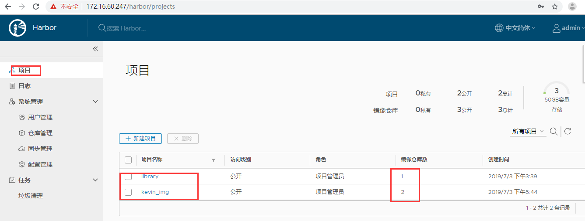

现在要把172.16.60.247的harbor私有仓库的这两个项目下的镜像同步到另一个节点172.16.60.248的harbor里。同步同步方式：147 -> 148 或 147 <- 148

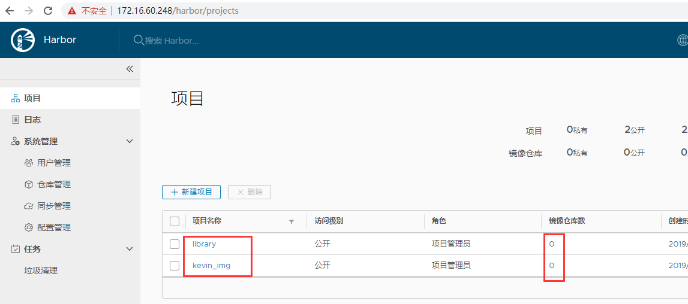

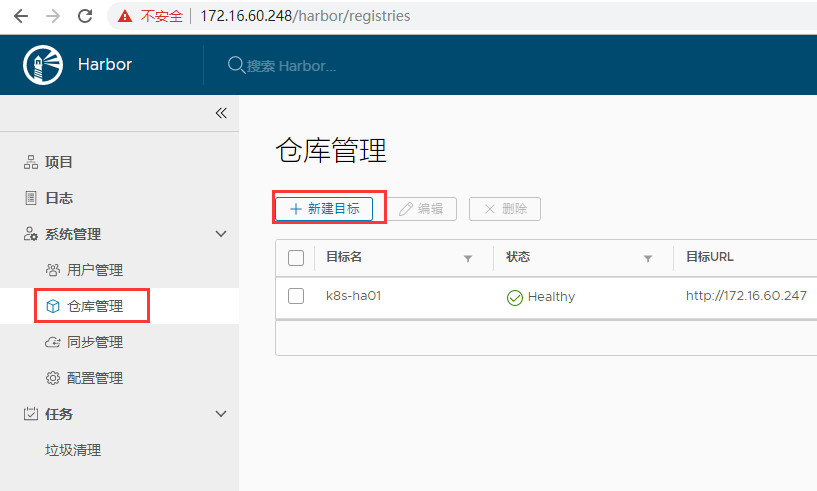

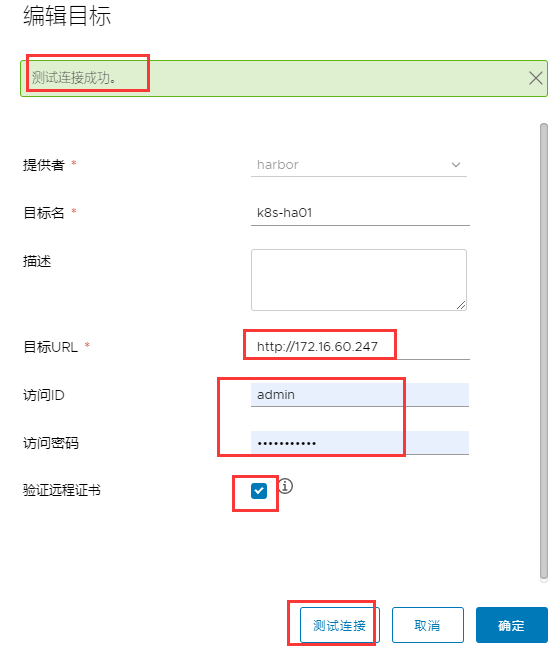

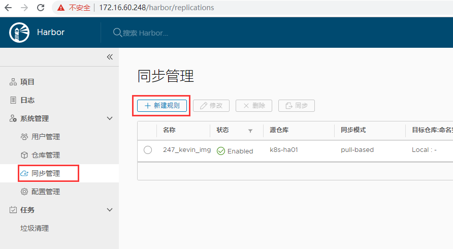

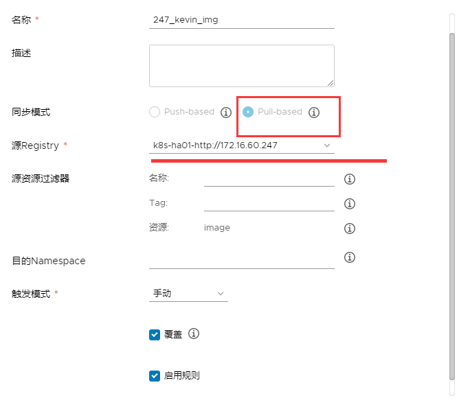

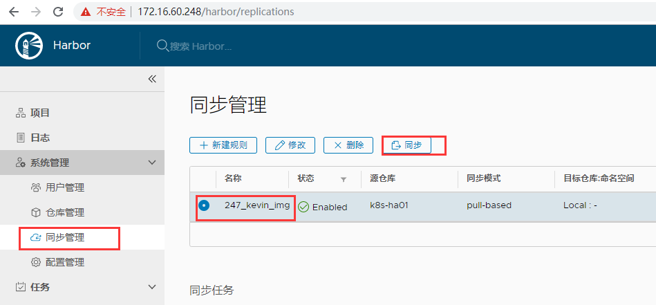

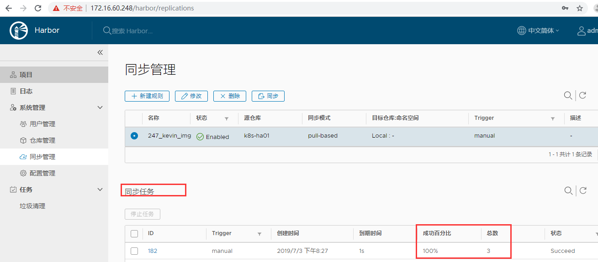

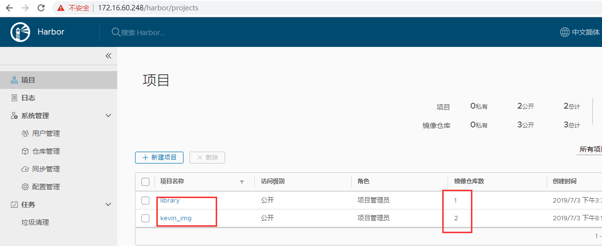

上面是手动同步，也可以选择定时同步，分别填写的是"秒 分 时 日 月 周"， 如下每两分钟同步一次！  则过了两分钟之后就会自动同步过来了~

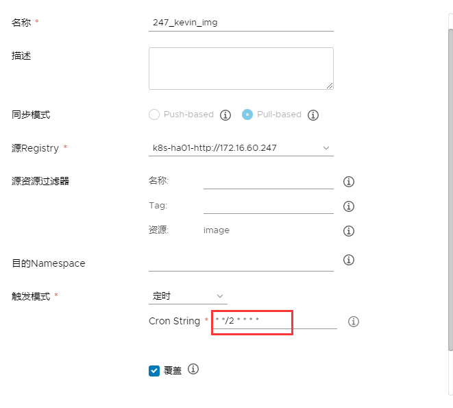

11.6 - kubernetes集群管理测试

|   |   |
| - | - |
| 1 2 3 4 5 6 7 8 9 10 11 12 13 14 15 16 17 18 19 20 21 22 23 24 25 26 27 28 29 30 31 32 33 34 35 36 37 38 39 40 41 42 43 44 45 46 47 48 49 50 51 52 | [root@k8s-master01 ~]\# kubectl get cs NAME                 STATUS    MESSAGE             ERROR scheduler            Healthy   ok                 controller-manager   Healthy   ok                 etcd-2               Healthy   {"health":"true"}  etcd-0               Healthy   {"health":"true"}  etcd-1               Healthy   {"health":"true"}     [root@k8s-master01 ~]\# kubectl get nodes NAME         STATUS   ROLES    AGE   VERSION k8s-node01   Ready    &lt;none&gt;   20d   v1.14.2 k8s-node02   Ready    &lt;none&gt;   20d   v1.14.2 k8s-node03   Ready    &lt;none&gt;   20d   v1.14.2    部署测试实例 [root@k8s-master01 ~]\# kubectl run kevin-nginx --image=nginx --replicas=3 kubectl run --generator=deployment/apps.v1 is DEPRECATED and will be removed in a future version. Use kubectl run --generator=run-pod/v1 or kubectl create instead. deployment.apps/kevin-nginx created    [root@k8s-master01 ~]\# kubectl run --generator=run-pod/v1 kevin-nginx --image=nginx --replicas=3 pod/kevin-nginx created    稍等一会儿，查看创建的kevin-nginx的pod（由于创建时要自动下载nginx镜像，所以需要等待一段时间） [root@k8s-master01 ~]\# kubectl get pods --all-namespaces|grep "kevin-nginx" default       kevin-nginx                             1/1     Running   0          98s default       kevin-nginx-569dcd559b-6h4nn            1/1     Running   0          106s default       kevin-nginx-569dcd559b-7f2b4            1/1     Running   0          106s default       kevin-nginx-569dcd559b-7tds2            1/1     Running   0          106s    查看具体详细事件 [root@k8s-master01 ~]\# kubectl get pods --all-namespaces -o wide|grep "kevin-nginx" default       kevin-nginx                             1/1     Running   0          2m13s   172.30.72.12   k8s-node03   &lt;none&gt;           &lt;none&gt; default       kevin-nginx-569dcd559b-6h4nn            1/1     Running   0          2m21s   172.30.56.7    k8s-node02   &lt;none&gt;           &lt;none&gt; default       kevin-nginx-569dcd559b-7f2b4            1/1     Running   0          2m21s   172.30.72.11   k8s-node03   &lt;none&gt;           &lt;none&gt; default       kevin-nginx-569dcd559b-7tds2            1/1     Running   0          2m21s   172.30.88.8    k8s-node01   &lt;none&gt;           &lt;none&gt;    [root@k8s-master01 ~]\# kubectl get deployment|grep kevin-nginx kevin-nginx   3/3     3            3           2m57s    创建svc [root@k8s-master01 ~]\# kubectl expose deployment kevin-nginx --port=8080 --target-port=80 --type=NodePort    [root@k8s-master01 ~]\# kubectl get svc|grep kevin-nginx nginx         NodePort    10.254.111.50    &lt;none&gt;        8080:32177/TCP   33s    集群内部,各pod之间访问kevin-nginx [root@k8s-master01 ~]\# curl http://10.254.111.50:8080    外部访问kevin-nginx的地址为http://node\_ip/32177 http://172.16.60.244:32177 http://172.16.60.245:32177 http://172.16.60.246:32177 |

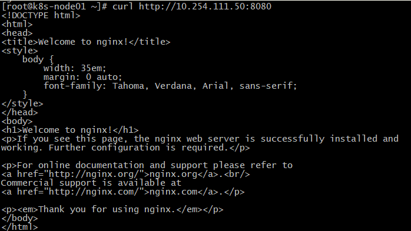

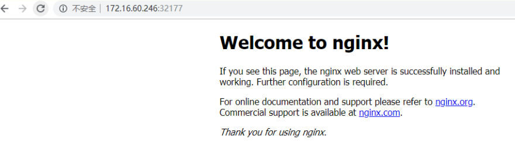

11.7 - 清理kubernetes集群

1）清理 Node 节点 （node节点同样操作）

|   |   |
| - | - |
| 1 2 3 4 5 6 7 8 9 10 11 12 13 14 15 16 17 18 19 20 21 22 23 24 25 26 27 28 29 30 31 32 33 34 35 36 | 停相关进程： [root@k8s-node01 ~]\# systemctl stop kubelet kube-proxy flanneld docker kube-proxy kube-nginx   清理文件： [root@k8s-node01 ~]\# source /opt/k8s/bin/environment.sh   umount kubelet 和 docker 挂载的目录 [root@k8s-node01 ~]\# mount | grep "${K8S\_DIR}" | awk '{print $3}'|xargs sudo umount   删除 kubelet 工作目录 [root@k8s-node01 ~]\# sudo rm -rf ${K8S\_DIR}/kubelet   删除 docker 工作目录 [root@k8s-node01 ~]\# sudo rm -rf ${DOCKER\_DIR}   删除 flanneld 写入的网络配置文件 [root@k8s-node01 ~]\# sudo rm -rf /var/run/flannel/   删除 docker 的一些运行文件 [root@k8s-node01 ~]\# sudo rm -rf /var/run/docker/   删除 systemd unit 文件 [root@k8s-node01 ~]\# sudo rm -rf /etc/systemd/system/{kubelet,docker,flanneld,kube-nginx}.service   删除程序文件 [root@k8s-node01 ~]\# sudo rm -rf /opt/k8s/bin/\*   删除证书文件 [root@k8s-node01 ~]\# sudo rm -rf /etc/flanneld/cert /etc/kubernetes/cert   清理 kube-proxy 和 docker 创建的 iptables [root@k8s-node01 ~]\# iptables -F &amp;&amp; sudo iptables -X &amp;&amp; sudo iptables -F -t nat &amp;&amp; sudo iptables -X -t nat   删除 flanneld 和 docker 创建的网桥： [root@k8s-node01 ~]\# ip link del flannel.1 [root@k8s-node01 ~]\# ip link del docker0 |

2）清理 Master 节点 （master节点同样操作）

|   |   |
| - | - |
| 1 2 3 4 5 6 7 8 9 10 11 12 13 14 15 16 17 18 19 20 21 22 23 24 25 26 27 28 29 30 | 停相关进程： [root@k8s-master01 ~]\# systemctl stop kube-apiserver kube-controller-manager kube-scheduler kube-nginx   清理文件： 删除 systemd unit 文件 [root@k8s-master01 ~]\# rm -rf /etc/systemd/system/{kube-apiserver,kube-controller-manager,kube-scheduler,kube-nginx}.service   删除程序文件 [root@k8s-master01 ~]\# rm -rf /opt/k8s/bin/{kube-apiserver,kube-controller-manager,kube-scheduler}   删除证书文件 [root@k8s-master01 ~]\# rm -rf /etc/flanneld/cert /etc/kubernetes/cert   清理 etcd 集群 [root@k8s-master01 ~]\# systemctl stop etcd   清理文件： [root@k8s-master01 ~]\# source /opt/k8s/bin/environment.sh   删除 etcd 的工作目录和数据目录 [root@k8s-master01 ~]\# rm -rf ${ETCD\_DATA\_DIR} ${ETCD\_WAL\_DIR}   删除 systemd unit 文件 [root@k8s-master01 ~]\# rm -rf /etc/systemd/system/etcd.service   删除程序文件 [root@k8s-master01 ~]\# rm -rf /opt/k8s/bin/etcd   删除 x509 证书文件 [root@k8s-master01 ~]\# rm -rf /etc/etcd/cert/\* |

                                                                                                                                                                

上面部署的dashboard是https证书方式，如果是http方式访问的kubernetes集群web-ui，操作如下：

|   |   |
| - | - |
| 1 2 3 4 5 6 7 8 9 10 11 12 13 14 15 16 17 18 19 20 21 22 23 24 25 26 27 28 29 30 31 32 33 34 35 36 37 38 39 40 41 42 43 44 45 46 47 48 49 50 51 52 53 54 55 56 57 58 59 60 61 62 63 64 65 66 67 68 69 70 71 72 73 74 75 76 77 78 79 80 81 82 83 84 85 86 87 88 89 90 91 92 93 94 95 96 97 98 99 100 101 102 103 104 105 106 107 108 109 110 111 112 113 114 115 116 117 118 119 120 121 122 123 124 125 126 127 128 129 130 131 132 133 134 135 136 137 138 139 140 141 142 143 144 145 146 147 148 149 150 151 152 153 154 155 156 157 158 159 160 161 162 163 164 165 166 167 168 169 170 171 172 173 174 175 176 177 178 179 180 181 182 183 184 185 186 187 188 189 190 191 192 | 1）配置kubernetes-dashboard.yaml （里面的"k8s.gcr.io/kubernetes-dashboard-amd64:v1.10.1"镜像已经提前在node节点上下载了） [root@k8s-master01 ~]\# cd /opt/k8s/work/ [root@k8s-master01 work]\# cat kubernetes-dashboard.yaml \# ------------------- Dashboard Secret ------------------- \#    apiVersion: v1 kind: Secret metadata:   labels:     k8s-app: kubernetes-dashboard   name: kubernetes-dashboard-certs   namespace: kube-system type: Opaque    --- \# ------------------- Dashboard Service Account ------------------- \#    apiVersion: v1 kind: ServiceAccount metadata:   labels:     k8s-app: kubernetes-dashboard   name: kubernetes-dashboard   namespace: kube-system    --- \# ------------------- Dashboard Role &amp; Role Binding ------------------- \#    kind: Role apiVersion: rbac.authorization.k8s.io/v1 metadata:   name: kubernetes-dashboard-minimal   namespace: kube-system rules:   \# Allow Dashboard to create 'kubernetes-dashboard-key-holder' secret. - apiGroups: [""]   resources: ["secrets"]   verbs: ["create"]   \# Allow Dashboard to create 'kubernetes-dashboard-settings' config map. - apiGroups: [""]   resources: ["configmaps"]   verbs: ["create"]   \# Allow Dashboard to get, update and delete Dashboard exclusive secrets. - apiGroups: [""]   resources: ["secrets"]   resourceNames: ["kubernetes-dashboard-key-holder", "kubernetes-dashboard-certs"]   verbs: ["get", "update", "delete"]   \# Allow Dashboard to get and update 'kubernetes-dashboard-settings' config map. - apiGroups: [""]   resources: ["configmaps"]   resourceNames: ["kubernetes-dashboard-settings"]   verbs: ["get", "update"]   \# Allow Dashboard to get metrics from heapster. - apiGroups: [""]   resources: ["services"]   resourceNames: ["heapster"]   verbs: ["proxy"] - apiGroups: [""]   resources: ["services/proxy"]   resourceNames: ["heapster", "http:heapster:", "https:heapster:"]   verbs: ["get"]    --- apiVersion: rbac.authorization.k8s.io/v1 kind: RoleBinding metadata:   name: kubernetes-dashboard-minimal   namespace: kube-system roleRef:   apiGroup: rbac.authorization.k8s.io   kind: Role   name: kubernetes-dashboard-minimal subjects: - kind: ServiceAccount   name: kubernetes-dashboard   namespace: kube-system    --- kind: ClusterRoleBinding apiVersion: rbac.authorization.k8s.io/v1beta1 metadata:   name: kubernetes-dashboard subjects:   - kind: ServiceAccount     name: kubernetes-dashboard     namespace: kube-system roleRef:   kind: ClusterRole   name: cluster-admin   apiGroup: rbac.authorization.k8s.io --- \# ------------------- Dashboard Deployment ------------------- \#    kind: Deployment apiVersion: apps/v1beta2 metadata:   labels:     k8s-app: kubernetes-dashboard   name: kubernetes-dashboard   namespace: kube-system spec:   replicas: 1   revisionHistoryLimit: 10   selector:     matchLabels:       k8s-app: kubernetes-dashboard   template:     metadata:       labels:         k8s-app: kubernetes-dashboard     spec:       serviceAccountName: kubernetes-dashboard-admin       containers:       - name: kubernetes-dashboard         image: k8s.gcr.io/kubernetes-dashboard-amd64:v1.10.1         ports:         - containerPort: 9090           protocol: TCP         args:           \#- --auto-generate-certificates           \# Uncomment the following line to manually specify Kubernetes API server Host           \# If not specified, Dashboard will attempt to auto discover the API server and connect           \# to it. Uncomment only if the default does not work.           \#- --apiserver-host=http://10.0.1.168:8080         volumeMounts:         - name: kubernetes-dashboard-certs           mountPath: /certs           \# Create on-disk volume to store exec logs         - mountPath: /tmp           name: tmp-volume         livenessProbe:           httpGet:             scheme: HTTP             path: /             port: 9090           initialDelaySeconds: 30           timeoutSeconds: 30       volumes:       - name: kubernetes-dashboard-certs         secret:           secretName: kubernetes-dashboard-certs       - name: tmp-volume         emptyDir: {}       serviceAccountName: kubernetes-dashboard       \# Comment the following tolerations if Dashboard must not be deployed on master       tolerations:       - key: node-role.kubernetes.io/master         effect: NoSchedule    --- \# ------------------- Dashboard Service ------------------- \#    kind: Service apiVersion: v1 metadata:   labels:     k8s-app: kubernetes-dashboard   name: kubernetes-dashboard   namespace: kube-system spec:   ports:     - port: 9090       targetPort: 9090   selector:     k8s-app: kubernetes-dashboard    \# ------------------------------------------------------------ kind: Service apiVersion: v1 metadata:   labels:     k8s-app: kubernetes-dashboard   name: kubernetes-dashboard-external   namespace: kube-system spec:   ports:     - port: 9090       targetPort: 9090       nodePort: 30090   type: NodePort   selector:     k8s-app: kubernetes-dashboard    创建这个yaml文件 [root@k8s-master01 work]\# kubectl create -f kubernetes-dashboard.yaml    稍微等一会儿，查看kubernetes-dashboard的pod创建情况（如下可知，该pod落在了k8s-node03节点上，即172.16.60.246） [root@k8s-master01 work]\# kubectl get pods -n kube-system -o wide|grep "kubernetes-dashboard" kubernetes-dashboard-7976c5cb9c-q7z2w   1/1     Running   0          10m     172.30.72.6   k8s-node03   &lt;none&gt;           &lt;none&gt;    [root@k8s-master01 work]\# kubectl get svc -n kube-system|grep "kubernetes-dashboard" kubernetes-dashboard-external   NodePort    10.254.227.142   &lt;none&gt;        9090:30090/TCP                  10m |

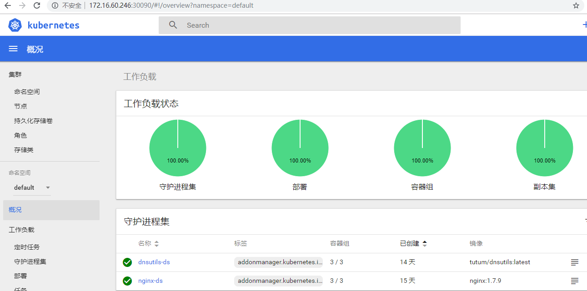

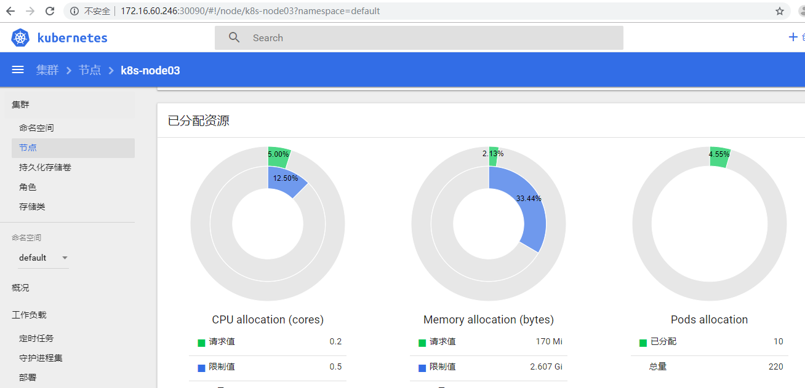

*************** 当你发现自己的才华撑不起野心时，就请安静下来学习吧！***************

分类: Docker

好文要顶 关注我 收藏该文 

 

散尽浮华

关注 - 23

粉丝 - 3133

+加关注

1

0

« 上一篇： Kubernetes容器集群管理环境 - 完整部署（中篇）

» 下一篇： Kubernetes容器集群管理环境 - Prometheus监控篇

posted @ 2019-07-03 20:51  散尽浮华  阅读(2792)  评论(12)  编辑  收藏

评论

  

#1楼 2019-07-05 10:46 | 骑着蚂蚁看海

终于出新了！！！！k8s可以的！！！大佬请收下我的膝盖！！！我以为你已经断更了！

支持(0) 反对(0)

  

#2楼 2019-07-16 00:03 | herocjx

metrics-server

E0715 07:28:07.211366 33412 available_controller.go:316] v1beta1.metrics.k8s.io failed with: Get https://172.30.240.8:443...ng headers)

Jul 15 07:28:32 k8s-master01 kube-apiserver[33412]: E0715 07:28:32.302929 33412 available_controller.go:316] v1beta1.metrics.k8s.io failed with: Get https://172.30.240.8:443...ng headers)

Jul 15 07:28:34 k8s-master01 kube-apiserver[33412]: E0715 07:28:34.005028 33412 memcache.go:135] couldn't get resource list for metrics.k8s.io/v1beta1: the server is current...the request

Jul 15 07:28:37 k8s-master01 kube-apiserver[33412]: E0715 07:28:37.310864 33412 available_controller.go:316] v1beta1.metrics.k8s.io failed with: Get https://172.30.240.8:443...ng headers)

一直获得不了， 请问是啥 问题 ？

支持(0) 反对(0)

  

#3楼 2019-07-16 00:05 | herocjx

通过地址访问：

kind "Status"

apiVersion "v1"

metadata {}

status "Failure"

message "Unauthorized"

reason "Unauthorized"

code 401

请指教 。

支持(0) 反对(0)

  

#4楼 [楼主] 2019-07-16 10:21 | 散尽浮华

@ herocjx

证书问题。浏览器地址访问需要提前创建和导入证书，可参考"中篇"的"9.3 - 浏览器访问kube-apiserver等安全端口，创建和导入证书的做法"

支持(0) 反对(0)

  

#5楼 2019-07-16 21:21 | herocjx

@ 散尽浮华

好的，谢谢！！！

E0715 07:28:07.211366 33412 available_controller.go:316] v1beta1.metrics.k8s.io failed with: Get https://172.30.240.8:443...ng headers)

Jul 15 07:28:32 k8s-master01 kube-apiserver[33412]: E0715 07:28:32.302929 33412 available_controller.go:316] v1beta1.metrics.k8s.io failed with: Get https://172.30.240.8:443...ng headers)

Jul 15 07:28:34 k8s-master01 kube-apiserver[33412]: E0715 07:28:34.005028 33412 memcache.go:135] couldn't get resource list for metrics.k8s.io/v1beta1: the server is current...the request

Jul 15 07:28:37 k8s-master01 kube-apiserver[33412]: E0715 07:28:37.310864 33412 available_controller.go:316] v1beta1.metrics.k8s.io failed with: Get https://172.30.240.8:443...ng headers)

以上是APISERVER 报的。 请指教。

支持(0) 反对(0)

  

#6楼 2019-07-20 10:41 | 紫色飞猪

前辈 我的metrics-server出现了这样的报错，请问我该如何解决一下呢？

metrics-server-584bcd8b5f-lzsjx 1/1 Running 0 16s

[root@k8s-master01 1.8+]# kubectl get --raw "/apis/metrics.k8s.io/v1beta1" | jq .

Error from server (ServiceUnavailable): the server is currently unable to handle the request

服务不可用。服务器目前无法处理请求，由于临时overloa

还有前辈 您这样的二进制部署 添加新的节点 怎么办？

支持(0) 反对(0)

  

#7楼 2019-08-11 17:27 | Nice_keep-going

大佬，你是我见过最牛逼，最无私的博主，没有之一！好想加你联系方式，你可以联系我11066986@qq.com

支持(1) 反对(0)

  

#8楼 2019-08-25 10:28 | lamborghini^_^

赞 很好的文章

支持(0) 反对(0)

  

#9楼 2019-12-05 23:24 | P_T

metrics-server-584bcd8b5f-lzsjx 1/1 Running 0 16s

[root@k8s-master01 1.8+]# kubectl get --raw "/apis/metrics.k8s.io/v1beta1" | jq .

Error from server (ServiceUnavailable): the server is currently unable to handle the request

我也遇到此问题，查看日志报

Warning BackOff 2m13s (x93 over 22m) kubelet, 20075-k8snode2 Back-off restarting failed container

支持(0) 反对(0)

  

#10楼 2019-12-20 22:51 | xugong

博主你好！请教这个问题，好多天了解决不了

[root@k8s-master01 1.8+]# kubectl -n kube-system get pods -l k8s-app=metrics-server

NAME READY STATUS RESTARTS AGE

metrics-server-7fb6cfd7bf-n8fg8 0/1 CrashLoopBackOff 1 10s

1、kubectl -n kube-system describe pod metrics-server-7fb6cfd7bf-n8fg8

Events:

Type Reason Age From Message

---- ------ ---- ---- -------

Normal Scheduled 24s default-scheduler Successfully assigned kube-system/metrics-server-7fb6cfd7bf-n8fg8 to k8s-node03

Normal Pulled 2s (x3 over 21s) kubelet, k8s-node03 Container image "k8s.gcr.io/metrics-server-amd64:v0.3.3" already present on machine

Normal Created 1s (x3 over 21s) kubelet, k8s-node03 Created container metrics-server

Normal Started 1s (x3 over 21s) kubelet, k8s-node03 Started container metrics-server

Warning BackOff 1s (x3 over 18s) kubelet, k8s-node03 Back-off restarting failed container

2、kubectl logs -n kube-system metrics-server-7fb6cfd7bf-n8fg8

-v, --v Level number for the log level verbosity

--vmodule moduleSpec comma-separated list of pattern=N settings for file-filtered logging

panic: error creating self-signed certificates: mkdir apiserver.local.config: read-only file system

goroutine 1 [running]:

main.main()

/go/src/github.com/kubernetes-incubator/metrics-server/cmd/metrics-server/metrics-server.go:39 +0x13b

支持(0) 反对(0)

  

#11楼 2021-02-03 11:48 | XWD2020

metrics-server-7fb6bf-n 0/1 CrashLoopBackOff 镜像需要使用国内下载

kubectl top node

报错 Error from server (ServiceUnavailable): the server is currently unable to handle the request (get nodes.metrics.k8s.io)

配置参数不正确。

介绍另外一种方法安装 metrics-server方法

https://www.cnblogs.com/wuchangblog/p/14163960.html

可以解决

1.下载并解压Metrics-Server

wget https://github.com/kubernetes-sigs/metrics-server/archive/v0.3.6.tar.gz

tar -zxvf v0.3.6.tar.gz

2.修改Metrics-Server配置文件

cd metrics-server-0.3.6/deploy/1.8+/

vim metrics-server-deployment.yaml

vim metrics-server-deployment.yaml文件

apiVersion: v1 kind: ServiceAccount metadata: name: metrics-server namespace: kube-system

apiVersion: apps/v1

kind: Deployment

metadata:

name: metrics-server

namespace: kube-system

labels:

k8s-app: metrics-server

spec:

selector:

matchLabels:

k8s-app: metrics-server

template:

metadata:

name: metrics-server

labels:

k8s-app: metrics-server

spec:

serviceAccountName: metrics-server

volumes:

# mount in tmp so we can safely use from-scratch images and/or read-only containers

- name: tmp-dir

emptyDir:

containers:

- name: metrics-server

# 修改image 和 imagePullPolicy

image: mirrorgooglecontainers/metrics-server-amd64:v0.3.6

imagePullPolicy: IfNotPresent

# 新增command配置

command:

- /metrics-server

- --kubelet-insecure-tls

- --kubelet-preferred-address-types=InternalDNS,InternalIP,ExternalDNS,ExternalIP,Hostname

volumeMounts:

- name: tmp-dir

mountPath: /tmp

# 新增resources配置

resources:

limits:

cpu: 300m

memory: 200Mi

requests:

cpu: 200m

memory: 100Mi　

3.安装Metrics-Server

当前目录 metrics-server-0.3.6/deploy/1.8+/

kubectl apply -f

kubectl top node

报错 Error from server (Forbidden): nodes.metrics.k8s.io is forbidden: User "aggregator" cannot list resource "nodes" in API group "metrics.k8s.io" at the cluster scope

使用：

kubectl create clusterrolebinding custom-metric-with-cluster-admin --clusterrole=cluster-admin --user=aggregator

再kubectl top node 就成功了

支持(0) 反对(0)

  

#12楼 2021-02-03 15:30 | XWD2020

11.4 - 部署 kube-state-metrics 插件

下载：kube-state-metrics

cd /opt/k8s/work/

wget https://github.com/kubernetes/kube-state-metrics/archive/v1.5.0.tar.gz

tar -zvxf v1.5.0.tar.gz

cd /opt/k8s/work/kube-state-metrics-1.5.0/kubernetes

在kube-state-metrics-deployment.yaml

fgrep -R "image" ./*

quay.io/coreos/kube-state-metrics:v1.5.0

k8s.gcr.io/addon-resizer:1.8.3

下载镜像

docker pull mirrorgooglecontainers/kube-state-metrics:v1.5.0

docker pull mirrorgooglecontainers/addon-resizer:1.8.3

docker tag docker.io/mirrorgooglecontainers/addon-resizer:1.8.3 k8s.gcr.io/addon-resizer:1.8.3

或者

修改配置文件 vi kube-state-metrics-deployment.yaml

image: quay.io/coreos/kube-state-metrics:v1.5.0

修改为： image: mirrorgooglecontainers/kube-state-metrics:v1.5.0

image: quay.io/coreos/kube-state-metrics:v1.5.0

修改为： image: mirrorgooglecontainers/addon-resizer:1.8.3

部署成功