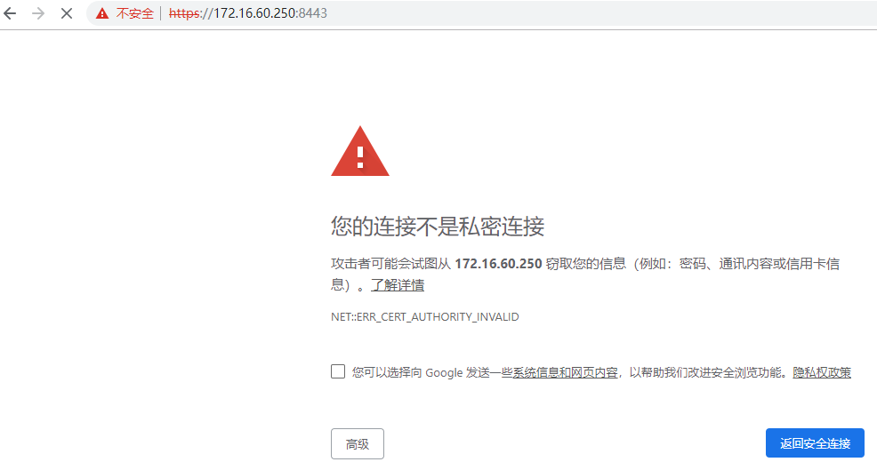
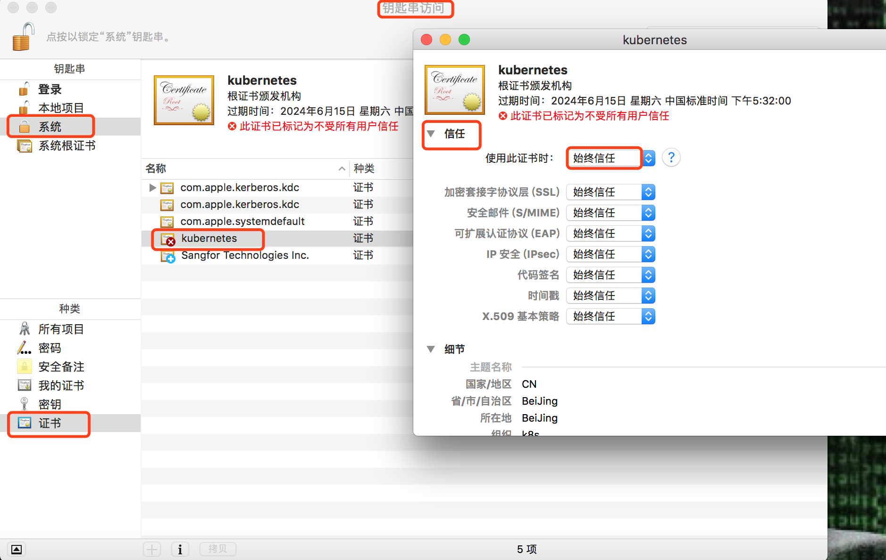
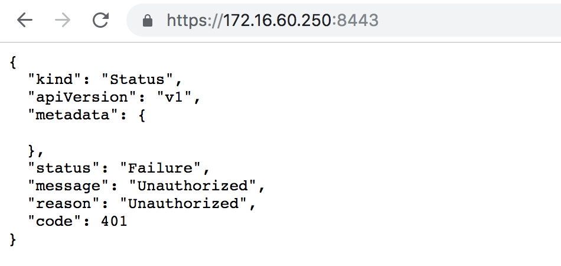
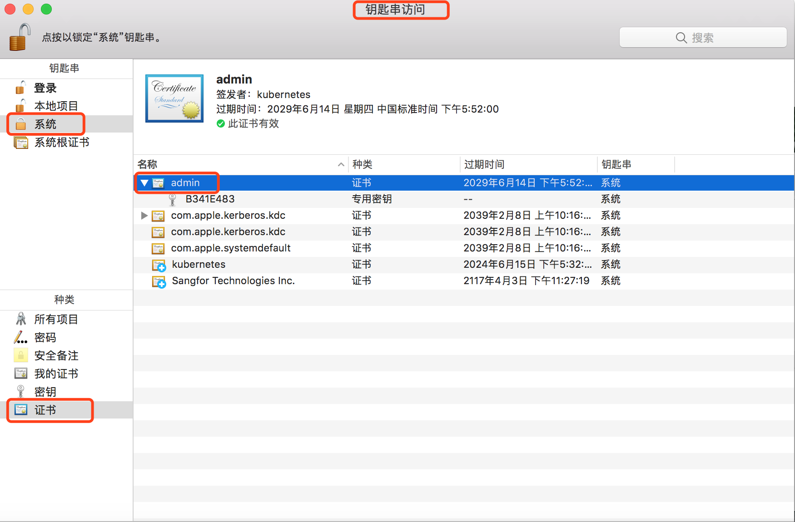
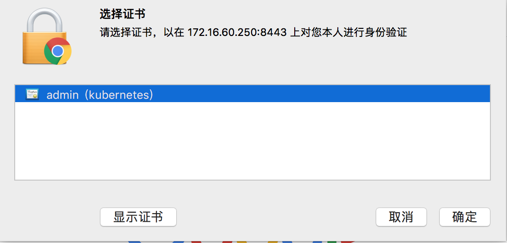
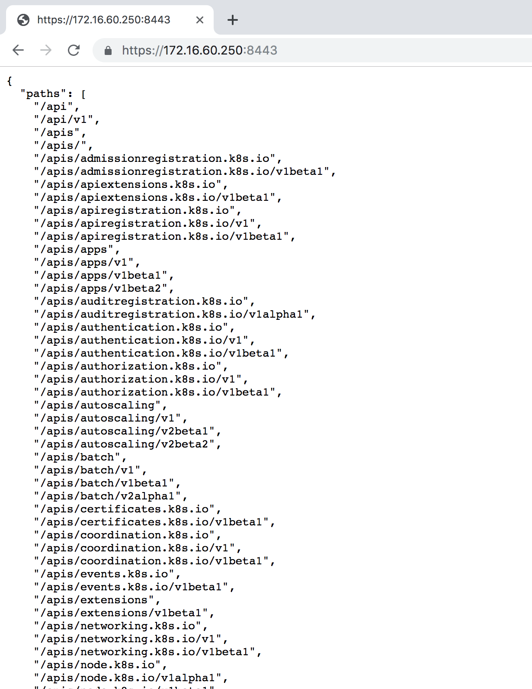
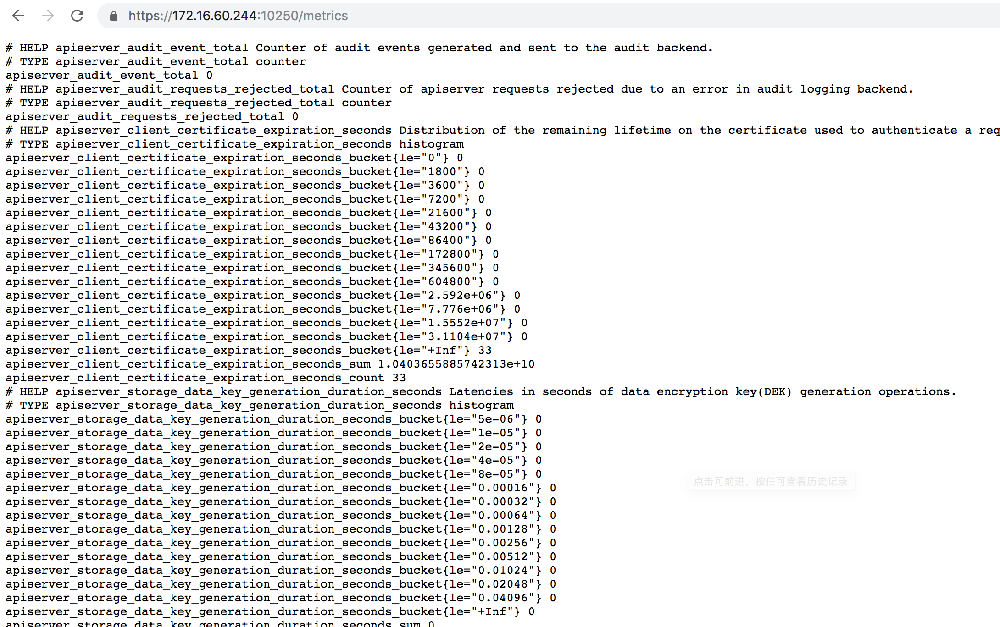
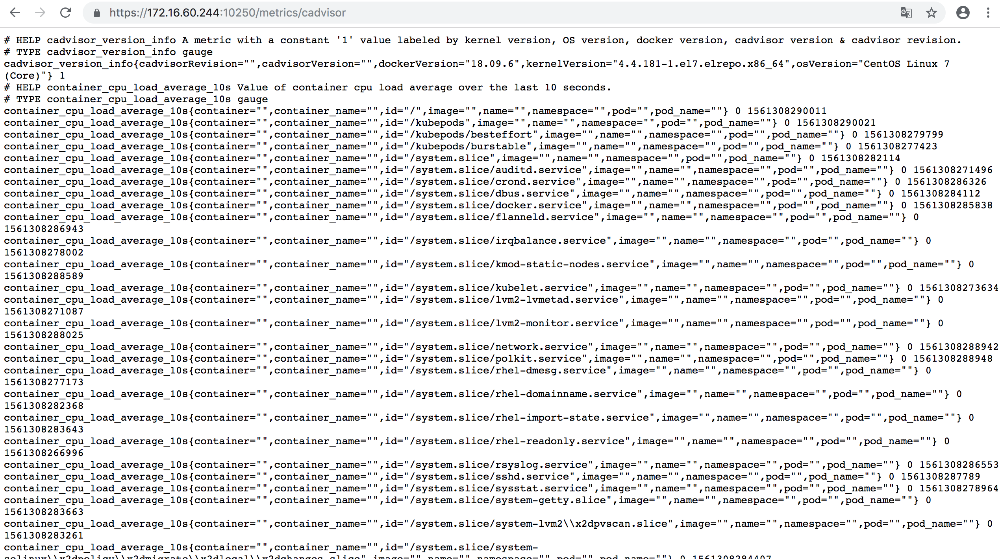

接着Kubernetes容器集群管理环境 - 完整部署（上篇）继续往下部署：

八、部署master节点

master节点的kube-apiserver、kube-scheduler 和 kube-controller-manager 均以多实例模式运行：kube-scheduler 和 kube-controller-manager 会自动选举产生一个 leader 实例，其它实例处于阻塞模式，当 leader 挂了后，重新选举产生新的 leader，从而保证服务可用性；kube-apiserver 是无状态的，需要通过 kube-nginx 进行代理访问，从而保证服务可用性；下面部署命令均在k8s-master01节点上执行，然后远程分发文件和执行命令。

|   |   |
| - | - |
| 1 2 3 4 5 6 7 8 9 10 11 12 13 14 15 16 | 下载最新版本二进制文件 [root@k8s-master01 ~]\# cd /opt/k8s/work [root@k8s-master01 work]\# wget https://dl.k8s.io/v1.14.2/kubernetes-server-linux-amd64.tar.gz [root@k8s-master01 work]\# tar -xzvf kubernetes-server-linux-amd64.tar.gz [root@k8s-master01 work]\# cd kubernetes [root@k8s-master01 work]\# tar -xzvf  kubernetes-src.tar.gz   将二进制文件拷贝到所有 master 节点： [root@k8s-master01 ~]\# cd /opt/k8s/work [root@k8s-master01 work]\# source /opt/k8s/bin/environment.sh [root@k8s-master01 work]\# for node\_master\_ip in ${NODE\_MASTER\_IPS[@]}   do     echo "&gt;&gt;&gt; ${node\_master\_ip}"     scp kubernetes/server/bin/{apiextensions-apiserver,cloud-controller-manager,kube-apiserver,kube-controller-manager,kube-proxy,kube-scheduler,kubeadm,kubectl,kubelet,mounter} root@${node\_master\_ip}:/opt/k8s/bin/     ssh root@${node\_master\_ip} "chmod +x /opt/k8s/bin/\*"   done |

8.1 - 部署高可用 kube-apiserver 集群

这里部署一个三实例kube-apiserver集群环境，它们通过nginx四层代理进行访问，对外提供一个统一的vip地址，从而保证服务可用性。下面部署命令均在k8s-master01节点上执行，然后远程分发文件和执行命令。

|   |   |
| - | - |
| 1 2 3 4 5 6 7 8 9 10 11 12 13 14 15 16 17 18 19 20 21 22 23 24 25 26 27 28 29 30 31 32 33 34 35 36 37 38 39 40 41 42 43 44 45 46 47 48 49 50 51 52 53 54 55 56 57 58 59 60 61 62 63 64 65 66 67 68 69 70 71 72 73 74 75 76 77 78 79 80 81 82 83 84 85 86 87 88 89 90 91 92 93 94 95 96 97 98 99 100 101 102 103 104 105 106 107 108 109 110 111 112 113 114 115 116 117 118 119 120 121 122 123 124 125 126 127 128 129 130 131 132 133 134 135 136 137 138 139 140 141 142 143 144 145 146 147 148 149 150 151 152 153 154 155 156 157 158 159 160 161 162 163 164 165 166 167 168 169 170 171 172 173 174 175 176 177 178 179 180 181 182 183 184 185 186 187 188 189 190 191 192 193 194 195 196 197 198 199 200 201 202 203 204 205 206 207 208 209 210 211 212 213 214 215 216 217 218 219 220 221 222 223 224 225 226 227 228 229 230 231 232 233 234 235 236 237 238 239 240 241 242 243 244 245 246 247 248 249 250 251 252 253 254 255 256 257 258 259 260 261 262 263 264 265 266 267 268 269 270 271 272 273 274 275 276 277 278 279 280 281 282 283 284 285 286 287 288 289 290 291 292 293 294 295 296 297 298 299 300 301 302 303 304 305 306 307 308 309 310 311 312 313 314 315 316 317 318 319 320 321 322 323 324 325 326 327 328 329 330 331 332 333 334 335 336 337 338 339 340 341 342 343 344 345 346 347 348 349 350 351 352 353 354 355 356 357 358 359 360 361 362 363 364 365 366 367 368 369 370 371 372 373 374 375 376 377 378 379 380 381 382 383 384 385 386 387 388 389 390 391 392 393 394 395 396 397 398 399 400 401 402 403 404 405 406 407 408 409 410 411 412 413 414 415 416 417 418 419 420 421 422 423 424 425 426 427 428 429 430 431 432 433 434 435 436 437 438 439 440 441 442 443 444 445 446 447 448 449 450 451 452 453 454 455 456 457 458 459 460 461 462 463 464 465 466 467 468 469 470 471 472 473 474 475 476 477 478 479 480 481 482 483 484 485 486 487 488 489 490 491 492 493 494 495 496 497 498 499 500 501 502 503 504 505 506 507 508 509 510 511 512 513 514 515 516 517 518 519 520 521 522 523 524 525 526 527 528 529 530 531 532 533 534 535 536 537 538 539 540 541 542 543 544 545 546 547 548 549 550 551 552 553 554 555 556 557 558 559 560 561 562 563 564 565 566 567 568 569 570 | 1) 创建 kubernetes 证书和私钥 创建证书签名请求： [root@k8s-master01 ~]\# cd /opt/k8s/work [root@k8s-master01 work]\# source /opt/k8s/bin/environment.sh [root@k8s-master01 work]\# cat &gt; kubernetes-csr.json &lt;&lt;EOF {   "CN": "kubernetes",   "hosts": [     "127.0.0.1",     "172.16.60.250",     "172.16.60.241",     "172.16.60.242",     "172.16.60.243",     "${CLUSTER\_KUBERNETES\_SVC\_IP}",     "kubernetes",     "kubernetes.default",     "kubernetes.default.svc",     "kubernetes.default.svc.cluster",     "kubernetes.default.svc.cluster.local"   ],   "key": {     "algo": "rsa",     "size": 2048   },   "names": [     {       "C": "CN",       "ST": "BeiJing",       "L": "BeiJing",       "O": "k8s",       "OU": "4Paradigm"     }   ] } EOF    解释说明： • hosts 字段指定授权使用该证书的 IP 或域名列表，这里列出了 VIP 、apiserver 节点 IP、kubernetes 服务 IP 和域名； • 域名最后字符不能是 .(如不能为 kubernetes.default.svc.cluster.local.)，否则解析时失败，提示：   x509: cannot parse dnsName "kubernetes.default.svc.cluster.local."； • 如果使用非 cluster.local 域名，如 opsnull.com，则需要修改域名列表中的最后两个域名为：kubernetes.default.svc.opsnull、kubernetes.default.svc.opsnull.com • kubernetes 服务 IP 是 apiserver 自动创建的，一般是 --service-cluster-ip-range 参数指定的网段的第一个IP，后续可以通过如下命令获取：    [root@k8s-master01 work]\# kubectl get svc kubernetes The connection to the server 172.16.60.250:8443 was refused - did you specify the right host or port?     上面报错是因为kube-apiserver服务此时没有启动，后续待apiserver服务启动后，以上命令就可以获得了。     生成证书和私钥： [root@k8s-master01 work]\# cfssl gencert -ca=/opt/k8s/work/ca.pem \\   -ca-key=/opt/k8s/work/ca-key.pem \\   -config=/opt/k8s/work/ca-config.json \\   -profile=kubernetes kubernetes-csr.json | cfssljson -bare kubernetes     [root@k8s-master01 work]\# ls kubernetes\*pem kubernetes-key.pem  kubernetes.pem     将生成的证书和私钥文件拷贝到所有 master 节点： [root@k8s-master01 work]\# cd /opt/k8s/work [root@k8s-master01 work]\# source /opt/k8s/bin/environment.sh [root@k8s-master01 work]\# for node\_master\_ip in ${NODE\_MASTER\_IPS[@]}   do     echo "&gt;&gt;&gt; ${node\_master\_ip}"     ssh root@${node\_master\_ip} "mkdir -p /etc/kubernetes/cert"     scp kubernetes\*.pem root@${node\_master\_ip}:/etc/kubernetes/cert/   done     2) 创建加密配置文件 [root@k8s-master01 work]\# cd /opt/k8s/work [root@k8s-master01 work]\# source /opt/k8s/bin/environment.sh [root@k8s-master01 work]\# cat &gt; encryption-config.yaml &lt;&lt;EOF kind: EncryptionConfig apiVersion: v1 resources:   - resources:       - secrets     providers:       - aescbc:           keys:             - name: key1               secret: ${ENCRYPTION\_KEY}       - identity: {} EOF     将加密配置文件拷贝到 master 节点的 /etc/kubernetes 目录下： [root@k8s-master01 work]\# cd /opt/k8s/work [root@k8s-master01 work]\# source /opt/k8s/bin/environment.sh [root@k8s-master01 work]\# for node\_master\_ip in ${NODE\_MASTER\_IPS[@]}   do     echo "&gt;&gt;&gt; ${node\_master\_ip}"     scp encryption-config.yaml root@${node\_master\_ip}:/etc/kubernetes/   done     3) 创建审计策略文件 [root@k8s-master01 work]\# cd /opt/k8s/work [root@k8s-master01 work]\# source /opt/k8s/bin/environment.sh [root@k8s-master01 work]\# cat &gt; audit-policy.yaml &lt;&lt;EOF apiVersion: audit.k8s.io/v1beta1 kind: Policy rules:   \# The following requests were manually identified as high-volume and low-risk, so drop them.   - level: None     resources:       - group: ""         resources:           - endpoints           - services           - services/status     users:       - 'system:kube-proxy'     verbs:       - watch       - level: None     resources:       - group: ""         resources:           - nodes           - nodes/status     userGroups:       - 'system:nodes'     verbs:       - get       - level: None     namespaces:       - kube-system     resources:       - group: ""         resources:           - endpoints     users:       - 'system:kube-controller-manager'       - 'system:kube-scheduler'       - 'system:serviceaccount:kube-system:endpoint-controller'     verbs:       - get       - update       - level: None     resources:       - group: ""         resources:           - namespaces           - namespaces/status           - namespaces/finalize     users:       - 'system:apiserver'     verbs:       - get       \# Don't log HPA fetching metrics.   - level: None     resources:       - group: metrics.k8s.io     users:       - 'system:kube-controller-manager'     verbs:       - get       - list       \# Don't log these read-only URLs.   - level: None     nonResourceURLs:       - '/healthz\*'       - /version       - '/swagger\*'       \# Don't log events requests.   - level: None     resources:       - group: ""         resources:           - events       \# node and pod status calls from nodes are high-volume and can be large, don't log responses for expected updates from nodes   - level: Request     omitStages:       - RequestReceived     resources:       - group: ""         resources:           - nodes/status           - pods/status     users:       - kubelet       - 'system:node-problem-detector'       - 'system:serviceaccount:kube-system:node-problem-detector'     verbs:       - update       - patch       - level: Request     omitStages:       - RequestReceived     resources:       - group: ""         resources:           - nodes/status           - pods/status     userGroups:       - 'system:nodes'     verbs:       - update       - patch       \# deletecollection calls can be large, don't log responses for expected namespace deletions   - level: Request     omitStages:       - RequestReceived     users:       - 'system:serviceaccount:kube-system:namespace-controller'     verbs:       - deletecollection       \# Secrets, ConfigMaps, and TokenReviews can contain sensitive &amp; binary data,   \# so only log at the Metadata level.   - level: Metadata     omitStages:       - RequestReceived     resources:       - group: ""         resources:           - secrets           - configmaps       - group: authentication.k8s.io         resources:           - tokenreviews   \# Get repsonses can be large; skip them.   - level: Request     omitStages:       - RequestReceived     resources:       - group: ""       - group: admissionregistration.k8s.io       - group: apiextensions.k8s.io       - group: apiregistration.k8s.io       - group: apps       - group: authentication.k8s.io       - group: authorization.k8s.io       - group: autoscaling       - group: batch       - group: certificates.k8s.io       - group: extensions       - group: metrics.k8s.io       - group: networking.k8s.io       - group: policy       - group: rbac.authorization.k8s.io       - group: scheduling.k8s.io       - group: settings.k8s.io       - group: storage.k8s.io     verbs:       - get       - list       - watch       \# Default level for known APIs   - level: RequestResponse     omitStages:       - RequestReceived     resources:       - group: ""       - group: admissionregistration.k8s.io       - group: apiextensions.k8s.io       - group: apiregistration.k8s.io       - group: apps       - group: authentication.k8s.io       - group: authorization.k8s.io       - group: autoscaling       - group: batch       - group: certificates.k8s.io       - group: extensions       - group: metrics.k8s.io       - group: networking.k8s.io       - group: policy       - group: rbac.authorization.k8s.io       - group: scheduling.k8s.io       - group: settings.k8s.io       - group: storage.k8s.io             \# Default level for all other requests.   - level: Metadata     omitStages:       - RequestReceived EOF     分发审计策略文件： [root@k8s-master01 work]\# cd /opt/k8s/work [root@k8s-master01 work]\# source /opt/k8s/bin/environment.sh [root@k8s-master01 work]\# for node\_master\_ip in ${NODE\_MASTER\_IPS[@]}   do     echo "&gt;&gt;&gt; ${node\_master\_ip}"     scp audit-policy.yaml root@${node\_master\_ip}:/etc/kubernetes/audit-policy.yaml   done     4) 创建后续访问 metrics-server 使用的证书 创建证书签名请求: [root@k8s-master01 work]\# cat &gt; proxy-client-csr.json &lt;&lt;EOF {   "CN": "aggregator",   "hosts": [],   "key": {     "algo": "rsa",     "size": 2048   },   "names": [     {       "C": "CN",       "ST": "BeiJing",       "L": "BeiJing",       "O": "k8s",       "OU": "4Paradigm"     }   ] } EOF     CN 名称为 aggregator，需要与 metrics-server 的 --requestheader-allowed-names 参数配置一致，否则访问会被 metrics-server 拒绝；     生成证书和私钥： [root@k8s-master01 work]\# cfssl gencert -ca=/etc/kubernetes/cert/ca.pem \\   -ca-key=/etc/kubernetes/cert/ca-key.pem  \\   -config=/etc/kubernetes/cert/ca-config.json  \\   -profile=kubernetes proxy-client-csr.json | cfssljson -bare proxy-client     [root@k8s-master01 work]\# ls proxy-client\*.pem proxy-client-key.pem  proxy-client.pem     将生成的证书和私钥文件拷贝到所有 master 节点： [root@k8s-master01 work]\# source /opt/k8s/bin/environment.sh [root@k8s-master01 work]\# for node\_master\_ip in ${NODE\_MASTER\_IPS[@]}   do     echo "&gt;&gt;&gt; ${node\_master\_ip}"     scp proxy-client\*.pem root@${node\_master\_ip}:/etc/kubernetes/cert/   done     5) 创建 kube-apiserver systemd unit 模板文件 [root@k8s-master01 work]\# cd /opt/k8s/work [root@k8s-master01 work]\# source /opt/k8s/bin/environment.sh [root@k8s-master01 work]\# cat &gt; kube-apiserver.service.template &lt;&lt;EOF [Unit] Description=Kubernetes API Server Documentation=https://github.com/GoogleCloudPlatform/kubernetes After=network.target     [Service] WorkingDirectory=${K8S\_DIR}/kube-apiserver ExecStart=/opt/k8s/bin/kube-apiserver \\\\   --advertise-address=\#\#NODE\_MASTER\_IP\#\# \\\\   --default-not-ready-toleration-seconds=360 \\\\   --default-unreachable-toleration-seconds=360 \\\\   --feature-gates=DynamicAuditing=true \\\\   --max-mutating-requests-inflight=2000 \\\\   --max-requests-inflight=4000 \\\\   --default-watch-cache-size=200 \\\\   --delete-collection-workers=2 \\\\   --encryption-provider-config=/etc/kubernetes/encryption-config.yaml \\\\   --etcd-cafile=/etc/kubernetes/cert/ca.pem \\\\   --etcd-certfile=/etc/kubernetes/cert/kubernetes.pem \\\\   --etcd-keyfile=/etc/kubernetes/cert/kubernetes-key.pem \\\\   --etcd-servers=${ETCD\_ENDPOINTS} \\\\   --bind-address=\#\#NODE\_MASTER\_IP\#\# \\\\   --secure-port=6443 \\\\   --tls-cert-file=/etc/kubernetes/cert/kubernetes.pem \\\\   --tls-private-key-file=/etc/kubernetes/cert/kubernetes-key.pem \\\\   --insecure-port=0 \\\\   --audit-dynamic-configuration \\\\   --audit-log-maxage=15 \\\\   --audit-log-maxbackup=3 \\\\   --audit-log-maxsize=100 \\\\   --audit-log-mode=batch \\\\   --audit-log-truncate-enabled \\\\   --audit-log-batch-buffer-size=20000 \\\\   --audit-log-batch-max-size=2 \\\\   --audit-log-path=${K8S\_DIR}/kube-apiserver/audit.log \\\\   --audit-policy-file=/etc/kubernetes/audit-policy.yaml \\\\   --profiling \\\\   --anonymous-auth=false \\\\   --client-ca-file=/etc/kubernetes/cert/ca.pem \\\\   --enable-bootstrap-token-auth \\\\   --requestheader-allowed-names="" \\\\   --requestheader-client-ca-file=/etc/kubernetes/cert/ca.pem \\\\   --requestheader-extra-headers-prefix="X-Remote-Extra-" \\\\   --requestheader-group-headers=X-Remote-Group \\\\   --requestheader-username-headers=X-Remote-User \\\\   --service-account-key-file=/etc/kubernetes/cert/ca.pem \\\\   --authorization-mode=Node,RBAC \\\\   --runtime-config=api/all=true \\\\   --enable-admission-plugins=NodeRestriction \\\\   --allow-privileged=true \\\\   --apiserver-count=3 \\\\   --event-ttl=168h \\\\   --kubelet-certificate-authority=/etc/kubernetes/cert/ca.pem \\\\   --kubelet-client-certificate=/etc/kubernetes/cert/kubernetes.pem \\\\   --kubelet-client-key=/etc/kubernetes/cert/kubernetes-key.pem \\\\   --kubelet-https=true \\\\   --kubelet-timeout=10s \\\\   --proxy-client-cert-file=/etc/kubernetes/cert/proxy-client.pem \\\\   --proxy-client-key-file=/etc/kubernetes/cert/proxy-client-key.pem \\\\   --service-cluster-ip-range=${SERVICE\_CIDR} \\\\   --service-node-port-range=${NODE\_PORT\_RANGE} \\\\   --logtostderr=true \\\\   --enable-aggregator-routing=true \\\\   --v=2 Restart=on-failure RestartSec=10 Type=notify LimitNOFILE=65536     [Install] WantedBy=multi-user.target EOF     解释说明： --advertise-address：apiserver 对外通告的 IP（kubernetes 服务后端节点 IP）； --default-\*-toleration-seconds：设置节点异常相关的阈值； --max-\*-requests-inflight：请求相关的最大阈值； --etcd-\*：访问 etcd 的证书和 etcd 服务器地址； --experimental-encryption-provider-config：指定用于加密 etcd 中 secret 的配置； --bind-address： https 监听的 IP，不能为 127.0.0.1，否则外界不能访问它的安全端口 6443； --secret-port：https 监听端口； --insecure-port=0：关闭监听 http 非安全端口(8080)； --tls-\*-file：指定 apiserver 使用的证书、私钥和 CA 文件； --audit-\*：配置审计策略和审计日志文件相关的参数； --client-ca-file：验证 client (kue-controller-manager、kube-scheduler、kubelet、kube-proxy 等)请求所带的证书； --enable-bootstrap-token-auth：启用 kubelet bootstrap 的 token 认证； --requestheader-\*：kube-apiserver 的 aggregator layer 相关的配置参数，proxy-client &amp; HPA 需要使用； --requestheader-client-ca-file：用于签名 --proxy-client-cert-file 和 --proxy-client-key-file 指定的证书；在启用了 metric aggregator 时使用； 如果 --requestheader-allowed-names 不为空，则--proxy-client-cert-file 证书的 CN 必须位于 allowed-names 中，默认为 aggregator; --service-account-key-file：签名 ServiceAccount Token 的公钥文件，kube-controller-manager 的 --service-account-private-key-file 指定私钥文件，两者配对使用； --runtime-config=api/all=true： 启用所有版本的 APIs，如 autoscaling/v2alpha1； --authorization-mode=Node,RBAC、--anonymous-auth=false： 开启 Node 和 RBAC 授权模式，拒绝未授权的请求； --enable-admission-plugins：启用一些默认关闭的 plugins； --allow-privileged：运行执行 privileged 权限的容器； --apiserver-count=3：指定 apiserver 实例的数量； --event-ttl：指定 events 的保存时间； --kubelet-\*：如果指定，则使用 https 访问 kubelet APIs；需要为证书对应的用户(上面 kubernetes\*.pem 证书的用户为 kubernetes) 用户定义 RBAC 规则，否则访问 kubelet API 时提示未授权； --proxy-client-\*：apiserver 访问 metrics-server 使用的证书； --service-cluster-ip-range： 指定 Service Cluster IP 地址段； --service-node-port-range： 指定 NodePort 的端口范围；     注意： 如果kube-apiserver机器没有运行 kube-proxy，则需要添加 --enable-aggregator-routing=true 参数（这里master节点没有作为node节点使用，故没有运行kube-proxy，需要加这个参数） requestheader-client-ca-file 指定的 CA 证书，必须具有 client auth and server auth！！     为各节点创建和分发 kube-apiserver systemd unit 文件 替换模板文件中的变量，为各节点生成 systemd unit 文件： [root@k8s-master01 work]\# cd /opt/k8s/work [root@k8s-master01 work]\# source /opt/k8s/bin/environment.sh [root@k8s-master01 work]\# for (( i=0; i &lt; 3; i++ ))   do     sed -e "s/\#\#NODE\_MASTER\_NAME\#\#/${NODE\_MASTER\_NAMES[i]}/" -e "s/\#\#NODE\_MASTER\_IP\#\#/${NODE\_MASTER\_IPS[i]}/" kube-apiserver.service.template &gt; kube-apiserver-${NODE\_MASTER\_IPS[i]}.service   done     其中：NODE\_NAMES 和 NODE\_IPS 为相同长度的 bash 数组，分别为节点名称和对应的 IP；     [root@k8s-master01 work]\# ll kube-apiserver\*.service -rw-r--r-- 1 root root 2718 Jun 18 10:38 kube-apiserver-172.16.60.241.service -rw-r--r-- 1 root root 2718 Jun 18 10:38 kube-apiserver-172.16.60.242.service -rw-r--r-- 1 root root 2718 Jun 18 10:38 kube-apiserver-172.16.60.243.service     分发生成的 systemd unit 文件, 文件重命名为 kube-apiserver.service; [root@k8s-master01 work]\# cd /opt/k8s/work [root@k8s-master01 work]\# source /opt/k8s/bin/environment.sh [root@k8s-master01 work]\# for node\_master\_ip in ${NODE\_MASTER\_IPS[@]}   do     echo "&gt;&gt;&gt; ${node\_master\_ip}"     scp kube-apiserver-${node\_master\_ip}.service root@${node\_master\_ip}:/etc/systemd/system/kube-apiserver.service   done     6) 启动 kube-apiserver 服务 [root@k8s-master01 work]\# source /opt/k8s/bin/environment.sh [root@k8s-master01 work]\# for node\_master\_ip in ${NODE\_MASTER\_IPS[@]}   do     echo "&gt;&gt;&gt; ${node\_master\_ip}"     ssh root@${node\_master\_ip} "mkdir -p ${K8S\_DIR}/kube-apiserver"     ssh root@${node\_master\_ip} "systemctl daemon-reload &amp;&amp; systemctl enable kube-apiserver &amp;&amp; systemctl restart kube-apiserver"   done     注意：启动服务前必须先创建工作目录；     检查 kube-apiserver 运行状态 [root@k8s-master01 work]\# source /opt/k8s/bin/environment.sh [root@k8s-master01 work]\# for node\_master\_ip in ${NODE\_MASTER\_IPS[@]}   do     echo "&gt;&gt;&gt; ${node\_master\_ip}"     ssh root@${node\_master\_ip} "systemctl status kube-apiserver |grep 'Active:'"   done     预期输出： &gt;&gt;&gt; 172.16.60.241    Active: active (running) since Tue 2019-06-18 10:42:42 CST; 1min 6s ago &gt;&gt;&gt; 172.16.60.242    Active: active (running) since Tue 2019-06-18 10:42:47 CST; 1min 2s ago &gt;&gt;&gt; 172.16.60.243    Active: active (running) since Tue 2019-06-18 10:42:51 CST; 58s ago     确保状态为 active (running)，否则查看日志，确认原因（journalctl -u kube-apiserver）     7）打印 kube-apiserver 写入 etcd 的数据 [root@k8s-master01 work]\# source /opt/k8s/bin/environment.sh [root@k8s-master01 work]\# ETCDCTL\_API=3 etcdctl \\     --endpoints=${ETCD\_ENDPOINTS} \\     --cacert=/opt/k8s/work/ca.pem \\     --cert=/opt/k8s/work/etcd.pem \\     --key=/opt/k8s/work/etcd-key.pem \\     get /registry/ --prefix --keys-only     预期会打印出很多写入到etcd中的数据信息     8）检查集群信息 [root@k8s-master01 work]\# kubectl cluster-info Kubernetes master is running at https://172.16.60.250:8443 To further debug and diagnose cluster problems, use 'kubectl cluster-info dump'.     [root@k8s-master01 work]\# kubectl get all --all-namespaces NAMESPACE   NAME                 TYPE        CLUSTER-IP   EXTERNAL-IP   PORT(S)   AGE default     service/kubernetes   ClusterIP   10.254.0.1   &lt;none&gt;        443/TCP   8m25s     查看集群状态信息 [root@k8s-master01 work]\# kubectl get componentstatuses            \#或者执行命令"kubectl get cs" NAME                 STATUS      MESSAGE                                                                                     ERROR controller-manager   Unhealthy   Get http://127.0.0.1:10252/healthz: dial tcp 127.0.0.1:10252: connect: connection refused scheduler            Unhealthy   Get http://127.0.0.1:10251/healthz: dial tcp 127.0.0.1:10251: connect: connection refused etcd-0               Healthy     {"health":"true"}                                                                         etcd-2               Healthy     {"health":"true"}                                                                         etcd-1               Healthy     {"health":"true"}     controller-managerhe 和 schedule状态为Unhealthy，是因为此时还没有部署这两个组件，待后续部署好之后再查看~     这里注意： -&gt; 如果执行 kubectl 命令式时输出如下错误信息，则说明使用的 ~/.kube/config 文件不对，请切换到正确的账户后再执行该命令：    The connection to the server localhost:8080 was refused - did you specify the right host or port? -&gt; 执行 kubectl get componentstatuses 命令时，apiserver 默认向 127.0.0.1 发送请求。当 controller-manager、scheduler 以集群模式运行时，有可能和kube-apiserver    不在一台机器上，这时 controller-manager 或 scheduler 的状态为 Unhealthy，但实际上它们工作正常。     9) 检查 kube-apiserver 监听的端口 [root@k8s-master01 work]\# netstat -lnpt|grep kube tcp        0      0 172.16.60.241:6443      0.0.0.0:\*               LISTEN      15516/kube-apiserve     需要注意： 6443: 接收 https 请求的安全端口，对所有请求做认证和授权； 由于关闭了非安全端口，故没有监听 8080；     10）授予 kube-apiserver 访问 kubelet API 的权限 在执行 kubectl exec、run、logs 等命令时，apiserver 会将请求转发到 kubelet 的 https 端口。 这里定义 RBAC 规则，授权 apiserver 使用的证书（kubernetes.pem）用户名（CN：kuberntes）访问 kubelet API 的权限：     [root@k8s-master01 work]\# kubectl create clusterrolebinding kube-apiserver:kubelet-apis --clusterrole=system:kubelet-api-admin --user kubernetes   11）查看kube-apiserver输出的metrics 需要用到根证书   使用nginx的代理端口获取metrics [root@k8s-master01 work]\# curl -s --cacert /opt/k8s/work/ca.pem --cert /opt/k8s/work/admin.pem --key /opt/k8s/work/admin-key.pem https://172.16.60.250:8443/metrics|head \# HELP APIServiceOpenAPIAggregationControllerQueue1\_adds (Deprecated) Total number of adds handled by workqueue: APIServiceOpenAPIAggregationControllerQueue1 \# TYPE APIServiceOpenAPIAggregationControllerQueue1\_adds counter APIServiceOpenAPIAggregationControllerQueue1\_adds 12194 \# HELP APIServiceOpenAPIAggregationControllerQueue1\_depth (Deprecated) Current depth of workqueue: APIServiceOpenAPIAggregationControllerQueue1 \# TYPE APIServiceOpenAPIAggregationControllerQueue1\_depth gauge APIServiceOpenAPIAggregationControllerQueue1\_depth 0 \# HELP APIServiceOpenAPIAggregationControllerQueue1\_longest\_running\_processor\_microseconds (Deprecated) How many microseconds has the longest running processor for APIServiceOpenAPIAggregationControllerQueue1 been running. \# TYPE APIServiceOpenAPIAggregationControllerQueue1\_longest\_running\_processor\_microseconds gauge APIServiceOpenAPIAggregationControllerQueue1\_longest\_running\_processor\_microseconds 0 \# HELP APIServiceOpenAPIAggregationControllerQueue1\_queue\_latency (Deprecated) How long an item stays in workqueueAPIServiceOpenAPIAggregationControllerQueue1 before being requested.   直接使用kube-apiserver节点端口获取metrics [root@k8s-master01 work]\# curl -s --cacert /opt/k8s/work/ca.pem --cert /opt/k8s/work/admin.pem --key /opt/k8s/work/admin-key.pem https://172.16.60.241:6443/metrics|head [root@k8s-master01 work]\# curl -s --cacert /opt/k8s/work/ca.pem --cert /opt/k8s/work/admin.pem --key /opt/k8s/work/admin-key.pem https://172.16.60.242:6443/metrics|head [root@k8s-master01 work]\# curl -s --cacert /opt/k8s/work/ca.pem --cert /opt/k8s/work/admin.pem --key /opt/k8s/work/admin-key.pem https://172.16.60.243:6443/metrics|head |

8.2 - 部署高可用 kube-controller-manager 集群

该集群包含 3 个节点，启动后将通过竞争选举机制产生一个 leader 节点，其它节点为阻塞状态。当 leader 节点不可用时，阻塞的节点将再次进行选举产生新的 leader 节点，从而保证服务的可用性。为保证通信安全，本文档先生成 x509 证书和私钥，kube-controller-manager 在如下两种情况下使用该证书：与 kube-apiserver 的安全端口通信; 在安全端口(https，10252) 输出 prometheus 格式的 metrics；下面部署命令均在k8s-master01节点上执行，然后远程分发文件和执行命令。

|   |   |
| - | - |
| 1 2 3 4 5 6 7 8 9 10 11 12 13 14 15 16 17 18 19 20 21 22 23 24 25 26 27 28 29 30 31 32 33 34 35 36 37 38 39 40 41 42 43 44 45 46 47 48 49 50 51 52 53 54 55 56 57 58 59 60 61 62 63 64 65 66 67 68 69 70 71 72 73 74 75 76 77 78 79 80 81 82 83 84 85 86 87 88 89 90 91 92 93 94 95 96 97 98 99 100 101 102 103 104 105 106 107 108 109 110 111 112 113 114 115 116 117 118 119 120 121 122 123 124 125 126 127 128 129 130 131 132 133 134 135 136 137 138 139 140 141 142 143 144 145 146 147 148 149 150 151 152 153 154 155 156 157 158 159 160 161 162 163 164 165 166 167 168 169 170 171 172 173 174 175 176 177 178 179 180 181 182 183 184 185 186 187 188 189 190 191 192 193 194 195 196 197 198 199 200 201 202 203 204 205 206 207 208 209 210 211 212 213 214 215 216 217 218 219 220 221 222 223 224 225 226 227 228 229 230 231 232 233 234 235 236 237 238 239 240 241 242 243 244 245 246 247 248 249 250 251 252 253 254 255 256 257 258 259 260 261 262 263 264 265 266 267 268 269 270 271 272 273 274 275 276 277 278 279 280 281 282 283 284 285 286 287 288 289 290 291 292 293 294 295 296 297 298 299 300 301 302 303 304 305 306 307 308 309 310 311 312 313 314 315 316 317 318 319 320 321 322 323 324 325 326 327 328 329 330 331 332 333 334 335 336 337 338 339 340 341 342 343 344 345 346 347 348 349 350 351 352 353 354 355 356 357 358 359 360 361 362 363 364 365 366 367 368 369 370 371 372 373 374 375 376 377 378 379 380 381 382 383 384 385 386 387 388 389 390 | 1）创建 kube-controller-manager 证书和私钥 创建证书签名请求： [root@k8s-master01 ~]\# cd /opt/k8s/work [root@k8s-master01 work]\# cat &gt; kube-controller-manager-csr.json &lt;&lt;EOF {     "CN": "system:kube-controller-manager",     "key": {         "algo": "rsa",         "size": 2048     },     "hosts": [       "127.0.0.1",       "172.16.60.241",       "172.16.60.242",       "172.16.60.243"     ],     "names": [       {         "C": "CN",         "ST": "BeiJing",         "L": "BeiJing",         "O": "system:kube-controller-manager",         "OU": "4Paradigm"       }     ] } EOF    • hosts 列表包含所有 kube-controller-manager 节点 IP； • CN 为 system:kube-controller-manager、O 为 system:kube-controller-manager，kubernetes 内置的 ClusterRoleBindings system:kube-controller-manager   赋予 kube-controller-manager 工作所需的权限。    生成证书和私钥 [root@k8s-master01 work]\# cd /opt/k8s/work [root@k8s-master01 work]\# cfssl gencert -ca=/opt/k8s/work/ca.pem \\   -ca-key=/opt/k8s/work/ca-key.pem \\   -config=/opt/k8s/work/ca-config.json \\   -profile=kubernetes kube-controller-manager-csr.json | cfssljson -bare kube-controller-manager    [root@k8s-master01 work]\# ll kube-controller-manager\*pem -rw------- 1 root root 1679 Jun 18 11:43 kube-controller-manager-key.pem -rw-r--r-- 1 root root 1517 Jun 18 11:43 kube-controller-manager.pem    将生成的证书和私钥分发到所有 master 节点： [root@k8s-master01 work]\# cd /opt/k8s/work [root@k8s-master01 work]\# source /opt/k8s/bin/environment.sh [root@k8s-master01 work]\# for node\_master\_ip in ${NODE\_MASTER\_IPS[@]}   do     echo "&gt;&gt;&gt; ${node\_master\_ip}"     scp kube-controller-manager\*.pem root@${node\_master\_ip}:/etc/kubernetes/cert/   done    2) 创建和分发 kubeconfig 文件 kube-controller-manager 使用 kubeconfig 文件访问 apiserver，该文件提供了 apiserver 地址、嵌入的 CA 证书和 kube-controller-manager 证书： [root@k8s-master01 work]\# cd /opt/k8s/work [root@k8s-master01 work]\# source /opt/k8s/bin/environment.sh [root@k8s-master01 work]\# kubectl config set-cluster kubernetes \\   --certificate-authority=/opt/k8s/work/ca.pem \\   --embed-certs=true \\   --server=${KUBE\_APISERVER} \\   --kubeconfig=kube-controller-manager.kubeconfig    [root@k8s-master01 work]\# kubectl config set-credentials system:kube-controller-manager \\   --client-certificate=kube-controller-manager.pem \\   --client-key=kube-controller-manager-key.pem \\   --embed-certs=true \\   --kubeconfig=kube-controller-manager.kubeconfig    [root@k8s-master01 work]\# kubectl config set-context system:kube-controller-manager \\   --cluster=kubernetes \\   --user=system:kube-controller-manager \\   --kubeconfig=kube-controller-manager.kubeconfig    [root@k8s-master01 work]\# kubectl config use-context system:kube-controller-manager --kubeconfig=kube-controller-manager.kubeconfig    分发 kubeconfig 到所有 master 节点： [root@k8s-master01 work]\# cd /opt/k8s/work [root@k8s-master01 work]\# source /opt/k8s/bin/environment.sh [root@k8s-master01 work]\# for node\_master\_ip in ${NODE\_MASTER\_IPS[@]}   do     echo "&gt;&gt;&gt; ${node\_master\_ip}"     scp kube-controller-manager.kubeconfig root@${node\_master\_ip}:/etc/kubernetes/   done    3) 创建和分发kube-controller-manager system unit 文件 [root@k8s-master01 work]\# cd /opt/k8s/work [root@k8s-master01 work]\# source /opt/k8s/bin/environment.sh [root@k8s-master01 work]\# cat &gt; kube-controller-manager.service.template &lt;&lt;EOF [Unit] Description=Kubernetes Controller Manager Documentation=https://github.com/GoogleCloudPlatform/kubernetes    [Service] WorkingDirectory=${K8S\_DIR}/kube-controller-manager ExecStart=/opt/k8s/bin/kube-controller-manager \\\\   --profiling \\\\   --cluster-name=kubernetes \\\\   --controllers=\*,bootstrapsigner,tokencleaner \\\\   --kube-api-qps=1000 \\\\   --kube-api-burst=2000 \\\\   --leader-elect \\\\   --use-service-account-credentials=true \\\\   --concurrent-service-syncs=2 \\\\   --bind-address=0.0.0.0 \\\\   --tls-cert-file=/etc/kubernetes/cert/kube-controller-manager.pem \\\\   --tls-private-key-file=/etc/kubernetes/cert/kube-controller-manager-key.pem \\\\   --authentication-kubeconfig=/etc/kubernetes/kube-controller-manager.kubeconfig \\\\   --client-ca-file=/etc/kubernetes/cert/ca.pem \\\\   --requestheader-allowed-names="" \\\\   --requestheader-client-ca-file=/etc/kubernetes/cert/ca.pem \\\\   --requestheader-extra-headers-prefix="X-Remote-Extra-" \\\\   --requestheader-group-headers=X-Remote-Group \\\\   --requestheader-username-headers=X-Remote-User \\\\   --authorization-kubeconfig=/etc/kubernetes/kube-controller-manager.kubeconfig \\\\   --cluster-signing-cert-file=/etc/kubernetes/cert/ca.pem \\\\   --cluster-signing-key-file=/etc/kubernetes/cert/ca-key.pem \\\\   --experimental-cluster-signing-duration=8760h \\\\   --horizontal-pod-autoscaler-sync-period=10s \\\\   --concurrent-deployment-syncs=10 \\\\   --concurrent-gc-syncs=30 \\\\   --node-cidr-mask-size=24 \\\\   --service-cluster-ip-range=${SERVICE\_CIDR} \\\\   --pod-eviction-timeout=6m \\\\   --terminated-pod-gc-threshold=10000 \\\\   --root-ca-file=/etc/kubernetes/cert/ca.pem \\\\   --service-account-private-key-file=/etc/kubernetes/cert/ca-key.pem \\\\   --kubeconfig=/etc/kubernetes/kube-controller-manager.kubeconfig \\\\   --logtostderr=true \\\\   --v=2 Restart=on-failure RestartSec=5    [Install] WantedBy=multi-user.target EOF    解释说明： 下面两行一般要去掉，否则执行"kubectl get cs"检查集群状态时，controller-manager状态会为"Unhealthy" --port=0：关闭监听非安全端口（http），同时 --address 参数无效，--bind-address 参数有效； --secure-port=10252    --bind-address=0.0.0.0: 在所有网络接口监听 10252 端口的 https /metrics 请求； --kubeconfig：指定 kubeconfig 文件路径，kube-controller-manager 使用它连接和验证 kube-apiserver； --authentication-kubeconfig 和 --authorization-kubeconfig：kube-controller-manager 使用它连接 apiserver，对 client 的请求进行认证和授权。kube-controller-manager 不再使用 --tls-ca-file 对请求 https metrics 的 Client 证书进行校验。如果没有配置这两个 kubeconfig 参数，则 client 连接 kube-controller-manager https 端口的请求会被拒绝(提示权限不足)。 --cluster-signing-\*-file：签名 TLS Bootstrap 创建的证书； --experimental-cluster-signing-duration：指定 TLS Bootstrap 证书的有效期； --root-ca-file：放置到容器 ServiceAccount 中的 CA 证书，用来对 kube-apiserver 的证书进行校验； --service-account-private-key-file：签名 ServiceAccount 中 Token 的私钥文件，必须和 kube-apiserver 的 --service-account-key-file 指定的公钥文件配对使用； --service-cluster-ip-range ：指定 Service Cluster IP 网段，必须和 kube-apiserver 中的同名参数一致； --leader-elect=true：集群运行模式，启用选举功能；被选为 leader 的节点负责处理工作，其它节点为阻塞状态； --controllers=\*,bootstrapsigner,tokencleaner：启用的控制器列表，tokencleaner 用于自动清理过期的 Bootstrap token； --horizontal-pod-autoscaler-\*：custom metrics 相关参数，支持 autoscaling/v2alpha1； --tls-cert-file、--tls-private-key-file：使用 https 输出 metrics 时使用的 Server 证书和秘钥； --use-service-account-credentials=true: kube-controller-manager 中各 controller 使用 serviceaccount 访问 kube-apiserver；    为各节点创建和分发 kube-controller-mananger systemd unit 文件 替换模板文件中的变量，为各节点创建 systemd unit 文件： [root@k8s-master01 work]\# cd /opt/k8s/work [root@k8s-master01 work]\# source /opt/k8s/bin/environment.sh [root@k8s-master01 work]\# for (( i=0; i &lt; 3; i++ ))   do     sed -e "s/\#\#NODE\_MASTER\_NAME\#\#/${NODE\_MASTER\_NAMES[i]}/" -e "s/\#\#NODE\_MASTER\_IP\#\#/${NODE\_MASTER\_IPS[i]}/" kube-controller-manager.service.template &gt; kube-controller-manager-${NODE\_MASTER\_IPS[i]}.service   done    注意： NODE\_NAMES 和 NODE\_IPS 为相同长度的 bash 数组，分别为节点名称和对应的 IP；    [root@k8s-master01 work]\# ll kube-controller-manager\*.service -rw-r--r-- 1 root root 1878 Jun 18 12:45 kube-controller-manager-172.16.60.241.service -rw-r--r-- 1 root root 1878 Jun 18 12:45 kube-controller-manager-172.16.60.242.service -rw-r--r-- 1 root root 1878 Jun 18 12:45 kube-controller-manager-172.16.60.243.service    分发到所有 master 节点： [root@k8s-master01 work]\# cd /opt/k8s/work [root@k8s-master01 work]\# source /opt/k8s/bin/environment.sh [root@k8s-master01 work]\# for node\_master\_ip in ${NODE\_MASTER\_IPS[@]}   do     echo "&gt;&gt;&gt; ${node\_master\_ip}"     scp kube-controller-manager-${node\_master\_ip}.service root@${node\_master\_ip}:/etc/systemd/system/kube-controller-manager.service   done    注意：文件重命名为 kube-controller-manager.service;    启动 kube-controller-manager 服务 [root@k8s-master01 work]\# source /opt/k8s/bin/environment.sh [root@k8s-master01 work]\# for node\_master\_ip in ${NODE\_MASTER\_IPS[@]}   do     echo "&gt;&gt;&gt; ${node\_master\_ip}"     ssh root@${node\_master\_ip} "mkdir -p ${K8S\_DIR}/kube-controller-manager"     ssh root@${node\_master\_ip} "systemctl daemon-reload &amp;&amp; systemctl enable kube-controller-manager &amp;&amp; systemctl restart kube-controller-manager"   done    注意：启动服务前必须先创建工作目录；    检查服务运行状态 [root@k8s-master01 work]\# source /opt/k8s/bin/environment.sh [root@k8s-master01 work]\# for node\_master\_ip in ${NODE\_MASTER\_IPS[@]}   do     echo "&gt;&gt;&gt; ${node\_master\_ip}"     ssh root@${node\_master\_ip} "systemctl status kube-controller-manager|grep Active"   done    预期输出结果： &gt;&gt;&gt; 172.16.60.241    Active: active (running) since Tue 2019-06-18 12:49:11 CST; 1min 7s ago &gt;&gt;&gt; 172.16.60.242    Active: active (running) since Tue 2019-06-18 12:49:11 CST; 1min 7s ago &gt;&gt;&gt; 172.16.60.243    Active: active (running) since Tue 2019-06-18 12:49:12 CST; 1min 7s ago    确保状态为 active (running)，否则查看日志，确认原因（journalctl -u kube-controller-manager）    kube-controller-manager 监听 10252 端口，接收 https 请求： [root@k8s-master01 work]\# netstat -lnpt|grep kube-controll tcp        0      0 172.16.60.241:10252     0.0.0.0:\*               LISTEN      25709/kube-controll    检查集群状态，controller-manager的状态为"ok" 注意：当kube-controller-manager集群中的1个或2个节点的controller-manager服务挂掉，只要有一个节点的controller-manager服务活着， 则集群中controller-manager的状态仍然为"ok",仍然会继续提供服务！ [root@k8s-master01 work]\# kubectl get cs NAME                 STATUS      MESSAGE                                                                                     ERROR scheduler            Unhealthy   Get http://127.0.0.1:10251/healthz: dial tcp 127.0.0.1:10251: connect: connection refused  controller-manager   Healthy     ok                                                                                         etcd-0               Healthy     {"health":"true"}                                                                          etcd-1               Healthy     {"health":"true"}                                                                          etcd-2               Healthy     {"health":"true"}    4) 查看输出的 metrics 注意：以下命令在3台kube-controller-manager节点上执行。    由于在kube-controller-manager启动文件中关掉了"--port=0"和"--secure-port=10252"这两个参数，则只能通过http方式获取到kube-controller-manager 输出的metrics信息。kube-controller-manager一般不会被访问，只有在监控时采集metrcis指标数据时被访问。    [root@k8s-master01 work]\# curl -s http://172.16.60.241:10252/metrics|head                                     \# HELP apiserver\_audit\_event\_total Counter of audit events generated and sent to the audit backend. \# TYPE apiserver\_audit\_event\_total counter apiserver\_audit\_event\_total 0 \# HELP apiserver\_audit\_requests\_rejected\_total Counter of apiserver requests rejected due to an error in audit logging backend. \# TYPE apiserver\_audit\_requests\_rejected\_total counter apiserver\_audit\_requests\_rejected\_total 0 \# HELP apiserver\_client\_certificate\_expiration\_seconds Distribution of the remaining lifetime on the certificate used to authenticate a request. \# TYPE apiserver\_client\_certificate\_expiration\_seconds histogram apiserver\_client\_certificate\_expiration\_seconds\_bucket{le="0"} 0 apiserver\_client\_certificate\_expiration\_seconds\_bucket{le="1800"} 0    [root@k8s-master01 work]\# curl -s --cacert /etc/kubernetes/cert/ca.pem http://172.16.60.241:10252/metrics |head \# HELP apiserver\_audit\_event\_total Counter of audit events generated and sent to the audit backend. \# TYPE apiserver\_audit\_event\_total counter apiserver\_audit\_event\_total 0 \# HELP apiserver\_audit\_requests\_rejected\_total Counter of apiserver requests rejected due to an error in audit logging backend. \# TYPE apiserver\_audit\_requests\_rejected\_total counter apiserver\_audit\_requests\_rejected\_total 0 \# HELP apiserver\_client\_certificate\_expiration\_seconds Distribution of the remaining lifetime on the certificate used to authenticate a request. \# TYPE apiserver\_client\_certificate\_expiration\_seconds histogram apiserver\_client\_certificate\_expiration\_seconds\_bucket{le="0"} 0 apiserver\_client\_certificate\_expiration\_seconds\_bucket{le="1800"} 0    [root@k8s-master01 work]\# curl -s --cacert /etc/kubernetes/cert/ca.pem http://127.0.0.1:10252/metrics |head   \# HELP apiserver\_audit\_event\_total Counter of audit events generated and sent to the audit backend. \# TYPE apiserver\_audit\_event\_total counter apiserver\_audit\_event\_total 0 \# HELP apiserver\_audit\_requests\_rejected\_total Counter of apiserver requests rejected due to an error in audit logging backend. \# TYPE apiserver\_audit\_requests\_rejected\_total counter apiserver\_audit\_requests\_rejected\_total 0 \# HELP apiserver\_client\_certificate\_expiration\_seconds Distribution of the remaining lifetime on the certificate used to authenticate a request. \# TYPE apiserver\_client\_certificate\_expiration\_seconds histogram apiserver\_client\_certificate\_expiration\_seconds\_bucket{le="0"} 0 apiserver\_client\_certificate\_expiration\_seconds\_bucket{le="1800"} 0   [root@k8s-master01 ~]\# curl -s --cacert /opt/k8s/work/ca.pem --cert /opt/k8s/work/admin.pem --key /opt/k8s/work/admin-key.pem http://172.16.60.241:10252/metrics |head \# HELP apiserver\_audit\_event\_total Counter of audit events generated and sent to the audit backend. \# TYPE apiserver\_audit\_event\_total counter apiserver\_audit\_event\_total 0 \# HELP apiserver\_audit\_requests\_rejected\_total Counter of apiserver requests rejected due to an error in audit logging backend. \# TYPE apiserver\_audit\_requests\_rejected\_total counter apiserver\_audit\_requests\_rejected\_total 0 \# HELP apiserver\_client\_certificate\_expiration\_seconds Distribution of the remaining lifetime on the certificate used to authenticate a request. \# TYPE apiserver\_client\_certificate\_expiration\_seconds histogram apiserver\_client\_certificate\_expiration\_seconds\_bucket{le="0"} 0 apiserver\_client\_certificate\_expiration\_seconds\_bucket{le="1800"} 0    5) kube-controller-manager 的权限 ClusteRole system:kube-controller-manager 的权限很小，只能创建 secret、serviceaccount 等资源对象，各 controller 的权限分散到 ClusterRole system:controller:XXX 中：    [root@k8s-master01 work]\# kubectl describe clusterrole system:kube-controller-manager Name:         system:kube-controller-manager Labels:       kubernetes.io/bootstrapping=rbac-defaults Annotations:  rbac.authorization.kubernetes.io/autoupdate: true PolicyRule:   Resources                                  Non-Resource URLs  Resource Names  Verbs   ---------                                  -----------------  --------------  -----   secrets                                    []                 []              [create delete get update]   endpoints                                  []                 []              [create get update]   serviceaccounts                            []                 []              [create get update]   events                                     []                 []              [create patch update]   tokenreviews.authentication.k8s.io         []                 []              [create]   subjectaccessreviews.authorization.k8s.io  []                 []              [create]   configmaps                                 []                 []              [get]   namespaces                                 []                 []              [get]   \*.\*                                        []                 []              [list watch]    需要在 kube-controller-manager 的启动参数中添加 --use-service-account-credentials=true 参数，这样 main controller 会为各 controller 创建对应的 ServiceAccount XXX-controller。 内置的 ClusterRoleBinding system:controller:XXX 将赋予各 XXX-controller ServiceAccount 对应的 ClusterRole system:controller:XXX 权限。    [root@k8s-master01 work]\# kubectl get clusterrole|grep controller system:controller:attachdetach-controller                              141m system:controller:certificate-controller                               141m system:controller:clusterrole-aggregation-controller                   141m system:controller:cronjob-controller                                   141m system:controller:daemon-set-controller                                141m system:controller:deployment-controller                                141m system:controller:disruption-controller                                141m system:controller:endpoint-controller                                  141m system:controller:expand-controller                                    141m system:controller:generic-garbage-collector                            141m system:controller:horizontal-pod-autoscaler                            141m system:controller:job-controller                                       141m system:controller:namespace-controller                                 141m system:controller:node-controller                                      141m system:controller:persistent-volume-binder                             141m system:controller:pod-garbage-collector                                141m system:controller:pv-protection-controller                             141m system:controller:pvc-protection-controller                            141m system:controller:replicaset-controller                                141m system:controller:replication-controller                               141m system:controller:resourcequota-controller                             141m system:controller:route-controller                                     141m system:controller:service-account-controller                           141m system:controller:service-controller                                   141m system:controller:statefulset-controller                               141m system:controller:ttl-controller                                       141m system:kube-controller-manager                                         141m    以 deployment controller 为例： [root@k8s-master01 work]\# kubectl describe clusterrole system:controller:deployment-controller Name:         system:controller:deployment-controller Labels:       kubernetes.io/bootstrapping=rbac-defaults Annotations:  rbac.authorization.kubernetes.io/autoupdate: true PolicyRule:   Resources                          Non-Resource URLs  Resource Names  Verbs   ---------                          -----------------  --------------  -----   replicasets.apps                   []                 []              [create delete get list patch update watch]   replicasets.extensions             []                 []              [create delete get list patch update watch]   events                             []                 []              [create patch update]   pods                               []                 []              [get list update watch]   deployments.apps                   []                 []              [get list update watch]   deployments.extensions             []                 []              [get list update watch]   deployments.apps/finalizers        []                 []              [update]   deployments.apps/status            []                 []              [update]   deployments.extensions/finalizers  []                 []              [update]   deployments.extensions/status      []                 []              [update]    6）查看kube-controller-manager集群中当前的leader [root@k8s-master01 work]\# kubectl get endpoints kube-controller-manager --namespace=kube-system  -o yaml apiVersion: v1 kind: Endpoints metadata:   annotations:     control-plane.alpha.kubernetes.io/leader: '{"holderIdentity":"k8s-master02\_4e449819-9185-11e9-82b6-005056ac42a4","leaseDurationSeconds":15,"acquireTime":"2019-06-18T04:55:49Z","renewTime":"2019-06-18T05:04:54Z","leaderTransitions":3}'   creationTimestamp: "2019-06-18T04:03:07Z"   name: kube-controller-manager   namespace: kube-system   resourceVersion: "4604"   selfLink: /api/v1/namespaces/kube-system/endpoints/kube-controller-manager   uid: fa824018-917d-11e9-90d4-005056ac7c81    可见，当前的leader为k8s-master02节点。    测试 kube-controller-manager 集群的高可用 停掉一个或两个节点的 kube-controller-manager 服务，观察其它节点的日志，看是否获取了 leader 权限。    比如停掉k8s-master02节点的kube-controller-manager 服务 [root@k8s-master02 ~]\# systemctl stop kube-controller-manager  [root@k8s-master02 ~]\# ps -ef|grep kube-controller-manager root     25677 11006  0 13:06 pts/0    00:00:00 grep --color=auto kube-controller-manager    接着观察kube-controller-manager集群当前的leader情况 [root@k8s-master01 work]\# kubectl get endpoints kube-controller-manager --namespace=kube-system  -o yaml apiVersion: v1 kind: Endpoints metadata:   annotations:     control-plane.alpha.kubernetes.io/leader: '{"holderIdentity":"k8s-master03\_4e4c28b5-9185-11e9-b98a-005056ac7136","leaseDurationSeconds":15,"acquireTime":"2019-06-18T05:06:32Z","renewTime":"2019-06-18T05:06:57Z","leaderTransitions":4}'   creationTimestamp: "2019-06-18T04:03:07Z"   name: kube-controller-manager   namespace: kube-system   resourceVersion: "4695"   selfLink: /api/v1/namespaces/kube-system/endpoints/kube-controller-manager   uid: fa824018-917d-11e9-90d4-005056ac7c81    发现当前leader已经转移到k8s-master03节点上了！！ |

8.3 - 部署高可用 kube-scheduler 集群

该集群包含 3 个节点，启动后将通过竞争选举机制产生一个 leader 节点，其它节点为阻塞状态。当 leader 节点不可用后，剩余节点将再次进行选举产生新的 leader 节点，从而保证服务的可用性。为保证通信安全，本文档先生成 x509 证书和私钥，kube-scheduler 在如下两种情况下使用该证书：与kube-apiserver 的安全端口通信;在安全端口(https，10251) 输出 prometheus 格式的 metrics；下面部署命令均在k8s-master01节点上执行，然后远程分发文件和执行命令。

|   |   |
| - | - |
| 1 2 3 4 5 6 7 8 9 10 11 12 13 14 15 16 17 18 19 20 21 22 23 24 25 26 27 28 29 30 31 32 33 34 35 36 37 38 39 40 41 42 43 44 45 46 47 48 49 50 51 52 53 54 55 56 57 58 59 60 61 62 63 64 65 66 67 68 69 70 71 72 73 74 75 76 77 78 79 80 81 82 83 84 85 86 87 88 89 90 91 92 93 94 95 96 97 98 99 100 101 102 103 104 105 106 107 108 109 110 111 112 113 114 115 116 117 118 119 120 121 122 123 124 125 126 127 128 129 130 131 132 133 134 135 136 137 138 139 140 141 142 143 144 145 146 147 148 149 150 151 152 153 154 155 156 157 158 159 160 161 162 163 164 165 166 167 168 169 170 171 172 173 174 175 176 177 178 179 180 181 182 183 184 185 186 187 188 189 190 191 192 193 194 195 196 197 198 199 200 201 202 203 204 205 206 207 208 209 210 211 212 213 214 215 216 217 218 219 220 221 222 223 224 225 226 227 228 229 230 231 232 233 234 235 236 237 238 239 240 241 242 243 244 245 246 247 248 249 250 251 252 253 254 255 256 257 258 259 260 261 262 263 264 265 266 267 268 269 270 271 272 273 274 275 276 277 278 279 280 281 282 283 284 285 286 287 288 289 290 291 292 293 294 295 296 297 298 299 300 301 302 303 304 305 306 307 308 309 310 311 312 313 314 315 316 317 318 319 320 321 322 323 324 325 326 327 328 329 330 331 332 333 334 335 336 337 338 339 340 341 342 343 344 345 | 1）创建 kube-scheduler 证书和私钥 创建证书签名请求： [root@k8s-master01 ~]\# cd /opt/k8s/work [root@k8s-master01 work]\# cat &gt; kube-scheduler-csr.json &lt;&lt;EOF {     "CN": "system:kube-scheduler",     "hosts": [       "127.0.0.1",       "172.16.60.241",       "172.16.60.242",       "172.16.60.243"     ],     "key": {         "algo": "rsa",         "size": 2048     },     "names": [       {         "C": "CN",         "ST": "BeiJing",         "L": "BeiJing",         "O": "system:kube-scheduler",         "OU": "4Paradigm"       }     ] } EOF   解释说明： hosts 列表包含所有 kube-scheduler 节点 IP； CN 和 O 均为 system:kube-scheduler，kubernetes 内置的 ClusterRoleBindings system:kube-scheduler 将赋予 kube-scheduler 工作所需的权限；   生成证书和私钥： [root@k8s-master01 work]\# cd /opt/k8s/work [root@k8s-master01 work]\# cfssl gencert -ca=/opt/k8s/work/ca.pem \\   -ca-key=/opt/k8s/work/ca-key.pem \\   -config=/opt/k8s/work/ca-config.json \\   -profile=kubernetes kube-scheduler-csr.json | cfssljson -bare kube-scheduler   [root@k8s-master01 work]\# ls kube-scheduler\*pem kube-scheduler-key.pem  kube-scheduler.pem   将生成的证书和私钥分发到所有 master 节点： [root@k8s-master01 work]\# cd /opt/k8s/work [root@k8s-master01 work]\# source /opt/k8s/bin/environment.sh [root@k8s-master01 work]\# for node\_master\_ip in ${NODE\_MASTER\_IPS[@]}   do     echo "&gt;&gt;&gt; ${node\_master\_ip}"     scp kube-scheduler\*.pem root@${node\_master\_ip}:/etc/kubernetes/cert/   done   2) 创建和分发 kubeconfig 文件 kube-scheduler 使用 kubeconfig 文件访问 apiserver，该文件提供了 apiserver 地址、嵌入的 CA 证书和 kube-scheduler 证书： [root@k8s-master01 work]\# cd /opt/k8s/work [root@k8s-master01 work]\# source /opt/k8s/bin/environment.sh [root@k8s-master01 work]\# kubectl config set-cluster kubernetes \\   --certificate-authority=/opt/k8s/work/ca.pem \\   --embed-certs=true \\   --server=${KUBE\_APISERVER} \\   --kubeconfig=kube-scheduler.kubeconfig   [root@k8s-master01 work]\# kubectl config set-credentials system:kube-scheduler \\   --client-certificate=kube-scheduler.pem \\   --client-key=kube-scheduler-key.pem \\   --embed-certs=true \\   --kubeconfig=kube-scheduler.kubeconfig   [root@k8s-master01 work]\# kubectl config set-context system:kube-scheduler \\   --cluster=kubernetes \\   --user=system:kube-scheduler \\   --kubeconfig=kube-scheduler.kubeconfig   [root@k8s-master01 work]\# kubectl config use-context system:kube-scheduler --kubeconfig=kube-scheduler.kubeconfig   分发 kubeconfig 到所有 master 节点： [root@k8s-master01 work]\# cd /opt/k8s/work [root@k8s-master01 work]\# source /opt/k8s/bin/environment.sh [root@k8s-master01 work]\# for node\_master\_ip in ${NODE\_MASTER\_IPS[@]}   do     echo "&gt;&gt;&gt; ${node\_master\_ip}"     scp kube-scheduler.kubeconfig root@${node\_master\_ip}:/etc/kubernetes/   done   3) 创建 kube-scheduler 配置文件 [root@k8s-master01 work]\# cd /opt/k8s/work [root@k8s-master01 work]\# cat &gt;kube-scheduler.yaml.template &lt;&lt;EOF apiVersion: kubescheduler.config.k8s.io/v1alpha1 kind: KubeSchedulerConfiguration bindTimeoutSeconds: 600 clientConnection:   burst: 200   kubeconfig: "/etc/kubernetes/kube-scheduler.kubeconfig"   qps: 100 enableContentionProfiling: false enableProfiling: true hardPodAffinitySymmetricWeight: 1 healthzBindAddress: 0.0.0.0:10251 leaderElection:   leaderElect: true metricsBindAddress: 0.0.0.0:10251 EOF   注意：这里的ip地址最好用0.0.0.0，不然执行"kubectl get cs"查看schedule的集群状态会是"Unhealthy" --kubeconfig：指定 kubeconfig 文件路径，kube-scheduler 使用它连接和验证 kube-apiserver； --leader-elect=true：集群运行模式，启用选举功能；被选为 leader 的节点负责处理工作，其它节点为阻塞状态；   替换模板文件中的变量： [root@k8s-master01 work]\# cd /opt/k8s/work [root@k8s-master01 work]\# source /opt/k8s/bin/environment.sh [root@k8s-master01 work]\# for (( i=0; i &lt; 3; i++ ))   do     sed -e "s/\#\#NODE\_MASTER\_NAME\#\#/${NODE\_MASTER\_NAMES[i]}/" -e "s/\#\#NODE\_MASTER\_IP\#\#/${NODE\_MASTER\_IPS[i]}/" kube-scheduler.yaml.template &gt; kube-scheduler-${NODE\_MASTER\_IPS[i]}.yaml   done   注意：NODE\_NAMES 和 NODE\_IPS 为相同长度的 bash 数组，分别为节点名称和对应的 IP；   [root@k8s-master01 work]\# ll kube-scheduler\*.yaml -rw-r--r-- 1 root root 399 Jun 18 14:57 kube-scheduler-172.16.60.241.yaml -rw-r--r-- 1 root root 399 Jun 18 14:57 kube-scheduler-172.16.60.242.yaml -rw-r--r-- 1 root root 399 Jun 18 14:57 kube-scheduler-172.16.60.243.yaml   分发 kube-scheduler 配置文件到所有 master 节点： [root@k8s-master01 work]\# cd /opt/k8s/work [root@k8s-master01 work]\# source /opt/k8s/bin/environment.sh [root@k8s-master01 work]\# for node\_master\_ip in ${NODE\_MASTER\_IPS[@]}   do     echo "&gt;&gt;&gt; ${node\_master\_ip}"     scp kube-scheduler-${node\_master\_ip}.yaml root@${node\_master\_ip}:/etc/kubernetes/kube-scheduler.yaml   done   注意：重命名为 kube-scheduler.yaml;   4）创建 kube-scheduler systemd unit 模板文件 [root@k8s-master01 work]\# cd /opt/k8s/work [root@k8s-master01 work]\# cat &gt; kube-scheduler.service.template &lt;&lt;EOF [Unit] Description=Kubernetes Scheduler Documentation=https://github.com/GoogleCloudPlatform/kubernetes   [Service] WorkingDirectory=${K8S\_DIR}/kube-scheduler ExecStart=/opt/k8s/bin/kube-scheduler \\\\   --config=/etc/kubernetes/kube-scheduler.yaml \\\\   --bind-address=0.0.0.0 \\\\   --tls-cert-file=/etc/kubernetes/cert/kube-scheduler.pem \\\\   --tls-private-key-file=/etc/kubernetes/cert/kube-scheduler-key.pem \\\\   --authentication-kubeconfig=/etc/kubernetes/kube-scheduler.kubeconfig \\\\   --client-ca-file=/etc/kubernetes/cert/ca.pem \\\\   --requestheader-allowed-names="" \\\\   --requestheader-client-ca-file=/etc/kubernetes/cert/ca.pem \\\\   --requestheader-extra-headers-prefix="X-Remote-Extra-" \\\\   --requestheader-group-headers=X-Remote-Group \\\\   --requestheader-username-headers=X-Remote-User \\\\   --authorization-kubeconfig=/etc/kubernetes/kube-scheduler.kubeconfig \\\\   --logtostderr=true \\\\   --v=2 Restart=always RestartSec=5 StartLimitInterval=0   [Install] WantedBy=multi-user.target EOF   为各节点创建和分发 kube-scheduler systemd unit 文件 替换模板文件中的变量，为各节点创建 systemd unit 文件： [root@k8s-master01 work]\# cd /opt/k8s/work [root@k8s-master01 work]\# source /opt/k8s/bin/environment.sh [root@k8s-master01 work]\# for (( i=0; i &lt; 3; i++ ))   do     sed -e "s/\#\#NODE\_MASTER\_NAME\#\#/${NODE\_MASTER\_NAMES[i]}/" -e "s/\#\#NODE\_MASTER\_IP\#\#/${NODE\_MASTER\_IPS[i]}/" kube-scheduler.service.template &gt; kube-scheduler-${NODE\_MASTER\_IPS[i]}.service   done   其中：NODE\_NAMES 和 NODE\_IPS 为相同长度的 bash 数组，分别为节点名称和对应的 IP；   [root@k8s-master01 work]\# ll kube-scheduler\*.service -rw-r--r-- 1 root root 981 Jun 18 15:30 kube-scheduler-172.16.60.241.service -rw-r--r-- 1 root root 981 Jun 18 15:30 kube-scheduler-172.16.60.242.service -rw-r--r-- 1 root root 981 Jun 18 15:30 kube-scheduler-172.16.60.243.service   分发 systemd unit 文件到所有 master 节点： [root@k8s-master01 work]\# cd /opt/k8s/work [root@k8s-master01 work]\# source /opt/k8s/bin/environment.sh [root@k8s-master01 work]\# for node\_master\_ip in ${NODE\_MASTER\_IPS[@]}   do     echo "&gt;&gt;&gt; ${node\_master\_ip}"     scp kube-scheduler-${node\_master\_ip}.service root@${node\_master\_ip}:/etc/systemd/system/kube-scheduler.service   done   5) 启动 kube-scheduler 服务 [root@k8s-master01 work]\# source /opt/k8s/bin/environment.sh [root@k8s-master01 work]\# for node\_master\_ip in ${NODE\_MASTER\_IPS[@]}   do     echo "&gt;&gt;&gt; ${node\_master\_ip}"     ssh root@${node\_master\_ip} "mkdir -p ${K8S\_DIR}/kube-scheduler"     ssh root@${node\_master\_ip} "systemctl daemon-reload &amp;&amp; systemctl enable kube-scheduler &amp;&amp; systemctl restart kube-scheduler"   done   注意：启动服务前必须先创建工作目录；   检查服务运行状态 [root@k8s-master01 work]\# source /opt/k8s/bin/environment.sh [root@k8s-master01 work]\# for node\_master\_ip in ${NODE\_MASTER\_IPS[@]}   do     echo "&gt;&gt;&gt; ${node\_master\_ip}"     ssh root@${node\_master\_ip} "systemctl status kube-scheduler|grep Active"   done   预期输出结果: &gt;&gt;&gt; 172.16.60.241    Active: active (running) since Tue 2019-06-18 15:33:29 CST; 1min 12s ago &gt;&gt;&gt; 172.16.60.242    Active: active (running) since Tue 2019-06-18 15:33:30 CST; 1min 11s ago &gt;&gt;&gt; 172.16.60.243    Active: active (running) since Tue 2019-06-18 15:33:30 CST; 1min 11s ago   确保状态为 active (running)，否则查看日志，确认原因: (journalctl -u kube-scheduler)   看看集群状态，此时状态均为"ok" [root@k8s-master01 work]\# kubectl get cs NAME                 STATUS    MESSAGE             ERROR scheduler            Healthy   ok                  controller-manager   Healthy   ok                  etcd-2               Healthy   {"health":"true"}   etcd-0               Healthy   {"health":"true"}   etcd-1               Healthy   {"health":"true"}   6) 查看输出的 metrics 注意：以下命令要在kube-scheduler集群节点上执行。   kube-scheduler监听10251和10259端口： 10251：接收 http 请求，非安全端口，不需要认证授权； 10259：接收 https 请求，安全端口，需要认证授权； 两个接口都对外提供 /metrics 和 /healthz 的访问。   [root@k8s-master01 work]\# netstat -lnpt |grep kube-schedule tcp6       0      0 :::10251                :::\*                    LISTEN      6075/kube-scheduler tcp6       0      0 :::10259                :::\*                    LISTEN      6075/kube-scheduler   [root@k8s-master01 work]\# lsof -i:10251                    COMMAND    PID USER   FD   TYPE DEVICE SIZE/OFF NODE NAME kube-sche 6075 root    3u  IPv6 628571      0t0  TCP \*:10251 (LISTEN)   [root@k8s-master01 work]\# lsof -i:10259                    COMMAND    PID USER   FD   TYPE DEVICE SIZE/OFF NODE NAME kube-sche 6075 root    5u  IPv6 628574      0t0  TCP \*:10259 (LISTEN)   下面几种方式均能获取到kube-schedule的metrics数据信息（分别使用http的10251 和 https的10259端口） [root@k8s-master01 work]\# curl -s http://172.16.60.241:10251/metrics |head        \# HELP apiserver\_audit\_event\_total Counter of audit events generated and sent to the audit backend. \# TYPE apiserver\_audit\_event\_total counter apiserver\_audit\_event\_total 0 \# HELP apiserver\_audit\_requests\_rejected\_total Counter of apiserver requests rejected due to an error in audit logging backend. \# TYPE apiserver\_audit\_requests\_rejected\_total counter apiserver\_audit\_requests\_rejected\_total 0 \# HELP apiserver\_client\_certificate\_expiration\_seconds Distribution of the remaining lifetime on the certificate used to authenticate a request. \# TYPE apiserver\_client\_certificate\_expiration\_seconds histogram apiserver\_client\_certificate\_expiration\_seconds\_bucket{le="0"} 0 apiserver\_client\_certificate\_expiration\_seconds\_bucket{le="1800"} 0   [root@k8s-master01 work]\# curl -s http://127.0.0.1:10251/metrics |head    \# HELP apiserver\_audit\_event\_total Counter of audit events generated and sent to the audit backend. \# TYPE apiserver\_audit\_event\_total counter apiserver\_audit\_event\_total 0 \# HELP apiserver\_audit\_requests\_rejected\_total Counter of apiserver requests rejected due to an error in audit logging backend. \# TYPE apiserver\_audit\_requests\_rejected\_total counter apiserver\_audit\_requests\_rejected\_total 0 \# HELP apiserver\_client\_certificate\_expiration\_seconds Distribution of the remaining lifetime on the certificate used to authenticate a request. \# TYPE apiserver\_client\_certificate\_expiration\_seconds histogram apiserver\_client\_certificate\_expiration\_seconds\_bucket{le="0"} 0 apiserver\_client\_certificate\_expiration\_seconds\_bucket{le="1800"} 0   [root@k8s-master01 work]\# curl -s --cacert /etc/kubernetes/cert/ca.pem http://172.16.60.241:10251/metrics |head   \# HELP apiserver\_audit\_event\_total Counter of audit events generated and sent to the audit backend. \# TYPE apiserver\_audit\_event\_total counter apiserver\_audit\_event\_total 0 \# HELP apiserver\_audit\_requests\_rejected\_total Counter of apiserver requests rejected due to an error in audit logging backend. \# TYPE apiserver\_audit\_requests\_rejected\_total counter apiserver\_audit\_requests\_rejected\_total 0 \# HELP apiserver\_client\_certificate\_expiration\_seconds Distribution of the remaining lifetime on the certificate used to authenticate a request. \# TYPE apiserver\_client\_certificate\_expiration\_seconds histogram apiserver\_client\_certificate\_expiration\_seconds\_bucket{le="0"} 0 apiserver\_client\_certificate\_expiration\_seconds\_bucket{le="1800"} 0   [root@k8s-master01 work]\# curl -s --cacert /etc/kubernetes/cert/ca.pem http://127.0.0.1:10251/metrics |head       \# HELP apiserver\_audit\_event\_total Counter of audit events generated and sent to the audit backend. \# TYPE apiserver\_audit\_event\_total counter apiserver\_audit\_event\_total 0 \# HELP apiserver\_audit\_requests\_rejected\_total Counter of apiserver requests rejected due to an error in audit logging backend. \# TYPE apiserver\_audit\_requests\_rejected\_total counter apiserver\_audit\_requests\_rejected\_total 0 \# HELP apiserver\_client\_certificate\_expiration\_seconds Distribution of the remaining lifetime on the certificate used to authenticate a request. \# TYPE apiserver\_client\_certificate\_expiration\_seconds histogram apiserver\_client\_certificate\_expiration\_seconds\_bucket{le="0"} 0 apiserver\_client\_certificate\_expiration\_seconds\_bucket{le="1800"} 0   [root@k8s-master01 work]\# curl -s --cacert /opt/k8s/work/ca.pem --cert /opt/k8s/work/admin.pem --key /opt/k8s/work/admin-key.pem https://172.16.60.241:10259/metrics |head \# HELP apiserver\_audit\_event\_total Counter of audit events generated and sent to the audit backend. \# TYPE apiserver\_audit\_event\_total counter apiserver\_audit\_event\_total 0 \# HELP apiserver\_audit\_requests\_rejected\_total Counter of apiserver requests rejected due to an error in audit logging backend. \# TYPE apiserver\_audit\_requests\_rejected\_total counter apiserver\_audit\_requests\_rejected\_total 0 \# HELP apiserver\_client\_certificate\_expiration\_seconds Distribution of the remaining lifetime on the certificate used to authenticate a request. \# TYPE apiserver\_client\_certificate\_expiration\_seconds histogram apiserver\_client\_certificate\_expiration\_seconds\_bucket{le="0"} 0 apiserver\_client\_certificate\_expiration\_seconds\_bucket{le="1800"} 0   7）查看当前的 leader [root@k8s-master01 work]\# kubectl get endpoints kube-scheduler --namespace=kube-system  -o yaml apiVersion: v1 kind: Endpoints metadata:   annotations:     control-plane.alpha.kubernetes.io/leader: '{"holderIdentity":"k8s-master01\_5eac29d7-919b-11e9-b242-005056ac7c81","leaseDurationSeconds":15,"acquireTime":"2019-06-18T07:33:31Z","renewTime":"2019-06-18T07:41:13Z","leaderTransitions":0}'   creationTimestamp: "2019-06-18T07:33:31Z"   name: kube-scheduler   namespace: kube-system   resourceVersion: "12218"   selfLink: /api/v1/namespaces/kube-system/endpoints/kube-scheduler   uid: 5f466875-919b-11e9-90d4-005056ac7c81   可见，当前的 leader 为 k8s-master01 节点。   测试 kube-scheduler 集群的高可用 随便找一个或两个 master 节点，停掉 kube-scheduler 服务，看其它节点是否获取了 leader 权限。   比如停掉k8s-master01节点的kube-schedule服务，查看下leader的转移情况 [root@k8s-master01 work]\# systemctl stop kube-scheduler [root@k8s-master01 work]\# ps -ef|grep kube-scheduler root      6871  2379  0 15:42 pts/2    00:00:00 grep --color=auto kube-scheduler   再次看看当前的leader，发现leader已经转移为k8s-master02节点了 [root@k8s-master01 work]\# kubectl get endpoints kube-scheduler --namespace=kube-system  -o yaml apiVersion: v1 kind: Endpoints metadata:   annotations:     control-plane.alpha.kubernetes.io/leader: '{"holderIdentity":"k8s-master02\_5efade79-919b-11e9-bbe2-005056ac42a4","leaseDurationSeconds":15,"acquireTime":"2019-06-18T07:43:03Z","renewTime":"2019-06-18T07:43:12Z","leaderTransitions":1}'   creationTimestamp: "2019-06-18T07:33:31Z"   name: kube-scheduler   namespace: kube-system   resourceVersion: "12363"   selfLink: /api/v1/namespaces/kube-system/endpoints/kube-scheduler   uid: 5f466875-919b-11e9-90d4-005056ac7c81 |

九、部署node工作节点

kubernetes node节点运行的组件有docker、kubelet、kube-proxy、flanneld。下面部署命令均在k8s-master01节点上执行，然后远程分发文件和执行命令。

|   |   |
| - | - |
| 1 2 3 4 5 6 7 8 | 安装依赖包 [root@k8s-master01 ~]\# source /opt/k8s/bin/environment.sh [root@k8s-master01 ~]\# for node\_node\_ip in ${NODE\_NODE\_IPS[@]}   do     echo "&gt;&gt;&gt; ${node\_node\_ip}"     ssh root@${node\_node\_ip} "yum install -y epel-release"     ssh root@${node\_node\_ip} "yum install -y conntrack ipvsadm ntp ntpdate ipset jq iptables curl sysstat libseccomp &amp;&amp; modprobe ip\_vs "   done |

9.1 - 部署 docker 组件

docker 运行和管理容器，kubelet 通过 Container Runtime Interface (CRI) 与它进行交互。下面操作均在k8s-master01上执行，然后远程分发文件和执行命令。

|   |   |
| - | - |
| 1 2 3 4 5 6 7 8 9 10 11 12 13 14 15 16 17 18 19 20 21 22 23 24 25 26 27 28 29 30 31 32 33 34 35 36 37 38 39 40 41 42 43 44 45 46 47 48 49 50 51 52 53 54 55 56 57 58 59 60 61 62 63 64 65 66 67 68 69 70 71 72 73 74 75 76 77 78 79 80 81 82 83 84 85 86 87 88 89 90 91 92 93 94 95 96 97 98 99 100 101 102 103 104 105 106 107 108 109 110 111 112 113 114 115 116 117 118 119 120 121 122 123 124 125 126 127 128 129 130 131 132 133 134 135 136 137 138 139 140 141 142 143 144 145 146 147 148 149 150 151 152 153 154 155 156 157 158 159 160 161 162 163 164 165 166 167 168 169 170 171 172 173 174 175 176 177 178 179 180 181 182 183 184 185 186 187 188 189 190 191 192 193 194 195 196 197 198 199 200 201 202 203 204 205 206 207 208 209 210 211 212 213 214 215 216 | 1) 下载和分发 docker 二进制文件 [root@k8s-master01 ~]\# cd /opt/k8s/work [root@k8s-master01 work]\# wget https://download.docker.com/linux/static/stable/x86\_64/docker-18.09.6.tgz [root@k8s-master01 work]\# tar -xvf docker-18.09.6.tgz   分发二进制文件到所有node节点： [root@k8s-master01 work]\# cd /opt/k8s/work [root@k8s-master01 work]\# source /opt/k8s/bin/environment.sh [root@k8s-master01 work]\# for node\_node\_ip in ${NODE\_NODE\_IPS[@]}   do     echo "&gt;&gt;&gt; ${node\_node\_ip}"     scp docker/\*  root@${node\_node\_ip}:/opt/k8s/bin/     ssh root@${node\_node\_ip} "chmod +x /opt/k8s/bin/\*"   done   2) 创建和分发 systemd unit 文件 [root@k8s-master01 work]\# cd /opt/k8s/work [root@k8s-master01 work]\# cat &gt; docker.service &lt;&lt;"EOF" [Unit] Description=Docker Application Container Engine Documentation=http://docs.docker.io   [Service] WorkingDirectory=\#\#DOCKER\_DIR\#\# Environment="PATH=/opt/k8s/bin:/bin:/sbin:/usr/bin:/usr/sbin" EnvironmentFile=-/run/flannel/docker ExecStart=/opt/k8s/bin/dockerd $DOCKER\_NETWORK\_OPTIONS ExecReload=/bin/kill -s HUP $MAINPID Restart=on-failure RestartSec=5 LimitNOFILE=infinity LimitNPROC=infinity LimitCORE=infinity Delegate=yes KillMode=process   [Install] WantedBy=multi-user.target EOF   注意事项： -&gt; EOF 前后有双引号，这样 bash 不会替换文档中的变量，如 $DOCKER\_NETWORK\_OPTIONS (这些环境变量是 systemd 负责替换的。)； -&gt; dockerd 运行时会调用其它 docker 命令，如 docker-proxy，所以需要将 docker 命令所在的目录加到 PATH 环境变量中； -&gt; flanneld 启动时将网络配置写入 /run/flannel/docker 文件中，dockerd 启动前读取该文件中的环境变量 DOCKER\_NETWORK\_OPTIONS ，然后设置 docker0 网桥网段； -&gt; 如果指定了多个 EnvironmentFile 选项，则必须将 /run/flannel/docker 放在最后(确保 docker0 使用 flanneld 生成的 bip 参数)； -&gt; docker 需要以 root 用于运行； -&gt; docker 从 1.13 版本开始，可能将 iptables FORWARD chain的默认策略设置为DROP，从而导致 ping 其它 Node 上的 Pod IP 失败，遇到这种情况时，需要手动设置策略为 ACCEPT：    \# iptables -P FORWARD ACCEPT    并且把以下命令写入 /etc/rc.local 文件中，防止节点重启iptables FORWARD chain的默认策略又还原为DROP    \# /sbin/iptables -P FORWARD ACCEPT   分发 systemd unit 文件到所有node节点机器: [root@k8s-master01 work]\# cd /opt/k8s/work [root@k8s-master01 work]\# source /opt/k8s/bin/environment.sh [root@k8s-master01 work]\# sed -i -e "s|\#\#DOCKER\_DIR\#\#|${DOCKER\_DIR}|" docker.service [root@k8s-master01 work]\# for node\_node\_ip in ${NODE\_NODE\_IPS[@]}   do     echo "&gt;&gt;&gt; ${node\_node\_ip}"     scp docker.service root@${node\_node\_ip}:/etc/systemd/system/   done   3) 配置和分发 docker 配置文件 使用国内的仓库镜像服务器以加快 pull image 的速度，同时增加下载的并发数 (需要重启 dockerd 生效)： [root@k8s-master01 work]\# cd /opt/k8s/work [root@k8s-master01 work]\# source /opt/k8s/bin/environment.sh [root@k8s-master01 work]\# cat &gt; docker-daemon.json &lt;&lt;EOF {     "registry-mirrors": ["https://docker.mirrors.ustc.edu.cn","https://hub-mirror.c.163.com"],     "insecure-registries": ["docker02:35000"],     "max-concurrent-downloads": 20,     "live-restore": true,     "max-concurrent-uploads": 10,     "debug": true,     "data-root": "${DOCKER\_DIR}/data",     "exec-root": "${DOCKER\_DIR}/exec",     "log-opts": {       "max-size": "100m",       "max-file": "5"     } } EOF   分发 docker 配置文件到所有 node 节点： [root@k8s-master01 work]\# cd /opt/k8s/work [root@k8s-master01 work]\# source /opt/k8s/bin/environment.sh [root@k8s-master01 work]\# for node\_node\_ip in ${NODE\_NODE\_IPS[@]}   do     echo "&gt;&gt;&gt; ${node\_node\_ip}"     ssh root@${node\_node\_ip} "mkdir -p  /etc/docker/ ${DOCKER\_DIR}/{data,exec}"     scp docker-daemon.json root@${node\_node\_ip}:/etc/docker/daemon.json   done   4) 启动 docker 服务 [root@k8s-master01 work]\# source /opt/k8s/bin/environment.sh [root@k8s-master01 work]\# for node\_node\_ip in ${NODE\_NODE\_IPS[@]}   do     echo "&gt;&gt;&gt; ${node\_node\_ip}"     ssh root@${node\_node\_ip} "systemctl daemon-reload &amp;&amp; systemctl enable docker &amp;&amp; systemctl restart docker"   done   检查服务运行状态 [root@k8s-master01 work]\# source /opt/k8s/bin/environment.sh [root@k8s-master01 work]\# for node\_node\_ip in ${NODE\_NODE\_IPS[@]}   do     echo "&gt;&gt;&gt; ${node\_node\_ip}"     ssh root@${node\_node\_ip} "systemctl status docker|grep Active"   done   预期输出结果： &gt;&gt;&gt; 172.16.60.244    Active: active (running) since Tue 2019-06-18 16:28:32 CST; 42s ago &gt;&gt;&gt; 172.16.60.245    Active: active (running) since Tue 2019-06-18 16:28:31 CST; 42s ago &gt;&gt;&gt; 172.16.60.246    Active: active (running) since Tue 2019-06-18 16:28:32 CST; 42s ago   确保状态为 active (running)，否则查看日志，确认原因 (journalctl -u docker)   5) 检查 docker0 网桥 [root@k8s-master01 work]\# source /opt/k8s/bin/environment.sh [root@k8s-master01 work]\# for node\_node\_ip in ${NODE\_NODE\_IPS[@]}   do     echo "&gt;&gt;&gt; ${node\_node\_ip}"     ssh root@${node\_node\_ip} "/usr/sbin/ip addr show flannel.1 &amp;&amp; /usr/sbin/ip addr show docker0"   done   预期输出结果： &gt;&gt;&gt; 172.16.60.244 3: flannel.1: &lt;BROADCAST,MULTICAST,UP,LOWER\_UP&gt; mtu 1450 qdisc noqueue state UNKNOWN group default     link/ether c6:c2:d1:5a:9a:8a brd ff:ff:ff:ff:ff:ff     inet 172.30.88.0/32 scope global flannel.1        valid\_lft forever preferred\_lft forever 4: docker0: &lt;NO-CARRIER,BROADCAST,MULTICAST,UP&gt; mtu 1500 qdisc noqueue state DOWN group default     link/ether 02:42:27:3c:5e:5f brd ff:ff:ff:ff:ff:ff     inet 172.30.88.1/21 brd 172.30.95.255 scope global docker0        valid\_lft forever preferred\_lft forever &gt;&gt;&gt; 172.16.60.245 3: flannel.1: &lt;BROADCAST,MULTICAST,UP,LOWER\_UP&gt; mtu 1450 qdisc noqueue state UNKNOWN group default     link/ether 02:36:1d:ab:c4:86 brd ff:ff:ff:ff:ff:ff     inet 172.30.56.0/32 scope global flannel.1        valid\_lft forever preferred\_lft forever 4: docker0: &lt;NO-CARRIER,BROADCAST,MULTICAST,UP&gt; mtu 1500 qdisc noqueue state DOWN group default     link/ether 02:42:6f:36:7d:fb brd ff:ff:ff:ff:ff:ff     inet 172.30.56.1/21 brd 172.30.63.255 scope global docker0        valid\_lft forever preferred\_lft forever &gt;&gt;&gt; 172.16.60.246 3: flannel.1: &lt;BROADCAST,MULTICAST,UP,LOWER\_UP&gt; mtu 1450 qdisc noqueue state UNKNOWN group default     link/ether 4e:73:d1:0e:27:c0 brd ff:ff:ff:ff:ff:ff     inet 172.30.72.0/32 scope global flannel.1        valid\_lft forever preferred\_lft forever 4: docker0: &lt;NO-CARRIER,BROADCAST,MULTICAST,UP&gt; mtu 1500 qdisc noqueue state DOWN group default     link/ether 02:42:21:39:f4:9e brd ff:ff:ff:ff:ff:ff     inet 172.30.72.1/21 brd 172.30.79.255 scope global docker0        valid\_lft forever preferred\_lft forever   确认各node节点的docker0网桥和flannel.1接口的IP一定要处于同一个网段中(如下 172.30.88.0/32 位于 172.30.88.1/21 中)！！！   到任意一个node节点上查看 docker 的状态信息 [root@k8s-node01 ~]\# ps -elfH|grep docker 0 S root     21573 18744  0  80   0 - 28180 pipe\_w 16:32 pts/2    00:00:00         grep --color=auto docker 4 S root     21147     1  0  80   0 - 173769 futex\_ 16:28 ?       00:00:00   /opt/k8s/bin/dockerd --bip=172.30.88.1/21 --ip-masq=false --mtu=1450 4 S root     21175 21147  0  80   0 - 120415 futex\_ 16:28 ?       00:00:00     containerd --config /data/k8s/docker/exec/containerd/containerd.toml --log-level debug   [root@k8s-node01 ~]\# docker info Containers: 0  Running: 0  Paused: 0  Stopped: 0 Images: 0 Server Version: 18.09.6 Storage Driver: overlay2  Backing Filesystem: xfs  Supports d\_type: true  Native Overlay Diff: true Logging Driver: json-file Cgroup Driver: cgroupfs Plugins:  Volume: local  Network: bridge host macvlan null overlay  Log: awslogs fluentd gcplogs gelf journald json-file local logentries splunk syslog Swarm: inactive Runtimes: runc Default Runtime: runc Init Binary: docker-init containerd version: bb71b10fd8f58240ca47fbb579b9d1028eea7c84 runc version: 2b18fe1d885ee5083ef9f0838fee39b62d653e30 init version: fec3683 Security Options:  seccomp   Profile: default Kernel Version: 4.4.181-1.el7.elrepo.x86\_64 Operating System: CentOS Linux 7 (Core) OSType: linux Architecture: x86\_64 CPUs: 4 Total Memory: 3.859GiB Name: k8s-node01 ID: R24D:75E5:2OWS:SNU5:NPSE:SBKH:WKLZ:2ZH7:6ITY:3BE2:YHRG:6WRU Docker Root Dir: /data/k8s/docker/data Debug Mode (client): false Debug Mode (server): true  File Descriptors: 22  Goroutines: 43  System Time: 2019-06-18T16:32:44.260301822+08:00  EventsListeners: 0 Registry: https://index.docker.io/v1/ Labels: Experimental: false Insecure Registries:  docker02:35000  127.0.0.0/8 Registry Mirrors:  https://docker.mirrors.ustc.edu.cn/  https://hub-mirror.c.163.com/ Live Restore Enabled: true Product License: Community Engine |

9.2 - 部署 kubelet 组件

kubelet 运行在每个node节点上，接收 kube-apiserver 发送的请求，管理 Pod 容器，执行交互式命令，如 exec、run、logs 等。kubelet 启动时自动向 kube-apiserver 注册节点信息，内置的 cadvisor 统计和监控节点的资源使用情况。为确保安全，部署时关闭了 kubelet 的非安全 http 端口，对请求进行认证和授权，拒绝未授权的访问(如 apiserver、heapster 的请求)。下面部署命令均在k8s-master01节点上执行，然后远程分发文件和执行命令。

|   |   |
| - | - |
| 1 2 3 4 5 6 7 8 9 10 11 12 13 14 15 16 17 18 19 20 21 22 23 24 25 26 27 28 29 30 31 32 33 34 35 36 37 38 39 40 41 42 43 44 45 46 47 48 49 50 51 52 53 54 55 56 57 58 59 60 61 62 63 64 65 66 67 68 69 70 71 72 73 74 75 76 77 78 79 80 81 82 83 84 85 86 87 88 89 90 91 92 93 94 95 96 97 98 99 100 101 102 103 104 105 106 107 108 109 110 111 112 113 114 115 116 117 118 119 120 121 122 123 124 125 126 127 128 129 130 131 132 133 134 135 136 137 138 139 140 141 142 143 144 145 146 147 148 149 150 151 152 153 154 155 156 157 158 159 160 161 162 163 164 165 166 167 168 169 170 171 172 173 174 175 176 177 178 179 180 181 182 183 184 185 186 187 188 189 190 191 192 193 194 195 196 197 198 199 200 201 202 203 204 205 206 207 208 209 210 211 212 213 214 215 216 217 218 219 220 221 222 223 224 225 226 227 228 229 230 231 232 233 234 235 236 237 238 239 240 241 242 243 244 245 246 247 248 249 250 251 252 253 254 255 256 257 258 259 260 261 262 263 264 265 266 267 268 269 270 271 272 273 274 275 276 277 278 279 280 281 282 283 284 285 286 287 288 289 290 291 292 293 294 295 296 297 298 299 300 301 302 303 304 305 306 307 308 309 310 311 312 313 314 315 316 317 318 319 320 321 322 323 324 325 326 327 328 329 330 331 332 333 334 335 336 337 338 339 340 341 342 343 344 345 346 347 348 349 350 351 352 353 354 355 356 357 358 359 360 361 362 363 364 365 366 367 368 369 370 371 372 373 374 375 376 377 378 379 380 381 382 383 384 385 386 387 388 389 390 391 392 393 394 395 396 397 398 399 400 401 402 403 404 405 406 407 408 409 410 411 412 413 414 415 416 417 418 419 420 421 422 423 424 425 426 427 428 429 430 431 432 433 434 435 436 437 438 439 440 441 442 443 444 445 446 447 448 449 450 451 452 453 454 455 456 457 458 459 460 461 462 463 464 465 466 467 468 469 470 471 472 473 474 475 476 477 478 479 480 481 482 483 484 485 486 487 488 489 490 491 492 493 494 495 496 497 498 499 500 501 502 503 504 505 506 507 508 509 510 511 512 513 514 515 516 517 518 519 520 521 522 523 524 525 526 527 528 529 530 531 532 533 534 535 536 537 538 539 540 541 542 543 544 545 546 547 548 549 550 551 552 553 554 555 556 557 558 559 560 561 562 563 564 565 566 567 568 569 570 571 572 573 574 575 576 577 578 579 580 581 582 583 584 585 586 587 588 589 590 591 592 593 594 595 596 597 598 599 600 601 602 603 604 605 606 607 608 609 610 611 612 613 614 615 616 617 618 619 620 621 622 623 624 625 626 627 628 629 630 631 632 | 1）下载和分发 kubelet 二进制文件 [root@k8s-master01 ~]\# cd /opt/k8s/work [root@k8s-master01 work]\# source /opt/k8s/bin/environment.sh [root@k8s-master01 work]\# for node\_node\_ip in ${NODE\_NODE\_IPS[@]}   do     echo "&gt;&gt;&gt; ${node\_node\_ip}"     scp kubernetes/server/bin/kubelet root@${node\_node\_ip}:/opt/k8s/bin/     ssh root@${node\_node\_ip} "chmod +x /opt/k8s/bin/\*"   done      2）创建 kubelet bootstrap kubeconfig 文件 [root@k8s-master01 work]\# cd /opt/k8s/work [root@k8s-master01 work]\# source /opt/k8s/bin/environment.sh [root@k8s-master01 work]\# for node\_node\_name in ${NODE\_NODE\_NAMES[@]}   do     echo "&gt;&gt;&gt; ${node\_node\_name}"          \# 创建 token     export BOOTSTRAP\_TOKEN=$(kubeadm token create \\       --description kubelet-bootstrap-token \\       --groups system:bootstrappers:${node\_node\_name} \\       --kubeconfig ~/.kube/config)          \# 设置集群参数     kubectl config set-cluster kubernetes \\       --certificate-authority=/etc/kubernetes/cert/ca.pem \\       --embed-certs=true \\       --server=${KUBE\_APISERVER} \\       --kubeconfig=kubelet-bootstrap-${node\_node\_name}.kubeconfig          \# 设置客户端认证参数     kubectl config set-credentials kubelet-bootstrap \\       --token=${BOOTSTRAP\_TOKEN} \\       --kubeconfig=kubelet-bootstrap-${node\_node\_name}.kubeconfig          \# 设置上下文参数     kubectl config set-context default \\       --cluster=kubernetes \\       --user=kubelet-bootstrap \\       --kubeconfig=kubelet-bootstrap-${node\_node\_name}.kubeconfig          \# 设置默认上下文     kubectl config use-context default --kubeconfig=kubelet-bootstrap-${node\_node\_name}.kubeconfig   done      解释说明: 向 kubeconfig 写入的是 token，bootstrap 结束后 kube-controller-manager 为 kubelet 创建 client 和 server 证书；      查看 kubeadm 为各节点创建的 token： [root@k8s-master01 work]\# kubeadm token list --kubeconfig ~/.kube/config TOKEN                     TTL       EXPIRES                     USAGES                   DESCRIPTION               EXTRA GROUPS 0zqowl.aye8f834jtq9vm9t   23h       2019-06-19T16:50:43+08:00   authentication,signing   kubelet-bootstrap-token   system:bootstrappers:k8s-node03 b46tq2.muab337gxwl0dsqn   23h       2019-06-19T16:50:43+08:00   authentication,signing   kubelet-bootstrap-token   system:bootstrappers:k8s-node02 heh41x.foguhh1qa5crpzlq   23h       2019-06-19T16:50:42+08:00   authentication,signing   kubelet-bootstrap-token   system:bootstrappers:k8s-node01      解释说明： -&gt; token 有效期为 1 天，超期后将不能再被用来 boostrap kubelet，且会被 kube-controller-manager 的 tokencleaner 清理； -&gt; kube-apiserver 接收 kubelet 的 bootstrap token 后，将请求的 user 设置为 system:bootstrap:&lt;Token ID&gt;，group 设置为 system:bootstrappers，    后续将为这个 group 设置 ClusterRoleBinding；      查看各 token 关联的 Secret： [root@k8s-master01 work]\# kubectl get secrets  -n kube-system|grep bootstrap-token bootstrap-token-0zqowl                           bootstrap.kubernetes.io/token         7      88s bootstrap-token-b46tq2                           bootstrap.kubernetes.io/token         7      88s bootstrap-token-heh41x                           bootstrap.kubernetes.io/token         7      89s      3) 分发 bootstrap kubeconfig 文件到所有node节点 [root@k8s-master01 work]\# cd /opt/k8s/work [root@k8s-master01 work]\# source /opt/k8s/bin/environment.sh [root@k8s-master01 work]\# for node\_node\_name in ${NODE\_NODE\_NAMES[@]}   do     echo "&gt;&gt;&gt; ${node\_node\_name}"     scp kubelet-bootstrap-${node\_node\_name}.kubeconfig root@${node\_node\_name}:/etc/kubernetes/kubelet-bootstrap.kubeconfig   done      4) 创建和分发 kubelet 参数配置文件 从 v1.10 开始，部分 kubelet 参数需在配置文件中配置，kubelet --help 会提示： DEPRECATED: This parameter should be set via the config file specified by the Kubelet's --config flag      创建 kubelet 参数配置文件模板： [root@k8s-master01 work]\# cd /opt/k8s/work [root@k8s-master01 work]\# source /opt/k8s/bin/environment.sh [root@k8s-master01 work]\# cat &gt; kubelet-config.yaml.template &lt;&lt;EOF kind: KubeletConfiguration apiVersion: kubelet.config.k8s.io/v1beta1 address: "\#\#NODE\_NODE\_IP\#\#" staticPodPath: "" syncFrequency: 1m fileCheckFrequency: 20s httpCheckFrequency: 20s staticPodURL: "" port: 10250 readOnlyPort: 0 rotateCertificates: true serverTLSBootstrap: true authentication:   anonymous:     enabled: false   webhook:     enabled: true   x509:     clientCAFile: "/etc/kubernetes/cert/ca.pem" authorization:   mode: Webhook registryPullQPS: 0 registryBurst: 20 eventRecordQPS: 0 eventBurst: 20 enableDebuggingHandlers: true enableContentionProfiling: true healthzPort: 10248 healthzBindAddress: "\#\#NODE\_NODE\_IP\#\#" clusterDomain: "${CLUSTER\_DNS\_DOMAIN}" clusterDNS:   - "${CLUSTER\_DNS\_SVC\_IP}" nodeStatusUpdateFrequency: 10s nodeStatusReportFrequency: 1m imageMinimumGCAge: 2m imageGCHighThresholdPercent: 85 imageGCLowThresholdPercent: 80 volumeStatsAggPeriod: 1m kubeletCgroups: "" systemCgroups: "" cgroupRoot: "" cgroupsPerQOS: true cgroupDriver: cgroupfs runtimeRequestTimeout: 10m hairpinMode: promiscuous-bridge maxPods: 220 podCIDR: "${CLUSTER\_CIDR}" podPidsLimit: -1 resolvConf: /etc/resolv.conf maxOpenFiles: 1000000 kubeAPIQPS: 1000 kubeAPIBurst: 2000 serializeImagePulls: false evictionHard:   memory.available:  "100Mi" nodefs.available:  "10%" nodefs.inodesFree: "5%" imagefs.available: "15%" evictionSoft: {} enableControllerAttachDetach: true failSwapOn: true containerLogMaxSize: 20Mi containerLogMaxFiles: 10 systemReserved: {} kubeReserved: {} systemReservedCgroup: "" kubeReservedCgroup: "" enforceNodeAllocatable: ["pods"] EOF      解释说明: -&gt; address：kubelet 安全端口（https，10250）监听的地址，不能为 127.0.0.1，否则 kube-apiserver、heapster 等不能调用 kubelet 的 API； -&gt; readOnlyPort=0：关闭只读端口(默认 10255)，等效为未指定； -&gt; authentication.anonymous.enabled：设置为 false，不允许匿名�访问 10250 端口； -&gt; authentication.x509.clientCAFile：指定签名客户端证书的 CA 证书，开启 HTTP 证书认证； -&gt; authentication.webhook.enabled=true：开启 HTTPs bearer token 认证； -&gt; 对于未通过 x509 证书和 webhook 认证的请求(kube-apiserver 或其他客户端)，将被拒绝，提示 Unauthorized； -&gt; authroization.mode=Webhook：kubelet 使用 SubjectAccessReview API 查询 kube-apiserver 某 user、group 是否具有操作资源的权限(RBAC)； -&gt; featureGates.RotateKubeletClientCertificate、featureGates.RotateKubeletServerCertificate：自动 rotate 证书，证书的有效期取决于    kube-controller-manager 的 --experimental-cluster-signing-duration 参数； -&gt; 需要 root 账户运行；      为各节点创建和分发 kubelet 配置文件： [root@k8s-master01 work]\# cd /opt/k8s/work [root@k8s-master01 work]\# source /opt/k8s/bin/environment.sh [root@k8s-master01 work]\# for node\_node\_ip in ${NODE\_NODE\_IPS[@]}   do     echo "&gt;&gt;&gt; ${node\_node\_ip}"     sed -e "s/\#\#NODE\_NODE\_IP\#\#/${node\_node\_ip}/" kubelet-config.yaml.template &gt; kubelet-config-${node\_node\_ip}.yaml.template     scp kubelet-config-${node\_node\_ip}.yaml.template root@${node\_node\_ip}:/etc/kubernetes/kubelet-config.yaml   done      5）创建和分发 kubelet systemd unit 文件 创建 kubelet systemd unit 文件模板： [root@k8s-master01 work]\# cd /opt/k8s/work [root@k8s-master01 work]\# source /opt/k8s/bin/environment.sh [root@k8s-master01 work]\# cat &gt; kubelet.service.template &lt;&lt;EOF [Unit] Description=Kubernetes Kubelet Documentation=https://github.com/GoogleCloudPlatform/kubernetes After=docker.service Requires=docker.service      [Service] WorkingDirectory=${K8S\_DIR}/kubelet ExecStart=/opt/k8s/bin/kubelet \\\\   --allow-privileged=true \\\\   --bootstrap-kubeconfig=/etc/kubernetes/kubelet-bootstrap.kubeconfig \\\\   --cert-dir=/etc/kubernetes/cert \\\\   --cni-conf-dir=/etc/cni/net.d \\\\   --container-runtime=docker \\\\   --container-runtime-endpoint=unix:///var/run/dockershim.sock \\\\   --root-dir=${K8S\_DIR}/kubelet \\\\   --kubeconfig=/etc/kubernetes/kubelet.kubeconfig \\\\   --config=/etc/kubernetes/kubelet-config.yaml \\\\   --hostname-override=\#\#NODE\_NODE\_NAME\#\# \\\\   --pod-infra-container-image=registry.cn-beijing.aliyuncs.com/k8s\_images/pause-amd64:3.1 \\\\   --image-pull-progress-deadline=15m \\\\   --volume-plugin-dir=${K8S\_DIR}/kubelet/kubelet-plugins/volume/exec/ \\\\   --logtostderr=true \\\\   --v=2 Restart=always RestartSec=5 StartLimitInterval=0      [Install] WantedBy=multi-user.target EOF      解释说明： -&gt; 如果设置了 --hostname-override 选项，则 kube-proxy 也需要设置该选项，否则会出现找不到 Node 的情况； -&gt; --bootstrap-kubeconfig：指向 bootstrap kubeconfig 文件，kubelet 使用该文件中的用户名和 token 向 kube-apiserver 发送 TLS Bootstrapping 请求； -&gt; K8S approve kubelet 的 csr 请求后，在 --cert-dir 目录创建证书和私钥文件，然后写入 --kubeconfig 文件； -&gt; --pod-infra-container-image 不使用 redhat 的 pod-infrastructure:latest 镜像，它不能回收容器的僵尸；      为各节点创建和分发 kubelet systemd unit 文件： [root@k8s-master01 work]\# cd /opt/k8s/work [root@k8s-master01 work]\# source /opt/k8s/bin/environment.sh [root@k8s-master01 work]\# for node\_node\_name in ${NODE\_NODE\_NAMES[@]}   do     echo "&gt;&gt;&gt; ${node\_node\_name}"     sed -e "s/\#\#NODE\_NODE\_NAME\#\#/${node\_node\_name}/" kubelet.service.template &gt; kubelet-${node\_node\_name}.service     scp kubelet-${node\_node\_name}.service root@${node\_node\_name}:/etc/systemd/system/kubelet.service   done      6）Bootstrap Token Auth 和授予权限 -&gt; kubelet启动时查找--kubeletconfig参数对应的文件是否存在，如果不存在则使用 --bootstrap-kubeconfig 指定的 kubeconfig 文件向 kube-apiserver 发送证书签名请求 (CSR)。 -&gt; kube-apiserver 收到 CSR 请求后，对其中的 Token 进行认证，认证通过后将请求的 user 设置为 system:bootstrap:&lt;Token ID&gt;，group 设置为 system:bootstrappers，    这一过程称为 Bootstrap Token Auth。 -&gt; 默认情况下，这个 user 和 group 没有创建 CSR 的权限，kubelet 启动失败，错误日志如下：    \# journalctl -u kubelet -a |grep -A 2 'certificatesigningrequests'    May 9 22:48:41 k8s-master01 kubelet[128468]: I0526 22:48:41.798230  128468 certificate\_manager.go:366] Rotating certificates    May 9 22:48:41 k8s-master01 kubelet[128468]: E0526 22:48:41.801997  128468 certificate\_manager.go:385] Failed while requesting a signed certificate from the master: cannot cre    ate certificate signing request: certificatesigningrequests.certificates.k8s.io is forbidden: User "system:bootstrap:82jfrm" cannot create resource "certificatesigningrequests" i    n API group "certificates.k8s.io" at the cluster scope    May 9 22:48:42 k8s-master01 kubelet[128468]: E0526 22:48:42.044828  128468 kubelet.go:2244] node "k8s-master01" not found    May 9 22:48:42 k8s-master01 kubelet[128468]: E0526 22:48:42.078658  128468 reflector.go:126] k8s.io/kubernetes/pkg/kubelet/kubelet.go:442: Failed to list \*v1.Service: Unauthor    ized    May 9 22:48:42 k8s-master01 kubelet[128468]: E0526 22:48:42.079873  128468 reflector.go:126] k8s.io/kubernetes/pkg/kubelet/kubelet.go:451: Failed to list \*v1.Node: Unauthorize    d    May 9 22:48:42 k8s-master01 kubelet[128468]: E0526 22:48:42.082683  128468 reflector.go:126] k8s.io/client-go/informers/factory.go:133: Failed to list \*v1beta1.CSIDriver: Unau    thorized    May 9 22:48:42 k8s-master01 kubelet[128468]: E0526 22:48:42.084473  128468 reflector.go:126] k8s.io/kubernetes/pkg/kubelet/config/apiserver.go:47: Failed to list \*v1.Pod: Unau    thorized    May 9 22:48:42 k8s-master01 kubelet[128468]: E0526 22:48:42.088466  128468 reflector.go:126] k8s.io/client-go/informers/factory.go:133: Failed to list \*v1beta1.RuntimeClass: U    nauthorized         解决办法是：创建一个 clusterrolebinding，将 group system:bootstrappers 和 clusterrole system:node-bootstrapper 绑定：    \# kubectl create clusterrolebinding kubelet-bootstrap --clusterrole=system:node-bootstrapper --group=system:bootstrappers      7) 启动 kubelet 服务 [root@k8s-master01 work]\# source /opt/k8s/bin/environment.sh [root@k8s-master01 work]\# for node\_node\_ip in ${NODE\_NODE\_IPS[@]}   do     echo "&gt;&gt;&gt; ${node\_node\_ip}"     ssh root@${node\_node\_ip} "mkdir -p ${K8S\_DIR}/kubelet/kubelet-plugins/volume/exec/"     ssh root@${node\_node\_ip} "/usr/sbin/swapoff -a"     ssh root@${node\_node\_ip} "systemctl daemon-reload &amp;&amp; systemctl enable kubelet &amp;&amp; systemctl restart kubelet"   done      解释说明： -&gt; 启动服务前必须先创建工作目录； -&gt; 关闭 swap 分区，否则 kubelet 会启动失败 (使用"journalctl -u kubelet |tail"命令查看错误日志)      kubelet 启动后使用 --bootstrap-kubeconfig 向 kube-apiserver 发送 CSR 请求， 当这个 CSR 被 approve 后，kube-controller-manager 为 kubelet 创建 TLS 客户端证书、私钥和 --kubeletconfig 文件。      注意：kube-controller-manager 需要配置 --cluster-signing-cert-file 和 --cluster-signing-key-file 参数，才会为 TLS Bootstrap 创建证书和私钥。      [root@k8s-master01 work]\# kubectl get csr NAME        AGE    REQUESTOR                 CONDITION csr-4wk6q   108s   system:bootstrap:0zqowl   Pending csr-mjtl5   110s   system:bootstrap:heh41x   Pending csr-rfz27   109s   system:bootstrap:b46tq2   Pending      [root@k8s-master01 work]\# kubectl get nodes No resources found.      此时三个node节点的csr均处于 pending 状态；      8）自动 approve CSR 请求 创建三个 ClusterRoleBinding，分别用于自动 approve client、renew client、renew server 证书： [root@k8s-master01 work]\# cd /opt/k8s/work [root@k8s-master01 work]\# cat &gt; csr-crb.yaml &lt;&lt;EOF  \# Approve all CSRs for the group "system:bootstrappers"  kind: ClusterRoleBinding  apiVersion: rbac.authorization.k8s.io/v1  metadata:    name: auto-approve-csrs-for-group  subjects:  - kind: Group    name: system:bootstrappers    apiGroup: rbac.authorization.k8s.io  roleRef:    kind: ClusterRole    name: system:certificates.k8s.io:certificatesigningrequests:nodeclient    apiGroup: rbac.authorization.k8s.io ---  \# To let a node of the group "system:nodes" renew its own credentials  kind: ClusterRoleBinding  apiVersion: rbac.authorization.k8s.io/v1  metadata:    name: node-client-cert-renewal  subjects:  - kind: Group    name: system:nodes    apiGroup: rbac.authorization.k8s.io  roleRef:    kind: ClusterRole    name: system:certificates.k8s.io:certificatesigningrequests:selfnodeclient    apiGroup: rbac.authorization.k8s.io --- \# A ClusterRole which instructs the CSR approver to approve a node requesting a \# serving cert matching its client cert. kind: ClusterRole apiVersion: rbac.authorization.k8s.io/v1 metadata:   name: approve-node-server-renewal-csr rules: - apiGroups: ["certificates.k8s.io"]   resources: ["certificatesigningrequests/selfnodeserver"]   verbs: ["create"] ---  \# To let a node of the group "system:nodes" renew its own server credentials  kind: ClusterRoleBinding  apiVersion: rbac.authorization.k8s.io/v1  metadata:    name: node-server-cert-renewal  subjects:  - kind: Group    name: system:nodes    apiGroup: rbac.authorization.k8s.io  roleRef:    kind: ClusterRole    name: approve-node-server-renewal-csr    apiGroup: rbac.authorization.k8s.io EOF      解释说明： -&gt; auto-approve-csrs-for-group：自动 approve node 的第一次 CSR； 注意第一次 CSR 时，请求的 Group 为 system:bootstrappers； -&gt; node-client-cert-renewal：自动 approve node 后续过期的 client 证书，自动生成的证书 Group 为 system:nodes; -&gt; node-server-cert-renewal：自动 approve node 后续过期的 server 证书，自动生成的证书 Group 为 system:nodes;      执行创建： [root@k8s-master01 work]\# kubectl apply -f csr-crb.yaml      查看 kubelet 的情况      需要耐心等待一段时间(1-10 分钟)，三个节点的 CSR 都被自动 approved（测试时等待了很长一段时间才被自动approved） [root@k8s-master01 work]\# kubectl get csr NAME        AGE     REQUESTOR                 CONDITION csr-4m4hc   37s     system:node:k8s-node01    Pending csr-4wk6q   7m29s   system:bootstrap:0zqowl   Approved,Issued csr-h8hq6   36s     system:node:k8s-node02    Pending csr-mjtl5   7m31s   system:bootstrap:heh41x   Approved,Issued csr-rfz27   7m30s   system:bootstrap:b46tq2   Approved,Issued csr-t9p6n   36s     system:node:k8s-node03    Pending      注意： Pending 的 CSR 用于创建 kubelet server 证书，需要手动 approve，后续会说到这个。      此时发现所有node节点状态均为"ready"： [root@k8s-master01 work]\# kubectl get nodes NAME         STATUS   ROLES    AGE     VERSION k8s-node01   Ready    &lt;none&gt;   3m      v1.14.2 k8s-node02   Ready    &lt;none&gt;   3m      v1.14.2 k8s-node03   Ready    &lt;none&gt;   2m59s   v1.14.2      kube-controller-manager 为各node节点生成了 kubeconfig 文件和公私钥（如下在node节点上执行）： [root@k8s-node01 ~]\# ls -l /etc/kubernetes/kubelet.kubeconfig -rw------- 1 root root 2310 Jun 18 17:09 /etc/kubernetes/kubelet.kubeconfig      [root@k8s-node01 ~]\# ls -l /etc/kubernetes/cert/|grep kubelet -rw------- 1 root root 1273 Jun 18 17:16 kubelet-client-2019-06-18-17-16-31.pem lrwxrwxrwx 1 root root   59 Jun 18 17:16 kubelet-client-current.pem -&gt; /etc/kubernetes/cert/kubelet-client-2019-06-18-17-16-31.pem      注意：此时还没有自动生成 kubelet server 证书；      9）手动 approve server cert csr 基于安全性考虑，CSR approving controllers 不会自动 approve kubelet server 证书签名请求，需要手动 approve：      [root@k8s-master01 work]\# kubectl get csr NAME        AGE    REQUESTOR                 CONDITION csr-4m4hc   6m4s   system:node:k8s-node01    Pending csr-4wk6q   12m    system:bootstrap:0zqowl   Approved,Issued csr-h8hq6   6m3s   system:node:k8s-node02    Pending csr-mjtl5   12m    system:bootstrap:heh41x   Approved,Issued csr-rfz27   12m    system:bootstrap:b46tq2   Approved,Issued csr-t9p6n   6m3s   system:node:k8s-node03    Pending      记住上面执行结果为"Pending"的对应的csr的NAME名称，然后对这些csr进行手动approve [root@k8s-master01 work]\# kubectl certificate approve csr-4m4hc certificatesigningrequest.certificates.k8s.io/csr-4m4hc approved      [root@k8s-master01 work]\# kubectl certificate approve csr-h8hq6 certificatesigningrequest.certificates.k8s.io/csr-h8hq6 approved      [root@k8s-master01 work]\# kubectl certificate approve csr-t9p6n certificatesigningrequest.certificates.k8s.io/csr-t9p6n approved      再次查看csr，发现所有的CSR都为approved了 [root@k8s-master01 work]\# kubectl get csr NAME        AGE     REQUESTOR                 CONDITION csr-4m4hc   7m46s   system:node:k8s-node01    Approved,Issued csr-4wk6q   14m     system:bootstrap:0zqowl   Approved,Issued csr-h8hq6   7m45s   system:node:k8s-node02    Approved,Issued csr-mjtl5   14m     system:bootstrap:heh41x   Approved,Issued csr-rfz27   14m     system:bootstrap:b46tq2   Approved,Issued csr-t9p6n   7m45s   system:node:k8s-node03    Approved,Issued      再次到node节点上查看，发现已经自动生成 kubelet server 证书； [root@k8s-node01 ~]\# ls -l /etc/kubernetes/cert/kubelet-\* -rw------- 1 root root 1273 Jun 18 17:16 /etc/kubernetes/cert/kubelet-client-2019-06-18-17-16-31.pem lrwxrwxrwx 1 root root   59 Jun 18 17:16 /etc/kubernetes/cert/kubelet-client-current.pem -&gt; /etc/kubernetes/cert/kubelet-client-2019-06-18-17-16-31.pem -rw------- 1 root root 1317 Jun 18 17:23 /etc/kubernetes/cert/kubelet-server-2019-06-18-17-23-13.pem lrwxrwxrwx 1 root root   59 Jun 18 17:23 /etc/kubernetes/cert/kubelet-server-current.pem -&gt; /etc/kubernetes/cert/kubelet-server-2019-06-18-17-23-13.pem      10）kubelet 提供的 API 接口 kubelet 启动后监听多个端口，用于接收 kube-apiserver 或其它客户端发送的请求：      在node节点执行下面命令 [root@k8s-node01 ~]\# netstat -lnpt|grep kubelet tcp        0      0 127.0.0.1:40831         0.0.0.0:\*               LISTEN      24468/kubelet    tcp        0      0 172.16.60.244:10248     0.0.0.0:\*               LISTEN      24468/kubelet    tcp        0      0 172.16.60.244:10250     0.0.0.0:\*               LISTEN      24468/kubelet      解释说明： -&gt; 10248: healthz http服务端口，即健康检查服务的端口 -&gt; 10250: kubelet服务监听的端口,api会检测他是否存活。即https服务，访问该端口时需要认证和授权（即使访问/healthz也需要）； -&gt; 10255：只读端口，可以不用验证和授权机制，直接访问。这里配置"readOnlyPort: 0"表示未开启只读端口10255；如果配置"readOnlyPort: 10255"则打开10255端口 -&gt; 从 K8S v1.10 开始，去除了 --cadvisor-port 参数（默认 4194 端口），不支持访问 cAdvisor UI &amp; API。      例如执行"kubectl exec -it nginx-ds-5aedg -- sh"命令时，kube-apiserver会向 kubelet 发送如下请求：     POST /exec/default/nginx-ds-5aedg/my-nginx?command=sh&amp;input=1&amp;output=1&amp;tty=1      kubelet 接收 10250 端口的 https 请求，可以访问如下资源： -&gt; /pods、/runningpods -&gt; /metrics、/metrics/cadvisor、/metrics/probes -&gt; /spec -&gt; /stats、/stats/container -&gt; /logs -&gt; /run/、/exec/, /attach/, /portForward/, /containerLogs/      由于关闭了匿名认证，同时开启了webhook 授权，所有访问10250端口https API的请求都需要被认证和授权。 预定义的 ClusterRole system:kubelet-api-admin 授予访问 kubelet 所有 API 的权限(kube-apiserver 使用的 kubernetes 证书 User 授予了该权限)：      [root@k8s-master01 work]\# kubectl describe clusterrole system:kubelet-api-admin Name:         system:kubelet-api-admin Labels:       kubernetes.io/bootstrapping=rbac-defaults Annotations:  rbac.authorization.kubernetes.io/autoupdate: true PolicyRule:   Resources      Non-Resource URLs  Resource Names  Verbs   ---------      -----------------  --------------  -----   nodes/log      []                 []              [\*]   nodes/metrics  []                 []              [\*]   nodes/proxy    []                 []              [\*]   nodes/spec     []                 []              [\*]   nodes/stats    []                 []              [\*]   nodes          []                 []              [get list watch proxy]      11) kubelet api 认证和授权 kubelet 配置了如下认证参数： -&gt; authentication.anonymous.enabled：设置为 false，不允许匿名�访问 10250 端口； -&gt; authentication.x509.clientCAFile：指定签名客户端证书的 CA 证书，开启 HTTPs 证书认证； -&gt; authentication.webhook.enabled=true：开启 HTTPs bearer token 认证；      同时配置了如下授权参数： -&gt; authroization.mode=Webhook：开启 RBAC 授权；      kubelet 收到请求后，使用 clientCAFile 对证书签名进行认证，或者查询 bearer token 是否有效。如果两者都没通过，则拒绝请求，提示 Unauthorized： [root@k8s-master01 work]\# curl -s --cacert /etc/kubernetes/cert/ca.pem https://172.16.60.244:10250/metrics Unauthorized      [root@k8s-master01 work]\# curl -s --cacert /etc/kubernetes/cert/ca.pem -H "Authorization: Bearer 123456" https://172.16.60.244:10250/metrics Unauthorized      通过认证后，kubelet 使用 SubjectAccessReview API 向 kube-apiserver 发送请求，查询证书或 token 对应的 user、group 是否有操作资源的权限(RBAC)；      下面进行证书认证和授权：      \# 权限不足的证书； [root@k8s-master01 work]\# curl -s --cacert /etc/kubernetes/cert/ca.pem --cert /etc/kubernetes/cert/kube-controller-manager.pem --key /etc/kubernetes/cert/kube-controller-manager-key.pem https://172.16.60.244:10250/metrics Forbidden (user=system:kube-controller-manager, verb=get, resource=nodes, subresource=metrics)      \# 使用部署 kubectl 命令行工具时创建的、具有最高权限的 admin 证书； [root@k8s-master01 work]\# curl -s --cacert /etc/kubernetes/cert/ca.pem --cert /opt/k8s/work/admin.pem --key /opt/k8s/work/admin-key.pem https://172.16.60.244:10250/metrics|head \# HELP apiserver\_audit\_event\_total Counter of audit events generated and sent to the audit backend. \# TYPE apiserver\_audit\_event\_total counter apiserver\_audit\_event\_total 0 \# HELP apiserver\_audit\_requests\_rejected\_total Counter of apiserver requests rejected due to an error in audit logging backend. \# TYPE apiserver\_audit\_requests\_rejected\_total counter apiserver\_audit\_requests\_rejected\_total 0 \# HELP apiserver\_client\_certificate\_expiration\_seconds Distribution of the remaining lifetime on the certificate used to authenticate a request. \# TYPE apiserver\_client\_certificate\_expiration\_seconds histogram apiserver\_client\_certificate\_expiration\_seconds\_bucket{le="0"} 0 apiserver\_client\_certificate\_expiration\_seconds\_bucket{le="1800"} 0      注意：--cacert、--cert、--key 的参数值必须是文件路径，否则返回 401 Unauthorized；      bear token 认证和授权 创建一个 ServiceAccount，将它和 ClusterRole system:kubelet-api-admin 绑定，从而具有调用 kubelet API 的权限： [root@k8s-master01 work]\# kubectl create sa kubelet-api-test [root@k8s-master01 work]\# kubectl create clusterrolebinding kubelet-api-test --clusterrole=system:kubelet-api-admin --serviceaccount=default:kubelet-api-test [root@k8s-master01 work]\# SECRET=$(kubectl get secrets | grep kubelet-api-test | awk '{print $1}') [root@k8s-master01 work]\# TOKEN=$(kubectl describe secret ${SECRET} | grep -E '^token' | awk '{print $2}') [root@k8s-master01 work]\# echo ${TOKEN} eyJhbGciOiJSUzI1NiIsImtpZCI6IiJ9.eyJpc3MiOiJrdWJlcm5ldGVzL3NlcnZpY2VhY2NvdW50Iiwia3ViZXJuZXRlcy5pby9zZXJ2aWNlYWNjb3VudC9uYW1lc3BhY2UiOiJkZWZhdWx0Iiwia3ViZXJuZXRlcy5pby9zZXJ2aWNlYWNjb3VudC9zZWNyZXQubmFtZSI6Imt1YmVsZXQtYXBpLXRlc3QtdG9rZW4tanRyMnEiLCJrdWJlcm5ldGVzLmlvL3NlcnZpY2VhY2NvdW50L3NlcnZpY2UtYWNjb3VudC5uYW1lIjoia3ViZWxldC1hcGktdGVzdCIsImt1YmVybmV0ZXMuaW8vc2VydmljZWFjY291bnQvc2VydmljZS1hY2NvdW50LnVpZCI6ImRjYjljZTE0LTkxYWMtMTFlOS05MGQ0LTAwNTA1NmFjN2M4MSIsInN1YiI6InN5c3RlbTpzZXJ2aWNlYWNjb3VudDpkZWZhdWx0Omt1YmVsZXQtYXBpLXRlc3QifQ.i\_uVqjOUMLdG4lDURfhxFDOtM2addxgEquQTcpOLP\_5g6UI-MjvE5jHem\_Q8OtMwFs5tqlCvKJHN2IdfsRiKk\_mBe\_ysLQsNEoHDclZwHRVN6X84Y62q49y-ArT12YlSpfWWenw-2GawsTmORbz7AYYaU5-kgqMk95mMx57ic8uwvJYlilw4JCnkMON5ESOmgAOg30uVvsBiQVkkYTwGtAG5Tah9wADujQttBjjDOlGntpGHxj-HmZO2GivDgdrbs\_UNvhzGt2maDlpP13qYv8zKiBGpSbiWOAk\_olsFKQ5-dIrn04NCbh9Kkyyh9JccMSuvePaj-lgTWj5zdUfRHw      这时，再接着进行kubelet请求 [root@k8s-master01 work]\# curl -s --cacert /etc/kubernetes/cert/ca.pem -H "Authorization: Bearer ${TOKEN}" https://172.16.60.244:10250/metrics|head \# HELP apiserver\_audit\_event\_total Counter of audit events generated and sent to the audit backend. \# TYPE apiserver\_audit\_event\_total counter apiserver\_audit\_event\_total 0 \# HELP apiserver\_audit\_requests\_rejected\_total Counter of apiserver requests rejected due to an error in audit logging backend. \# TYPE apiserver\_audit\_requests\_rejected\_total counter apiserver\_audit\_requests\_rejected\_total 0 \# HELP apiserver\_client\_certificate\_expiration\_seconds Distribution of the remaining lifetime on the certificate used to authenticate a request. \# TYPE apiserver\_client\_certificate\_expiration\_seconds histogram apiserver\_client\_certificate\_expiration\_seconds\_bucket{le="0"} 0 apiserver\_client\_certificate\_expiration\_seconds\_bucket{le="1800"} 0      12）cadvisor 和 metrics cadvisor 是内嵌在 kubelet 二进制中的，统计所在节点各容器的资源(CPU、内存、磁盘、网卡)使用情况的服务。 浏览器访问https://172.16.60.244:10250/metrics 和 https://172.16.60.244:10250/metrics/cadvisor 分别返回 kubelet 和 cadvisor 的 metrics。      注意： -&gt; kubelet.config.json 设置 authentication.anonymous.enabled 为 false，不允许匿名证书访问 10250 的 https 服务； -&gt; 参考下面的"浏览器访问kube-apiserver安全端口"，创建和导入相关证书，然后就可以在浏览器里成功访问kube-apiserver和上面的kubelet的10250端口了。      需要通过证书方式访问kubelet的10250端口 [root@k8s-master01 ~]\# curl -s --cacert /etc/kubernetes/cert/ca.pem --cert /opt/k8s/work/admin.pem --key /opt/k8s/work/admin-key.pem https://172.16.60.244:10250/metrics      [root@k8s-master01 ~]\# curl -s --cacert /etc/kubernetes/cert/ca.pem --cert /opt/k8s/work/admin.pem --key /opt/k8s/work/admin-key.pem https://172.16.60.244:10250/metrics/cadvisor     13）获取 kubelet 的配置 从 kube-apiserver 获取各节点 kubelet 的配置： 如果发现没有jq命令（json处理工具），可以直接yum安装jq： [root@k8s-master01 ~]\# yum install -y jq     使用部署 kubectl 命令行工具时创建的、具有最高权限的 admin 证书； [root@k8s-master01 ~]\# source /opt/k8s/bin/environment.sh [root@k8s-master01 ~]\# curl -sSL --cacert /etc/kubernetes/cert/ca.pem --cert /opt/k8s/work/admin.pem --key /opt/k8s/work/admin-key.pem ${KUBE\_APISERVER}/api/v1/nodes/k8s-node01/proxy/configz | jq '.kubeletconfig|.kind="KubeletConfiguration"|.apiVersion="kubelet.config.k8s.io/v1beta1"' {   "syncFrequency": "1m0s",   "fileCheckFrequency": "20s",   "httpCheckFrequency": "20s",   "address": "172.16.60.244",   "port": 10250,   "rotateCertificates": true,   "serverTLSBootstrap": true,   "authentication": {     "x509": {       "clientCAFile": "/etc/kubernetes/cert/ca.pem"     },     "webhook": {       "enabled": true,       "cacheTTL": "2m0s"     },     "anonymous": {       "enabled": false     }   },   "authorization": {     "mode": "Webhook",     "webhook": {       "cacheAuthorizedTTL": "5m0s",       "cacheUnauthorizedTTL": "30s"     }   },   "registryPullQPS": 0,   "registryBurst": 20,   "eventRecordQPS": 0,   "eventBurst": 20,   "enableDebuggingHandlers": true,   "enableContentionProfiling": true,   "healthzPort": 10248,   "healthzBindAddress": "172.16.60.244",   "oomScoreAdj": -999,   "clusterDomain": "cluster.local",   "clusterDNS": [     "10.254.0.2"   ],   "streamingConnectionIdleTimeout": "4h0m0s",   "nodeStatusUpdateFrequency": "10s",   "nodeStatusReportFrequency": "1m0s",   "nodeLeaseDurationSeconds": 40,   "imageMinimumGCAge": "2m0s",   "imageGCHighThresholdPercent": 85,   "imageGCLowThresholdPercent": 80,   "volumeStatsAggPeriod": "1m0s",   "cgroupsPerQOS": true,   "cgroupDriver": "cgroupfs",   "cpuManagerPolicy": "none",   "cpuManagerReconcilePeriod": "10s",   "runtimeRequestTimeout": "10m0s",   "hairpinMode": "promiscuous-bridge",   "maxPods": 220,   "podCIDR": "172.30.0.0/16",   "podPidsLimit": -1,   "resolvConf": "/etc/resolv.conf",   "cpuCFSQuota": true,   "cpuCFSQuotaPeriod": "100ms",   "maxOpenFiles": 1000000,   "contentType": "application/vnd.kubernetes.protobuf",   "kubeAPIQPS": 1000,   "kubeAPIBurst": 2000,   "serializeImagePulls": false,   "evictionHard": {     "memory.available": "100Mi"   },   "evictionPressureTransitionPeriod": "5m0s",   "enableControllerAttachDetach": true,   "makeIPTablesUtilChains": true,   "iptablesMasqueradeBit": 14,   "iptablesDropBit": 15,   "failSwapOn": true,   "containerLogMaxSize": "20Mi",   "containerLogMaxFiles": 10,   "configMapAndSecretChangeDetectionStrategy": "Watch",   "enforceNodeAllocatable": [     "pods"   ],   "kind": "KubeletConfiguration",   "apiVersion": "kubelet.config.k8s.io/v1beta1" }    或者直接执行下面语句：（https://172.16.60.250:8443 就是变量${KUBE\_APISERVER}） [root@k8s-master01 ~]\# curl -sSL --cacert /etc/kubernetes/cert/ca.pem --cert /opt/k8s/work/admin.pem --key /opt/k8s/work/admin-key.pem https://172.16.60.250:8443/api/v1/nodes/k8s-node01/proxy/configz | jq '.kubeletconfig|.kind="KubeletConfiguration"|.apiVersion="kubelet.config.k8s.io/v1beta1"' [root@k8s-master01 ~]\# curl -sSL --cacert /etc/kubernetes/cert/ca.pem --cert /opt/k8s/work/admin.pem --key /opt/k8s/work/admin-key.pem https://172.16.60.250:8443/api/v1/nodes/k8s-node02/proxy/configz | jq '.kubeletconfig|.kind="KubeletConfiguration"|.apiVersion="kubelet.config.k8s.io/v1beta1"' [root@k8s-master01 ~]\# curl -sSL --cacert /etc/kubernetes/cert/ca.pem --cert /opt/k8s/work/admin.pem --key /opt/k8s/work/admin-key.pem https://172.16.60.250:8443/api/v1/nodes/k8s-node03/proxy/configz | jq '.kubeletconfig|.kind="KubeletConfiguration"|.apiVersion="kubelet.config.k8s.io/v1beta1"' |

9.3 - 浏览器访问kube-apiserver等安全端口，创建和导入证书的做法

浏览器访问 kube-apiserver 的安全端口 6443 （代理端口是8443）时，提示证书不被信任：

这是因为 kube-apiserver 的 server 证书是我们创建的根证书 ca.pem 签名的，需要将根证书 ca.pem 导入操作系统，并设置永久信任。

这里说下Mac OS系统客户机上导入证书的方法:

1）点击Mac本上的"钥匙串访问" -> "系统" -> "证书" -> "kebernetes"(双击里面的"信任"，改成"始终信任"),如下图：

清除浏览器缓存，再次访问，发现证书已经被信任了！(红色感叹号已经消失了)

2）需要给浏览器生成一个 client 证书，访问 apiserver 的 6443 https 端口时使用。这里使用部署 kubectl 命令行工具时创建的 admin 证书、私钥和上面的 ca 证书，创建一个浏览器可以使用 PKCS#12/PFX 格式的证书:

|   |   |
| - | - |
| 1 2 3 4 5 6 7 | [root@k8s-master01 ~]\# cd /opt/k8s/work/ [root@k8s-master01 work]\# openssl pkcs12 -export -out admin.pfx -inkey admin-key.pem -in admin.pem -certfile ca.pem Enter Export Password:                      \# 这里输入自己设定的任意密码，比如"123456" Verifying - Enter Export Password:          \# 确认密码: 123456   [root@k8s-master01 work]\# ll admin.pfx -rw-r--r-- 1 root root 3613 Jun 23 23:56 admin.pfx |

将在k8s-master01服务器上生成的client证书admin.pfx拷贝到Mac本机，导入到"钥匙串访问" -> "系统" -> "证书" 里面 (导入时会提示输入admin.pfx证书的密码，即"123456")，如下图:

清除浏览器历史记录，一定要重启浏览器，接着访问apiserver地址，接着会提示选择一个浏览器证书，这里选中上面导入的"admin.pfx", 然后再次访问apiserver，发现相应的metrics数据就成功显示出来了！！(注意，如果失败了。则可以删除证书，然后重新生成，重新导入再跟着操作步骤来一遍，清除浏览器缓存，重启浏览器，选择导入的证书，再次访问即可！）

同样的，再上面apiserver访问的client证书导入到本地浏览器后，再访问kubelet的10250端口的metric时，也会提示选择导入的证书"admin.pfx"，然后就会正常显示对应的metrics数据了。（k8s集群的其他组件metrics的https证书方式方式同理！）

9.4 - 部署 kube-proxy 组件

kube-proxy运行在所有的node节点上，它监听apiserver中service和endpoint的变化情况，创建路由规则以提供服务IP和负载均衡功能。下面部署命令均在k8s-master01节点上执行，然后远程分发文件和执行命令。

|   |   |
| - | - |
| 1 2 3 4 5 6 7 8 9 10 11 12 13 14 15 16 17 18 19 20 21 22 23 24 25 26 27 28 29 30 31 32 33 34 35 36 37 38 39 40 41 42 43 44 45 46 47 48 49 50 51 52 53 54 55 56 57 58 59 60 61 62 63 64 65 66 67 68 69 70 71 72 73 74 75 76 77 78 79 80 81 82 83 84 85 86 87 88 89 90 91 92 93 94 95 96 97 98 99 100 101 102 103 104 105 106 107 108 109 110 111 112 113 114 115 116 117 118 119 120 121 122 123 124 125 126 127 128 129 130 131 132 133 134 135 136 137 138 139 140 141 142 143 144 145 146 147 148 149 150 151 152 153 154 155 156 157 158 159 160 161 162 163 164 165 166 167 168 169 170 171 172 173 174 175 176 177 178 179 180 181 182 183 184 185 186 187 188 189 190 191 192 193 194 195 196 197 198 199 200 201 202 203 204 205 206 207 208 209 210 211 212 213 214 215 216 217 218 219 220 221 222 223 224 225 226 227 228 229 230 231 232 233 234 235 236 237 238 | 1）下载和分发 kube-proxy 二进制文件 [root@k8s-master01 ~]\# cd /opt/k8s/work [root@k8s-master01 work]\# source /opt/k8s/bin/environment.sh [root@k8s-master01 work]\# for node\_node\_ip in ${NODE\_NODE\_IPS[@]}   do     echo "&gt;&gt;&gt; ${node\_node\_ip}"     scp kubernetes/server/bin/kube-proxy root@${node\_node\_ip}:/opt/k8s/bin/     ssh root@${node\_node\_ip} "chmod +x /opt/k8s/bin/\*"   done   2) 创建 kube-proxy 证书 创建证书签名请求： [root@k8s-master01 ~]\# cd /opt/k8s/work [root@k8s-master01 work]\# cat &gt; kube-proxy-csr.json &lt;&lt;EOF {   "CN": "system:kube-proxy",   "key": {     "algo": "rsa",     "size": 2048   },   "names": [     {       "C": "CN",       "ST": "BeiJing",       "L": "BeiJing",       "O": "k8s",       "OU": "4Paradigm"     }   ] } EOF   注意： CN：指定该证书的 User 为 system:kube-proxy； 预定义的 RoleBinding system:node-proxier 将User system:kube-proxy 与 Role system:node-proxier 绑定，该 Role 授予了调用 kube-apiserver Proxy 相关 API 的权限； 该证书只会被 kube-proxy 当做 client 证书使用，所以 hosts 字段为空；   生成证书和私钥： [root@k8s-master01 work]\# cd /opt/k8s/work [root@k8s-master01 work]\# cfssl gencert -ca=/opt/k8s/work/ca.pem \\   -ca-key=/opt/k8s/work/ca-key.pem \\   -config=/opt/k8s/work/ca-config.json \\   -profile=kubernetes  kube-proxy-csr.json | cfssljson -bare kube-proxy   [root@k8s-master01 work]\# ll kube-proxy\* -rw-r--r-- 1 root root 1013 Jun 24 20:21 kube-proxy.csr -rw-r--r-- 1 root root  218 Jun 24 20:21 kube-proxy-csr.json -rw------- 1 root root 1679 Jun 24 20:21 kube-proxy-key.pem -rw-r--r-- 1 root root 1411 Jun 24 20:21 kube-proxy.pem   3）创建和分发 kubeconfig 文件 [root@k8s-master01 work]\# cd /opt/k8s/work [root@k8s-master01 work]\# source /opt/k8s/bin/environment.sh [root@k8s-master01 work]\# kubectl config set-cluster kubernetes \\   --certificate-authority=/opt/k8s/work/ca.pem \\   --embed-certs=true \\   --server=${KUBE\_APISERVER} \\   --kubeconfig=kube-proxy.kubeconfig   [root@k8s-master01 work]\# kubectl config set-credentials kube-proxy \\   --client-certificate=kube-proxy.pem \\   --client-key=kube-proxy-key.pem \\   --embed-certs=true \\   --kubeconfig=kube-proxy.kubeconfig   [root@k8s-master01 work]\# kubectl config set-context default \\   --cluster=kubernetes \\   --user=kube-proxy \\   --kubeconfig=kube-proxy.kubeconfig   [root@k8s-master01 work]\# kubectl config use-context default --kubeconfig=kube-proxy.kubeconfig   注意：--embed-certs=true：将 ca.pem 和 admin.pem 证书内容嵌入到生成的 kubectl-proxy.kubeconfig 文件中(不加时，写入的是证书文件路径)；   分发 kubeconfig 文件： [root@k8s-master01 work]\# cd /opt/k8s/work [root@k8s-master01 work]\# source /opt/k8s/bin/environment.sh [root@k8s-master01 work]\# for node\_node\_name in ${NODE\_NODE\_NAMES[@]}   do     echo "&gt;&gt;&gt; ${node\_node\_name}"     scp kube-proxy.kubeconfig root@${node\_node\_name}:/etc/kubernetes/   done   4）创建 kube-proxy 配置文件 从 v1.10 开始，kube-proxy 部分参数可以配置文件中配置。可以使用 --write-config-to 选项生成该配置文件。 创建 kube-proxy config 文件模板： [root@k8s-master01 work]\# cd /opt/k8s/work [root@k8s-master01 work]\# cat &gt; kube-proxy-config.yaml.template &lt;&lt;EOF kind: KubeProxyConfiguration apiVersion: kubeproxy.config.k8s.io/v1alpha1 clientConnection:   burst: 200   kubeconfig: "/etc/kubernetes/kube-proxy.kubeconfig"   qps: 100 bindAddress: \#\#NODE\_NODE\_IP\#\# healthzBindAddress: \#\#NODE\_NODE\_IP\#\#:10256 metricsBindAddress: \#\#NODE\_NODE\_IP\#\#:10249 enableProfiling: true clusterCIDR: ${CLUSTER\_CIDR} hostnameOverride: \#\#NODE\_NODE\_NAME\#\# mode: "ipvs" portRange: "" kubeProxyIPTablesConfiguration:   masqueradeAll: false kubeProxyIPVSConfiguration:   scheduler: rr   excludeCIDRs: [] EOF   注意： bindAddress: 监听地址； clientConnection.kubeconfig: 连接 apiserver 的 kubeconfig 文件； clusterCIDR: kube-proxy 根据 --cluster-cidr 判断集群内部和外部流量，指定 --cluster-cidr 或 --masquerade-all 选项后 kube-proxy 才会对访问 Service IP 的请求做 SNAT； hostnameOverride: 参数值必须与 kubelet 的值一致，否则 kube-proxy 启动后会找不到该 Node，从而不会创建任何 ipvs 规则； mode: 使用 ipvs 模式；   为各节点创建和分发 kube-proxy 配置文件： [root@k8s-master01 work]\# cd /opt/k8s/work [root@k8s-master01 work]\# source /opt/k8s/bin/environment.sh [root@k8s-master01 work]\# for (( i=0; i &lt; 3; i++ ))   do     echo "&gt;&gt;&gt; ${NODE\_NODE\_NAMES[i]}"     sed -e "s/\#\#NODE\_NODE\_NAME\#\#/${NODE\_NODE\_NAMES[i]}/" -e "s/\#\#NODE\_NODE\_IP\#\#/${NODE\_NODE\_IPS[i]}/" kube-proxy-config.yaml.template &gt; kube-proxy-config-${NODE\_NODE\_NAMES[i]}.yaml.template     scp kube-proxy-config-${NODE\_NODE\_NAMES[i]}.yaml.template root@${NODE\_NODE\_NAMES[i]}:/etc/kubernetes/kube-proxy-config.yaml   done   [root@k8s-master01 work]\# ll kube-proxy-config-k8s-node0\* -rw-r--r-- 1 root root 500 Jun 24 20:27 kube-proxy-config-k8s-node01.yaml.template -rw-r--r-- 1 root root 500 Jun 24 20:27 kube-proxy-config-k8s-node02.yaml.template -rw-r--r-- 1 root root 500 Jun 24 20:27 kube-proxy-config-k8s-node03.yaml.template   5）创建和分发 kube-proxy systemd unit 文件 [root@k8s-master01 work]\# cd /opt/k8s/work [root@k8s-master01 work]\# source /opt/k8s/bin/environment.sh [root@k8s-master01 work]\# cat &gt; kube-proxy.service &lt;&lt;EOF [Unit] Description=Kubernetes Kube-Proxy Server Documentation=https://github.com/GoogleCloudPlatform/kubernetes After=network.target   [Service] WorkingDirectory=${K8S\_DIR}/kube-proxy ExecStart=/opt/k8s/bin/kube-proxy \\\\   --config=/etc/kubernetes/kube-proxy-config.yaml \\\\   --logtostderr=true \\\\   --v=2 Restart=on-failure RestartSec=5 LimitNOFILE=65536   [Install] WantedBy=multi-user.target EOF   分发 kube-proxy systemd unit 文件： [root@k8s-master01 work]\# cd /opt/k8s/work [root@k8s-master01 work]\# source /opt/k8s/bin/environment.sh [root@k8s-master01 work]\# for node\_node\_name in ${NODE\_NODE\_NAMES[@]}   do     echo "&gt;&gt;&gt; ${node\_node\_name}"     scp kube-proxy.service root@${node\_node\_name}:/etc/systemd/system/   done   6）启动 kube-proxy 服务 [root@k8s-master01 work]\# cd /opt/k8s/work [root@k8s-master01 work]\# source /opt/k8s/bin/environment.sh [root@k8s-master01 work]\# for node\_node\_ip in ${NODE\_NODE\_IPS[@]}   do     echo "&gt;&gt;&gt; ${node\_node\_ip}"     ssh root@${node\_node\_ip} "mkdir -p ${K8S\_DIR}/kube-proxy"     ssh root@${node\_node\_ip} "modprobe ip\_vs\_rr"     ssh root@${node\_node\_ip} "systemctl daemon-reload &amp;&amp; systemctl enable kube-proxy &amp;&amp; systemctl restart kube-proxy"   done   注意：启动服务前必须先创建工作目录；   检查启动结果： [root@k8s-master01 work]\# source /opt/k8s/bin/environment.sh [root@k8s-master01 work]\# for node\_node\_ip in ${NODE\_NODE\_IPS[@]}   do     echo "&gt;&gt;&gt; ${node\_node\_ip}"     ssh root@${node\_node\_ip} "systemctl status kube-proxy|grep Active"   done   预期结果： &gt;&gt;&gt; 172.16.60.244    Active: active (running) since Mon 2019-06-24 20:35:31 CST; 2min 0s ago &gt;&gt;&gt; 172.16.60.245    Active: active (running) since Mon 2019-06-24 20:35:30 CST; 2min 0s ago &gt;&gt;&gt; 172.16.60.246    Active: active (running) since Mon 2019-06-24 20:35:32 CST; 1min 59s ago   确保状态为 active (running)，否则查看日志，确认原因（journalctl -u kube-proxy）   7）查看监听端口（在任意一台node节点上查看） [root@k8s-node01 ~]\# netstat -lnpt|grep kube-prox tcp        0      0 172.16.60.244:10249     0.0.0.0:\*               LISTEN      3830/kube-proxy     tcp        0      0 172.16.60.244:10256     0.0.0.0:\*               LISTEN      3830/kube-proxy     需要注意： 10249：该端口用于http prometheus metrics port; 10256：该端口用于http healthz port;   8）查看 ipvs 路由规则 [root@k8s-master01 work]\# source /opt/k8s/bin/environment.sh [root@k8s-master01 work]\# for node\_node\_ip in ${NODE\_NODE\_IPS[@]}   do     echo "&gt;&gt;&gt; ${node\_node\_ip}"     ssh root@${node\_node\_ip} "/usr/sbin/ipvsadm -ln"   done   预期输出： &gt;&gt;&gt; 172.16.60.244 IP Virtual Server version 1.2.1 (size=4096) Prot LocalAddress:Port Scheduler Flags   -&gt; RemoteAddress:Port           Forward Weight ActiveConn InActConn TCP  10.254.0.1:443 rr   -&gt; 172.16.60.241:6443           Masq    1      0          0           -&gt; 172.16.60.242:6443           Masq    1      0          0           -&gt; 172.16.60.243:6443           Masq    1      0          0         &gt;&gt;&gt; 172.16.60.245 IP Virtual Server version 1.2.1 (size=4096) Prot LocalAddress:Port Scheduler Flags   -&gt; RemoteAddress:Port           Forward Weight ActiveConn InActConn TCP  10.254.0.1:443 rr   -&gt; 172.16.60.241:6443           Masq    1      0          0           -&gt; 172.16.60.242:6443           Masq    1      0          0           -&gt; 172.16.60.243:6443           Masq    1      0          0         &gt;&gt;&gt; 172.16.60.246 IP Virtual Server version 1.2.1 (size=4096) Prot LocalAddress:Port Scheduler Flags   -&gt; RemoteAddress:Port           Forward Weight ActiveConn InActConn TCP  10.254.0.1:443 rr   -&gt; 172.16.60.241:6443           Masq    1      0          0           -&gt; 172.16.60.242:6443           Masq    1      0          0           -&gt; 172.16.60.243:6443           Masq    1      0          0   由上面可以看出：所有通过 https 访问 K8S SVC kubernetes 的请求都转发到 kube-apiserver 节点的 6443 端口； |

十、验证Kubernetes集群功能

|   |   |
| - | - |
| 1 2 3 4 5 6 7 8 9 10 11 12 13 14 15 16 17 18 19 20 21 22 23 24 25 26 27 28 29 30 31 32 33 34 35 36 37 38 39 40 41 42 43 44 45 46 47 48 49 50 51 52 53 54 55 56 57 58 59 60 61 62 63 64 65 66 67 68 69 70 71 72 73 74 75 76 77 78 79 80 81 82 83 84 85 86 87 88 89 90 91 92 93 94 95 96 97 98 99 100 101 102 103 104 105 106 107 108 109 110 111 112 113 114 115 116 117 118 119 120 121 122 123 124 125 126 127 128 129 130 131 132 133 134 135 136 137 138 139 140 141 142 143 144 145 146 147 148 149 150 151 152 153 154 155 156 | 使用 daemonset 验证 master 和 worker 节点是否工作正常。   1）检查节点状态 [root@k8s-master01 ~]\# kubectl get nodes NAME         STATUS   ROLES    AGE    VERSION k8s-node01   Ready    &lt;none&gt;   6d3h   v1.14.2 k8s-node02   Ready    &lt;none&gt;   6d3h   v1.14.2 k8s-node03   Ready    &lt;none&gt;   6d3h   v1.14.2   各node节点状态都为 Ready 时正常。   2）创建测试文件 [root@k8s-master01 ~]\# cd /opt/k8s/work [root@k8s-master01 work]\# cat &gt; nginx-ds.yml &lt;&lt;EOF apiVersion: v1 kind: Service metadata:   name: nginx-ds   labels:     app: nginx-ds spec:   type: NodePort   selector:     app: nginx-ds   ports:   - name: http     port: 80     targetPort: 80 --- apiVersion: extensions/v1beta1 kind: DaemonSet metadata:   name: nginx-ds   labels:     addonmanager.kubernetes.io/mode: Reconcile spec:   template:     metadata:       labels:         app: nginx-ds     spec:       containers:       - name: my-nginx         image: nginx:1.7.9         ports:         - containerPort: 80 EOF   执行测试 [root@k8s-master01 work]\# kubectl create -f nginx-ds.yml   3）检查各节点的 Pod IP 连通性 稍微等一会儿，或者或刷几次下面的命令，才会显示出Pod的IP信息 [root@k8s-master01 work]\# kubectl get pods  -o wide|grep nginx-ds nginx-ds-4lf8z   1/1     Running   0          46s   172.30.56.2   k8s-node02   &lt;none&gt;           &lt;none&gt; nginx-ds-6kfsw   1/1     Running   0          46s   172.30.72.2   k8s-node03   &lt;none&gt;           &lt;none&gt; nginx-ds-xqdgw   1/1     Running   0          46s   172.30.88.2   k8s-node01   &lt;none&gt;           &lt;none&gt;   可见，nginx-ds的 Pod IP分别是 172.30.56.2、172.30.72.2、172.30.88.2，在所有 Node 上分别 ping 这三个 IP，看是否连通： [root@k8s-master01 work]\# source /opt/k8s/bin/environment.sh [root@k8s-master01 work]\# for node\_node\_ip in ${NODE\_NODE\_IPS[@]}   do     echo "&gt;&gt;&gt; ${node\_node\_ip}"     ssh ${node\_node\_ip} "ping -c 1 172.30.56.2"     ssh ${node\_node\_ip} "ping -c 1 172.30.72.2"     ssh ${node\_node\_ip} "ping -c 1 172.30.88.2"   done   预期输出结果： &gt;&gt;&gt; 172.16.60.244 PING 172.30.56.2 (172.30.56.2) 56(84) bytes of data. 64 bytes from 172.30.56.2: icmp\_seq=1 ttl=63 time=0.542 ms   --- 172.30.56.2 ping statistics --- 1 packets transmitted, 1 received, 0% packet loss, time 0ms rtt min/avg/max/mdev = 0.542/0.542/0.542/0.000 ms PING 172.30.72.2 (172.30.72.2) 56(84) bytes of data. 64 bytes from 172.30.72.2: icmp\_seq=1 ttl=63 time=0.654 ms   --- 172.30.72.2 ping statistics --- 1 packets transmitted, 1 received, 0% packet loss, time 0ms rtt min/avg/max/mdev = 0.654/0.654/0.654/0.000 ms PING 172.30.88.2 (172.30.88.2) 56(84) bytes of data. 64 bytes from 172.30.88.2: icmp\_seq=1 ttl=64 time=0.103 ms   --- 172.30.88.2 ping statistics --- 1 packets transmitted, 1 received, 0% packet loss, time 0ms rtt min/avg/max/mdev = 0.103/0.103/0.103/0.000 ms &gt;&gt;&gt; 172.16.60.245 PING 172.30.56.2 (172.30.56.2) 56(84) bytes of data. 64 bytes from 172.30.56.2: icmp\_seq=1 ttl=64 time=0.106 ms   --- 172.30.56.2 ping statistics --- 1 packets transmitted, 1 received, 0% packet loss, time 0ms rtt min/avg/max/mdev = 0.106/0.106/0.106/0.000 ms PING 172.30.72.2 (172.30.72.2) 56(84) bytes of data. 64 bytes from 172.30.72.2: icmp\_seq=1 ttl=63 time=0.408 ms   --- 172.30.72.2 ping statistics --- 1 packets transmitted, 1 received, 0% packet loss, time 0ms rtt min/avg/max/mdev = 0.408/0.408/0.408/0.000 ms PING 172.30.88.2 (172.30.88.2) 56(84) bytes of data. 64 bytes from 172.30.88.2: icmp\_seq=1 ttl=63 time=0.345 ms   --- 172.30.88.2 ping statistics --- 1 packets transmitted, 1 received, 0% packet loss, time 0ms rtt min/avg/max/mdev = 0.345/0.345/0.345/0.000 ms &gt;&gt;&gt; 172.16.60.246 PING 172.30.56.2 (172.30.56.2) 56(84) bytes of data. 64 bytes from 172.30.56.2: icmp\_seq=1 ttl=63 time=0.350 ms   --- 172.30.56.2 ping statistics --- 1 packets transmitted, 1 received, 0% packet loss, time 0ms rtt min/avg/max/mdev = 0.350/0.350/0.350/0.000 ms PING 172.30.72.2 (172.30.72.2) 56(84) bytes of data. 64 bytes from 172.30.72.2: icmp\_seq=1 ttl=64 time=0.105 ms   --- 172.30.72.2 ping statistics --- 1 packets transmitted, 1 received, 0% packet loss, time 0ms rtt min/avg/max/mdev = 0.105/0.105/0.105/0.000 ms PING 172.30.88.2 (172.30.88.2) 56(84) bytes of data. 64 bytes from 172.30.88.2: icmp\_seq=1 ttl=63 time=0.584 ms   --- 172.30.88.2 ping statistics --- 1 packets transmitted, 1 received, 0% packet loss, time 0ms rtt min/avg/max/mdev = 0.584/0.584/0.584/0.000 ms   4）检查服务 IP 和端口可达性 [root@k8s-master01 work]\# kubectl get svc |grep nginx-ds nginx-ds     NodePort    10.254.41.83   &lt;none&gt;        80:30876/TCP   4m24s   可见： Service Cluster IP：10.254.41.83 服务端口：80 NodePort 端口：30876   在所有 Node 上 curl Service IP： [root@k8s-master01 work]\# source /opt/k8s/bin/environment.sh [root@k8s-master01 work]\# for node\_node\_ip in ${NODE\_NODE\_IPS[@]}   do     echo "&gt;&gt;&gt; ${node\_node\_ip}"     ssh ${node\_node\_ip} "curl -s 10.254.41.83"   done   预期输出: nginx欢迎页面内容。   5）检查服务的 NodePort 可达性 在所有 Node 上执行： [root@k8s-master01 work]\# source /opt/k8s/bin/environment.sh [root@k8s-master01 work]\# for node\_node\_ip in ${NODE\_NODE\_IPS[@]}   do     echo "&gt;&gt;&gt; ${node\_node\_ip}"     ssh ${node\_node\_ip} "curl -s ${node\_node\_ip}:30876"   done   预期输出: nginx 欢迎页面内容。 |

*************** 当你发现自己的才华撑不起野心时，就请安静下来学习吧！***************

分类: Docker

好文要顶 关注我 收藏该文 

 

散尽浮华

关注 - 23

粉丝 - 3133

+加关注

0

0

« 上一篇： 应用指标数据采集并录入Elasticsearch仓库 - 运维笔记

» 下一篇： Kubernetes容器集群管理环境 - 完整部署（下篇）

posted @ 2019-07-03 20:50  散尽浮华  阅读(8676)  评论(3)  编辑  收藏

评论

  

#1楼 2019-08-11 11:32 | zzf.zzf

systemctl status kube-scheduler启动服务时，报错：unknown flag: --bind-address 后面的参数有问题..

--bind-address=0.0.0.0 \\

--tls-cert-file=/etc/kubernetes/cert/kube-scheduler.pem \\

--tls-private-key-file=/etc/kubernetes/cert/kube-scheduler-key.pem \\

--authentication-kubeconfig=/etc/kubernetes/kube-scheduler.kubeconfig \\

--client-ca-file=/etc/kubernetes/cert/ca.pem \\

--requestheader-allowed-names="" \\

--requestheader-client-ca-file=/etc/kubernetes/cert/ca.pem \\

--requestheader-extra-headers-prefix="X-Remote-Extra-" \\

--requestheader-group-headers=X-Remote-Group \\

--requestheader-username-headers=X-Remote-User \\

大师帮忙看看？

支持(0) 反对(0)

  

#2楼 2021-02-01 14:55 | XWD2020

赞，试验成功。

支持(0) 反对(0)

  

#3楼 2021-02-02 11:14 | XWD2020

创建几个nginx服务时候 容器很久没有起来，提示 ContainerCreating

原来先要下载镜像 pause-amd64:3.1

报错：

[root@k8s-master01 work]# kubectl get pods -o wide

nginx-ds-58hfx 0/1 ContainerCreating 0 55m <none> k8s-node01 <none> <none>

查看报错原因：kubectl describe pod nginx-ds-58hfx

Failed create pod sandbox: rpc error: code = Unknown desc = failed pulling image "registry.cn-beijing.aliyuncs.com/k8s_images/pause-amd64:3.1": Error response from daemon: pull access denied for registry.cn-beijing.aliyuncs.com/k8s_images/pause-amd64, repository does not exist or may require 'docker login'

原因是没有这个地址：

root@k8s-node01 ~]# docker pull registry.cn-beijing.aliyuncs.com/k8s_images/pause-amd64:3.1

Error response from daemon: pull access denied for registry.cn-beijing.aliyuncs.com/k8s_images/pause-amd64, repository does not exist or may require 'docker login'

这样就可以，在全部node上先下载docker images

docker pull registry.cn-beijing.aliyuncs.com/zhoujun/pause-amd64:3.1

或者

docker pull registry.cn-hangzhou.aliyuncs.com/google_containers/pause-amd64:3.0

然后修改版本：

docker tag registry.cn-beijing.aliyuncs.com/zhoujun/pause-amd64:3.1 registry.cn-beijing.aliyuncs.com/k8s_images/pause-amd64:3.1

在node上查看镜像 有了，名字也改好了

查看master

[root@k8s-master01 work]# kubectl get pods -o wide

NAME READY STATUS RESTARTS AGE IP NODE NOMINATED NODE READINESS GATES

nginx-ds-58hfx 1/1 Running 成功