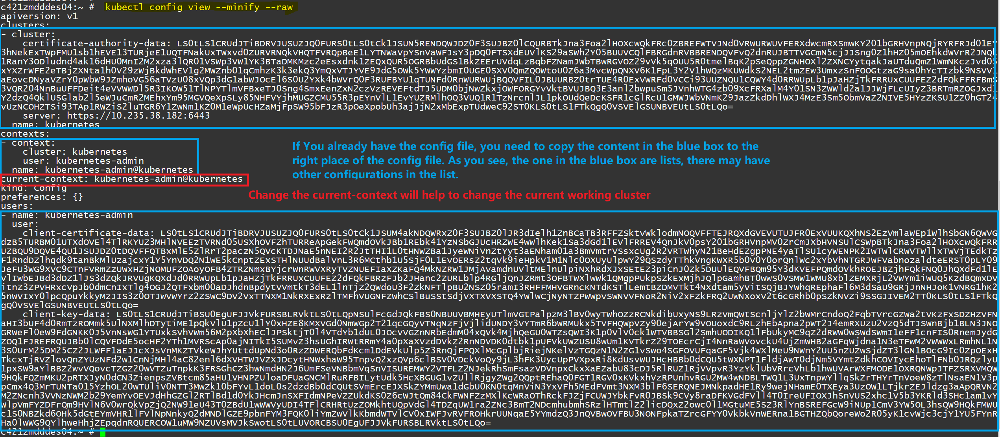

https://kubernetes.io/zh/docs/tasks/tools/install-kubectl/

https://k8slens.dev/

将 $HOME/.kube/config 追加到 KUBECONFIG 环境变量中

如果有 $HOME/.kube/config 文件，并且还未列在 KUBECONFIG 环境变量中， 那么现在将它追加到 KUBECONFIG 环境变量中。 例如：

Linux

export KUBECONFIG=$KUBECONFIG:$HOME/.kube/config

Windows Powershell

$Env:KUBECONFIG="$Env:KUBECONFIG;$HOME\.kube\config"

在配置练习目录中输入以下命令，查看当前 KUBECONFIG 环境变量中列举的所有文件合并后的配置信息：

kubectl config view

清理

将 KUBECONFIG 环境变量还原为原始值。 例如：

Linux

export KUBECONFIG=$KUBECONFIG_SAVED

Windows PowerShell

$Env:KUBECONFIG=$ENV:KUBECONFIG_SAVED

How control Kubernetes Clusters at local.

This document just tells how to do it, for more please refer to the official document.

Control the Local Kubernetes Cluster

1. First login the c421zmdddes04.int.thomsonreuters.com    master server

1. Run command to switch to "root". COMMAND: sudo su - root

1. Run command "kubectl config view --minify --raw" to get the kube config.

1. Copy the Whole output of last step and save it in C:\Users\u6034830\.kube\config, (well, you need to replace the u6034830 with your own name). TIPS: for this step, if you have already have a config file, you need to update the clusters/contexts/users by adding the content in the above instead of a simple replacement, which I have mentioned in the picture above.

1. If you have installed Lens, open the Lens, you can see, the cluster you added has been there, you can add the cluster into the Lens by select it.

