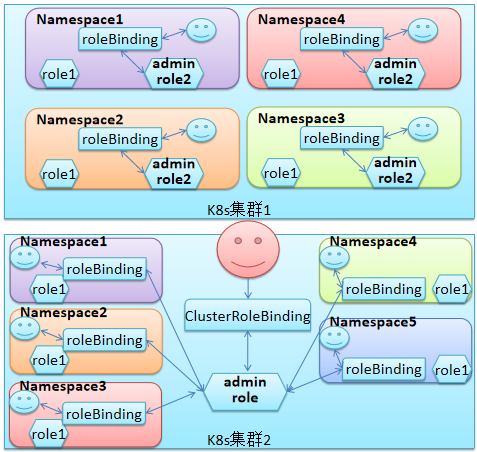

kubernetes认证，授权概括总结：

RBAC简明总结摘要：

API Server认证授权过程:

　　subject(主体)----->认证----->授权【action(可做什么)】------>准入控制【Object(能对那些资源对象做操作)】

认证：

　　有多种方式，比较常用的：token，tls，user/password

账号:

　　k8s中账号的概念不是我们理解的账号，它并不真的存在，它只是形式上存在。

　　它有两种账号: UserAccount(人使用的账号), ServiceAccount（Pod使用的账号）

授权：RBAC

　　k8s中的授权机制也有很多，但目前主流是RBAC(基于角色的访问控制)

　　RBAC中的核心概念:

　　    基于单个名称空间:

　　　　role, clusterrole, rolebinding

　　　整个集群级别:

　　　　clusterrole , clusterrolebinding

role, clusterrole : 是定义职务，权限，就像公司成立时，就事先制定好有CTO，CEO，总监，经理等职务

rolebinding, clusterrolebinding: 是将具体的账号(Subject) 和 某个role/clusterrole关联，即授权，或叫任职。

subject:

　　在k8s中，主体是个泛称，它表示k8s中的三类主体， user， group， serviceAccount

object：

　　Object这个词，含义比较丰富，在不同场景理解要有变化，在k8s中我们通过

　　# kubectl describe role myrole

　　Name: myrole

　　.............

　　Resources 　　 Non-Resource URLs 　　 Resource Names　　 Verbs

　　---------　　 　　 ----------------- 　　　　　　 -------------- 　　　　　　 -----

　　deployments　　　　 [] 　　　　　　　　　　 [] 　　　　　　 [get list watch]

　　pods　　　　　　　   [] 　　　　　　　　　　 [] 　　　　　　 [get list watch]

　　其中，Resources： 它可被称为Resource Group

　　　　Resource Names: 它可被称为 Resource，它表ResourceGroup中具体的单个资源

　　　　Non-Resource URLs： 它被称为非资源URL

　　而这三类Object是k8s系统基本的Object。

　　在yaml清单中，经常看到某种属性为<[]Object>它实际上是yaml语法中的字典 或叫映射(map)。这在报错时，经常看到。

　　它和这里说的Object可不是一回事。

action:

　　即具体能对Ojbect做什么，它有: get, list, watch, patch, delete, update, create 等。。。

RBAC核心概念公式

　　role/clusterrole = object + action

　　授权单个名称空间： rolebinding = subject + role/clusterRole

　　授权集群： clusterRoleBinding = subject + clusterRole

 

基本原理：

K8s中的认证和授权机制:

　　在K8s中我们操作任何资源都需要经历三个检查步骤：认证、授权 和 准入控制。

　　当然这些仅针对普通用户，k8s中默认clusteradmin是拥有最高权限的。

- 认证: 即用户要登陆k8s上操作资源，你必须提供合法的用户名和密码。

- 授权: 用户认证通过后，要查看该用户能操作什么资源，若其要操作的资源在其允许操作的资源范围内则通过。

- 准入控制: 用户要操作的资源，也许需要级联其它相关资源或级联了其它相关操作，那么这些级联的资源 或 级联的操作该用户是否有权限访问？这个就是有准入控制来检查的，若不允许访问级联资源，那么该资源也将无法访问。因为k8s是高度模块化设计，因此，这三种检查都允许用户自定义使用何种检测机制来进行访问控制。

认证:

- token: 此方式又称为预共享密钥方式的认证，即用户名和密码，如同MySQL中root要登陆，必须事先在user表中创建root密码.

- TLS: 此中方式为证书认证方式，此时K8s服务端 和 客户端要做双向证书认证，即客户端要认证服务端的证书是否为自己认可的CA所签发的证书，且证书中的subject信息CN(主机名)必须与服务端的主机名一致，等等；而服务器端也要认证客户端的证书，也要认可签发该证书的CA，以及证书中的信息也要匹配。以上是两种比较常用的认证方式，还有其它认证，可自行研究。需要注意的是 认证插件中只有一个认证通过，其它插件就无需再次认证了。

授权:

　　它也是模块化设计,它和认证一样都同时支持多个模块并存，但只要有一个模块认证通过，即通过了此关，可进入下一关进一步检查。

　　除了下面几种常用授权模块，我们也可在测试时，使用“总是允许” 或 “总是拒绝”来测试账号。

- RBAC：基于角色的访问控制机制，它只有允许授权，没有拒绝授权，因为默认是拒绝所有，我们仅需要定义允许该用户做什么即可。默认kubectl创建的K8s资源，都是默认启用强制RBAC的

- ABAC

- 基于Node的授权

- Web-huke的授权（这是一种通过Web的回调机制实现的授权)

准入控制：

　　这块主要是对认证授权通过后，后期对要操作的级联对象操作的检查，无需过多关注。

K8s上的用户账户:

　　k8s客户端(一般用:kubectl) ------>API Server

　　APIServer需要对客户端做认证，默认使用工具安装的K8s，会在用户家目录下创建一个认证配置文件 .kube/config 这里面保存了客户端访问API Server的密钥相关信息，这样当用kubectl访问k8s时，它就会自动读取该配置文件，向API Server发起认证，然后完成操作请求。

通常一个正常的API请求是包含: 用户认证信息，API请求的URL，共同组成。

1. 在K8s中用户账户为:

　　user: username + userID

　　group:

　　extra: 一些扩展信息

2. 在k8s中发起API请求，其内部实际是一个URL请求路径:

　　格式: http://API_Server_IP:6443/apis/apps/v1/namespaces/default/deployments/myapp-deploy/

　　一个普通的HTTP请求有:

　　　　get, post, put, delete

　　在K8s中实际用的还是基本的请求方法，但K8s将这些基本方法，又做了更细致的封装，于是就有以下API 请求命令:

　　　　get, list, create, update, patch, watch, proxy, redirect(重定向)， delete，deletecollection(级联删除)

　　一个API请求的URL拆解开后会包含以下信息，当然这些信息是不包含认证，仅是资源:

　　　　API Group

　　　　Namespace

　　　　Resource

　　　　Subresource

　　#再进一步理解授权：

　　　　若当前仅授权某用户可get资源，那么它就不能做create，update，delete等操作。

 

在k8s中访问资源，其实就是对URL发起增删改查的操作.

验证方式:

　　1. 在安装了kubectl的节点上，启动kubectl的代理. 【注: kubectl所在节点必须有认证配置信息,即 .kube/config】

　　　　kubectl proxy --port=8888

　　2. 接着就可以在本地使用HTTP访问8888来向运行在HTTPS协议上的API Server发起请求了

　　　　curl   http://localhost:8888/....

#注意：一定要先启动一个Proxy，因为，kubectl自身是有认证信息的，你每次执行kubectl命令时，它都会读取 ~/.kube/config 文件中的认证信息，所以你不需要输入任何认证信息，其实背后，是自动做了认证数据传递的。但你若直接使用curl 来请求APIServer，你就必须给 curl 制作一个API Server认可的认证信息，否则，curl是获取不到任何信息的！所以为了简单演示期间，可以使用上面的命令，先启动一个kubectl代理，然后，curl向它发起请求，这样curl就不需要提供任何认证信息，所有认证都将在kubectl proxy 和 API Server之间自动进行，但通常为了安全，通常仅将代理启动为监听在127.0.0.1上，然后在本地做 curl 请求。

kind(即:类型)：
它有三种类型：【每种类型都有一个固定的JSON表达方式,配置清单使用yaml写，但在提交时,会被自动转换为JSON格式】
    1. 对象类型，如: Pod, deployment, service,namespace等这些都称为对象，它们都是可在集群上创建出来的具体实体。
    2. 列表类型，在RESTful风格下它被称为集合,在K8s上称为列表(list)
    # curl  http://localhost:8888/api/v1/namespaces   #注意:namespaces其实就是一个集合,它会列出该对象集合中的所有子资源.
    # curl http://localhost:8888/api/v1/namespaces/default
            {
              "kind": "Namespace",
              "apiVersion": "v1",
              "metadata": {
                "name": "default",
                "selfLink": "/api/v1/namespaces/default",
                "uid": "2486e6a1-a8a6-11e9-8872-000c291a5fb6",
                "resourceVersion": "4",
                "creationTimestamp": "2019-07-17T15:18:34Z"
              },
              "spec": {
                "finalizers": [
                  "kubernetes"
                ]
              },
              "status": {
                "phase": "Active"
              }
            }
RESTful: REST 称为表针状态转移，通常用于承载对象数据状态的格式，也称为序列化的数据结构，一般用于流式化数据的格式有xml，yaml，json。
在K8s中，使用的都是Json来作为其输出输入数据的格式，即便我们编写的所有清单文件都是yaml格式，但kubectl在将清单信息提交给API Server 前还是会自动将其转换为Json格式再提交给API Server去处理。

curl  http://localhost:8888/apis/apps/v1/namespaces/kube-system/deployments/coredns
    注意:
        以上两个URL，一个是起始于api ，一个是起始于apis 
        区别: api 它是一个特殊链接,只有在核心v1群组中的对象才能使用。
              apis 它是一般API访问的入口固定格式名。

在K8s上有两类客户端需要访问API Server:
1. 远程的kubectl  ，我们经常在Master上使用kubectl来操作k8s，很容易以为，kubectl是只能在Master上运行的，
    其实不是，这样做仅仅是为了方便访问，才将kubectl安装在Master上，其实你可以在Windows上安装一个kubectl
    然后，将~/.kube/config 这个记录了认证信息的文件拷贝过去，就可以在Windows上使用了。因此它其实是个远程客户端.
    
2. Pod，如: coreDNS, K8s的仪表盘图型界面接口
   像kube-dns 它本身也是需要访问API Server的，因为当集群中新增资源对象时，它需要动态的生成一条该资源对象的A记录，
   所以它需要访问API Server来获取这个对象的信息，Dashboard也需要，因为它提供了一个Web界面，可让我们通过图像界面
   来管理操作k8s，如创建，删除Pod，创建删除名称空间等，所以它也需要访问API Server。

Pod中访问API Server通常是人去访问，或写的脚本去访问，所以这类访问使用的账号为：UserAccount
而Pod自身去连接API Server时，使用的账号是：ServiceAccount

集群中的Pod如何访问API Server？
kubectl  get  svc
kubectl  describe  svc  kubernetes  #可以看到API Server被映射为K8s上的Service了，Pod就是通过这个Service访问API Server的.
  注:
    由于API Server的访问必须要通过证书认证，它是双向认证，即客户端Pod要验证API Server的身份，API也要验证客户端的身份.
    所以对于Pod来说，它访问API Server时，使用的地址是Service的地址.假如是10.96.0.1，而真实API Server所在Node节点的IP为
    172.20.0.1。这就导致我们在创建API Server的证书时，必须要能够实现，Pod获取API Server的证书，去验证里面的主机名时，
    解析到的IP中必须有10.96.0.1，这就意味着DNS上要有两条A记录，一条解析为10.96.0.1，一条解析为172.20.0.1，这样Pod
    验证API Server才能通过，而kubectl这种外部客户端访问验证API Server解析的地址中有172.20.0.1,也能验证API身份通过。
    或者在证书中直接写两个IP地址，也是可以的。
    但是我们又该知道，Pod验证API Server是必须，但我们更需要的是API Server去验证客户端！
    Pod中的应用要访问API Server,它事先是不可能专门为API Server设计一个读取kubernetes认证信息的功能的，
    就如: nginx 它是不可能直接去读取kubernetes的认证信息，然后去访问API Server的！
    所以，访问API Server时的认证信息要由Pod本身来完成。
       kubectl  describe  pods  myapp-1        
            #可看到它默认挂载了一个存储卷,类型是secret的.它其实就是Pod访问APIServer
            时提供的认证信息，不过默认的token是普通用户,它仅能查看自己的相关信息.
       kubectl  get  secret   
            #使用它可看到,当前名称空间的默认token，即 default-token-...
            它就是当名称空间中所有Pod ，默认访问API Server时，提供的认证信息，当然你可加“ -n  名称空间名” 来查看
            其它名称空间中的默认token，而且其中一定有一个default-token-xxx..的标准k8s资源。
            
            #所以结合上面提到的两类账号，这里的default-token 其实就是第二类账号，即serviceAccount。
            #下面还有部分关于serviceAccount的说明，但为了让知识点集中，在这里继续深入
             kubectl  create  serviceaccount  admin
             此命名创建了一个admin的serviceAccount，即可通过该账号登录k8s，但此自定义账号并不能做任何事，因为
         这里仅是创建了认证信息，真正决定是否能操作k8s资源对象的是 授权 ，这点需要注意！！
            
    知道了这些，若我们需要运行一个Pod，这个Pod是用来管理其它Pod，Service，deployment等资源的，那么，我们就需要
    给该Pod提供一个secret，它里面要包含足够的权限的认证信息，这样该Pod就可以用于管理K8s上的资源了。

创建清单文件的快捷方式:
方式一:               
   kubectl  create  serviceaccount  mysa  -o  yaml  --dry-run  > mysa-serviceaccount.yaml
     注:
      只有支持create创建的K8s资源，都可以使用这种方式生成一个yaml格式的配置清单文件，我们就可以
      使用该清单模板来修改出我们需要的清单。
      --dry-run: 它是测试运行，并不真正执行。
方式二:
    kubectl  get  pods  myapp-1  -o  yaml   --exprots 

 

关于serviceaccount:
    Pod中访问API Server通常是人去访问，或写的脚本去访问，所以这类访问使用的账号为：UserAccount
    而Pod自身去连接API Server时，使用的账号是：ServiceAccount
    总结如下： 
            useraccount： 它是现实中的人使用的用户名和密码的认证账户。
            serviceaccount: 它是Pod中应用程序使用的认证账户和密码。
     另外，在创建serviceAccount时，也可以指定docker私有镜像服务器的认证信息，并且这样做会更加安全，
     可避免docker私钥信息泄露。
     先前在说secret时，它里面有一种类型叫 docker-registry，它可用来创建连接docker私有镜像服务器的信息，
     但这种方式定义的secret，需要在Pod定义中指定 imagePullSecrets来指明使用哪个secret，但这样很不安全.
     很容易泄漏私有镜像的认证信息。
     因此可将认证信息添加到serviceAccount中，这样在定义pod时，只需要指明使用那个SA就可以了，因为sa
     的访问权限，一般只有集群管理员才能访问。
     # kubectl describe sa mysa
            Name:                mysa
            ..........
            Image pull secrets:  <none>    
            。。。。。
            
        
创建一个serviceaccount的示例:
# kubectl  create  serviceaccount   mysa
 
# kubectl  get  sa
 
# kubectl  describe  sa  mysa       #可看到一个Tokens信息,以及它所挂载的secret。这是k8s自动生成的认证信息,
                                                使用该信息就可以登陆到K8s上，但是需要注意，登陆可以，但该账户是没有任何
                                                 权限的，因为权限是由授权来完成的。
    Name:                mysa
    Namespace:           default
    Labels:              <none>
    Annotations:         <none>
    Image pull secrets:  <none>
    Mountable secrets:   mysa-token-cwgpg
    Tokens:              mysa-token-cwgpg
    Events:              <none>

 # kubectl get secrets 
    NAME                     TYPE                                  DATA   AGE
    default-token-6xlcj      kubernetes.io/service-account-token   3      4d14h
    mysa-token-cwgpg         kubernetes.io/service-account-token   3      112s
 
 # kubectl   describe   secrets   mysa-token-cwgpg 
    Name:         mysa-token-cwgpg
    Namespace:    default
    ............
    Type:  kubernetes.io/service-account-token
    Data
    ====
    ca.crt:     1346 bytes
    namespace:  7 bytes
    token:      eyJhb.................72gU_ViYAHUZC-jmB8t7Xg
         
         
创建一个使用自定义ServiceAccount的Pod示例:
vim  pod-sa-demo.yaml
    apiVersion: v1
    kind: Pod
    metadata:
      name: pod-sa-demo
      namespace: default
      labels:
         app: myapp
         tier: frontend
      annotations:
         test.com/created-by: “cluster admin”
   spec:
      containers:
      -  name: myapp
         image: ikubernetes/myapp:v1
         ports:
         - name:  http
           containerPort:  80
      serviceAccountName: admin

kubectl  apply  -f  pod-sa-demo.yaml
kubectl  describe  pods  pod-sa-demo            #这里就可以看到，此Pod使用了自定义的admin认证信息。
            
任何需要访问API Server的应用都可认为是API Server的客户端，则这些客户端都需要被API Server所认证，
这些客户端包括: kubectl, kubelet, kube-proxy等等，那么它们要被API Server所认证，就必须提供用户认证信息，
那么它们是如何知道使用那些认证信息的？ 其实默认它们使用的都是 ~/.kube/config 中的认证信息，但是若我们
需要使用多个不同权限的账户来访问集群，是不是要不断的切换系统账户，才能使用不同的~/.kube/config ?
若有多个集群，是否也需要创建多个系统账户，在不同系统账户的家目录下创建不同的.kube/config ?
其实这是不必的，在K8s中，认证信息被称为kubeconfig, 它可使用下面命令查看:
# kubectl  config  view
apiVersion: v1
kind: Config
preferences: {}
clusters:                       #这是定义一个要管理的K8s集群，可定义多个,若需要同时管理多个集群时.
-  cluster:
      #这是服务器端的证书数据，用于客户端验证APIserver的.REDACTED:表示真实数据以隐藏.
      certificate-authority-data: REDACTED
      server: https://172.20.0.70:6443    #指明API Server的地址
   name: kubernetes                       #给这个集群信息取一个名字叫 kubernetes
users:      #这是定义一个登陆某K8s集群时，使用的用户账户信息，若需要管理多个集群,就需要定义多个.
            #当然一个集群也可有多个不同权限的账号.
-   name: kubernetes-admin                #定义这个用户的用户名叫 kubernetes-admin
    user:
        client-certificate-data: REDACTED #定义此用户的证书数据
        client-key-data:REDACTED          #定义此用户的私钥数据
contexts:   #这是定义一个访问集群的上下文信息，即那个users + 那个clusters = 登陆该cluster，它也可定义多个.
-    context:
        cluster: kubernetes               #这里指明要登陆kubernetes这个集群，需要使用
        user: kubernetes-admin            # kubernetes-admin这个用户认证数据。
    name: kubernetes-admin@kubernetes     #为这个上下文定义一个引用名字
current-context: kubernetes-admin@kubernetes  #指明当前使用kubernetes-admin@kubernetes这个上下文来登陆集群。
       
      
创建一个自定义用户来登陆API Server:
 cd  /etc/kubernetes/ssl      #这是kubeasz部署后,CA证书默认存放位置。
 cp  admin-csr.json   test-csr.json

vim  test-csr.json
{
  "CN": "test",
  "key": {
    "algo": "rsa",
    "size": 2048
  },
  "names": [
    {
      "C": "CN",
      "ST": "HangZhou",
      "L": "XS"
    }
  ]
}  

# grep -A1 'profile' ca-config.json
　　"profiles": {
　　　　"kubernetes": {

# cfssl gencert -ca=ca.pem -ca-key=ca-key.pem -config=ca-config.json -profile=kubernetes test-csr.json | cfssljson -bare test

查看创建的证书:
    openssl  x509  -in  test.pem  -text  -noout   #-text:使用文本输出， -noout: 不适应base64编码.
        注:
            Issuer: 显示当前证书是由谁来签署的.
            Subject: 中显示的CN是连入K8s集群的用户账户名
            Validity: 这是显示当前证书的有效期限.

创建k8s的认证信息(kubeconfig):
    kubectl  config  set-credentials  testuser  --client-certificate=./test.crt  \
                --client-key=./test.key  --embed-certs=true
      注:
        --embed-certs: ture:表示将证书和私钥包含到k8s中,并且隐藏不显示具体数据.
        若需要创建token认证信息:
            kubectl  config  set-credentials  testuser  --token=预共享的密钥 
        若需要创建基于用户名和密码的认证信息:
            kubectl  config  set-credentials  testuser  --username=test  --password=PU@&@Xs
        若要基于外部认证信息需要使用:
            --auth-provider= 和 --auth-provider-arg=.. 等信息。

查看kubeconfig的信息:
 kubectl  config   view     #可以看到刚创建的testuser的相关信息.
         
接着让test可以访问kubernetes集群:
 kubectl  config  set-context  test@kubernetes  --cluster=kubernetes  --user=test

使用自己定义的用户做为当前连接K8s集群的用户:
 kubectl  config  use-context  test@kubernetes
 
 kubectl  get  pods   #将看到权限被拒绝的错误
 
 切换回管理员权限:
    kubectl  config  use-context  ...

创建一个新集群配置信息:
   kubectl  config  set-cluster  mycluster  --kubeconfig=/tmp/test.conf  --server="https://1.1.1.2:6443"  \
            --certificate-authority=/etc/kubernetes/pki/ca.crt  --embed-certs=true

查看:
    kubectl  config  view  --kubeconfig=/tmp/test.conf

 

K8s的授权插件：

　　Node， ABAC， RBAC， Webhook

　　下面主要以RBAC(Role-based Access Controller)来介绍。

RBAC： 基于角色的授权认证

   重要概念:

　　Role（角色）：它通过内生的一种叫“角色”的概念，来完成对权限的授予和分配等，所以从此角度讲 角色 是一个组织或任务中的职位或位置，它通常代表一种权力或资格。

　　Permission（许可）：其实就是权限，而权限是多种Operations(操作)的集合，而Operations是附加在对象(Object)上的具体Action(动作)，每一个Action就是一个Operation，

多个Operation就是Operations，即权限。

RBAC授权的过程：

　　首先，K8s中访问资源其实就是发起HTTP访问, HTTP访问的通用URL格式为：

　　http://API_SERVER：PORT/<API_GROUP>/<API_VERSION>/namespaces/<NAMESPACE_NAME>/<KIND>[/OBJECT_ID]

　　而授权是一个组合userAccount或serviceAccount ，role 和 permission 的过程。

　　第一步要先组合Permission，因为Permission是有 Action组成的，而Action=Operation+Object。

　　Operation(操作): 它是GET，PUT，POST，DELETE，PATCH等，当然我这里列出的HTTP的原始方法，在K8s中它们是CREATE，GET，PATCH，DELETE，PROXY，WATCH，UPDATE等

　　Object（对象）： 在K8s中，一切皆对象，它的对象分为三类：

　　　　1. 一般对象：基本上涵盖了绝大部分资源主体。

　　　　2. 对象列表：就如：namespaceList

　　　　3. 虚拟对象（或叫 非对象资源）：这部分通常是一些URL，很少。

　　知道了Operation和Object，那么Action就是它俩的组合。

　　比如：我定义一个Action是 GET + /api/v1/namespaces/default/pod/myapp-0 ,这就表示，我定义了一个只能列出默认名称空间下pod类型资源中myapp-0的动作。

　　　　类似这种Action，我可以定义很多个，然后将其打包成Permissions，这样我就有了一个授权。

　　第二步 就是要定义一个role

　　　　Role（角色）：实际上，role可理解为一组Permissions的组合，即 我将一组权限打包后，取一个名字。

　　　　　　　　　　这就类似于公司中的职位一样，技术部主管，就相当于一个Role，他的Permission就是能做什么，他能管理职员，他能管理部门内资源配置等。

　　第三步 就是将user 和 role关联绑定，称为rolebinding

　　　　这就相当于公司的中职位授予，如：A能力很强，公司授予他，技术部总监，另外还兼职公司副CTO等。

  用上面两个集群来说明Role，RoleBinding 和 clusterRole，clusterRoleBinding

　集群1：

　　　每个名称空间(Namespace)中，为了定义一个此名称空间的管理员，不得不每个名称空间都创建相同的Admin Role，然后使用roleBinding将AdminRole关联到用户上，来让指定用户成为此名称空间中的管理员。这样做很显然，非常繁琐，若名称空间很多，就要在这些名称空间中都要做相同操作，很麻烦。

　集群2：

　　在整个k8s集群级别创建一个admin role，然后，使用roleBinding来引用它，并将它和自己名称空间中的用户关联，这样该用户就成功的拥有了对当前名称空间的管理员权限。

这样就很省事了。只需要创建一个集群级别的admin role即可。为啥这样做可以？ 因为所有名称空间里的管理员操作基本都一样，都是GET pod，update pod等等这些操作，因此将这些相同操作都定义为集群role，这样就可让所有名称空间都可以引用它了，它就相当于一个模板了。但具体在自己的名称空间中时，它就相当于被具体化为本名称空间中的admin role了。

若现在还想创建一个用户拥有管理所有名称空间中的所有资源，就需要使用ClusterRoleBinding了，它能将ClusterRole具体化为集群级别的role，让授予此role的用户具有集群管理员的权限。

总的来说：

　　roleBinding可绑定名称空间内部的role，也可绑定ClusterRole，但roleBinding绑定后，具体化的role是具体化成本名称空间的role。

　　clusterRoleBinding：它仅可绑定ClusterRole，它具体化的role，就可访问整个集群中所有的资源。

创建Role：
kubectl  create  role   myrole   --verb=get,list,watch   --resource=pods  --dry-run  -o  yaml   >  role-demo.yaml

#修改role-demo.yaml 
vim  role-demo.yaml
    apiVersion: rbac.authorization.k8s.io/v1
    kind: Role
    metadata:
      name: myrole
      namespace: default
    rules:
    - apiGroups:
      - ""
      resources:
      - pods
      - deployments
      verbs:
      - get
      - list
      - watch

#  kubectl  apply  -f   role-demo.yaml
        
# kubectl describe role myrole 
        Name:         myrole
        .............
          Resources     Non-Resource URLs    Resource Names     Verbs
          ---------    -----------------    --------------      -----
          deployments          []              []           [get list watch]
          pods                 []              []           [get list watch]
    
 #这里要注意：
 #     若不定义Resource Names，则表示对Resources这个一类资源都可操作Verbs所指定的动作。
 #     Non-Resource URLs：这就是前面提到的非资源对象,或称为虚拟URL对象, 它们是k8s中所需要的特殊动作。
             
             
创建roleBinding
  kubectl create rolebinding test-read-pods --role=myrole --user=test --dry-run -o yaml > rolebinding-demo.yaml

  vim  rolebinding-demo.yaml
    apiVersion: rbac.authorization.k8s.io/v1
    kind: RoleBinding
    metadata:
      name: test-read-pod
      namespace: default
    roleRef:           #指定要引用的role，在那个API组中，它的类型是role，还是clusterRole，还有要引用role的具体名称。
      apiGroup: rbac.authorization.k8s.io
      kind: Role
      name: myrole
    subjects:          #注意：subjects是对k8s中两种访问资源的账号的统称，这两种账号是 userAccount 和 serviceAccount
    - apiGroup: rbac.authorization.k8s.io
      kind: User       #此处的kind并非真实的k8s资源类型,仅用于标识, 它只能是 user， group，serviceAccount
      name: test                        
      namespace: default  #因为test用户可能在多个名称空间都有，因此最好加上namespace做限定。
    
#kubectl  apply  -f  rolebinding-demo.yaml

#kubectl  describe  rolebinding   test-read-pod
  ....................
    Role:
      Kind:  Role
      Name:  myrole
    Subjects:
      Kind  Name  Namespace
      ----  ----  ---------
      User  test  

测试切换到test用户，查看权限是否生效
 kubectl config  use-context  test@kubernetes
 
 #但测试发现，test用户可以列出所有名称空间的所有资源，这个我很是不解？
 # 此问题：注解部分在: k8s集群认证 > admin权限问题  但其中原理还是不明。
     
创建clusterRole:
    kubectl  create  clusterrole   clusterRole-manger-pods   \
            --verb=get,list,watch,create,update,delete   \
            --resource=pods,rs.extensions  \
             --dry-run  -o  yaml  > clusterrole-pod-manger.yaml

vim  clusterrole-pods-manger.yaml 
apiVersion: rbac.authorization.k8s.io/v1
kind: ClusterRole
metadata:
  creationTimestamp: null
  name: clusterRole-manger-pods
rules:
- apiGroups:     #注意: pods就是主API，它没有子API,因此其api组为空
  - ""
  resources:
  - pods
  verbs:
  - get
  - list
  - watch
  - delete
  - create
  - update
- apiGroups:     #replicaSet控制器有两个子API组，一个是apps，一个是extensions，所以这里必须指定，你要授予那个子API组权限.
  - extensions   #否则，绑定此role的用户仅能访问replicSet主组的资源，但replicaSet其实没有主组，因此实际上就没有给绑定用户访问replicaSet的权限.
  resources:
  - replicasets
  verbs:
  - get
  - list
  - watch
  - delete
  - create
  - update

#创建此ClusterRole
  kubectl  apply  -f  clusterrole-pods-manger.yaml
  
#使用rolebinding来绑定此clusterRole
   kubectl  create  rolebinding   rbind-clusterRoleMangerPods   \
            --clusterrole=clusterRole-manger-pods  --user=test  \
            --dry-run -o yaml  >rbind-clusterRoleMangerPods.yaml 
   
   
# vim   rbind-clusterRoleMangerPods.yaml 
    apiVersion: rbac.authorization.k8s.io/v1
    kind: RoleBinding
    metadata:
      name: rbind-clusterRoleMangerPods
      namespace:  default               #这里指定将该rolebinding创建在default 名称空间中
    roleRef:
      apiGroup: rbac.authorization.k8s.io
      kind: ClusterRole
      name: clusterRole-manger-pods
    subjects:
    - apiGroup: rbac.authorization.k8s.io
      kind: User
      name: test

#创建此rolebinding
  kubectl  apply  -f   rbind-clusterRoleMangerPods.yaml
  
#测试此clusterRole
  kubectl  config  use-context   test@kubernetes

#测试是否能获取pod 和 replicasets.extensions 的资源
  kubectl  get   pods
  kubectl  get   rs
          
#创建clusterRoleBinding
 kubectl  create  clusterrolebinding   cbind-crolePodManger   \
             --clusterrole=clusterRole-manger-pods  --user=test  \
             --dry-run  -o  yaml  > cbind-demo.yaml
 
 vim  cbind-demo.yaml 
    apiVersion: rbac.authorization.k8s.io/v1beta1
    kind: ClusterRoleBinding
    metadata:
      name: cbind-crolePodManger
    roleRef:
      apiGroup: rbac.authorization.k8s.io
      kind: ClusterRole
      name: clusterRole-manger-pods
    subjects:
    - apiGroup: rbac.authorization.k8s.io
      kind: User
      name: test

#切换用户
  kubectl  config  use-context   test@kubernetes
  
#测试是否能看不同名称空间的资源.
    kubectl  get  pod  -n  kube-system
    kubectl  get  rs  -n  ingress-nginx

