Kubernetes容器集群管理环境 - Prometheus监控篇

 

一、Prometheus介绍

之前已经详细介绍了Kubernetes集群部署篇，今天这里重点说下Kubernetes监控方案-Prometheus+Grafana。Prometheus（普罗米修斯）是一个开源系统监控和警报工具，最初是在SoundCloud建立的。自2012年成立以来，许多公司和组织都采用了普罗米修斯，该项目拥有一个非常活跃的开发者和用户社区。它现在是一个独立的开放源码项目，并且独立于任何公司，为了强调该点并澄清项目的治理结构，Prometheus在2016年加入了云计算基金会，成为继Kubernetes之后的第二个托管项目。 Prometheus是用来收集数据的,同时本身也提供强大的查询能力,结合Grafana即可以监控并展示出想要的数据。

Prometheus的主要特征

- 多维度数据模型

- 灵活的查询语言 (PromQL)

- 不依赖分布式存储，单个服务器节点是自主的

- 以HTTP方式，通过pull模型拉去时间序列数据

- 也通过中间网关支持push模型

- 通过服务发现或者静态配置，来发现目标服务对象

- 支持多种多样的图表和界面展示，grafana也支持它

Prometheus组件

Prometheus生态包括了很多组件，它们中的一些是可选的：

- 主服务Prometheus Server负责抓取和存储时间序列数据

- 客户库负责检测应用程序代码

- 支持短生命周期的PUSH网关

- 基于Rails/SQL仪表盘构建器的GUI

- 多种导出工具，可以支持Prometheus存储数据转化为HAProxy、StatsD、Graphite等工具所需要的数据存储格式

- 警告管理器 (AlertManaager)

- 命令行查询工具

- 其他各种支撑工具

Prometheus监控Kubernetes集群过程中，通常情况为:

- 使用metric-server收集数据给k8s集群内使用，如kubectl,hpa,scheduler等

- 使用prometheus-operator部署prometheus，存储监控数据

- 使用kube-state-metrics收集k8s集群内资源对象数据

- 使用node_exporter收集集群中各节点的数据

- 使用prometheus收集apiserver，scheduler，controller-manager，kubelet组件数据

- 使用alertmanager实现监控报警

- 使用grafana实现数据可视化

Prometheus架构

下面这张图说明了Prometheus的整体架构，以及生态中的一些组件作用

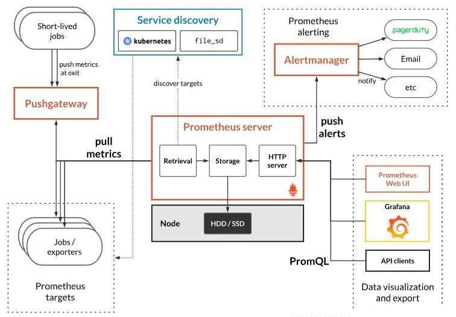

Prometheus整体流程比较简单，Prometheus 直接接收或者通过中间的 Pushgateway 网关被动获取指标数据，在本地存储所有的获取的指标数据，并对这些数据进行一些规则整理，用来生成一些聚合数据或者报警信息，Grafana 或者其他工具用来可视化这些数据。

Prometheus服务可以直接通过目标拉取数据，或者间接地通过中间网关拉取数据。它在本地存储抓取的所有数据，并通过一定规则进行清理和整理数据，并把得到的结果存储到新的时间序列中，PromQL和其他API可视化展示收集的数据在K8s中，关于集群的资源有metrics度量值的概念，有各种不同的exporter可以通过api接口对外提供各种度量值的及时数据，prometheus在与k8s融合工作的过程中就是通过与这些提供metric值的exporter进行交互，获取数据，整合数据，展示数据，触发告警的过程。

1）Prometheus获取metrics

- 对短暂生命周期的任务，采取拉的形式获取metrics (不常见)

- 对于exporter提供的metrics，采取拉的方式获取metrics(通常方式),对接的exporter常见的有：kube-apiserver 、cadvisor、node-exporter，也可根据应用类型部署相应的exporter，获取该应用的状态信息，目前支持的应用有：nginx/haproxy/mysql/redis/memcache等。

2）Prometheus数据汇总及按需获取

可以按照官方定义的expr表达式格式，以及PromQL语法对相应的指标进程过滤，数据展示及图形展示。不过自带的webui较为简陋，但prometheus同时提供获取数据的api，grafana可通过api获取prometheus数据源，来绘制更精细的图形效果用以展示。

expr书写格式及语法参考官方文档：https://prometheus.io/docs/prometheus/latest/querying/basics/

3）Prometheus告警推送

prometheus支持多种告警媒介，对满足条件的告警自动触发告警，并可对告警的发送规则进行定制，例如重复间隔、路由等，可以实现非常灵活的告警触发。

Prometheus适用场景

Prometheus在记录纯数字时间序列方面表现非常好。它既适用于面向服务器等硬件指标的监控，也适用于高动态的面向服务架构的监控。对于现在流行的微服务，Prometheus的多维度数据收集和数据筛选查询语言也是非常的强大。Prometheus是为服务的可靠性而设计的，当服务出现故障时，它可以使你快速定位和诊断问题。它的搭建过程对硬件和服务没有很强的依赖关系。

Prometheus不适用场景

Prometheus，它的价值在于可靠性，甚至在很恶劣的环境下，你都可以随时访问它和查看系统服务各种指标的统计信息。 如果你对统计数据需要100%的精确，它并不适用，例如：它不适用于实时计费系统

二、Prometheus+Grafana部署

依据之前部署好的Kubernetes容器集群管理环境为基础，继续部署Prometheus+Grafana。如果不部署metrics-service的话，则要部署kube-state-metrics，它专门监控的是k8s资源对象，如pod，deployment，daemonset等，并且它会被Prometheus以endpoint方式自动识别出来。记录如下: (k8s-prometheus-grafana.git打包后下载地址：https://pan.baidu.com/s/1nb-QCOc7lgmyJaWwPRBjPg  提取密码: bh2e）

由于Zabbix不适用于容器环境下的指标采集和监控告警，为此使用了与K8s原生的监控工具Prometheus；Prometheus可方便地识别K8s中相关指标，并以极高的效率和便捷的配置实现了指标采集和监控告警。具体工作:

1）在K8s集群中部署Prometheus，以K8s本身的特性实现了Prometheus的高可用；

2）优化Prometheus配置，实现了配置信息的热加载，在更新配置时无需重启进程；

3）配置了Prometheus抓取规则，以实现对apiserver/etcd/controller-manager/scheduler/kubelet/kube-proxy以及K8s集群内运行中容器的信息采集；

4）配置了Prometheus及告警规则，以实现对采集到的信息进行计算和告警；

1.  Prometheus和Grafana部署

|   |   |
| - | - |
| 1 2 3 4 5 6 7 8 9 10 11 12 13 14 15 16 17 18 19 20 21 22 23 24 25 26 27 28 29 30 31 32 33 34 35 36 37 38 39 40 41 42 43 44 45 46 47 48 49 50 51 52 53 54 55 56 57 58 59 60 61 62 63 64 65 66 67 68 69 70 71 72 73 74 75 76 77 78 79 80 81 82 83 84 85 86 87 88 89 90 91 92 93 94 95 96 97 98 99 100 101 102 103 104 105 106 107 108 109 110 111 112 113 114 115 116 117 118 119 120 121 122 123 124 125 126 127 128 129 130 131 132 133 134 135 136 137 138 139 140 141 142 143 144 145 146 147 148 149 150 151 152 | 1）在k8s-master01节点上进行安装部署。安装git，并下载相关yaml文件 [root@k8s-master01 ~]\# cd /opt/k8s/work/ [root@k8s-master01 work]\# git clone https://github.com/redhatxl/k8s-prometheus-grafana.git      2）在所有的node节点下载监控所需镜像 [root@k8s-master01 work]\# source /opt/k8s/bin/environment.sh [root@k8s-master01 work]\# for node\_node\_ip in ${NODE\_NODE\_IPS[@]}   do     echo "&gt;&gt;&gt; ${node\_node\_ip}"     ssh root@${node\_node\_ip} "docker pull prom/node-exporter"   done      [root@k8s-master01 work]\# for node\_node\_ip in ${NODE\_NODE\_IPS[@]}   do     echo "&gt;&gt;&gt; ${node\_node\_ip}"     ssh root@${node\_node\_ip} "docker pull prom/prometheus:v2.0.0"   done      [root@k8s-master01 work]\# for node\_node\_ip in ${NODE\_NODE\_IPS[@]}   do     echo "&gt;&gt;&gt; ${node\_node\_ip}"     ssh root@${node\_node\_ip} "docker pull grafana/grafana:4.2.0"   done      3）采用daemonset方式部署node-exporter组件 [root@k8s-master01 work]\# cd k8s-prometheus-grafana/ [root@k8s-master01 k8s-prometheus-grafana]\# ls grafana  node-exporter.yaml  prometheus  README.md    这里需要修改下默认的node-exporter.yaml文件内存，修改后的node-exporter.yaml内容如下： [root@k8s-master01 k8s-prometheus-grafana]\# cat node-exporter.yaml --- apiVersion: extensions/v1beta1 kind: DaemonSet metadata:   name: node-exporter   namespace: kube-system   labels:     k8s-app: node-exporter spec:   template:     metadata:       labels:         k8s-app: node-exporter     spec:       containers:       - image: prom/node-exporter         name: node-exporter         ports:         - containerPort: 9100           protocol: TCP           name: http       tolerations:       hostNetwork: true       hostPID: true       hostIPC: true       restartPolicy: Always    --- apiVersion: v1 kind: Service metadata:   annotations:     prometheus.io/scrape: 'true'     prometheus.io/app-metrics: 'true'     prometheus.io/app-metrics-path: '/metrics'   labels:     k8s-app: node-exporter   name: node-exporter   namespace: kube-system spec:   ports:   - name: http     port: 9100     nodePort: 31672     protocol: TCP   type: NodePort   selector:     k8s-app: node-exporter    [root@k8s-master01 k8s-prometheus-grafana]\# kubectl create -f  node-exporter.yaml      稍等一会儿，查看node-exporter部署是否成功了 [root@k8s-master01 k8s-prometheus-grafana]\# kubectl get pods -n kube-system|grep "node-exporter\*" node-exporter-9h2z6                     1/1     Running   0          117s node-exporter-sk4g4                     1/1     Running   0          117s node-exporter-stlwb                     1/1     Running   0          117s      4）部署prometheus组件 [root@k8s-master01 k8s-prometheus-grafana]\# cd prometheus/      4.1）部署rbac文件 [root@k8s-master01 prometheus]\# kubectl create -f rbac-setup.yaml      4.2）以configmap的形式管理prometheus组件的配置文件 [root@k8s-master01 prometheus]\# kubectl create -f configmap.yaml      4.3）Prometheus deployment 文件 [root@k8s-master01 prometheus]\# kubectl create -f prometheus.deploy.yaml      4.4）Prometheus service文件 [root@k8s-master01 prometheus]\# kubectl create -f prometheus.svc.yaml      5）部署grafana组件 [root@k8s-master01 prometheus]\# cd ../grafana/ [root@k8s-master01 grafana]\# ll total 12 -rw-r--r-- 1 root root 1449 Jul  8 17:19 grafana-deploy.yaml -rw-r--r-- 1 root root  256 Jul  8 17:19 grafana-ing.yaml -rw-r--r-- 1 root root  225 Jul  8 17:19 grafana-svc.yaml      5.1）grafana deployment配置文件 [root@k8s-master01 grafana]\# kubectl create -f grafana-deploy.yaml      5.2）grafana service配置文件 [root@k8s-master01 grafana]\# kubectl create -f grafana-svc.yaml      5.3）grafana ingress配置文件 [root@k8s-master01 grafana]\# kubectl create -f grafana-ing.yaml      6）web访问界面配置 [root@k8s-master01 k8s-prometheus-grafana]\# kubectl get pods -n kube-system NAME                                    READY   STATUS    RESTARTS   AGE coredns-5b969f4c88-pd5js                1/1     Running   0          30d grafana-core-5f7c6c786b-x8prc           1/1     Running   0          17d kube-state-metrics-5dd55c764d-nnsdv     2/2     Running   0          23d kubernetes-dashboard-7976c5cb9c-4jpzb   1/1     Running   0          16d metrics-server-54997795d9-rczmc         1/1     Running   0          24d node-exporter-9h2z6                     1/1     Running   0          74s node-exporter-sk4g4                     1/1     Running   0          74s node-exporter-stlwb                     1/1     Running   0          74s prometheus-8697656888-2vwbw             1/1     Running   0          10d      [root@k8s-master01 k8s-prometheus-grafana]\# kubectl get svc -n kube-system NAME                            TYPE        CLUSTER-IP       EXTERNAL-IP   PORT(S)                         AGE grafana                         NodePort    10.254.95.120    &lt;none&gt;        3000:31821/TCP                  17d kube-dns                        ClusterIP   10.254.0.2       &lt;none&gt;        53/UDP,53/TCP,9153/TCP          30d kube-state-metrics              NodePort    10.254.228.212   &lt;none&gt;        8080:30978/TCP,8081:30872/TCP   23d kubernetes-dashboard-external   NodePort    10.254.223.104   &lt;none&gt;        9090:30090/TCP                  16d metrics-server                  ClusterIP   10.254.135.197   &lt;none&gt;        443/TCP                         24d node-exporter                   NodePort    10.254.72.22     &lt;none&gt;        9100:31672/TCP                  2m11s prometheus                      NodePort    10.254.241.170   &lt;none&gt;        9090:30003/TCP                  10d      7）查看node-exporter （http://node-ip:31672/） http://172.16.60.244:31672/ http://172.16.60.245:31672/ http://172.16.60.246:31672/     8）prometheus对应的nodeport端口为30003，通过访问http://node-ip:30003/targets 可以看到prometheus已经成功连接上了k8s的apiserver http://172.16.60.244:30003/targets http://172.16.60.245:30003/targets http://172.16.60.246:30003/targets |

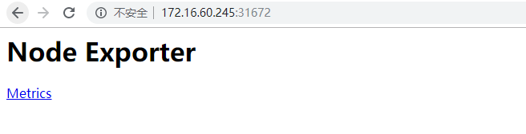

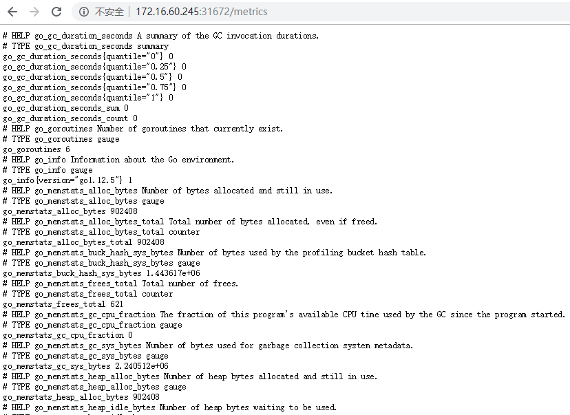

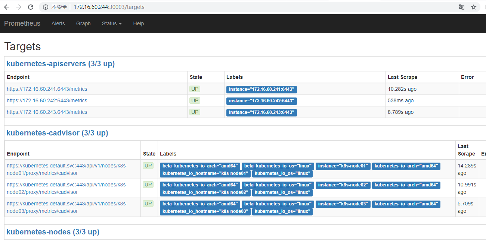

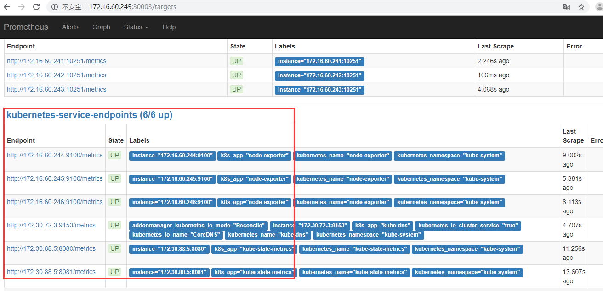

2.  Prometheus配置K8s组件监控项

如上部署prometheus之后，默认的监控项是kubernetes-apiservers、kubernetes-nodes、kubernetes-service-endpoints(CoreDNS、kube-state-metric)等，这是都是在prometheus/configmap.yaml文件中配置的，而像其他组件kubernetes-schedule、kubernetes-control-manager、kubernetes-kubelet、kubernetes-kube-proxy、etcd就需要手动添加了，如下： 就需要手动添加了，如下：

|   |   |
| - | - |
| 1 2 3 4 5 6 7 8 9 10 11 12 13 14 15 16 17 18 19 20 21 22 23 24 25 26 27 28 29 30 31 32 33 34 35 36 37 38 39 40 41 42 43 44 45 46 47 48 49 50 51 52 53 54 55 56 57 58 59 60 61 62 63 64 65 66 67 68 69 70 71 72 73 74 75 76 77 78 79 80 81 82 83 84 85 86 87 88 89 90 91 92 93 94 95 96 97 98 99 100 101 102 103 104 105 106 107 108 109 110 111 112 113 114 115 116 117 118 119 120 121 122 123 124 125 126 127 128 129 130 131 132 133 134 135 136 137 138 139 140 141 142 143 144 145 146 147 148 149 150 151 152 153 154 155 156 157 158 159 160 161 162 163 164 165 166 167 168 169 170 171 172 173 174 175 176 177 178 179 180 181 182 183 184 185 186 187 188 189 190 191 | 1）在prometheus里手动添加kubernetes-schedule、kubernetes-control-manager、kubernetes-kubelet、kubernetes-kube-proxy组件的连接配置，非证书连接！ 以下组件的配置，还不需要使用证书连接，直接ip+port就可以，默认路径就是/metrics 确保以下四个组件的metrcis数据可以通过下面方式正常获取。 schedule的metrics接口 （Scheduler服务端口默认为10251） \# curl 172.16.60.241:10251/metrics \# curl 172.16.60.242:10251/metrics \# curl 172.16.60.243:10251/metrics control-manager的metrics接口（ControllerManager服务端口默认为10252） \# curl 172.16.60.241:10252/metrics \# curl 172.16.60.242:10252/metrics \# curl 172.16.60.243:10252/metrics kubelet的metrics接口 （kubelet服务只读端口，没有任何认证(0：disable)，默认为10255，该功能只要配置端口，就必定开启服务） 而10250是kubelet的https端口，10248是healthz http服务端口。 \# curl 172.16.60.244:10255/metrics \# curl 172.16.60.245:10255/metrics \# curl 172.16.60.246:10255/metrics kube-proxy的metrics接口 （kube-proxy服务端口默认为10249） \# curl 172.16.60.244:10249/metrics \# curl 172.16.60.245:10249/metrics \# curl 172.16.60.246:10249/metrics    所以prometheus连接以上四个组件的配置为： [root@k8s-master01 ~]\# cd /opt/k8s/work/k8s-prometheus-grafana/prometheus/ [root@k8s-master01 prometheus]\# vim configmap.yaml ......... .........     - job\_name: 'kubernetes-schedule'          \#任务名       scrape\_interval: 5s                   \#本任务的抓取间隔，覆盖全局配置       static\_configs:         - targets: ['172.16.60.241:10251','172.16.60.242:10251','172.16.60.243:10251']          - job\_name: 'kubernetes-control-manager'       scrape\_interval: 5s       static\_configs:         - targets: ['172.16.60.241:10252','172.16.60.242:10252','172.16.60.243:10252']          - job\_name: 'kubernetes-kubelet'       scrape\_interval: 5s       static\_configs:         - targets: ['172.16.60.244:10255','172.16.60.245:10255','172.16.60.246:10255']          - job\_name: 'kubernetes-kube-proxy'       scrape\_interval: 5s       static\_configs:         - targets: ['172.16.60.244:10249','172.16.60.245:10249','172.16.60.246:10249']    接着更新config配置： [root@k8s-master01 prometheus]\# kubectl apply -f configmap.yaml    然后重启pod，重启的方式是：直接删除pod 这种方式只是在当前被调度的node节点上删除了pod，然后schedule再将pod重新调度到其他的node节点上。即删除pod后，pod会自动被创建~    [root@k8s-master01 prometheus]\# kubectl get pods -n kube-system|grep "prometheus" prometheus-6b96dcbd87-lwwv7             1/1     Running   0          44h    [root@k8s-master01 prometheus]\# kubectl delete pods/prometheus-6b96dcbd87-lwwv7 -n kube-system pod "prometheus-6b96dcbd87-lwwv7" deleted    删除后，再次查看，发现pod会自动创建，并可能被调度到其他node节点上了。可以理解为pod重启 [root@k8s-master01 prometheus]\# kubectl get pods -n kube-system|grep "prometheus"            prometheus-6b96dcbd87-c2n59             1/1     Running   0          22s    2）在prometheus里手动添加etcd组件的连接配置，使用证书连接！ 在prometheus配置文件configmap.yaml中，可以看出默认对kubernetes-apiservers的连接配置是将证书和token文件映射到了容器内部。 而对接etcd的配置，也是将etcd的证书映射到容器内部，方式如下：    首先创建secret，将需要的etcd证书保存到secret对象etcd-certs中： [root@k8s-master01 prometheus]\# kubectl -n kube-system create secret generic etcd-certs --from-file=/etc/etcd/cert/etcd-key.pem                                 --from-file=/etc/etcd/cert/etcd.pem --from-file=/etc/kubernetes/cert/ca.pem   ================================================================================================================================== 这里贴下之前线上k8s集群部署时用到的secret对象的创建命令 \# kubectl -n kube-system create secret generic cmp-prometheus-certs  --from-file=/opt/cmp/ssl/etcd/healthcheck-client.pem   --from-file=/opt/cmp/ssl/etcd/healthcheck-client-key.pem --from-file=/opt/cmp/ssl/etcd/ca.pem \# kubectl -n kube-system create secret generic cmp-prometheus-kubernetes-ca  --from-file=/opt/cmp/ssl/kubernetes-ca/admin.pem   --from-file=/opt/cmp/ssl/kubernetes-ca/admin-key.pem --from-file=/opt/cmp/ssl/kubernetes-ca/ca.pem ==================================================================================================================================   查看创建的secret [root@k8s-master01 prometheus]\# kubectl get secret -n kube-system|grep etcd-certs etcd-certs                                       Opaque                                3      82s    [root@k8s-master01 prometheus]\# kubectl describe secret/etcd-certs -n kube-system Name:         etcd-certs Namespace:    kube-system Labels:       &lt;none&gt; Annotations:  &lt;none&gt;    Type:  Opaque    Data ==== ca.pem:        1367 bytes etcd-key.pem:  1675 bytes etcd.pem:      1444 bytes    修改prometheus.deploy.yaml添加secrets，即将创建的secret对象"etcd-certs"通过volumes挂载方式，添加到prometheus.deploy.yaml部署文件中: [root@k8s-master01 prometheus]\# cat prometheus.deploy.yaml ........     spec:       containers:       - image: prom/prometheus:v2.0.0         name: prometheus         command:         - "/bin/prometheus"         args:         - "--config.file=/etc/prometheus/prometheus.yml"         - "--storage.tsdb.path=/prometheus"         - "--storage.tsdb.retention=24h"         ports:         - containerPort: 9090           protocol: TCP         volumeMounts:         - mountPath: "/prometheus"           name: data         - mountPath: "/etc/prometheus"           name: config-volume         - name: k8s-certs     \#添加下面这三行内容，即将secret对象里的内容映射到容器的/var/run/secrets/kubernetes.io/k8s-certs/etcd/目录下(容器里会自动创建这个目录)           mountPath: /var/run/secrets/kubernetes.io/k8s-certs/etcd/           readOnly: true         resources:           requests:             cpu: 100m             memory: 100Mi           limits:             cpu: 500m             memory: 2500Mi       serviceAccountName: prometheus         volumes:       - name: data         emptyDir: {}       - name: config-volume         configMap:           name: prometheus-config        - name: k8s-certs            \#添加下面这三行内容         secret:           secretName: etcd-certs       修改prometh的configmap.yaml配置文件，添加etcd连接配置 (注意.yaml结尾文件和.yml结尾文件都可以，不影响使用的) [root@k8s-master01 prometheus]\# vim configmap.yaml   .........     - job\_name: 'kubernetes-etcd'       scheme: https       tls\_config:         ca\_file: /var/run/secrets/kubernetes.io/k8s-certs/etcd/ca.pem         cert\_file: /var/run/secrets/kubernetes.io/k8s-certs/etcd/etcd.pem         key\_file: /var/run/secrets/kubernetes.io/k8s-certs/etcd/etcd-key.pem       scrape\_interval: 5s       static\_configs:         - targets: ['172.16.60.241:2379','172.16.60.242:2379','172.16.60.243:2379']    更新config.yaml配置（也可以先delete删除，再create创建，但是不建议这么操作） [root@k8s-master01 prometheus]\# kubectl apply -f configmap.yaml    更新prometheus.deploy.yml配置（也可以先delete删除，再create创建，但是不建议这么操作） [root@k8s-master01 prometheus]\# kubectl apply -f prometheus.deploy.yaml    接着重启pods。只需要删除pod，然后就会自动拉起一个pod，即重启了一次 [root@k8s-master01 prometheus]\# kubectl get pods -n kube-system|grep prometheus prometheus-76fb9bc788-w28pf             1/1     Running   0          11m    [root@k8s-master01 prometheus]\# kubectl delete pods/prometheus-76fb9bc788-w28pf -n kube-system pod "prometheus-76fb9bc788-w28pf" deleted    查看prometheus的pod，发现pod已重启 [root@k8s-master01 prometheus]\# kubectl get pods -n kube-system|grep prometheus              prometheus-76fb9bc788-lbf57             1/1     Running   0          5s    ======================================================================================== 注意： 如果没有修改configmap.yaml，只是修改的prometheus.deploy.yaml文件 那么只需要执行"kubectl apply -f prometheus.deploy.yaml" 这样就自动实现了deploy.yaml文件里的pod的重启了 ========================================================================================    查看prometheus的pod容器里是否正确挂载了secret（如下，一定要确保volumes挂载的secret生效了） [root@k8s-master01 prometheus]\# kubectl describe pods/prometheus-76fb9bc788-lbf57 -n kube-system ............     Mounts:       /etc/prometheus from config-volume (rw)       /prometheus from data (rw)       /var/run/secrets/kubernetes.io/k8s-certs/etcd/ from k8s-certs (ro)       /var/run/secrets/kubernetes.io/serviceaccount from prometheus-token-mbvhb (ro)    登录prometheus容器查看 [root@k8s-master01 prometheus]\# kubectl exec -ti prometheus-76fb9bc788-lbf57 -n kube-system sh /prometheus \# ls /var/run/secrets/kubernetes.io/k8s-certs/etcd/ ca.pem        etcd-key.pem  etcd.pem    到这里，prometheus就已经成功配置了k8s的etcd集群，可以访问prometheus查看了 |

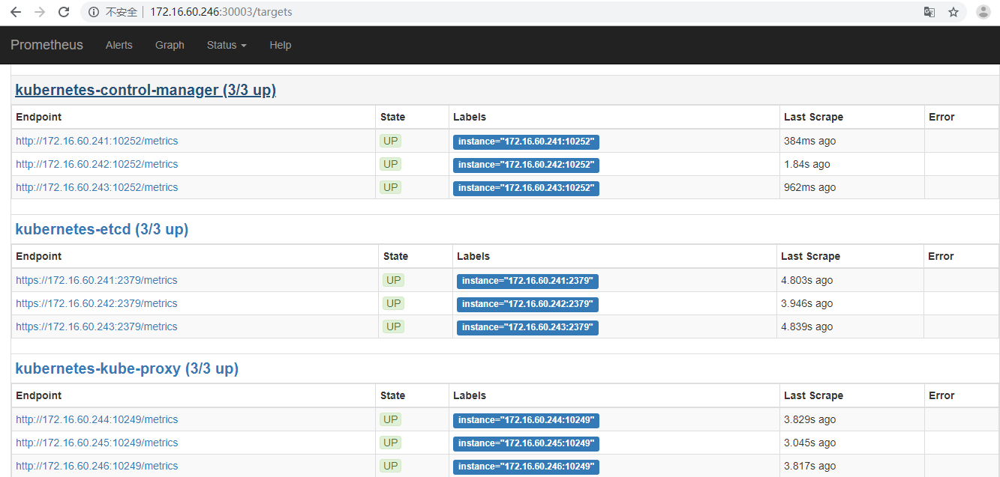

3.  Prometheus的报警设置 (AlterManager)

AlertManager用于接收Prometheus发送的告警并对于告警进行一系列的处理后发送给指定的用户,可以根据不同的需要可以设置邮件告警、短信告警等、钉钉告警(钉钉告警需要接入prometheus-webhook-dingtalk)等。Alertmanager与Prometheus是相互分离的两个部分。Prometheus服务器根据报警规则将警报发送给Alertmanager，然后Alertmanager将silencing、inhibition、aggregation等消息通过电子邮件、PaperDuty和HipChat发送通知。设置警报和通知的主要步骤：

-  安装配置Alertmanager;

-  配置Prometheus通过-alertmanager.url标志与Alertmanager通信;

-  在Prometheus中创建告警规则;

Alertmanager机制

Alertmanager处理由类似Prometheus服务器等客户端发来的警报，之后需要删除重复、分组，并将它们通过路由发送到正确的接收器，比如电子邮件、Slack等。Alertmanager还支持沉默和警报抑制的机制。

-  分组

分组是指当出现问题时，Alertmanager会收到一个单一的通知，而当系统宕机时，很有可能成百上千的警报会同时生成，这种机制在较大的中断中特别有用。例如，当数十或数百个服务的实例在运行，网络发生故障时，有可能服务实例的一半不可达数据库。在告警规则中配置为每一个服务实例都发送警报的话，那么结果是数百警报被发送至Alertmanager。但是作为用户只想看到单一的报警页面，同时仍然能够清楚的看到哪些实例受到影响，因此，人们通过配置Alertmanager将警报分组打包，并发送一个相对看起来紧凑的通知。分组警报、警报时间，以及接收警报的receiver是在配置文件中通过路由树配置的。

-  抑制

抑制是指当警报发出后，停止重复发送由此警报引发其他错误的警报的机制。例如，当警报被触发，通知整个集群不可达，可以配置Alertmanager忽略由该警报触发而产生的所有其他警报，这可以防止通知数百或数千与此问题不相关的其他警报。抑制机制可以通过Alertmanager的配置文件来配置。

-  沉默

沉默是一种简单的特定时间静音提醒的机制。一种沉默是通过匹配器来配置，就像路由树一样。传入的警报会匹配RE，如果匹配，将不会为此警报发送通知。沉默机制可以通过Alertmanager的Web页面进行配置。

Prometheus以scrape_interval（默认为1m）规则周期，从监控目标上收集信息。其中scrape_interval可以基于全局或基于单个metric定义；然后将监控信息持久存储在其本地存储上。Prometheus以evaluation_interval（默认为1m）另一个独立的规则周期，对告警规则做定期计算。其中evaluation_interval只有全局值；然后更新告警状态。其中包含三种告警状态：

inactive：没有触发阈值。即表示当前告警信息既不是firing状态，也不是pending状态；

pending：已触发阈值但未满足告警持续时间。即表示告警消息在设置的阈值时间范围内被激活了；

firing：已触发阈值且满足告警持续时间。即表示告警信息在超过设置的阈值时间内被激活了；

如果采用Prometheus Operator方式部署，则prometheus和alertmanager两个模块会一起被安装。这里我先安装的prometheus容器，然后再安装的alertmanager容器，这两个是分开部署的。操作记录如下 (这里配置实现的时邮件报警):

|   |   |
| - | - |
| 1 2 3 4 5 6 7 8 9 10 11 12 13 14 15 16 17 18 19 20 21 22 23 24 25 26 27 28 29 30 31 32 33 34 35 36 37 38 39 40 41 42 43 44 45 46 47 48 49 50 51 52 53 54 55 56 57 58 59 60 61 62 63 64 65 66 67 68 69 70 71 72 73 74 75 76 77 78 79 80 81 82 83 84 85 86 87 88 89 90 91 92 93 94 95 96 97 98 99 100 101 102 103 104 105 106 107 108 109 110 111 112 113 114 115 116 117 118 119 120 121 122 123 124 125 126 127 128 129 130 131 132 133 134 135 136 137 138 139 140 141 142 143 144 145 146 147 148 149 150 151 152 153 154 155 156 157 158 159 160 161 162 163 164 165 166 167 168 169 170 171 172 173 174 175 176 177 178 179 180 181 182 183 184 185 186 187 188 189 190 191 192 193 194 195 196 197 198 199 200 201 202 203 204 205 206 207 208 209 210 211 212 213 | [root@k8s-master01 ~]\# cd /opt/k8s/work/k8s-prometheus-grafana/prometheus/     1）配置alertmanager-conf.yaml [root@k8s-master01 prometheus]\# cat alertmanager-conf.yaml apiVersion: v1 kind: ConfigMap metadata:   name: alert-config   namespace: kube-system data:   config.yml: |-     global:       \#在没有告警的情况下声明为已解决的时间       resolve\_timeout: 5m       smtp\_smarthost: 'smtp.163.com:25'       smtp\_from: 'wangkevin@163.com'       smtp\_auth\_username: 'wangkevin@163.com'       smtp\_auth\_password: 'kevin123@\#$12'       smtp\_hello: '163.com'       smtp\_require\_tls: false     \#所有告警信息进入之后的根路由，用于设置告警的分发策略     route:       \#这里的标签列表是接收到告警信息后的重新分组标签，例如，在接收到的告警信息里有许多具有 cluster=A 和 alertname=LatncyHigh 标签的告警信息会被批量聚合到一个分组里       group\_by: ['alertname', 'cluster']       \#在一个新的告警分组被创建后，需要等待至少 group\_wait 时间来初始化通知，这种方式可以确保有足够的时间为同一分组收获多条告警，然后一起触发这条告警信息       group\_wait: 30s       \#在第 1 条告警发送后，等待group\_interval时间来发送新的一组告警信息       group\_interval: 5m       \#如果某条告警信息已经发送成功，则等待repeat\_interval时间重新发送他们。这里不启用这个功能~       \#repeat\_interval: 5m       \#默认的receiver：如果某条告警没有被一个route匹配，则发送给默认的接收器       receiver: default       \#上面的所有属性都由所有子路由继承，并且可以在每个子路由上覆盖       routes:       - receiver: email         group\_wait: 10s         match:           team: node     receivers:     - name: 'default'       email\_configs:       - to: '102\*\*\*\*\*\*@qq.com'         send\_resolved: true       - to: 'wang\*\*\*\*\*@sina.cn'         send\_resolved: true     - name: 'email'       email\_configs:       - to: '87486\*\*\*\*\*@163.com'         send\_resolved: true       - to: 'wang\*\*\*\*\*\*\*@163.com'         send\_resolved: true     上面在alertmanager-conf.yaml文件中配置了邮件告警信息的发送发和接收方，发送发为wang\_shibo1987@163.com，接收方为1025337607@qq.com和wangshiboloveni@163.com。 [root@k8s-master01 prometheus]\# kubectl create -f alertmanager-conf.yaml     2）修改config.yaml文件配置 配置configmap.yaml，添加告警的监控项。如下，添加一个测试告警监控项，当内存使用率超过1%时候，就报警 [root@k8s-master01 prometheus]\# vim configmap.yaml apiVersion: v1 kind: ConfigMap metadata:   name: prometheus-config   namespace: kube-system data:   prometheus.yml: |     global:       scrape\_interval:     15s       evaluation\_interval: 15s         alerting:                              \#添加下面紧接着的这四行       alertmanagers:         - static\_configs:           - targets: ["localhost:9093"]         rule\_files:                           \#添加下面紧接着的这两行       - /etc/prometheus/rules.yml         scrape\_configs:         - job\_name: 'kubernetes-schedule'             scrape\_interval: 5s                      static\_configs:         - targets: ['172.16.60.241:10251','172.16.60.242:10251','172.16.60.243:10251'] ....... .......       rules.yml: |                  \#结尾添加下面这几行配置     groups:     - name: alert-rule       rules:       - alert: NodeMemoryUsage         expr: (node\_memory\_MemTotal\_bytes - (node\_memory\_MemFree\_bytes + node\_memory\_Buffers\_bytes + node\_memory\_Cached\_bytes)) / node\_memory\_MemTotal\_bytes \* 100 &gt; 1         for: 1m         labels:           team: admin         annotations:           description: "{{$labels.instance}}: Memory usage is above 1% (current value is: {{ $value }}%)"           value: "{{ $value }}%"           threshold: "1%"         更新config.yaml文件配置 [root@k8s-master01 prometheus]\# kubectl apply -f configmap.yaml     3）修改prometheus.deploy.yaml文件配置 [root@k8s-master01 prometheus]\# vim prometheus.deploy.yml .......     spec:       containers:       - image: prom/alertmanager:v0.15.3          \#添加下面紧接的内容，即alertmanager容器配置         name: alertmanager         imagePullPolicy: IfNotPresent         args:         - "--config.file=/etc/alertmanager/config.yml"         - "--storage.path=/alertmanager/data"         ports:         - containerPort: 9093           name: http         volumeMounts:         - mountPath: "/etc/alertmanager"           name: alertcfg         resources:           requests:             cpu: 100m             memory: 256Mi           limits:             cpu: 100m             memory: 256Mi                       \#上面添加的配置到这里结束       - image: prom/prometheus:v2.0.0         name: prometheus .......       volumes:       - name: alertcfg         \#添加下面紧接着这三行配置         configMap:           name: alert-config       - name: data         emptyDir: {} .......     更新prometheus.deploy.yaml文件配置 [root@k8s-master01 prometheus]\# kubectl apply -f prometheus.deploy.yaml     重启pods [root@k8s-master01 prometheus]\# kubectl get pods -n kube-system|grep prometheus            prometheus-76fb9bc788-lbf57             1/1     Running   0          5s     [root@k8s-master01 prometheus]\# kubectl delete pods/prometheus-76fb9bc788-lbf57 -n kube-system     [root@k8s-master01 prometheus]\# kubectl get pods -n kube-system|grep prometheus             prometheus-8697656888-2vwbw             2/2     Running   0          5s     4）修改prometheus.svc.yaml文件配置 [root@k8s-master01 prometheus]\# vim prometheus.svc.yml --- kind: Service apiVersion: v1 metadata:   labels:     app: prometheus   name: prometheus   namespace: kube-system spec:   type: NodePort   ports:   - port: 9090     targetPort: 9090     nodePort: 30003     name: prom            \#添加下面这紧接的五行内容   - port: 9093     targetPort: 9093     nodePort: 30013     name: alert   selector:     app: prometheus     更新prometheus.svc.yml文件 [root@k8s-master01 prometheus]\# kubectl apply -f prometheus.svc.yml    查看pods   [root@k8s-master01 prometheus]\# kubectl get pods -n kube-system NAME                                    READY   STATUS    RESTARTS   AGE coredns-5b969f4c88-pd5js                1/1     Running   0          30d grafana-core-5f7c6c786b-x8prc           1/1     Running   0          17d kube-state-metrics-5dd55c764d-nnsdv     2/2     Running   0          23d kubernetes-dashboard-7976c5cb9c-4jpzb   1/1     Running   0          16d metrics-server-54997795d9-rczmc         1/1     Running   0          24d node-exporter-t65bn                     1/1     Running   0          3m20s node-exporter-tsdbc                     1/1     Running   0          3m20s node-exporter-zmb68                     1/1     Running   0          3m20s prometheus-8697656888-7kxwg             2/2     Running   0          11m        可以看出prometheus-8697656888-7kxwg的pod里面有两个容器都正常启动了(2/2)，一个是prometheus容器，一个是altermanager容器(prometheus.deploy.yaml文件里配置)    登录容器 [root@k8s-master01 prometheus]\# kubectl exec -ti prometheus-8697656888-7kxwg -n kube-system -c prometheus /bin/sh /prometheus \#    [root@k8s-master01 prometheus]\# kubectl exec -ti prometheus-8697656888-7kxwg -n kube-system -c alertmanager /bin/sh /etc/alertmanager \#   查看services [root@k8s-master01 prometheus]\# kubectl get svc -n kube-system NAME                            TYPE        CLUSTER-IP       EXTERNAL-IP   PORT(S)                         AGE grafana                         NodePort    10.254.95.120    &lt;none&gt;        3000:31821/TCP                  17d kube-dns                        ClusterIP   10.254.0.2       &lt;none&gt;        53/UDP,53/TCP,9153/TCP          30d kube-state-metrics              NodePort    10.254.228.212   &lt;none&gt;        8080:30978/TCP,8081:30872/TCP   23d kubernetes-dashboard-external   NodePort    10.254.223.104   &lt;none&gt;        9090:30090/TCP                  16d metrics-server                  ClusterIP   10.254.135.197   &lt;none&gt;        443/TCP                         24d node-exporter                   NodePort    10.254.168.172   &lt;none&gt;        9100:31672/TCP                  11m prometheus                      NodePort    10.254.241.170   &lt;none&gt;        9090:30003/TCP,9093:30013/TCP   10d   这时候，访问http://172.16.60.245:30003/alerts就能看到Prometheus的告警设置了。 |

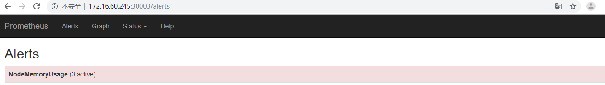

双击上面的Alerts

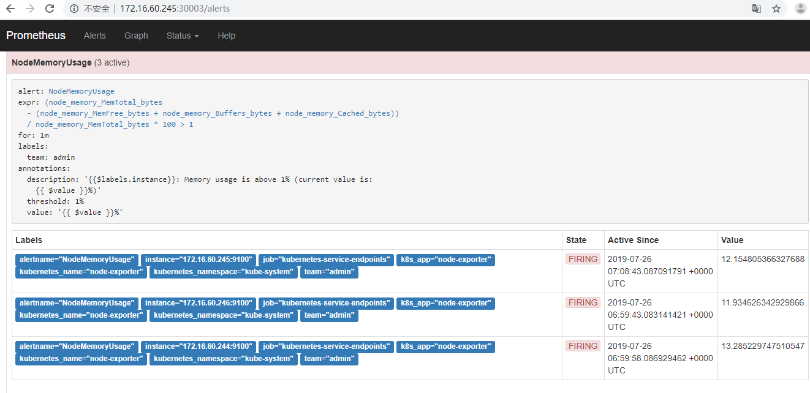

收到的邮件告警信息如下：

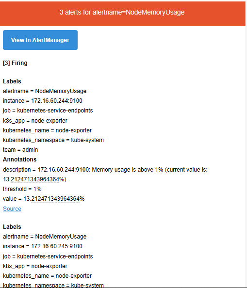

访问30013端口，可以看到Alertmanager的Silences静默状态等

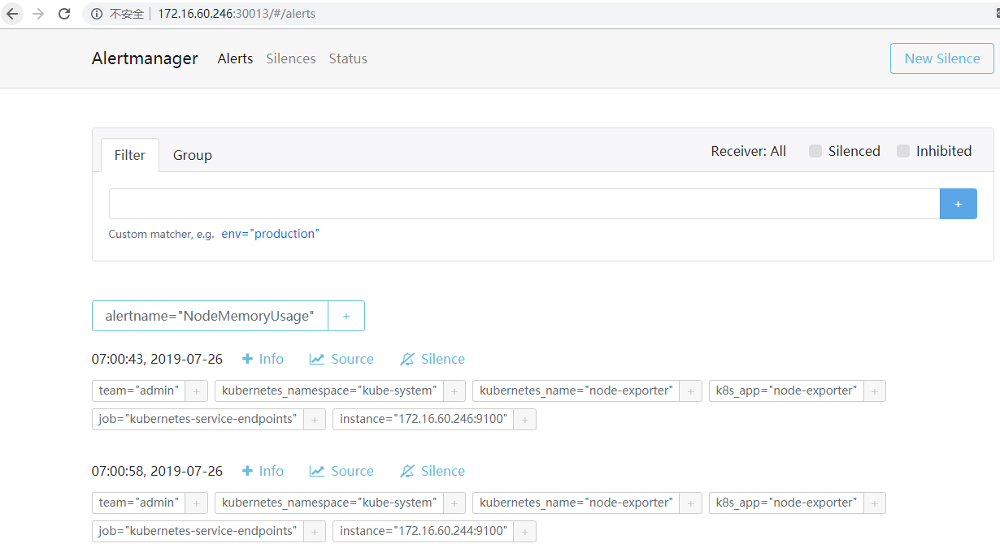

4. Prometheus针对K8s容器集群的监控指标告警设置

指标数据以及后面grafana里监控项的值都可以直接在prometheus的"graph"的查询栏里直接查看

|   |   |
| - | - |
| 1 2 3 4 5 6 7 8 9 10 11 12 13 14 15 16 17 18 19 20 21 22 23 24 25 26 27 28 29 30 31 32 33 34 35 36 37 38 39 40 41 42 43 44 45 46 47 48 49 50 51 52 53 54 55 56 57 58 59 60 61 62 63 64 65 66 67 68 69 70 71 72 73 74 75 76 77 78 79 80 81 82 83 84 85 86 87 88 89 90 91 92 93 94 95 96 97 98 99 100 101 102 103 104 105 106 107 108 109 110 111 112 113 114 115 116 117 118 119 120 121 122 123 124 125 126 127 128 129 130 131 132 133 134 135 136 137 138 139 140 141 142 143 144 145 146 147 148 149 150 151 152 153 154 155 156 157 158 159 160 161 162 163 164 165 166 167 168 169 170 171 172 173 174 175 176 177 178 179 180 181 182 183 184 185 186 187 188 189 190 191 192 193 194 195 196 197 198 199 200 201 202 203 204 205 206 207 208 209 210 211 212 213 214 215 216 217 218 219 220 221 222 223 224 225 226 227 228 229 230 231 232 233 234 235 236 237 238 239 240 241 242 243 244 245 246 | 修改configmap.yaml文件 [root@k8s-master01 prometheus]\# pwd /opt/k8s/work/k8s-prometheus-grafana/prometheus [root@k8s-master01 prometheus]\# cp configmap.yaml configmap.yaml.bak [root@k8s-master01 prometheus]\# vim configmap.yaml ............ ............   rules.yml: |     groups:     - name: alert-rule       rules:       - alert: NodeMemoryUsage         expr: (node\_memory\_MemTotal\_bytes - (node\_memory\_MemFree\_bytes + node\_memory\_Buffers\_bytes + node\_memory\_Cached\_bytes)) / node\_memory\_MemTotal\_bytes \* 100 &gt; 85         for: 1m         labels:           team: admin         annotations:           description: "{{$labels.instance}}: Memory usage is above 1% (current value is: {{ $value }}%)"           value: "{{ $value }}%"           threshold: "85%"       - alert: InstanceDown         expr: up == 0         for: 1m         labels:           team: admin         annotations:              description: "{{$labels.job}}({{$labels.instance}})采集任务down"           value: "{{ $value }}"           threshold: "1"           - alert: KubeCpuUsage         expr: rate(process\_cpu\_seconds\_total{job=~"kubernetes-kube-proxy|kubernetes-kubelet|kubernetes-schedule|kubernetes-control-manager|kubernetes-apiservers|kubernetes-etcd"}[1m]) \* 100 &gt; 95         for: 1m         labels:           team: admin         annotations:           description: "组件{{$labels.job}}({{$labels.instance}}): Cpu使用率超过95%"           value: "{{ $value }}%"           threshold: "95%"       - alert: AddonCpuUsage         expr: rate(process\_cpu\_seconds\_total{k8s\_app=~"kube-state-metrics|kube-dns"}[1m]) \* 100 &gt; 95         for: 1m         labels:           team: admin         annotations:           description: "插件{{$labels.k8s\_app}}({{$labels.instance}}): Cpu使用率超过95%"           value: "{{ $value }}%"           threshold: "95%"            - alert: KubeOpenFds         expr: process\_open\_fds{job=~"kubernetes-kube-proxy|kubernetes-kubelet|kubernetes-schedule|kubernetes-control-manager|kubernetes-apiservers|kubernetes-etcd"}  &gt; 1024         for: 1m         labels:           team: admin         annotations:           description: "组件{{$labels.job}}({{$labels.instance}}): 打开句柄数超过1024"           value: "{{ $value }}"           threshold: "1024"             - alert: AddonOpenFds         expr: process\_open\_fds{k8s\_app=~"kube-state-metrics|kube-dns"}  &gt; 1024         for: 1m         labels:           team: admin         annotations:           description: "插件{{$labels.k8s\_app}}({{$labels.instance}}): 打开句柄数超过1024"           value: "{{ $value }}"           threshold: "1024"                   - alert: KubeVirtualMemory         expr: process\_virtual\_memory\_bytes{job=~"kubernetes-kube-proxy|kubernetes-kubelet|kubernetes-schedule|kubernetes-control-manager|kubernetes-apiservers|kubernetes-etcd"}  &gt; 2000000000         for: 1m         labels:           team: admin         annotations:           description: "组件{{$labels.job}}({{$labels.instance}}): 使用虚拟内存超过2G"           value: "{{ $value }}"           threshold: "2G"             - alert: AddonKubeVirtualMemory         expr: process\_virtual\_memory\_bytes{k8s\_app=~"kube-state-metrics|kube-dns"}  &gt; 2000000000         for: 1m         labels:           team: admin         annotations:           description: "插件{{$labels.k8s\_app}}({{$labels.instance}}): 使用虚拟内存超过2G"           value: "{{ $value }}"           threshold: "2G"       - alert: HttpRequestsAvg         expr: sum(rate(rest\_client\_requests\_total{job=~"kubernetes-kube-proxy|kubernetes-kubelet|kubernetes-schedule|kubernetes-control-manager|kubernetes-apiservers"}[1m]))  &gt; 1000         for: 1m         labels:           team: admin         annotations:           description: "组件{{$labels.job}}({{$labels.instance}}): TPS超过1000"           value: "{{ $value }}"           threshold: "1000"           - alert: KubeletDockerOperationsErrors         expr: rate(kubelet\_docker\_operations\_errors{job="kubernetes-kubelet"}[1m])  != 0         for: 1m         labels:           team: admin         annotations:           description: "Kublet组件({{$labels.instance}})有{{$labels.operation\_type}}操作错误"           value: "{{ $value }}"           threshold: "0"              - alert: KubeletNodeConfigError         expr: kubelet\_node\_config\_error{job="kubernetes-kubelet"}  != 0         for: 1m         labels:           team: admin         annotations:           description: "Kublet组件({{$labels.instance}})节点配置有误"           value: "{{ $value }}"           threshold: "0"                - alert: DaemonSet\_misscheduled         expr: kube\_daemonset\_status\_number\_misscheduled{namespace=~"kube-system|cattle-system"} &gt; 0         for: 1m         labels:           team: admin         annotations:           description: "空间{{$labels.namespace}}({{$labels.instance}}): 发现{{$labels.daemonset}}调度失败"           value: "{{ $value }}"           threshold: "0"       - alert: DaemonSet\_unavailable         expr: kube\_daemonset\_status\_number\_unavailable{namespace=~"kube-system|cattle-system"} &gt; 0         for: 1m         labels:           team: admin         annotations:           description: "空间{{$labels.namespace}}({{$labels.instance}}): 发现{{$labels.daemonset}}不可用"           value: "{{ $value }}"           threshold: "0"       - alert: Deployment\_unavailable         expr: kube\_deployment\_status\_replicas\_unavailable{namespace=~"kube-system|cattle-system"} &gt; 0         for: 1m         labels:           team: admin         annotations:           description: "空间{{$labels.namespace}}({{$labels.instance}}): 发现{{$labels.deployment}}不可用"           value: "{{ $value }}"           threshold: "0"       - alert: Deployment\_unavailable\_DOTA         expr: kube\_deployment\_status\_replicas\_unavailable{deployment=~"aimaster-nginx.\*",namespace="dev"} &gt; 0         for: 1m         labels:           team: admin         annotations:           description: "空间{{$labels.namespace}}({{$labels.instance}}): 发现{{$labels.deployment}}不可用"           value: "{{ $value }}"           threshold: "0"           system: "DOTA"       - alert: Pod\_waiting         expr: kube\_pod\_container\_status\_waiting\_reason{namespace=~"kube-system|cattle-system"} == 1         for: 1m         labels:           team: admin         annotations:           description: "空间{{$labels.namespace}}({{$labels.instance}}): 发现{{$labels.pod}}下的{{$labels.container}}启动异常等待中"           value: "{{ $value }}"           threshold: "1"       - alert: Pod\_terminated         expr: kube\_pod\_container\_status\_terminated\_reason{namespace=~"kube-system|cattle-system"} == 1         for: 1m         labels:           team: admin         annotations:           description: "空间{{$labels.namespace}}({{$labels.instance}}): 发现{{$labels.pod}}下的{{$labels.container}}被删除"           value: "{{ $value }}"           threshold: "1"       - alert: Pod\_restarts         expr: kube\_pod\_container\_status\_restarts\_total{namespace=~"kube-system|cattle-system"} &gt; 0         for: 1m         labels:           team: admin         annotations:           description: "空间{{$labels.namespace}}({{$labels.instance}}): 发现{{$labels.pod}}下的{{$labels.container}}被重启"           value: "{{ $value }}"           threshold: "0"       - alert: Etcd\_leader         expr: etcd\_server\_has\_leader{job="kubernetes-etcd"} == 0         for: 1m         labels:           team: admin         annotations:           description: "组件{{$labels.job}}({{$labels.instance}}): 当前没有leader"           value: "{{ $value }}"           threshold: "0"       - alert: Etcd\_leader\_changes         expr: rate(etcd\_server\_leader\_changes\_seen\_total{job="kubernetes-etcd"}[1m]) &gt; 0         for: 1m         labels:           team: admin         annotations:           description: "组件{{$labels.job}}({{$labels.instance}}): 当前leader已发生改变"           value: "{{ $value }}"           threshold: "0"       - alert: Etcd\_failed         expr: rate(etcd\_server\_proposals\_failed\_total{job="kubernetes-etcd"}[1m]) &gt; 0         for: 1m         labels:           team: admin         annotations:           description: "组件{{$labels.job}}({{$labels.instance}}): 服务失败"           value: "{{ $value }}"           threshold: "0"       - alert: Etcd\_db\_total\_size         expr: etcd\_debugging\_mvcc\_db\_total\_size\_in\_bytes{job="kubernetes-etcd"} &gt; 10000000000         for: 1m         labels:           team: admin         annotations:           description: "组件{{$labels.job}}({{$labels.instance}})：db空间超过10G"           value: "{{ $value }}"           threshold: "10G"       - alert: Endpoint\_ready         expr: kube\_endpoint\_address\_not\_ready{namespace=~"kube-system|cattle-system"} == 1         for: 1m         labels:           team: admin         annotations:           description: "空间{{$labels.namespace}}({{$labels.instance}}): 发现{{$labels.endpoint}}不可用"           value: "{{ $value }}"           threshold: "1"       - alert: ReplicaSet\_ready         expr: (kube\_replicaset\_status\_ready\_replicas - kube\_replicaset\_status\_replicas) != 0         for: 1m         labels:           team: admin         annotations:           description: "{{$labels.instance}}: 发现空间{{$labels.namespace}}下的{{$labels.replicaset&gt;}}不可用"           value: "{{ $value }}"           threshold: "0"   然后是config.yaml配置生效 （config更新后，必须要重启pod才能生效） [root@k8s-master01 prometheus]\# kubectl delete -f configmap.yaml configmap "prometheus-config" deleted   [root@k8s-master01 prometheus]\# kubectl create -f configmap.yaml  configmap/prometheus-config created   [root@k8s-master01 prometheus]\# kubectl get pods -n kube-system|grep prometheus prometheus-858989bcfb-v7dfl             2/2     Running   0          10m   [root@k8s-master01 prometheus]\# kubectl delete pods/prometheus-858989bcfb-v7dfl -n kube-system pod "prometheus-858989bcfb-v7dfl" deleted   [root@k8s-master01 prometheus]\# kubectl get pods -n kube-system|grep prometheus               prometheus-858989bcfb-l8dlx             2/2     Running   0          4s   然后访问prometheus，查看config配置，发现配置已经生效了 |

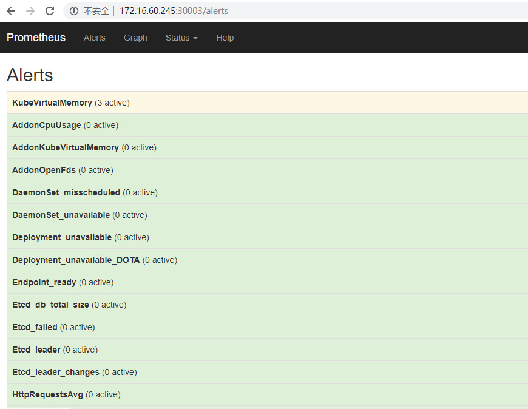

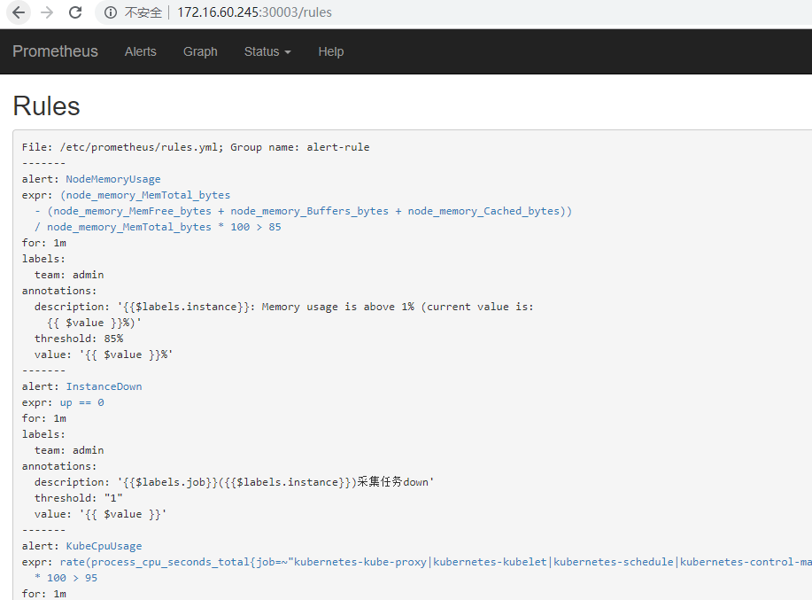

查看alert的对应邮件告警信息

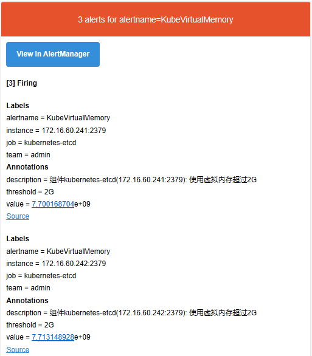

5. Prometheus的热加载机制

Promtheus的时序 数据库 在存储了大量的数据后，每次重启Prometheus进程的时间会越来越慢。 而在日常运维工作中会经常调整Prometheus的配置信息，实际上Prometheus提供了在运行时热加载配置信息的功能。Prometheus 内部提供了成熟的 hot reload 方案，这大大方便配置文件的修改和重新加载，在 Prometheus 生态中，很多 Exporter 也采用类似约定的实现方式。

Prometheus配置信息的热加载有两种方式：

1）第一种热加载方式：查看Prometheus的进程id，发送 SIGHUP 信号:

|   |   |
| - | - |
| 1 | \# kill -HUP &lt;pid&gt; |

2）第二种热加载方式：发送一个POST请求到 /-/reload ，需要在启动时给定 --web.enable-lifecycle 选项（注意下面的ip是pod ip）:

|   |   |
| - | - |
| 1 | \# curl -X POST http://PodIP:9090/-/reload |

当你采用以上任一方式执行 reload 成功的时候，将在 promtheus log 中看到如下信息:

|   |   |
| - | - |
| 1 | ... msg="Loading configuration file" filename=prometheus.yml ... |

这里注意下：

个人更倾向于采用 curl -X POST 的方式，因为每次 reload 过后， pid 会改变，使用 kill 方式需要找到当前进程号。

从 2.0 开始，hot reload 功能是默认关闭的，如需开启，需要在启动 Prometheus 的时候，添加 --web.enable-lifecycle 参数。

在本案例中Prometheus热加载功能添加的操作如下:

|   |   |
| - | - |
| 1 2 3 4 5 6 7 8 9 10 11 12 13 14 15 16 17 18 19 20 21 22 23 24 25 26 27 28 29 30 31 32 33 34 35 36 37 38 39 40 41 42 43 44 45 46 47 48 49 50 51 52 53 54 55 56 57 58 59 60 61 62 63 64 65 | [root@k8s-master01 ~]\# cd /opt/k8s/work/k8s-prometheus-grafana/prometheus/ [root@k8s-master01 prometheus]\# vim prometheus.deploy.yaml ........... ...........       - image: prom/prometheus:v2.0.0         name: prometheus         command:         - "/bin/prometheus"         args:         - "--config.file=/etc/prometheus/prometheus.yml"         - "--storage.tsdb.path=/prometheus"         - "--storage.tsdb.retention=24h"         - "--web.enable-lifecycle"                            \# 在deploy.yaml文件中的prometheus容器构建参数里添加这一行内容         ports:         - containerPort: 9090       然后重启该deploy配置 [root@k8s-master01 prometheus]\# kubectl delete -f prometheus.deploy.yaml deployment.apps "prometheus" deleted    [root@k8s-master01 prometheus]\# kubectl create -f prometheus.deploy.yaml       deployment.apps/prometheus created    [root@k8s-master01 prometheus]\# kubectl get pods -n kube-system|grep prometheus prometheus-858989bcfb-8mt92             2/2     Running   0          22s    接下来验证以下prometheus的热加载机制 只要是更改了prometheus的相关配置，只需要使用下面的热加载命令就行，无需重启Prometheus的pod！    例如将Prometheus监控指标中pod内存使用率阈值由上面定义的85%改为90% [root@k8s-master01 prometheus]\# vim configmap.yaml ........... ...........       - alert: NodeMemoryUsage         expr: (node\_memory\_MemTotal\_bytes - (node\_memory\_MemFree\_bytes + node\_memory\_Buffers\_bytes + node\_memory\_Cached\_bytes)) / node\_memory\_MemT otal\_bytes \* 100 &gt; 90         for: 1m         labels:           team: admin         annotations:           description: "{{$labels.instance}}: Memory usage is above 1% (current value is: {{ $value }}%)"           value: "{{ $value }}%"           threshold: "90%"   这里注意： 宿主机/opt/k8s/work/k8s-prometheus-grafana/prometheus/configmap.yaml文件里配置了两个yml文件，分别为prometheus.yml和rules.yml，分别对应prometheus容器的 /etc/prometheus/prometheus.yml和/etc/prometheus/rules.yml     由于Prometheus的热加载功能是从资源对象里加载，不是从文件里加载。所以需要保证宿主机/opt/k8s/work/k8s-prometheus-grafana/prometheus/configmap.yaml文件里 的rules.yml配置和prometheus容器里的/etc/prometheus/rules.yml文件内容同步。 要想保证这两者同步，必须在修改了configmap.yml文件后要执行apply更新操作！ (记住：凡是修改了configmap.yml或是alertmanager-conf.yaml等config.yml文件，都要执行apply更新操作！)   [root@k8s-master01 prometheus]\# kubectl apply -f configmap.yaml   先查看prometheus的pod ip（这里prometheus的pod里包括两个容器：alertmanager和prometheus，同一个pod下的容器共享一个pod ip） [root@k8s-master01 prometheus]\# kubectl get pods -n kube-system -o wide|grep prometheus prometheus-858989bcfb-fhdfv             2/2     Running   0          158m    172.30.56.4     k8s-node02   &lt;none&gt;           &lt;none&gt;   然后再进行prometheus的热加载操作（-X POST 和 -XPOST 效果是一样的）。注意Prometheus的热加载POST方式中的ip指的是Pod IP地址！ [root@k8s-master01 prometheus]\# curl -X POST http://172.30.56.4:9090/-/reload [root@k8s-master01 prometheus]\# curl -XPOST http://172.30.56.4:9090/-/reload   访问访问prometheus的web页面，发现热加载功能已经生效！ |

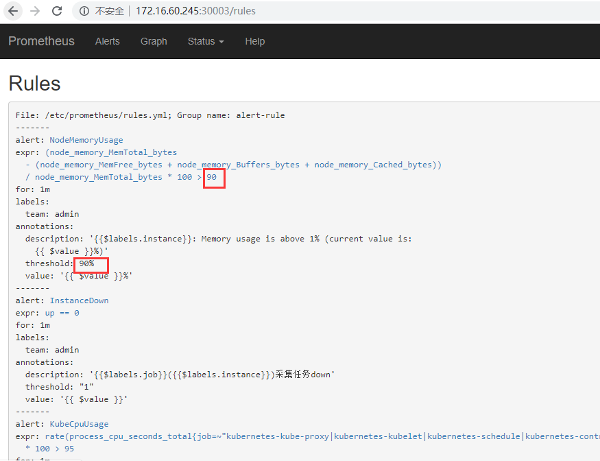

6. Grafana 数据源和图形配置 （默认用户名密码均为admin）

|   |   |
| - | - |
| 1 2 3 4 5 6 7 | [root@k8s-master01 grafana]\# kubectl get svc -n kube-system|grep "grafana" grafana            NodePort             10.254.95.120         &lt;none&gt;           3000:31821/TCP       12m   访问grafana的地址为： http://172.16.60.244:31821/ http://172.16.60.245:31821/ http://172.16.60.246:31821/ |

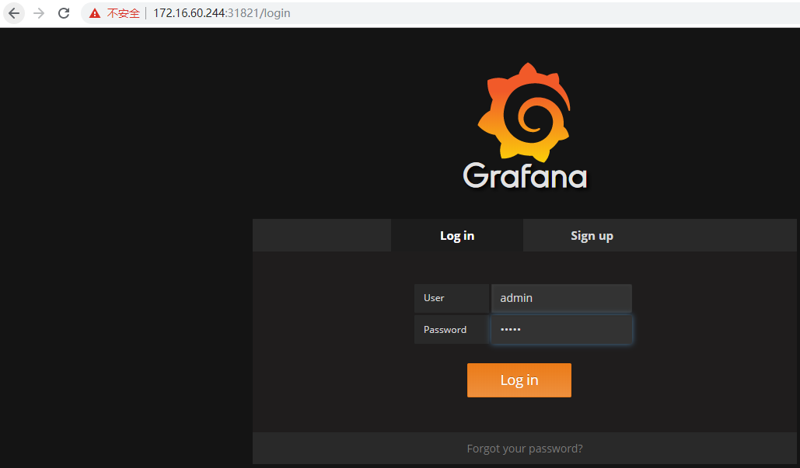

为grafana添加数据源

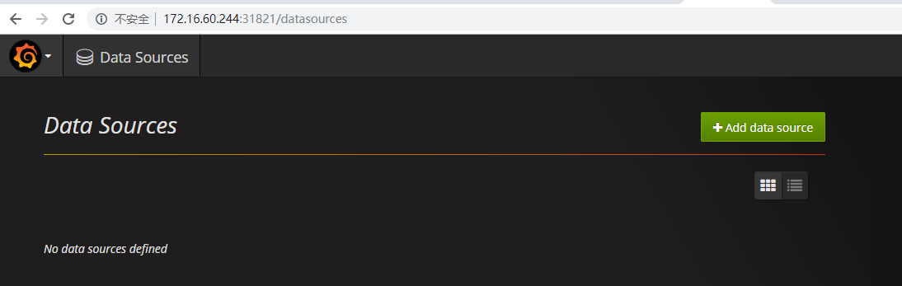

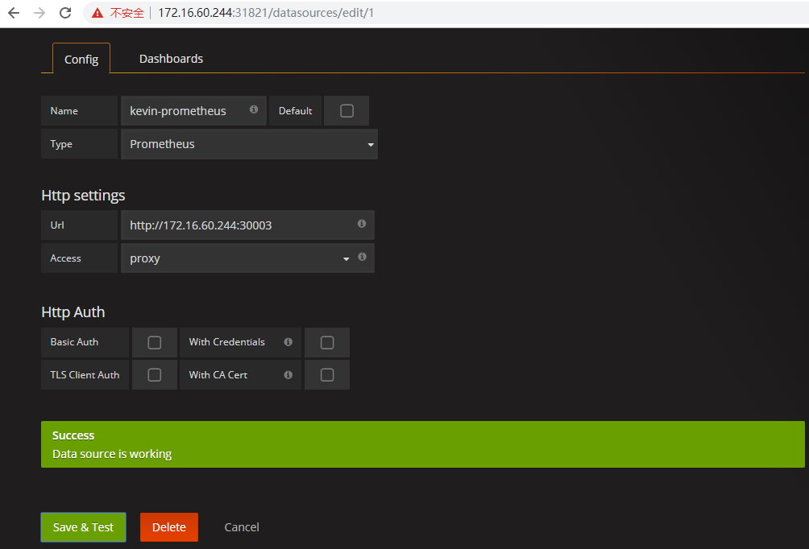

导入面板，可以直接输入模板编号315在线导入，或者下载好对应的json模板文件本地导入，面板模板下载地址https:///dashboards/315

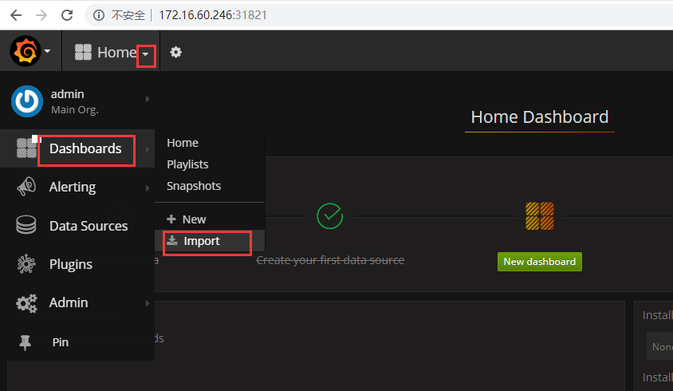

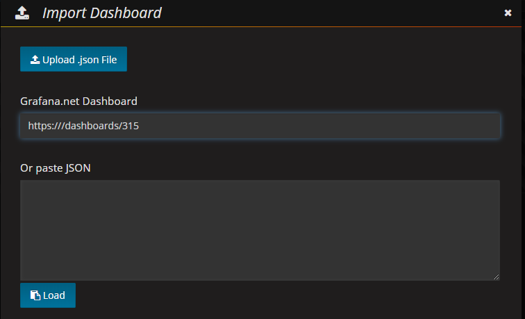

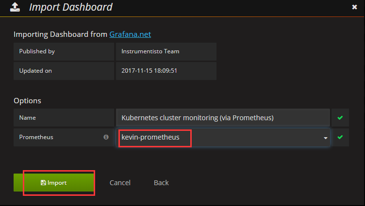

查看Grafana的展示效果

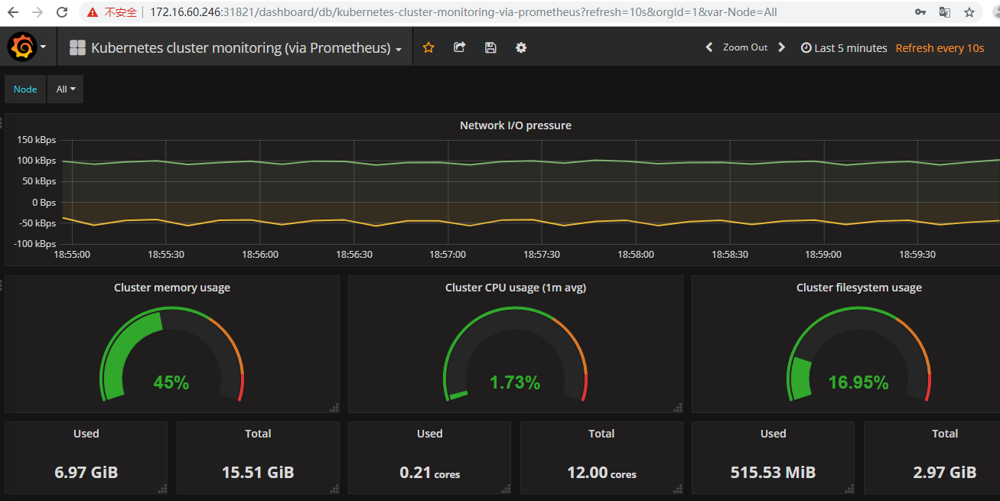

这里注意下：k8s监控指标中tyoe为"counter"类型的用rate(速率)进行统计。比如：

指标名称：etcd_server_leader_changes_seen_total

告警规则：以采集间隔1min为例，本次采集值减去上次采集值，结果大于0告警

则prometheus中监控的报警统计如下:

expr: rate(etcd_server_leader_changes_seen_total{job="kubernetes-etcd"}[1m]) > 0

下面制作了两个dashboard，可以直接导入对应的json文件（地址：），导入前删除上面的"Kubernetes cluster monitoring（via Prometheus）"  两个json文件下载地址: https://pan.baidu.com/s/11GCffEtkvRTn5byDKIUlfg   提取密码: d5mr

 

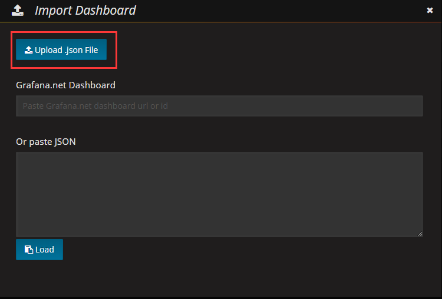

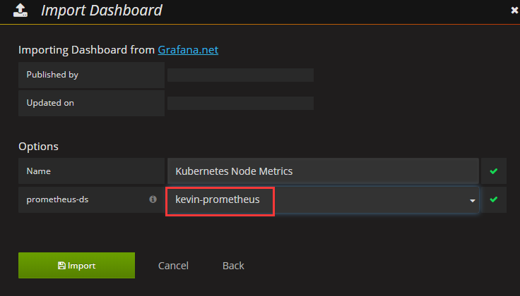

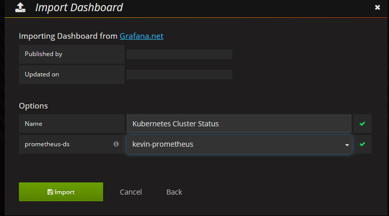

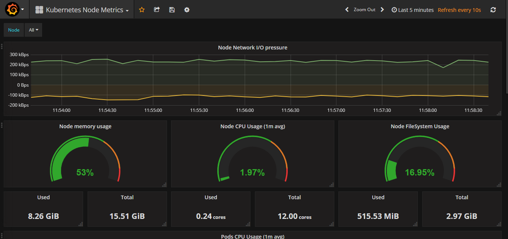

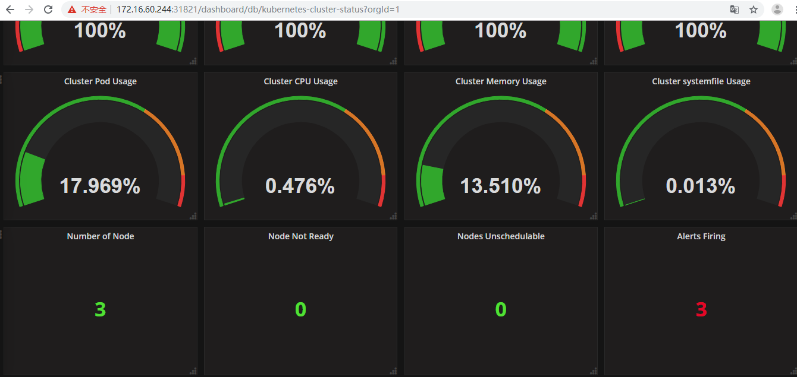

建议将上面Dashboard图形中标题和各监控项的英文名称改为中文名称~

三、Prometheus高可用说明

1.  Prometheus的本地存储

在构建Prometheus高可用方案之前，先来了解一下Prometheus的本地存储相关的内容。Prometheus 2.x 采用自定义的存储格式将样本数据保存在本地磁盘当中。如下所示，按照两个小时为一个时间窗口，将两小时内产生的数据存储在一个块(Block)中，每一个块中包含该时间窗口内的所有样本数据(chunks)，元数据文件(meta.json)以及索引文件(index)。

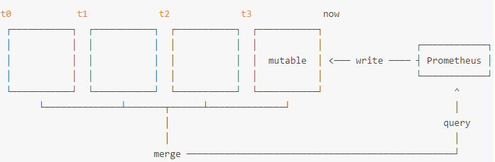

而在当前时间窗口内正在收集的样本数据，Prometheus则会直接将数据保存在内容当中。为了确保此期间如果Prometheus发生崩溃或者重启时能够恢复数据，Prometheus启动时会以写入日志(WAL)的方式来实现重播，从而恢复数据。此期间如果通过API删除时间序列，删除记录也会保存在单独的逻辑文件当中(tombstone)。在文件系统中这些块保存在单独的目录当中，Prometheus保存块数据的目录结构如下所示:

|   |   |
| - | - |
| 1 2 3 4 5 6 7 8 9 10 11 12 13 14 15 16 | ./data    |- 01BKGV7JBM69T2G1BGBGM6KB12       |- meta.json       |- wal         |- 000002         |- 000001    |- 01BKGTZQ1SYQJTR4PB43C8PD98       |- meta.json       |- index       |- chunks         |- 000001       |- tombstones    |- 01BKGTZQ1HHWHV8FBJXW1Y3W0K       |- meta.json       |- wal         |-000001 |

通过时间窗口的形式保存所有的样本数据，可以明显提高Prometheus的查询效率，当查询一段时间范围内的所有样本数据时，只需要简单的从落在该范围内的块中查询数据即可。同时该存储方式可以简化历史数据的删除逻辑。只要一个块的时间范围落在了配置的保留范围之外，直接丢弃该块即可。

本地存储配置

用户可以通过命令行启动参数的方式修改本地存储的配置。(本地历史数据最多保存15天)

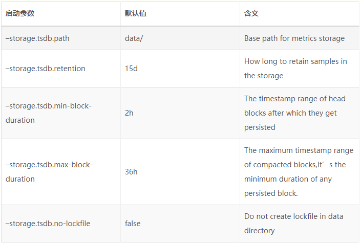

在一般情况下，Prometheus中存储的每一个样本大概占用1-2字节大小。如果需要对Prometheus Server的本地磁盘空间做容量规划时，可以通过以下公式计算:

|   |   |
| - | - |
| 1 | needed\_disk\_space = retention\_time\_seconds \* ingested\_samples\_per\_second \* bytes\_per\_sample |

保留时间(retention_time_seconds)和样本大小(bytes_per_sample)不变的情况下，如果想减少本地磁盘的容量需求，只能通过减少每秒获取样本数(ingested_samples_per_second)的方式。因此有两种手段，一是减少时间序列的数量，二是增加采集样本的时间间隔。考虑到Prometheus会对时间序列进行压缩，因此减少时间序列的数量效果更明显。

从失败中恢复

如果本地存储由于某些原因出现了错误，最直接的方式就是停止Prometheus并且删除data目录中的所有记录。当然也可以尝试删除那些发生错误的块目录，不过这就意味着用户会丢失该块中保存的大概两个小时的监控记录。

Promthues高效的本地存储模型，可以让单台Prometheus能够高效的处理大量的数据。 但是也导致Promthues数据持久化的问题，无法保存长时间的数据。同时也导致Promthues自身无法进行弹性的扩展，下一部分介绍Promthues的持久化存储方案Remote Storae。

2.  Prometheus的远端存储

在Prometheus设计上，使用本地存储可以降低Prometheus部署和管理的复杂度同时减少高可用 (HA) 带来的复杂性。 在默认情况下，用户只需要部署多套Prometheus，采集相同的Targets即可实现基本的HA。

当然本地存储也带来了一些不好的地方，首先就是数据持久化的问题，特别是在像Kubernetes这样的动态集群环境下，如果Promthues的实例被重新调度，那所有历史监控数据都会丢失。 其次本地存储也意味着Prometheus不适合保存大量历史数据(一般Prometheus推荐只保留几周或者几个月的数据)。最后本地存储也导致Prometheus无法进行弹性扩展。为了适应这方面的需求，Prometheus提供了remote_write和remote_read的特性，支持将数据存储到远端和从远端读取数据。通过将监控样本采集和数据存储分离，解决Prometheus的持久化问题。除了本地存储方面的问题，由于Prometheus基于Pull模型，当有大量的Target需要采样本时，单一Prometheus实例在数据抓取时可能会出现一些性能问题，联邦集群的特性可以让Prometheus将样本采集任务划分到不同的Prometheus实例中，并且通过一个统一的中心节点进行聚合，从而可以使Prometheuse可以根据规模进行扩展。

远程存储

Prometheus的本地存储设计可以减少其自身运维和管理的复杂度，同时能够满足大部分用户监控规模的需求。但是本地存储也意味着Prometheus无法持久化数据，无法存储大量历史数据，同时也无法灵活扩展和迁移。为了保持Prometheus的简单性，Prometheus并没有尝试在自身中解决以上问题，而是通过定义两个标准接口(remote_write/remote_read)，让用户可以基于这两个接口将数据保存到任意第三方的存储服务中，这种方式在Promthues中称为远程存储（Remote Storage）。

Remote Write

用户可以在Prometheus配置文件中指定Remote Write(远程写)的URL地址，比如指向influxdb中，也可指向消息队列等。一旦设置了该配置项，Prometheus将样本数据通过HTTP的形式发送给适配器(Adaptor)。而用户则可以在适配器中对接外部任意服务。外部服务可以是真正的存储系统, 公有云存储服务, 也可以是消息队列等任意形式。

Remote Read

Promthues的Remote Read(远程读)也通过了一个适配器实现。Promthues的Remote Read(远程读)的流程当中，当用户发起查询请求后（也就是说Remote Read只在数据查询时有效），Promthues将向remote_read中配置的URL发起查询请求(matchers,ranges)，接收Promthues的原始样本数据。Adaptor根据请求条件从第三方存储服务中获取响应的数据。同时将数据转换为Promthues的原始样本数据返回给Prometheus Server。当获取到样本数据后，Promthues在本地使用PromQL对样本数据进行二次处理。注意：即使使用了远程读，Prometheus中对于规则文件的处理，以及Metadata API的处理都只在本地完成。

配置文件

用户需要使用远程读写功能时，主要通过在Prometheus配置文件中添加remote_write和remote_read配置，其中url用于指定远程读/写的HTTP服务地址。如果该URL启动了认证则可以通过basic_auth进行安全认证配置。对于https的支持需要设定tls_concig。proxy_url主要用于Prometheus无法直接访问适配器服务的情况下。remote_write和remote_write具体配置如下所示:

|   |   |
| - | - |
| 1 2 3 4 5 6 7 8 9 10 11 12 13 14 15 16 17 18 19 20 21 22 23 24 25 26 27 | remote\_write:     url: &lt;string&gt;     [ remote\_timeout: &lt;duration&gt; | default = 30s ]     write\_relabel\_configs:     [ - &lt;relabel\_config&gt; ... ]     basic\_auth:     [ username: &lt;string&gt; ]     [ password: &lt;string&gt; ]     [ bearer\_token: &lt;string&gt; ]     [ bearer\_token\_file: /path/to/bearer/token/file ]     tls\_config:     [ &lt;tls\_config&gt; ]     [ proxy\_url: &lt;string&gt; ]    remote\_read:     url: &lt;string&gt;     required\_matchers:     [ &lt;labelname&gt;: &lt;labelvalue&gt; ... ]     [ remote\_timeout: &lt;duration&gt; | default = 30s ]     [ read\_recent: &lt;boolean&gt; | default = false ]     basic\_auth:     [ username: &lt;string&gt; ]     [ password: &lt;string&gt; ]     [ bearer\_token: &lt;string&gt; ]     [ bearer\_token\_file: /path/to/bearer/token/file ]     [ &lt;tls\_config&gt; ]     [ proxy\_url: &lt;string&gt; ] |

自定义Remote Stoarge Adaptor

实现自定义Remote Storage需要用户分别创建用于支持remote_read和remote_write的HTTP服务。一般使用Influxdb作为Remote Stoarge。目前Prometheus社区也提供了部分对于第三方数据库的Remote Storage支持，如influxDB，OpenTSDB，PostgreSQL等。ES也可以作为远端存储，不过如果将ES作为Prometheus的远端存储，则默认只能往ES里面写，Prometheus默认不能从ES里面读历史数据（说白了就是ES默认不支持Prometheus的PromQL查询语法，要用的法，需要做修改）。通过Remote Storage特性可以将Promthues中的监控样本数据存储在第三方的存储服务中，从而解决了Promthues的数据持久化问题。同时由于解除了本地存储的限制，Promthues自身也可以进行弹性的扩展，在诸如Kubernetes这样的环境下可以进行动态的调度。使用influxdb作为Remote Stoarge远端存储的方式这里就不介绍了。下面介绍下Prometheus的联邦集群。

3.  Prometheus的联邦集群

单个Prometheus Server可以轻松的处理数以百万的时间序列。当然根据规模的不同的变化，Prometheus同样可以轻松的进行扩展。这部分将会介绍利用Prometheus的联邦集群特性，对Prometheus进行扩展。联邦有不同的用例, 它通常用于实现可扩展的prometheus，或者将metrics从一个服务的prometheus拉到另一个Prometheus上用于展示。

Prometheus支持使用联邦集群的方式，对Prometheus进行扩展。对于大部分监控规模而言，我们只需要在每一个数据中心 (例如：EC2可用区，Kubernetes集群) 安装一个Prometheus Server实例，就可以在各个数据中心处理上千规模的集群。同时将Prometheus Server部署到不同的数据中心可以避免网络配置的复杂性。

对于大部分监控规模而言，我们只需要在每一个数据中心(例如一个Kubernetes集群)安装一个Prometheus Server实例，就可以在各个数据中心处理上千规模的集群，这也可以避免网络配置的复杂性。

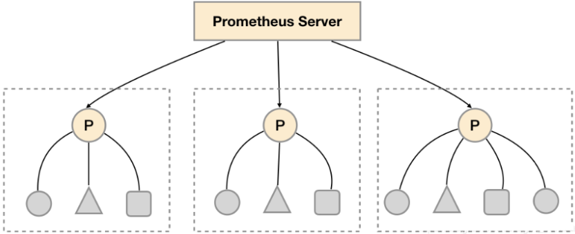

如上图所示，在每个数据中心部署单独的Prometheus Server，用于采集当前数据中心监控数据，并由一个中心的Prometheus Server负责聚合多个数据中心的监控数据。这一特性在Promthues中称为联邦集群。联邦集群的核心在于每一个Prometheus Server都包含一个用于获取当前实例中监控样本的接口/federate。对于中心Prometheus Server而言，无论是从其他的Prometheus实例还是Exporter实例中获取数据实际上并没有任何差异。

每一个Prometheus Server实例包含一个/federate接口，用于获取一组指定的时间序列的监控数据。因此在中心Prometheus Server中只需要配置一个采集任务用于从其他Prometheus Server中获取监控数据。

|   |   |
| - | - |
| 1 2 3 4 5 6 7 8 9 10 11 12 13 14 | scrape\_configs:   - job\_name: 'federate'     scrape\_interval: 15s     honor\_labels: true     metrics\_path: '/federate'     params:       'match[]':         - '{job="prometheus"}'         - '{\_\_name\_\_=~"job:.\*"}'         - '{\_\_name\_\_=~"node.\*"}'     static\_configs:       - targets:         - '172.16.60.240:9090'         - '172.16.60.241:9090' |

通过params可以用于控制Prometheus Server向Target实例请求监控数据的URL当中添加请求参数。例如:

|   |   |
| - | - |
| 1 | "http://172.16.60.240:9090/federate?match[]={job%3D"prometheus"}&amp;match[]={\_\_name\_\_%3D~"job%3A.\*"}&amp;match[]={\_\_name\_\_%3D~"node.\*"}" |

通过URL中的match[]参数指定，可以指定需要获取的时间序列。honor_labels配置true可以确保当采集到的监控指标冲突时，能够自动忽略冲突的监控数据。如果为false时，prometheus会自动将冲突的标签替换为exported_的形式。

功能分区

功能分区，即通过联邦集群的特性在任务级别对Prometheus采集任务进行划分，以支持规模的扩展。而当你的监控大到单个Prometheus Server无法处理的情况下，我们可以在各个数据中心中部署多个Prometheus Server实例。每一个Prometheus Server实例只负责采集当前数据中心中的一部分任务(Job)，例如可以将应用监控和主机监控分离到不同的Prometheus实例当中。假如监控采集任务的规模继续增大，通过功能分区的方式可以进一步细化采集任务。对于中心Prometheus Server只需要从这些实例中聚合数据即可。例如如下所示，可以在各个数据中心中部署多个Prometheus Server实例。每一个Prometheus Server实例只负责采集当前数据中心中的一部分任务(Job)，再通过中心Prometheus实例进行聚合。

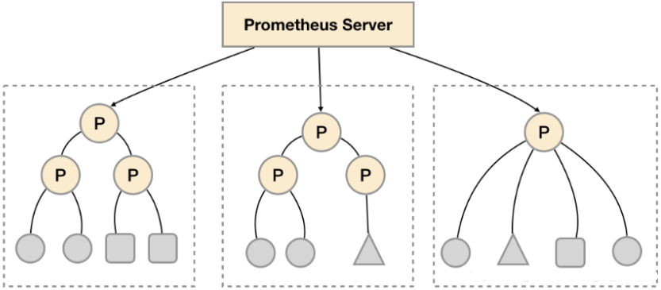

水平扩展

另外一种极端的情况，假如当单个采集任务的量也变得非常的大，这时候单纯通过功能分区Prometheus Server也无法有效处理。在这种情况下，我们只能考虑在任务(Job)的实例级别进行水平扩展。将采集任务的目标实例划分到不同的Prometheus Server当中。水平扩展：即通过联邦集群的特性在任务的实例级别对Prometheus采集任务进行划分，以支持规模的扩展。水平扩展可以将统一任务的不同实例的监控数据采集任务划分到不同的Prometheus实例。通过relabel设置，我们可以确保当前Prometheus Server只收集当前采集任务的一部分实例的监控指标。

|   |   |
| - | - |
| 1 2 3 4 5 6 7 8 9 10 11 12 13 14 | global:   external\_labels:     slave: 1  \# This is the 2nd slave. This prevents clashes between slaves. scrape\_configs:   - job\_name: some\_job     \# Add usual service discovery here, such as static\_configs     relabel\_configs:     - source\_labels: [\_\_address\_\_]       modulus:       4    \# 4 slaves       target\_label:  \_\_tmp\_hash       action:        hashmod     - source\_labels: [\_\_tmp\_hash]       regex:         ^1$  \# This is the 2nd slave       action:        keep |

并且通过当前数据中心的一个中心Prometheus Server将监控数据进行聚合到任务级别。

|   |   |
| - | - |
| 1 2 3 4 5 6 7 8 9 10 11 12 13 | - scrape\_config:   - job\_name: slaves     honor\_labels: true     metrics\_path: /federate     params:       match[]:         - '{\_\_name\_\_=~"^slave:.\*"}'   \# Request all slave-level time series     static\_configs:       - targets:         - slave0:9090         - slave1:9090         - slave3:9090         - slave4:9090 |

几种高可用方案

远程存储解决了prometheus数据持久化和可扩展性的问题，联邦解决了单台prometheus数据采集任务量过大的问题。它们的组合可以作为高可用方案。

1.  基本HA：服务可用性

此方案用户只需要部署多套Prometheus Server实例，并且采集相同的Exporter目标即可。基本的HA模式只能确保Promthues服务的可用性问题，但是不解决Prometheus Server之间的数据一致性问题以及持久化问题(数据丢失后无法恢复)，也无法进行动态的扩展。因此这种部署方式适合监控规模不大，Promthues Server也不会频繁发生迁移的情况，并且只需要保存短周期监控数据的场景。

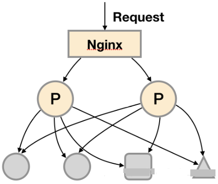

2.  基本HA + 远程存储

在基本HA模式的基础上通过添加Remote Storage存储支持，将监控数据保存在第三方存储服务上。在保证Promthues服务可用性的基础上，同时确保了数据的持久化，当Promthues Server发生宕机或者数据丢失的情况下，可以快速的恢复。 同时Promthues Server可能很好的进行迁移。因此，该方案适用于用户监控规模不大，但是希望能够将监控数据持久化，同时能够确保Promthues Server的可迁移性的场景。

 

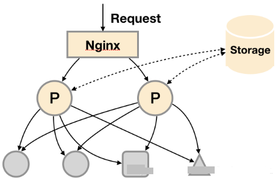

3.  基本HA + 远程存储 + 联邦集群

当单台Promthues Server无法处理大量的采集任务时，用户可以考虑基于Prometheus联邦集群的方式将监控采集任务划分到不同的Promthues实例当中，即在任务级别进行功能分区。这种方案适用于两种场景：

场景一：单数据中心 + 大量的采集任务

这种场景下Promthues的性能瓶颈主要在于大量的采集任务，因此用户需要利用Prometheus联邦集群的特性，将不同类型的采集任务划分到不同的Promthues子服务中，从而实现功能分区。

场景二：多数据中心

这种模式也适合与多数据中心的情况，当Promthues Server无法直接与数据中心中的Exporter进行通讯时，在每一个数据中部署一个单独的Promthues Server负责当前数据中心的采集任务是一个不错的方式。这样可以避免用户进行大量的网络配置，只需要确保主Promthues Server实例能够与当前数据中心的Prometheus Server通讯即可。 中心Promthues Server负责实现对多数据中心数据的聚合。

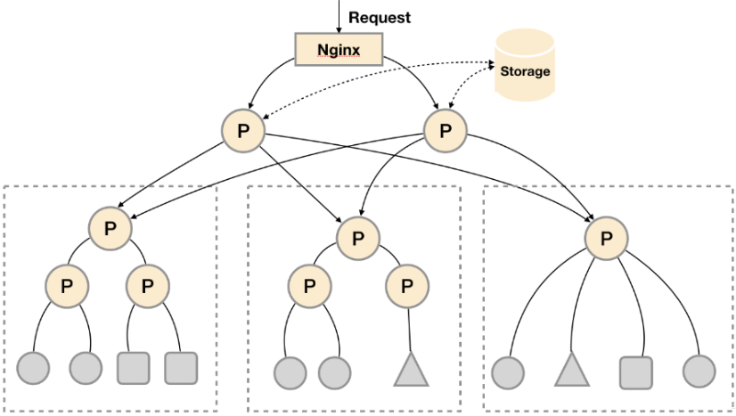

持久化就是历史数据落盘，Prometheus实例跑在K8s中，只保存24小时的。本地存放短时间内的数据，如果要长时间存放数据，可以再远端存储上存放历史数据。通过联邦的方式，实现了远程同步并保存历史数据的这个功能。prometheus 高可用分为实例高可用和存储高可用：

1）实例高可用使用k8s的多pod方式。启两个pod，两个都采集数据，落在本地，设置保留时间，比如2小时。2小时内的数据可以进行监控和报警。

2）存储高可用使用的是联邦方式。采用联邦高可用方式，数据先写到本地落盘，接着上层去读（上层不落盘），读到下层的远程存储里落盘。写只能在本地，读可以在本地也可以在远端存储上。

4.  Alertmanager的联邦集群

在prometheus server高可用的情况下，单个alertmanager容易引发单点故障。

解决该问题最直接方式就是部署多套Alertmanager, 但由于Alertmanager之间不存在并不了解彼此的存在，因此则会出现告警通知被不同的Alertmanager重复发送多次的问题。

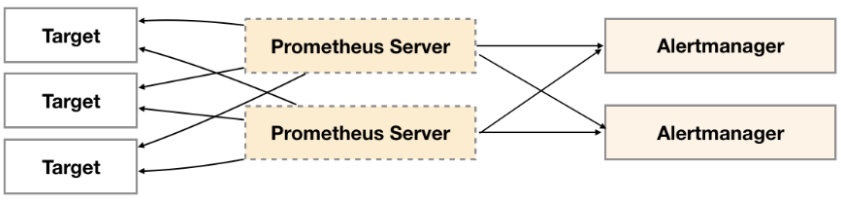

为了解决这一问题，Alertmanager引入了Gossip机制，保证多个Alertmanager之间的信息传递。确保在多个Alertmanager分别接收到相同告警信息的情况下，也只有一个告警通知被发送给Receiver。

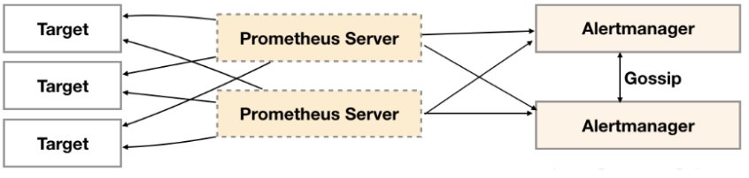

Gossip协议

Gossip是分布式系统中被广泛使用的协议，用于实现分布式节点之间的信息交换和状态同步。如下所示，当Alertmanager接收到来自Prometheus的告警消息后，会按照以下流程对告警进行处理：

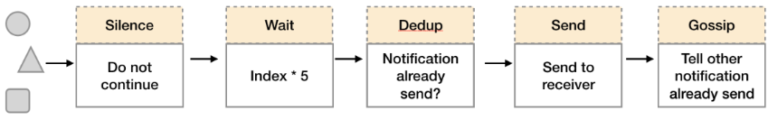

1. 在第一个阶段Silence中，Alertmanager会判断当前通知是否匹配到任何的静默规则，如果没有则进入下一个阶段，否则则中断流水线不发送通知。

2. 在第二个阶段Wait中，Alertmanager会根据当前Alertmanager在集群中所在的顺序(index)等待index * 5s的时间。

3. 当前Alertmanager等待阶段结束后，Dedup阶段则会判断当前Alertmanager数据库中该通知是否已经发送，如果已经发送则中断流水线，不发送告警，否则则进入下一阶段Send对外发送告警通知。

4. 告警发送完成后该Alertmanager进入最后一个阶段Gossip，Gossip会通知其他Alertmanager实例当前告警已经发送。其他实例接收到Gossip消息后，则会在自己的数据库中保存该通知已发送的记录。

因此如下所示，Gossip机制的关键在于两点：

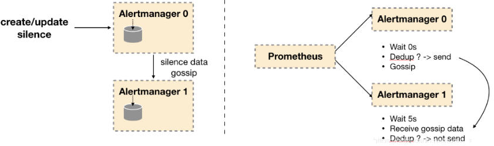

1. Silence设置同步：Alertmanager启动阶段基于Pull-based从集群其它节点同步Silence状态，当有新的Silence产生时使用Push-based方式在集群中传播Gossip信息。

2. 通知发送状态同步：告警通知发送完成后，基于Push-based同步告警发送状态。Wait阶段可以确保集群状态一致。

Alertmanager基于Gossip实现的集群机制虽然不能保证所有实例上的数据时刻保持一致，但是实现了CAP理论中的AP系统，即可用性和分区容错性。同时对于Prometheus Server而言保持了配置了简单性，Promthues Server之间不需要任何的状态同步。

Gossip集群搭建

多个Alertmanager可以组成gossip集群，需要在Alertmanager启动时设置相应的参数。其中主要的参数包括：

1. --cluster.listen-address: 当前alertmanager在gossip集群的监听地址【这地址指的是啥没太懂，如有错误还望指点】

2. --cluster.peer: 需要关联的gossip集群的监听地址

举个例子:

|   |   |
| - | - |
| 1 2 3 | ./alertmanager --web.listen-address=":9093" --cluster.listen-address="127.0.0.1:8001" --storage.path=/tmp/data01 --config.file=/etc/prometheus/alertmanager01.yml --log.level=debug ./alertmanager --web.listen-address=":9094" --cluster.listen-address="127.0.0.1:8002" --cluster.peer=127.0.0.1:8001 --storage.path=/tmp/data02 --config.file=/etc/prometheus/alertmanager02.yml --log.level=debug ./alertmanager --web.listen-address=":9095" --cluster.listen-address="127.0.0.1:8003" --cluster.peer=127.0.0.1:8001 --storage.path=/tmp/data03 --config.file=/etc/prometheus/alertmanager03.yml --log.level=debug |

该例子创建了三个alertmanager组成gossip集群，后两个创建的alertmanager需要关联第一个创建alertmanager对应的gossip监听地址。启动完成后访问任意Alertmanager节点http://localhost:9093/#/status,可以查看当前Alertmanager集群的状态。

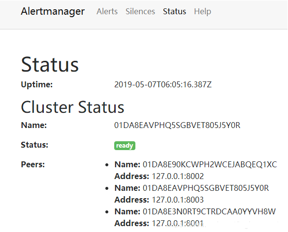

对应的prometheus配置文件中的告警部分需要添加多个alertmanager地址：

|   |   |
| - | - |
| 1 2 3 4 5 6 7 | alerting:   alertmanagers:   - static\_configs:     - targets:       - 127.0.0.1:9093       - 127.0.0.1:9094       - 127.0.0.1:9095 |

*************** 当你发现自己的才华撑不起野心时，就请安静下来学习吧！***************

分类: Docker

好文要顶 关注我 收藏该文 

 

散尽浮华

关注 - 23

粉丝 - 3133

+加关注

1

0

« 上一篇： Kubernetes容器集群管理环境 - 完整部署（下篇）

» 下一篇： Kubernetes容器集群管理环境 - Node节点的移除与加入

posted @ 2019-07-08 15:44  散尽浮华  阅读(8462)  评论(5)  编辑  收藏

评论

  

#1楼 2019-12-30 21:52 | xugong

博主，请教这个是什么问题造成：

[root@k8s-master01 work]# ssh root@192.168.85.205 "docker pull prom/node-exporter"

bash: docker: command not found

（192.168.85.205 的docker是正常使用的，k8s-master01通过ssh也正常登陆到192.168.85.205 ）

支持(0) 反对(0)

  

#2楼 2019-12-31 17:01 | jmeterload

博主 有些地方部署出问题 可以加你好友请教下么？

支持(0) 反对(0)

  

#3楼 2020-06-15 19:57 | 磐石yys

额 大佬 你的一篇文章能当一本书看

支持(0) 反对(0)

  

#4楼 2021-02-05 15:12 | XWD2020

赞*10000，成功实践

支持(0) 反对(0)

  

#5楼 2021-02-05 17:10 | XWD2020

报错

:10255: getsockopt: connection refused

:10255; Connection refused

----重要-----

10255：只读端口，可以不用验证和授权机制，直接访问。这里配置"readOnlyPort: 0"表示未开启只读端口10255；如果配置"readOnlyPort: 10255"则打开10255端口

解释说明：readOnlyPort=0：关闭只读端口(默认 10255)，等效为未指定；

在 9.2 - 部署 kubelet 组件，创建 kubelet 参数配置文件模板。cd /opt/k8s/work。vim kubelet-config.yaml.template。readOnlyPort: 0

每个node节点修改 /etc/kubernetes/kubelet-config.yaml

修改成：readOnlyPort: 10255

systemctl restart kubelet

查看端口 netstat -lnpt|grep kubelet ，有10255端口起来，成功