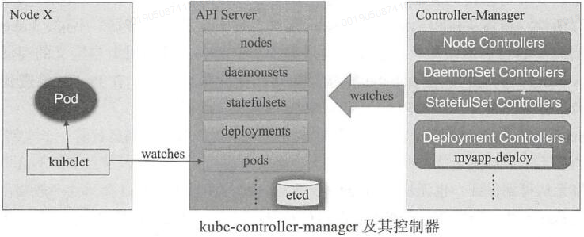
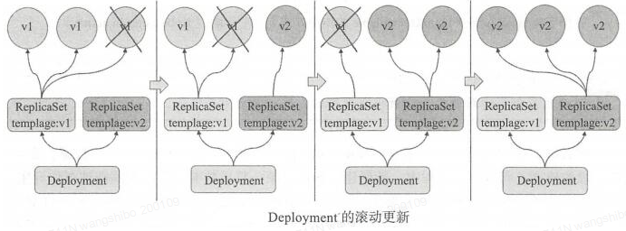
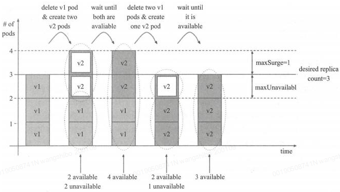
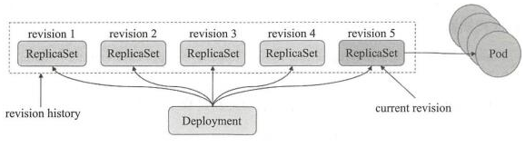
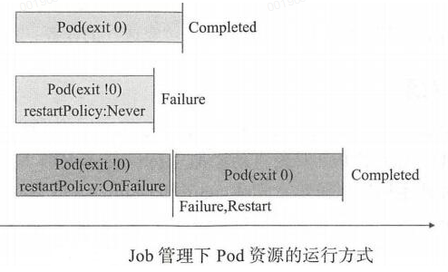

Kubernetes之Pod控制器

 

Kubernetes中内建了很多controller（控制器），这些相当于⼀个状态机，⽤来控制Pod的具体状态和⾏为。Pod控制器有很多种类型，但是目前kubernetes中常用的控制器有： ReplicationController（RC）、ReplicaSet（RS）、Deployment、DaemouSet（DS）、StatefulSet、Job、CronJob。下面说说这几个控制器的使用：

Replication Controller（RC）：是Kubernetes系统中的核心概念，用于定义Pod副本的数量。在Master内，RC进程通过RC的定义来完成Pod的创建、监控、启停等操作。根据RC定义，Kubernetes能够确保在任意时刻都能运行用于指定的Pod"副本"（Replica）数量。随着kubernetes的迭代更新，RC即将被废弃，逐渐被ReplicaSet替代。

ReplicaSet（RS）：它的核心作用是代用户创建指定数量的Pod副本，并确定Pod副本一直处于满足用户期望数量的状态，多退少补，同时支持扩缩容机制。主要有三个组件：用户期望的Pod副本数量；标签选择器，选择属于自己管理和控制的Pod；当前Pod数量不满足用户期望数量时，根据资源模板进行新建。

Deployment：工作在ReplicaSet之上，用于管理无状态应用，除了ReplicaSet的机制，还增加了滚动更新和回滚功能，提供声明式配置。

DaemonSet：用于确保集群中的每一个节点只运行特定的pod副本，通常用于实现系统级后台任务。比如ELK服务。要求：服务是无状态的；服务必须是守护进程

Job：只要完成就立即退出，不需要重启或重建。

Cronjob：周期性任务控制，不需要持续后台运行。

StatefulSet：管理有状态应用，如mysql，redis等。

kubelet对非主进程崩溃类的容器错误无法感知，需要借助存活性探测livenessProbe。如下图：

Pod控制器通常包含三个组成部分：标签选择器，期望的副本数，Pod模板。

Pod 模板资源 

spec.template 不需要apiVersion和kind字段，和自主式Pod对象支持的字段几乎完全一样。配置示例如下：

|   |   |
| - | - |
| 1 2 3 4 5 6 7 8 9 10 11 12 13 14 15 16 17 18 19 20 | apiVersion: apps/v1 kind: ReplicaSet metadata:   name: rs-example spec:   replicas: 2   selector:     matchLabels:       app: rs-demo   template:     metadata:       labels:         app: rs-demo     spec:       containers:       - name: myapp         image: ikubernetes/myapp:v1         ports:         - name: http           containerPort: 80 |

一、 Replication Controller （RC） 

Replication Controller 简称RC，它能确保任何时候Kubernetes集群中有指定数量的pod副本(replicas)在运行， 如果少于指定数量的pod副本(replicas)，Replication Controller会启动新的Container，反之会杀死多余的以保证数量不变。Replication Controller使用预先定义的pod模板创建pods，一旦创建成功，pod 模板和创建的pods没有任何关联，可以修改pod 模板而不会对已创建pods有任何影响，也可以直接更新通过Replication Controller创建的pods。对于利用pod 模板创建的pods，Replication Controller根据label selector来关联，通过修改pods的label可以删除对应的pods。

最初Replication Controller 是用于复制和在异常时重新调度节点的唯一kubernetes组件，后来逐渐被replicaSet代替了。现在基本上很少见到Replication Controller，它即将被废弃。但是有的kubernates容器环境还是有可能会有RC，所以还是有必要知道它的用法。

根据Replication Controller的定义，Kubernetes能够确保在任意时刻都能运行用于指定的Pod"副本"（Replica）数量。如果有过多的Pod副本在运行，系统就会停掉一些Pod；如果运行的Pod副本数量太少，系统就会再启动一些Pod，总之，通过RC的定义，Kubernetes总是保证集群中运行着用户期望的副本数量。

同时，Kubernetes会对全部运行的Pod进行监控和管理，如果有需要（例如某个Pod停止运行），就会将Pod重启命令提交给Node上的某个程序来完成（如Kubelet或Docker）。通过对Replication Controller的使用，Kubernetes实现了应用集群的高可用性。简单来说，RC可以保证在任意时间运行Pod的副本数量，能够保证Pod总是可用的。如果实际Pod数量比指定的多那就结束掉多余的，如果实际数量比指定的少就新启动一些Pod，当Pod失败、被删除或者挂掉后，RC都会去自动创建新的Pod来保证副本数量，所以即使只有一个Pod，也应该使用RC来管理我们的Pod。

应用托管到Kubernetes之后，需要保证应用能够持续的运行，Replication Controller就是这个保证的key，主要的功能如下：

--  确保pod数量：它会确保Kubernetes中有指定数量的Pod在运行。如果少于指定数量的pod，Replication Controller会创建新的，反之则会删除掉多余的以保证Pod数量不变。

--  确保pod健康：当pod不健康，运行出错或者无法提供服务时，Replication Controller也会杀死不健康的pod，重新创建新的。

--  弹性伸缩 ：在业务高峰或者低峰期的时候，可以通过Replication Controller动态的调整pod的数量来提高资源的利用率。同时，配置相应的监控功能（Hroizontal Pod Autoscaler），会定时自动从监控平台获取Replication Controller关联pod的整体资源使用情况，做到自动伸缩。

--  滚动升级：滚动升级为一种平滑的升级方式，通过逐步替换的策略，保证整体系统的稳定，在初始化升级的时候就可以及时发现和解决问题，避免问题不断扩大。

对Replication Controller的定义使用Yaml或Json格式的配置文件来完成。如下：master服务上创建文件php-controller.yaml,为了避免同一个rc定义的pod在同一个node上生成多个pod时，端口冲突，文件中不指定hostPort。replicas指定pod的数量。

|   |   |
| - | - |
| 1 2 3 4 5 6 7 8 9 10 11 12 13 14 15 16 17 18 19 20 21 22 23 24 25 | apiVersion: v1  kind: ReplicationController  metadata:     name: php-controller     labels:        name: php-controller  spec:    replicas: 2    selector:       name: php-test-pod    template:       metadata:       labels:         name: php-test-pod      spec:        containers:        - name: php-test          image: 172.16.60.131:5000/php-base:1.0          env:          - name: ENV\_TEST\_1            value: env\_test\_1          - name: ENV\_TEST\_2            value: env\_test\_2          ports:          - containerPort: 80 |

执行操作

|   |   |
| - | - |
| 1 2 3 4 5 6 7 8 9 10 11 12 13 14 15 16 17 18 19 20 21 22 23 24 25 26 27 28 29 30 31 32 33 | [root@localhost k8s]\# kubectl create -f php-controller.yaml   replicationcontroller "php-controller" created   查询 [root@localhost k8s]\# kubectl get rc [root@localhost k8s]\# kubectl get rc php-controller [root@localhost k8s]\# kubectl describe rc php-controller   [root@localhost k8s]\# kubectl get pods [root@localhost k8s]\# kubectl get pods -o wide NAME                   READY     STATUS    RESTARTS   AGE       NODE  php-controller-8x5wp   1/1       Running   0          5m        172.16.60.131  php-controller-ynzl7   1/1       Running   0          5m        172.16.60.130    可见在131和130的2台node服务器上都创建了Pod。   更改副本数量 在文件中pod副本数量是通过replicas来控制的，kubernetes允许通过kubectl scal命令来动态控制Pod的数量。比如更改replicas的数量为3 [root@localhost k8s]\# kubectl scale rc php-controller --replicas=3  replicationcontroller "php-controller" scaled    删除 通过更改replicas=0，可以把该RC下的所有Pod都删掉。另外kubeclt也提供了stop和delete命令来完成一次性删除RC和RC控制的全部Pod。 需要注意的是：单纯的删除RC，并不会影响已创建好的Pod。 \# kubectl delete rc rcName     \#这样删除rc，但是pod不会收到影响 \# kubectl delete -f rcfile     \#这样删除rc的yml文件，也会会删除rc，也会删除rc下的所有pod   [root@localhost k8s]\# kubectl delete -f php-controller.yaml    \#删除rc，也会删除rc下的所有pod   滚动升级 可以对RC使用滚动升级，来发布新功能或修复BUG。但是注意：RC在rolling-update升级成功后不能直接回滚！！！（使用deployment可以回滚到上一个版本，需加上--revision参数，下面会说到） 当Pod中只有一个容器时，通过--image参数指定新的Tag，如果有多个容器或其他字段修改时，需要指定yaml文件。 [root@master01 deploy\_yaml]\# kubectl rolling-update php-controller --image=ikubernetes/myapp:v2 |

二、ReplicaSet （RS）

ReplicaSet是Replication Controller的替代者，确保Pod副本数在任一时刻都精确满足期望值。用来确保容器应用的副本数始终保持在用户定义的副本数，即如果有容器异常退出，会自动创建新的Pod来替代；而如果异常多出来的容器也会自动回收。虽然ReplicaSet可以独立使用，但一般还是建议使用 Deployment 来自动管理ReplicaSet，这样就无需担心跟其他机制的不兼容问题（比如ReplicaSet不支持rolling-update但Deployment支持）。也就是说Replicaset通常不会直接创建，而是在创建最高层级的deployment资源时自动创建。

随着Kubernetes的高速发展，官方已经推荐我们使用RS和Deployment来代替RC了，实际上RS和RC的功能基本一致，目前唯一的一个区别就是RC只支持基于等式的selector（env=dev或environment!=qa），但RS还支持基于集合的selector（version in (v1.0, v2.0)），这对复杂的运维管理就非常方便了。

ReplicaSet 主要功能

--  确保Pod数量：它会确保Kubernetes中有指定数量的Pod在运行，如果少于指定数量的Pod，RC就会创建新的，反之这会删除多余的，保证Pod的副本数量不变。

--  确保Pod健康：当Pod不健康，比如运行出错了，总之无法提供正常服务时，RC也会杀死不健康的Pod，重新创建新的。

--  弹性伸缩：在业务高峰或者低峰的时候，可以用过RC来动态的调整Pod数量来提供资源的利用率，当然我们也提到过如果使用HPA这种资源对象的话可以做到自动伸缩。

--  滚动升级：滚动升级是一种平滑的升级方式，通过逐步替换的策略，保证整体系统的稳定性。

kubectl命令行工具中关于RC的大部分命令同样适用于RS资源对象。不过我们也很少会去单独使用RS，它主要被Deployment这个更加高层的资源对象使用，除非用户需要自定义升级功能或根本不需要升级Pod，在一般情况下，我们推荐使用Deployment而不直接使用Replica Set。

虽说不用直接创建ReplicaSet，为了学习，这里还是手动创建replicaset，如下：

|   |   |
| - | - |
| 1 2 3 4 5 6 7 8 9 10 11 12 13 14 15 16 17 18 19 20 21 22 23 24 25 26 27 28 29 30 31 32 33 34 35 36 37 38 39 40 41 42 43 44 45 46 47 | [root@master ~]\# vim rs-demo.yaml apiVersion: apps/v1        \#群组/版本 kind: ReplicaSet           \#类型 注意大小写 metadata:                  \#元数据   name: myapp   namespace: default  spec:     replicas: 2              \#定义ReplicaSet副本数量   selector:                \#定义选择器     matchLabels:           \#匹配 ，创建的模板的标签需要包含此处的标签，不然无法被创建       app: myapp       release: canary   template:                \#定义模板     metadata:              \#模板元数据       name: myapp-pod      \#此处名称定义没有用，被控制器创建的pod都会以控制器的名称后加随机字符串来命名       labels:              \#此处要包含replicaset处定义的标签选择器         app: myapp         release: canary     spec:       containers:                    \#定义模板的容器       - name: myapp-container         image: ikubernetes/myapp:v1         ports:                       \#端口         - name: http           containerPort: 80             \#运行后验证 [root@master ~]\# kubectl create -f rs-demo.yaml   \#replicaset 简写rs [root@master ~]\# kubectl get rs   \#查看pod [root@master ~]\# kubectl get pods \#可以使用"kubectl describe pods &lt;POD\_NAME&gt;"来查看详细信息   修改Pod的副本数量： [root@master ~]\# kubectl edit rs myapp   replicas: 5 [root@master ~]\# kubectl get pods   修改Pod的镜像版本： [root@master ~]\# kubectl edit rs myapp       - image: ikubernetes/myapp:v2   此时查看原来存在的pod副本还是v1版本，只有重建后的pod才会是V2版本。 [root@master ~]\# kubectl delete -f rs-demo.yaml &amp;&amp; kube create -f rs-demo.yaml |

根据上面的yml文件可以看出，ReplicaSet和Replication Controller的template部分是一样的，但是selector处不一样。Replication Controller用selector , ReplicaSet用 selector.matchLables选择器 ，这样更简单，更具有表达力！

spec.selector 支持matchLabels和matchExpressions两种匹配机制

spec.minReadySeconds，Pod对象启动后多长时间认为就绪，默认0s

ReplicaSet 与 Replication Controller 的区别

目前，二者的区别只是支持的selector标签不同，后续肯定会加入更多功能。

ReplicaSet 标签选择器的能力更强。

Replication Controller只能指定标签名：标签值

Replicaset 可以指定env=pro,env=devel ,也可以指定只要包含env标签就行，理解为env=*。

Replicaset 的matchlables 是精确匹配，说Replicaset支持更强表达能力的选择器，是因为Replicaset还有matchExpressions选择器。比如:

|   |   |
| - | - |
| 1 2 3 4 5 6 | selector:     matchExpressions:         - key: app            operator: In            values:                - kubia |

查看 （如下rs名称为rs-example。 下面的replicasets可以写为rs）

# kubectl get replicasets

# kubectl describe replicasets rs-example

缺少Pod副本

删除某Pod后，replicaset会自动重建

删除某Pod标签后，replicaset会创建新的Pod（如下pod名称为rs-example-b59gz）

# kubectl label pod rs-example-b59gz app= --overwrite                 # 修改已有标签

若修改标签后的Pod不隶属于任何控制器，则会成为自主式Pod

多出Pod副本

自动删除多余的Pod

改动Pod模板定义对已存在的活动对象无效，仅影响新建的Pod

此时分批次删除旧有Pod或更改其标签，可实现滚动升级的效果，更替期间新旧版本共存

扩缩容（下面的replicaset可以写为rs）

# kubectl scale replicaset rs-example --replicas=5

# kubectl scale replicaset rs-example --current-replicas=1 --replicas=2         # 当目前副本数量为1时 扩展到2

# kubectl delete replicasets rs-example --cascade=false                               # 仅删除控制器，不级联删除所属Pod

或者直接修改yaml下Pod的副本数量进行扩缩容

[root@master ~]# vim rs-demo.yaml

.....

replicas: 3

[root@master ~]# kubectl apply -f rs-demo.yaml

[root@master ~]# kubectl get rs

###########   总结下关于RC/RS的一些特性和作用  #############

-  大部分情况下，可以通过定义一个RC/RS实现的Pod的创建和副本数量的控制

-  RC/RS中包含一个完整的Pod定义模块（不包含apiversion和kind）

-  RC/RS是通过label selector机制来实现对Pod副本的控制的

-  通过改变RC/RS里面的Pod副本数量，可以实现Pod的扩缩容功能

-  通过改变RC/RS里面的Pod模板中镜像版本，可以实现Pod的滚动升级功能（但是不支持一键回滚，需要用相同的方法去修改镜像地址）

三、Deployment     

Deployment构建于ReplicaSet之上，支持事件和状态查看、回滚、版本记录、暂停和启动升级；Deployment有多种自动更新方案：Recreate，先删除再新建；RollingUpdate，滚动升级，逐步替换。Deployment为Pod和Replica Set（下一代Replication Controller）提供声明式更新，它可以更加方便的管理Pod和Replica Set。只需要在 Deployment 中描述想要的目标状态是什么，Deployment controller 就会帮您将 Pod 和ReplicaSet 的实际状态改变到您的目标状态。此外，也可以定义一个全新的 Deployment 来创建 ReplicaSet 或删除已有Deployment 并创建一个新的来替换。

Deployment控制器典型的用例如下：

--  使用Deployment来创建ReplicaSet (即RS)。RS在后台创建pod。检查启动状态，看它是成功还是失败。

--  接着通过更新Deployment的PodTemplateSpec字段来声明Pod的新状态。这会创建一个新的RS，Deployment会按照控制的速率将pod从旧的RS移动到新的RS中。

--  如果当前状态不稳定，回滚到之前的Deployment revision。每次回滚都会更新Deployment的revision。

--  扩容Deployment以满足更高的负载。

--  暂停Deployment来应用PodTemplateSpec的多个修复，然后恢复上线。

--  根据Deployment 的状态判断上线是否hang住了。

--  清除旧的不必要的 ReplicaSet。

Deployment和RC同样为Kubernetes的一个核心内容，主要职责同样是为了保证pod的数量和健康，90%的功能与Replication Controller完全一样，可以看做新一代的Replication Controller。但是，它又具备了Replication Controller之外的新特性：

--  RC全部功能：Deployment继承了上面描述的RC全部功能。

--  事件和状态查看：可以查看Deployment的升级详细进度和状态。

--  回滚：当升级pod镜像或者相关参数的时候发现问题，可以使用回滚操作回滚到上一个稳定的版本或者指定的版本。

--  版本记录: 每一次对Deployment的操作，都能保存下来，给予后续可能的回滚使用。

--  暂停和启动：对于每一次升级，都能够随时暂停和启动。

--  多种升级方案：Recreate：删除所有已存在的pod,重新创建新的; RollingUpdate：滚动升级，逐步替换的策略，同时滚动升级时，支持更多的附加参数，例如设置最大不可用pod数量，最小升级间隔时间等等。

Kubernetes是一个高速发展的项目，在新的版本中，官方推荐使用 Replica Set 和 Deployment 来代替 RC。那么它们优势在哪里呢？

--  RC只支持基于等式的selector(env=dev或environment!=qa)，但RS还支持新的, 基于集合的selector(version in (v1.0, v2.0)或env notin (dev, qa))，这给运维管理带来很大方便。

--  使用Deployment升级Pod，只需要定义Pod的最终状态，k8s会为你执行必要的操作，虽然能够使用命令 # kubectl rolling-update 完成升级，但它是在客户端与服务端多次交互控制RC完成的，所以REST API中并没有rolling-update的接口，这为定制自己的管理系统带来了一些麻烦。

--  Deployment拥有更加灵活强大的升级、回滚功能。

目前，Replica Set与RC的区别只是支持的selector不同，后续肯定会加入更多功能。Deployment使用了Replica Set，是更高一层的概念。除非需要自定义升级功能或根本不需要升级Pod，一般情况下，我们推荐使用Deployment 而不直接使用 Replica Set。

首先看一个官方的nginx-deployment.yaml的例子： 

|   |   |
| - | - |
| 1 2 3 4 5 6 7 8 9 10 11 12 13 14 15 16 17 18 19 | apiVersion: v1 kind: Deployment metadata:   name: nginx-deployment spec:   replicas: 3   selector:     matchLabels:         app: nginx   template:     metadata:       labels:         app: nginx     spec:       containers:       - name: nginx         image: nginx:1.7.9         ports:         - containerPort: 80 |

Deployment会自动创建名称为 DeploymentName-PodTemplateHashValue格式的ReplicaSet。 在所有的 Kubernetes 配置中，Deployment 也需要apiVersion，kind和metadata这些配置项。如下：

|   |   |
| - | - |
| 1 2 3 4 5 6 7 8 9 10 11 12 13 14 15 16 17 18 19 20 21 22 23 24 25 26 27 28 29 30 | [root@k8s-master ~]\# kubectl explain deployment KIND:     Deployment VERSION:  extensions/v1beta1   DESCRIPTION:      DEPRECATED - This group version of Deployment is deprecated by      apps/v1beta2/Deployment. See the release notes for more information.      Deployment enables declarative updates for Pods and ReplicaSets.   FIELDS:    apiVersion    &lt;string&gt;      APIVersion defines the versioned schema of this representation of an      object. Servers should convert recognized schemas to the latest internal      value, and may reject unrecognized values. More info:      https://git.k8s.io/community/contributors/devel/api-conventions.md\#resources      kind    &lt;string&gt;      Kind is a string value representing the REST resource this object      represents. Servers may infer this from the endpoint the client submits      requests to. Cannot be updated. In CamelCase. More info:      https://git.k8s.io/community/contributors/devel/api-conventions.md\#types-kinds      metadata    &lt;Object&gt;      Standard object metadata.      spec    &lt;Object&gt;      Specification of the desired behavior of the Deployment.      status    &lt;Object&gt;      Most recently observed status of the Deployment. |

使用kubectl explain deployment.spec查看具体Deployment spec的配置选项，解析如下：

|   |   |
| - | - |
| 1 2 3 4 5 6 7 8 9 10 11 12 13 14 15 16 17 18 19 20 21 22 23 24 25 26 27 28 29 30 31 32 33 34 35 36 37 38 39 40 41 42 43 44 45 46 47 48 49 50 51 | [root@k8s-master ~]\# kubectl explain deployment.spec KIND:     Deployment VERSION:  extensions/v1beta1   RESOURCE: spec &lt;Object&gt;   DESCRIPTION:      Specification of the desired behavior of the Deployment.        DeploymentSpec is the specification of the desired behavior of the      Deployment.   FIELDS:    minReadySeconds    &lt;integer&gt;      Minimum number of seconds for which a newly created pod should be ready      without any of its container crashing, for it to be considered available.      Defaults to 0 (pod will be considered available as soon as it is ready)      paused    &lt;boolean&gt;      Indicates that the deployment is paused and will not be processed by the      deployment controller.      progressDeadlineSeconds    &lt;integer&gt;      The maximum time in seconds for a deployment to make progress before it is      considered to be failed. The deployment controller will continue to process      failed deployments and a condition with a ProgressDeadlineExceeded reason      will be surfaced in the deployment status. Note that progress will not be      estimated during the time a deployment is paused. This is not set by      default.      replicas    &lt;integer&gt;      Number of desired pods. This is a pointer to distinguish between explicit      zero and not specified. Defaults to 1.      revisionHistoryLimit    &lt;integer&gt;      The number of old ReplicaSets to retain to allow rollback. This is a      pointer to distinguish between explicit zero and not specified.      rollbackTo    &lt;Object&gt;      DEPRECATED. The config this deployment is rolling back to. Will be cleared      after rollback is done.      selector    &lt;Object&gt;      Label selector for pods. Existing ReplicaSets whose pods are selected by      this will be the ones affected by this deployment.      strategy    &lt;Object&gt;      The deployment strategy to use to replace existing pods with new ones.      template    &lt;Object&gt; -required-      Template describes the pods that will be created. |

Replicas（副本数量）

　　.spec.replicas 是可以选字段，指定期望的pod数量，默认是1。

Selector（选择器）

　　.spec.selector是可选字段，用来指定 label selector ，圈定Deployment管理的pod范围。如果被指定， .spec.selector 必须匹配 .spec.template.metadata.labels，否则它将被API拒绝。如果 .spec.selector 没有被指定， .spec.selector.matchLabels 默认是.spec.template.metadata.labels。

　　在Pod的template跟.spec.template不同或者数量超过了.spec.replicas规定的数量的情况下，Deployment会杀掉label跟selector不同的Pod。

Pod Template（Pod模板）

　　.spec.template 是 .spec中唯一要求的字段。

　　.spec.template 是 pod template. 它跟 Pod有一模一样的schema，除了它是嵌套的并且不需要apiVersion 和 kind字段。

　　另外为了划分Pod的范围，Deployment中的pod template必须指定适当的label（不要跟其他controller重复了，参考selector）和适当的重启策略。

　　.spec.template.spec.restartPolicy 可以设置为 Always , 如果不指定的话这就是默认配置。

strategy（更新策略）

　　.spec.strategy 指定新的Pod替换旧的Pod的策略。 .spec.strategy.type 可以是"Recreate"或者是 "RollingUpdate"。"RollingUpdate"是默认值。

　　Recreate： 重建式更新，就是删一个建一个。类似于ReplicaSet的更新方式，即首先删除现有的Pod对象，然后由控制器基于新模板重新创建新版本资源对象。

　　rollingUpdate：滚动更新，简单定义 更新期间pod最多有几个等。可以指定maxUnavailable 和 maxSurge 来控制 rolling update 进程。

　　maxSurge：.spec.strategy.rollingUpdate.maxSurge 是可选配置项，用来指定可以超过期望的Pod数量的最大个数。该值可以是一个绝对值（例如5）或者是期望的Pod数量的百分比（例如10%）。当MaxUnavailable为0时该值不可以为0。通过百分比计算的绝对值向上取整。默认值是1。

　　例如，该值设置成30%，启动rolling update后新的ReplicatSet将会立即扩容，新老Pod的总数不能超过期望的Pod数量的130%。旧的Pod被杀掉后，新的ReplicaSet将继续扩容，旧的ReplicaSet会进一步缩容，确保在升级的所有时刻所有的Pod数量和不会超过期望Pod数量的130%。

　　maxUnavailable：.spec.strategy.rollingUpdate.maxUnavailable 是可选配置项，用来指定在升级过程中不可用Pod的最大数量。该值可以是一个绝对值（例如5），也可以是期望Pod数量的百分比（例如10%）。通过计算百分比的绝对值向下取整。  如果.spec.strategy.rollingUpdate.maxSurge 为0时，这个值不可以为0。默认值是1。

      例如，该值设置成30%，启动rolling update后旧的ReplicatSet将会立即缩容到期望的Pod数量的70%。新的Pod ready后，随着新的ReplicaSet的扩容，旧的ReplicaSet会进一步缩容确保在升级的所有时刻可以用的Pod数量至少是期望Pod数量的70%。

需要注意：maxSurge和maxUnavailable的属性值不可同时为0，否则Pod对象的副本数量在符合用户期望的数量后无法做出合理变动以进行更新操作。

在配置时，用户还可以使用Deployment控制器的spec.minReadySeconds属性来控制应用升级的速度。新旧更替过程中，新创建的Pod对象一旦成功响应就绪探测即被认为是可用状态，然后进行下一轮的替换。而spec.minReadySeconds能够定义在新的Pod对象创建后至少需要等待多长的时间才能会被认为其就绪，在该段时间内，更新操作会被阻塞。

revisionHistoryLimit（历史版本记录）

　　Deployment revision history存储在它控制的ReplicaSets中。默认保存记录10个　　

　　.spec.revisionHistoryLimit 是一个可选配置项，用来指定可以保留的旧的ReplicaSet数量。该理想值取决于心Deployment的频率和稳定性。如果该值没有设置的话，默认所有旧的Replicaset或会被保留，将资源存储在etcd中，是用kubectl get rs查看输出。每个Deployment的该配置都保存在ReplicaSet中，然而，一旦删除的旧的RepelicaSet，Deployment就无法再回退到那个revison了。

　　如果将该值设置为0，所有具有0个replica的ReplicaSet都会被删除。在这种情况下，新的Deployment rollout无法撤销，因为revision history都被清理掉了。

需要注意：为了保存版本升级的历史，需要再创建Deployment对象时，在命令中使用"--record"选项

rollbackTo　　　　

 　　.spec.rollbackTo 是一个可以选配置项，用来配置Deployment回退的配置。设置该参数将触发回退操作，每次回退完成后，该值就会被清除。

　　 revision：.spec.rollbackTo.revision是一个可选配置项，用来指定回退到的revision。默认是0，意味着回退到上一个revision。

progressDeadlineSeconds　　

　　.spec.progressDeadlineSeconds 是可选配置项，用来指定在系统报告Deployment的failed progressing，表现为resource的状态中type=Progressing、Status=False、 Reason=ProgressDeadlineExceeded前可以等待的Deployment进行的秒数。Deployment controller会继续重试该Deployment。未来，在实现了自动回滚后， deployment controller在观察到这种状态时就会自动回滚。

　　如果设置该参数，该值必须大于 .spec.minReadySeconds。

paused

　.spec.paused是可以可选配置项，boolean值。用来指定暂停和恢复Deployment。Paused和没有paused的Deployment之间的唯一区别就是，所有对paused deployment中的PodTemplateSpec的修改都不会触发新的rollout。Deployment被创建之后默认是非paused。　

1.  创建Deployment

|   |   |
| - | - |
| 1 2 3 4 5 6 7 8 9 10 11 12 13 14 15 16 17 18 19 20 21 22 23 24 25 26 27 28 29 30 31 | [root@k8s-master ~]\# vim deploy-demo.yaml   apiVersion: apps/v1 kind: Deployment metadata:     name: myapp-deploy     namespace: default spec:     replicas: 2     selector:         matchLabels:             app: myapp             release: canary     template:         metadata:             labels:                 app: myapp                 release: canary         spec:             containers:             - name: myapp               image: ikubernetes/myapp:v1               ports:               - name: http                 containerPort: 80   [root@k8s-master ~]\# kubectl apply -f deploy-demo.yaml [root@k8s-master ~]\# kubectl get deploy NAME               DESIRED   CURRENT   UP-TO-DATE   AVAILABLE   AGE myapp-deploy       2         0         0            0           1s [root@k8s-master ~]\# kubectl get rs |

输出结果表明我们希望的repalica数是2（根据deployment中的.spec.replicas配置）当前replica数（ .status.replicas）是0, 最新的replica数（.status.updatedReplicas）是0，可用的replica数（.status.availableReplicas）是0。过几秒后再执行get命令，将获得如下输出：

|   |   |
| - | - |
| 1 2 3 | [root@k8s-master ~]\# kubectl get deploy NAME               DESIRED   CURRENT   UP-TO-DATE   AVAILABLE   AGE myapp-deploy       2         2         2            2           10s |

可以看到Deployment已经创建了2个 replica，所有的 replica 都已经是最新的了（包含最新的pod template），可用的（根据Deployment中的.spec.minReadySeconds声明，处于已就绪状态的pod的最少个数）。执行kubectl get rs和kubectl get pods会显示Replica Set（RS）和Pod已创建。

|   |   |
| - | - |
| 1 2 3 | [root@k8s-master ~]\# kubectl get rs NAME                          DESIRED   CURRENT   READY   AGE myapp-deploy-2035384211       2         2         0       18s |

ReplicaSet 的名字总是<Deployment的名字>-<pod template的hash值>。

|   |   |
| - | - |
| 1 2 3 4 | [root@k8s-master ~]\# kubectl get pods --show-labels NAME                            READY     STATUS    RESTARTS   AGE       LABELS myapp-deploy-2035384211-7ci7o   1/1       Running   0          10s       app=myapp,release=canary,pod-template-hash=2035384211 myapp-deploy-2035384211-kzszj   1/1       Running   0          10s       app=myapp,release=canary,pod-template-hash=2035384211 |

刚创建的Replica Set将保证总是有2个myapp的 pod 存在。

需要注意：在 Deployment 中的 selector 指定正确的 pod template label（在该示例中是 app = myapp,release=canary），不要跟其他的 controller 的 selector 中指定的 pod template label 搞混了（包括 Deployment、Replica Set、Replication Controller 等）。

上面示例输出中的 pod label 里的 pod-template-hash label。当 Deployment 创建或者接管 ReplicaSet 时，Deployment controller 会自动为 Pod 添加 pod-template-hash label。这样做的目的是防止 Deployment 的子ReplicaSet 的 pod 名字重复。通过将 ReplicaSet 的PodTemplate 进行哈希散列，使用生成的哈希值作为 label 的值，并添加到 ReplicaSet selector 里、 pod template label 和 ReplicaSet 管理中的 Pod 上。

2.  Deployment更新升级

1）通过直接更改yaml的方式进行升级，如下：

|   |   |
| - | - |
| 1 2 3 4 5 6 7 8 9 10 11 12 13 14 15 16 17 18 19 20 21 22 23 24 25 26 | [root@k8s-master ~]\# vim deploy-demo.yaml   apiVersion: apps/v1 kind: Deployment metadata:     name: myapp-deploy     namespace: default spec:     replicas: 2     selector:         matchLabels:             app: myapp             release: canary     template:         metadata:             labels:                 app: myapp                 release: canary         spec:             containers:             - name: myapp               image: ikubernetes/myapp:v2               ports:               - name: http                 containerPort: 80 [root@k8s-master ~]\# kubectl apply -f deploy.yaml |

升级过程(我们看到，是停止一台，升级一台的这种循环。

|   |   |
| - | - |
| 1 2 3 4 5 6 7 8 9 10 11 12 13 14 15 16 17 18 19 20 21 22 23 24 25 26 27 28 29 30 31 32 33 | [root@k8s-master ~]\# kubectl get pods -l app=myapp -w NAME                           READY     STATUS    RESTARTS   AGE myapp-deploy-f4bcc4799-cs5xc   1/1       Running   0          23m myapp-deploy-f4bcc4799-cwzd9   1/1       Running   0         14m myapp-deploy-f4bcc4799-k4tq5   1/1       Running   0         23m myapp-deploy-f4bcc4799-shbmb   1/1       Running   0         14m myapp-deploy-f4bcc4799-vtk6m   1/1       Running   0         14m     myapp-deploy-f4bcc4799-shbmb   1/1       Terminating   0         16m myapp-deploy-869b888f66-mv5c6   0/1       Pending   0         0s myapp-deploy-869b888f66-mv5c6   0/1       Pending   0         0s myapp-deploy-869b888f66-vk9j6   0/1       Pending   0         0s myapp-deploy-869b888f66-vk9j6   0/1       Pending   0         0s myapp-deploy-869b888f66-mv5c6   0/1       ContainerCreating   0         0s myapp-deploy-869b888f66-r57t5   0/1       Pending   0         0s myapp-deploy-869b888f66-r57t5   0/1       Pending   0         0s myapp-deploy-869b888f66-vk9j6   0/1       ContainerCreating   0         1s myapp-deploy-869b888f66-r57t5   0/1       ContainerCreating   0         1s myapp-deploy-869b888f66-r57t5   0/1       ContainerCreating   0         1s myapp-deploy-869b888f66-mv5c6   0/1       ContainerCreating   0         1s myapp-deploy-869b888f66-vk9j6   0/1       ContainerCreating   0         2s myapp-deploy-f4bcc4799-shbmb   0/1       Terminating   0         16m myapp-deploy-f4bcc4799-shbmb   0/1       Terminating   0         16m myapp-deploy-869b888f66-r57t5   1/1       Running   0         4s myapp-deploy-f4bcc4799-vtk6m   1/1       Terminating   0         16m myapp-deploy-869b888f66-rxzbb   0/1       Pending   0         1s myapp-deploy-869b888f66-rxzbb   0/1       Pending   0         1s myapp-deploy-869b888f66-rxzbb   0/1       ContainerCreating   0         1s myapp-deploy-869b888f66-vk9j6   1/1       Running   0         5s myapp-deploy-f4bcc4799-cwzd9   1/1       Terminating   0         16m myapp-deploy-869b888f66-vvwwv   0/1       Pending   0         0s myapp-deploy-869b888f66-vvwwv   0/1       Pending   0         0s |

查看一下 rs的情况，以下可以看到原的rs作为备份，而现在是启动新的rs

|   |   |
| - | - |
| 1 2 3 4 | [root@k8s-master ~]\# kubectl get rs -o wide NAME                      DESIRED   CURRENT   READY     AGE       CONTAINER(S)       IMAGE(S)               SELECTOR myapp-deploy-869b888f66   2         2         2         3m        myapp-containers   ikubernetes/myapp:v2   app=myapp,pod-template-hash=4256444922,release=canary myapp-deploy-f4bcc4799    0         0         0         29m       myapp-containers   ikubernetes/myapp:v1   app=myapp,pod-template-hash=906770355,release=canary |

2）通过set 命令直接修改image的版本进行升级，如下：

|   |   |
| - | - |
| 1 | [root@k8s-master ~]\# kubectl set image deployment/myapp-deploy myapp=ikubernetes/myapp:v2 |

3.  Deployment扩容

1）使用以下命令扩容 Deployment：

|   |   |
| - | - |
| 1 | [root@k8s-master ~]\# kubectl scale deployment myapp-deploy --replicas 5 |

2）直接修改yaml文件的方式进行扩容：

|   |   |
| - | - |
| 1 2 3 4 5 | [root@k8s-master ~]\# vim demo.yaml \# 修改.spec.replicas的值 spec:   replicas: 5 [root@k8s-master ~]\# kubectl apply -f demo.yaml |

3）通过打补丁的方式进行扩容：

|   |   |
| - | - |
| 1 2 | [root@k8s-master ~]\# kubectl patch deployment myapp-deploy -p '{"spec":{"replicas":5}}' [root@k8s-master ~]\# kuebctl get pods |

4.  Deployment修改滚动更新策略

可以通过打补丁的方式进行修改更新策略，如下：

|   |   |
| - | - |
| 1 2 3 4 5 6 7 8 9 10 11 12 13 14 15 16 | [root@k8s-master ~]\# kubectl patch deployment myapp-deploy -p '{"spec":{"strategy":{"rollingupdate":{"maxsurge&quot;:1,"maxUnavailable":0}}}}' [root@k8s-master ~]\# kubectl describe deploy myapp-deploy Name:            myapp-deploy Namespace:        default CreationTimestamp:    Tue, 28 Aug 2018 09:52:03 -0400 Labels:            app=myapp             release=canary Annotations:        deployment.kubernetes.io/revision=4             kubectl.kubernetes.io/last-applied-configuration={"apiVersion":"apps/v1","kind":"Deployment","metadata":{"annotations":{},"name":"myapp-deploy","namespace":"default"},"spec":{"replicas":3,"selector":{... Selector:        app=myapp,release=dev Replicas:        3 desired | 3 updated | 3 total | 3 available | 0 unavailable StrategyType:        RollingUpdate MinReadySeconds:    0 RollingUpdateStrategy:    0 max unavailable, 1 max surge Pod Template: .... |

5.  金丝雀发布

Deployment控制器支持自定义控制更新过程中的滚动节奏，如"暂停(pause)"或"继续(resume)"更新操作。比如等待第一批新的Pod资源创建完成后立即暂停更新过程，此时，仅存在一部分新版本的应用，主体部分还是旧的版本；接着再筛选一小部分的用户请求路由到新版本的Pod应用，继续观察能否稳定地按期望的方式运行。确定没问题之后再继续完成余下的Pod资源滚动更新，否则立即回滚更新操作。这就是所谓的金丝雀发布（Canary Release）。也就是说，当我们要发布应用的新版本时，我们通常只会将部分流量切到新版本，当测试新版本应用没有问题时，再慢慢加大切向新版本流量的比例，这种发布方式称之为"金丝雀发布"。（金丝雀发布是灰度发布的一种方式）。如下命令演示：

|   |   |
| - | - |
| 1 2 3 4 5 6 7 8 9 10 11 12 13 14 15 16 17 18 19 20 21 22 23 24 25 26 27 28 29 30 31 32 33 34 35 36 37 38 39 40 41 42 43 44 45 46 47 48 49 50 51 | 1）更新deployment的v3版本，并配置暂停deployment [root@k8s-master ~]\# kubectl set image deployment myapp-deploy myapp=ikubernetes/myapp:v3 &amp;&amp; kubectl rollout pause deployment myapp-deploy    deployment "myapp-deploy" image updated deployment "myapp-deploy" paused [root@k8s-master ~]\# kubectl rollout status deployment myapp-deploy　　\#观察更新状态   2）监控更新的过程，可以看到已经新增了一个资源，但是并未按照预期的状态去删除一个旧的资源，就是因为使用了pause暂停命令 [root@k8s-master ~]\# kubectl get pods -l app=myapp -w NAME                            READY     STATUS    RESTARTS   AGE myapp-deploy-869b888f66-dpwvk   1/1       Running   0          24m myapp-deploy-869b888f66-frspv   1/1       Running   0         24m myapp-deploy-869b888f66-sgsll   1/1       Running   0         24m myapp-deploy-7cbd5b69b9-5s4sq   0/1       Pending   0         0s myapp-deploy-7cbd5b69b9-5s4sq   0/1       Pending   0         0s myapp-deploy-7cbd5b69b9-5s4sq   0/1       ContainerCreating   0         1s myapp-deploy-7cbd5b69b9-5s4sq   0/1       ContainerCreating   0         2s myapp-deploy-7cbd5b69b9-5s4sq   1/1       Running   0         19s   3）确保更新的pod没问题了，继续更新 [root@k8s-master ~]\# kubectl rollout resume deploy  myapp-deploy   4）查看最后的更新情况 [root@k8s-master ~]\# kubectl get pods -l app=myapp -w NAME                            READY     STATUS    RESTARTS   AGE myapp-deploy-869b888f66-dpwvk   1/1       Running   0          24m myapp-deploy-869b888f66-frspv   1/1       Running   0         24m myapp-deploy-869b888f66-sgsll   1/1       Running   0         24m myapp-deploy-7cbd5b69b9-5s4sq   0/1       Pending   0         0s myapp-deploy-7cbd5b69b9-5s4sq   0/1       Pending   0         0s myapp-deploy-7cbd5b69b9-5s4sq   0/1       ContainerCreating   0         1s myapp-deploy-7cbd5b69b9-5s4sq   0/1       ContainerCreating   0         2s myapp-deploy-7cbd5b69b9-5s4sq   1/1       Running   0         19s myapp-deploy-869b888f66-dpwvk   1/1       Terminating   0         31m myapp-deploy-7cbd5b69b9-p6kzm   0/1       Pending   0         1s myapp-deploy-7cbd5b69b9-p6kzm   0/1       Pending   0         1s myapp-deploy-7cbd5b69b9-p6kzm   0/1       ContainerCreating   0         1s myapp-deploy-7cbd5b69b9-p6kzm   0/1       ContainerCreating   0         2s myapp-deploy-869b888f66-dpwvk   0/1       Terminating   0         31m myapp-deploy-869b888f66-dpwvk   0/1       Terminating   0         31m myapp-deploy-869b888f66-dpwvk   0/1       Terminating   0         31m myapp-deploy-7cbd5b69b9-p6kzm   1/1       Running   0         18s myapp-deploy-869b888f66-frspv   1/1       Terminating   0         31m myapp-deploy-7cbd5b69b9-q8mvs   0/1       Pending   0         0s myapp-deploy-7cbd5b69b9-q8mvs   0/1       Pending   0         0s myapp-deploy-7cbd5b69b9-q8mvs   0/1       ContainerCreating   0         0s myapp-deploy-7cbd5b69b9-q8mvs   0/1       ContainerCreating   0         1s myapp-deploy-869b888f66-frspv   0/1       Terminating   0         31m myapp-deploy-869b888f66-frspv   0/1       Terminating   0         31m myapp-deploy-869b888f66-frspv   0/1       Terminating   0         31m myapp-deploy-869b888f66-frspv   0/1       Terminating   0         31m ...... |

6.  Deployment版本回退

kubernetes默认会在系统中保存前两次的 Deployment 的 rollout 历史记录，以便可随时回退（可修改revision history limit来更改保存的revision数）。

需要注意： 只要 Deployment 的 rollout 被触发就会创建一个 revision。也就是说当且仅当 Deployment 的 Pod template（如.spec.template）被更改，例如更新template 中的 label 和容器镜像时，就会创建出一个新的 revision。

其他的更新，比如扩容 Deployment 不会创建 revision——因此我们可以很方便的手动或者自动扩容。这意味着当您回退到历史 revision 时，只有 Deployment 中的 Pod template 部分才会回退。（即使用"rollout history"命令，查看Deployment的历史信息）

|   |   |
| - | - |
| 1 2 3 4 5 6 7 | [root@k8s-master ~]\#  kubectl rollout history deploy  myapp-deploy　　\#检查Deployment升级记录 deployments "myapp-deploy" REVISION    CHANGE-CAUSE 0        &lt;none&gt; 3        &lt;none&gt; 4        &lt;none&gt; 5        &lt;none&gt; |

这里在创建deployment时没有增加--record参数，故不能看到revision变化。在创建 Deployment 的时候使用了--record参数可以记录命令，就可以方便的查看每次 revision 的变化。因此记住：使用--record参数将记录后续创建对象的操作，方便管理与问题追溯！

查看Deployment历史详细信息（即使用"rollout history"查看Deployment的历史信息）

|   |   |
| - | - |
| 1 2 | [root@k8s-master ~]\# kubectl rollout history deployment/myapp-deploy                  \#查看Deployment的历史信息 [root@k8s-master ~]\# kubectl rollout history deployment/myapp-deploy --revision=2     \#查看单个revision 的详细信息 |

RC在rolling-update升级成功后不能直接回滚，但Deployment可以回滚历史版本，默认是回退到上一个版本（即使用"rollout undo"回滚到上一版本）：

|   |   |
| - | - |
| 1 2 | [root@k8s-master ~]\# kubectl rollout undo deployment/myapp-deploy deployment "myapp-deploy" rolled back |

回滚到某个指定的历史版本（即可以使用"--to-revision"参数回滚到某个指定的历史版本）：

|   |   |
| - | - |
| 1 2 | [root@k8s-master ~]\# kubectl rollout undo deployment/myapp-deploy --to-revision=2 deployment "myapp-deploy" rolled back |

###########  总结下关于 Deployment 控制器的用法细节  #############

更新策略

滚动更新 rolling update 和 重新创建 recreate，默认为滚动更新！

spec.strategy.rollingUpdate.maxSurge

升级期间允许的总Pod数超出期望值的个数，可以是具体数值或百分比，若为1，则表示可超出1个

spec.strategy.rollingUpdate.maxUnavailable

升级期间正常可用的Pod副本数，包含新旧版本，最多不能低于期望值的个数，可为具体数值或百分比

spec.minReadySeconds

可控制更新速度，此时间内更新操作会被阻塞

千万注意：maxSurge和maxUnavailable不能同时为0，否则无法升级！！

保留滚动更新历史版本，下面参数表示控制保存历史版本的数量

spec.revisionHistoryLimit

历史版本可用于回滚，要记录历史版本需要在创建Deployment时使用 --record选项

kubectl apply -f b.yaml --record

修改间隔时间

# kubectl patch deployment myapp-deploy -p '{"spec":{"minReadySeconds":5}}'

修改镜像 触发滚动更新

# kubectl set image deployment myapp-deploy myapp=ikubernetes/myapp:v2

查看滚动更新过程中状态信息

# kubectl rollout status deployment myapp-deploy

# kubectl get deployment myapp-deploy --watch

旧的replicasets会保留 但此前管理的Pod对象会删除

# kubectl get rs -l app=myapp

访问

# curl $(kubectl get pods myapp-deploy-79d4d5d95f-k2b7x -o go-template={{.status.podIP}})

金丝雀发布

发布时，第一批更新完成后，暂停升级，新旧同时提供服务，其中新的很少，待确认没有问题后，完成余下部分的升级

先添加一个新Pod，设置maxSurge为1，maxUnavailable为0

# kubectl patch deployment myapp-deploy -p '{"spec":{"strategy":{"rollingUpdate":{"maxSurge":1,"maxUnavailable":0}}}}'

启动更新 在启动后，在maxReadySeconds属性设置的时间内执行暂停 通常使用&&

#kubectl set image deployment myapp-deploy myapp=ikubernetes/myapp:v3 && kubectl rollout pause deployment myapp-deploy

查看进度

# kubectl rollout status deployment myapp-deploy

# kubectl get replicasets.apps

此时，可将一部分流量引入新Pod上，进行验证。

继续升级

# kubectl rollout resume deployment myapp-deploy

回滚到之前的版本

# kubectl rollout undo deployment myapp-deploy

查看历史版本

# kubectl rollout history deployment myapp-deploy

查看当前版本

# kubectl describe deployments.apps myapp-deploy

回滚到第1个版本

# kubectl rollout undo deployment myapp-deploy --to-revision=1

若此前滚动更新过程处于暂停状态，那么回滚操作需要先将Pod模板的版本改回到之前的版本，然后继续更新，否则会一直处理暂停状态而无法回滚

扩容和缩容

修改spec.replicas的值，可用kubectl apply、kubectl edit、kubectl scale等命令实现

Replication Controller 和ReplicaSet 都用于在kubernetes集群上运行指定数量的pod，但它们不关心在哪个节点上运行。有种情况是让每个节点都运行某一个pod比如日志收集，和监控应用。这时候要用到另外一个控制器了DaemonSet。DaemonSet也使用Pod模版，默认是将模版中的pod，在每个节点中创建pod，但也有特殊情况，只在某特定节点上创建pod,比如不同的硬盘类型。这可以用pod模版的nodeSelector属性指定。

四、DaemonSet（DS）

DaemonSet确保全部（或者一些）Node节点上运行一个Pod 的副本，可使用节点选择器及节点标签指定Pod仅在部分Node节点运行。当有Node加入集群时，会为他们新增一个Pod；当有Node从集群移除时，这些Pod也会被回收。删除 DaemonSet将会删除它创建的所有Pod。DaemonSet常用于存储、日志、监控类守护进程。

DaemonSet 典型用法 [ Linux守护进程通常就指Daemon或服务。Daemon名称通常为相应服务后加上一个d。如cron服务的daemon为crond，http服务的daemon为httpd ] ：

-  在每个节点上运行存储Daemon，比如glusterd 或 ceph。

-  在每个Node上运行日志收集 daemon。例如fluentd、logstash。

-  在每个Node上运行监控 daemon。例如 Prometheus Node Exporter 或 collectd。

DeamonSet简单的用法是，在所有的 Node 上都存在一个 DaemonSet，将被作为每种类型的 daemon 使用。 一个稍微复杂的用法可能是，对单独的每种类型的 daemon 使用多个 DaemonSet，但具有不同的标志，和/或对不同硬件类型具有不同的内存、CPU要求。

1.  编写DaemonSet Spec

1）必需字段

和其它所有 Kubernetes 配置一样，DaemonSet 需要 apiVersion、kind 和 metadata字段。

|   |   |
| - | - |
| 1 2 3 4 5 6 7 8 9 10 11 12 13 14 15 16 17 18 19 20 21 22 23 24 25 26 27 28 29 30 31 32 33 34 | [root@k8s-master ~]\# kubectl explain daemonset KIND:     DaemonSet VERSION:  extensions/v1beta1   DESCRIPTION:      DEPRECATED - This group version of DaemonSet is deprecated by      apps/v1beta2/DaemonSet. See the release notes for more information.      DaemonSet represents the configuration of a daemon set.   FIELDS:    apiVersion    &lt;string&gt;      APIVersion defines the versioned schema of this representation of an      object. Servers should convert recognized schemas to the latest internal      value, and may reject unrecognized values. More info:      https://git.k8s.io/community/contributors/devel/api-conventions.md\#resources      kind    &lt;string&gt;      Kind is a string value representing the REST resource this object      represents. Servers may infer this from the endpoint the client submits      requests to. Cannot be updated. In CamelCase. More info:      https://git.k8s.io/community/contributors/devel/api-conventions.md\#types-kinds      metadata    &lt;Object&gt;      Standard object's metadata. More info:      https://git.k8s.io/community/contributors/devel/api-conventions.md\#metadata      spec    &lt;Object&gt;      The desired behavior of this daemon set. More info:      https://git.k8s.io/community/contributors/devel/api-conventions.md\#spec-and-status      status    &lt;Object&gt;      The current status of this daemon set. This data may be out of date by some      window of time. Populated by the system. Read-only. More info:      https://git.k8s.io/community/contributors/devel/api-conventions.md\#spec-and-status |

2）Pod模板

.spec 唯一必需的字段是 .spec.template。

.spec.template 是一个 Pod 模板。 它与 Pod 具有相同的 schema，除了它是嵌套的，而且不具有 apiVersion 或 kind 字段。

Pod 除了必须字段外，在 DaemonSet 中的 Pod 模板必须指定合理的标签。

在 DaemonSet 中的 Pod 模板必需具有一个值为 Always 的 RestartPolicy，或者未指定它的值，默认是 Always。

|   |   |
| - | - |
| 1 | [root@k8s-master ~]\# kubectl explain daemonset.spec.template.spec |

3）Pod Seletor

.spec.selector 字段表示 Pod Selector，它与 Job 或其它资源的 .sper.selector 的原理是相同的。

spec.selector 表示一个对象，它由如下两个字段组成：

    matchLabels - 与 ReplicationController 的 .spec.selector 的原理相同。

    matchExpressions - 允许构建更加复杂的 Selector，可以通过指定 key、value 列表，以及与 key 和 value 列表的相关的操作符。

当上述两个字段都指定时，结果表示的是 AND 关系。

如果指定了 .spec.selector，必须与 .spec.template.metadata.labels 相匹配。如果没有指定，它们默认是等价的。如果与它们配置的不匹配，则会被 API 拒绝。

如果 Pod 的 label 与 selector 匹配，或者直接基于其它的 DaemonSet、或者 Controller（例如 ReplicationController），也不可以创建任何 Pod。 否则 DaemonSet Controller 将认为那些 Pod 是它创建的。Kubernetes 不会阻止这样做。一个场景是，可能希望在一个具有不同值的、用来测试用的 Node 上手动创建 Pod。

4）Daemon Pod通信

与 DaemonSet 中的 Pod 进行通信，几种可能的模式如下：

-  Push：配置 DaemonSet 中的 Pod 向其它 Service 发送更新，例如统计数据库。它们没有客户端。

-  NodeIP 和已知端口：DaemonSet 中的 Pod 可以使用 hostPort，从而可以通过 Node IP 访问到 Pod。客户端能通过某种方法知道 Node IP 列表，并且基于此也可以知道端口。

-  DNS：创建具有相同 Pod Selector 的 Headless Service，然后通过使用 endpoints 资源或从 DNS 检索到多个 A 记录来发现 DaemonSet。

-  Service：创建具有相同 Pod Selector 的 Service，并使用该 Service 访问到某个随机 Node 上的 daemon。（没有办法访问到特定 Node）

DaemonSet的pod调度策略与RC类似，除了使用系统内置的算法在每个node上进行调度，也可以在pod定义中使用nodeselector或nodeaffinity来指定满足条件的node范围进行调度。

2.  创建DaemonSet

DaemonSet 不支持 replicas参数，默认不会部署到master节点！

|   |   |
| - | - |
| 1 2 3 4 5 6 7 8 9 10 11 12 13 14 15 16 17 18 19 20 21 22 23 24 25 26 27 28 29 30 31 32 33 34 35 36 37 38 39 40 41 42 43 44 45 46 47 48 49 50 51 52 53 54 55 56 57 58 59 60 61 62 63 64 65 66 67 68 69 70 71 72 73 74 75 76 77 78 79 80 81 82 83 84 85 86 87 88 89 90 91 92 93 94 95 96 97 98 99 100 101 102 103 104 105 106 107 108 109 110 111 112 113 114 115 116 117 118 119 120 121 122 123 124 125 126 127 128 129 130 131 132 133 134 135 136 137 138 139 | 1）编辑daemonSet的yaml文件 可以在同一个yaml文件中定义多个资源，这里将redis和filebeat定在一个文件当中   [root@k8s-master mainfests]\# vim ds-demo.yaml apiVersion: apps/v1 kind: Deployment metadata:   name: redis   namespace: default spec:   replicas: 1   selector:     matchLabels:       app: redis       role: logstor   template:     metadata:       labels:         app: redis         role: logstor     spec:       containers:       - name: redis         image: redis:4.0-alpine         ports:         - name: redis           containerPort: 6379 --- apiVersion: apps/v1 kind: DaemonSet metadata:   name: filebeat-ds   namespace: default spec:   selector:     matchLabels:       app: filebeat       release: stable   template:     metadata:       labels:         app: filebeat         release: stable     spec:       containers:       - name: filebeat         image: ikubernetes/filebeat:5.6.5-alpine         env:         - name: REDIS\_HOST           value: redis.default.svc.cluster.local         - name: REDIS\_LOG\_LEVEL           value: info   2）创建pods                [root@k8s-master mainfests]\# kubectl apply -f ds-demo.yaml deployment.apps/redis created daemonset.apps/filebeat-ds created   3）暴露端口 [root@k8s-master mainfests]\# kubectl expose deployment redis --port=6379 service/redis exposed [root@k8s-master mainfests]\# kubectl get svc NAME         TYPE        CLUSTER-IP       EXTERNAL-IP   PORT(S)        AGE kubernetes   ClusterIP   10.96.0.1        &lt;none&gt;        443/TCP        16d myapp        NodePort    10.106.67.242    &lt;none&gt;        80:32432/TCP   13d nginx        ClusterIP   10.106.162.254   &lt;none&gt;        80/TCP         14d redis        ClusterIP   10.107.163.143   &lt;none&gt;        6379/TCP       4s   [root@k8s-master mainfests]\# kubectl get pods NAME                     READY     STATUS    RESTARTS   AGE filebeat-ds-rpp9p        1/1       Running   0          5m filebeat-ds-vwx7d        1/1       Running   0          5m pod-demo                 2/2       Running   6          5d redis-5b5d6fbbbd-v82pw   1/1       Running   0          36s   4）测试redis是否收到日志 [root@k8s-master mainfests]\# kubectl exec -it redis-5b5d6fbbbd-v82pw -- /bin/sh /data \# netstat -tnl Active Internet connections (only servers) Proto Recv-Q Send-Q Local Address           Foreign Address         State       tcp        0      0 0.0.0.0:6379            0.0.0.0:\*               LISTEN      tcp        0      0 :::6379                 :::\*                    LISTEN        /data \# nslookup redis.default.svc.cluster.local nslookup: can't resolve '(null)': Name does not resolve   Name:      redis.default.svc.cluster.local Address 1: 10.107.163.143 redis.default.svc.cluster.local   /data \# redis-cli -h redis.default.svc.cluster.local redis.default.svc.cluster.local:6379&gt; KEYS \*　　\#由于redis在filebeat后面才启动，日志可能已经发走了，所以查看key为空 (empty list or set)   [root@k8s-master mainfests]\# kubectl get pods NAME                     READY     STATUS    RESTARTS   AGE filebeat-ds-rpp9p        1/1       Running   0          14m filebeat-ds-vwx7d        1/1       Running   0          14m pod-demo                 2/2       Running   6          5d redis-5b5d6fbbbd-v82pw   1/1       Running   0          9m [root@k8s-master mainfests]\# kubectl exec -it filebeat-ds-rpp9p -- /bin/sh / \# cat /etc/filebeat/filebeat.yml filebeat.registry\_file: /var/log/containers/filebeat\_registry filebeat.idle\_timeout: 5s filebeat.spool\_size: 2048   logging.level: info   filebeat.prospectors: - input\_type: log   paths:     - "/var/log/containers/\*.log"     - "/var/log/docker/containers/\*.log"     - "/var/log/startupscript.log"     - "/var/log/kubelet.log"     - "/var/log/kube-proxy.log"     - "/var/log/kube-apiserver.log"     - "/var/log/kube-controller-manager.log"     - "/var/log/kube-scheduler.log"     - "/var/log/rescheduler.log"     - "/var/log/glbc.log"     - "/var/log/cluster-autoscaler.log"   symlinks: true   json.message\_key: log   json.keys\_under\_root: true   json.add\_error\_key: true   multiline.pattern: '^\\s'   multiline.match: after   document\_type: kube-logs   tail\_files: true   fields\_under\_root: true   output.redis:   hosts: ${REDIS\_HOST:?No Redis host configured. Use env var REDIS\_HOST to set host.}   key: "filebeat"   [root@k8s-master mainfests]\# kubectl get pods -l app=filebeat -o wide NAME                READY     STATUS    RESTARTS   AGE       IP            NODE filebeat-ds-rpp9p   1/1       Running   0          16m       10.244.2.12   k8s-node02 filebeat-ds-vwx7d   1/1       Running   0          16m       10.244.1.15   k8s-node01 |

3.  DaemonSet的滚动更新

Kubernetes 1.6版本后，DaemonSet也能支持滚动升级了，支持 RollingUpdate 滚动更新 和 OnDelete 删除时更新（删除后重建启用新版本）。DaemonSet的滚动更新策略是先终止旧的pod，再创建一个新的pod，逐步进行替换的！

DaemonSet有两种更新策略类型：

- OnDelete：这是向后兼容性的默认更新策略。使用 OnDelete更新策略，在更新DaemonSet模板后，只有在手动删除旧的DaemonSet pod时才会创建新的DaemonSet pod。

这与Kubernetes 1.5或更早版本中DaemonSet的行为相同。

- RollingUpdate：使用RollingUpdate更新策略，在更新DaemonSet模板后，旧的DaemonSet pod将被终止，并且将以受控方式自动创建新的DaemonSet pod。

DaemonSet更新配置定义在 spec.updateStrategy 下，要启用DaemonSet的滚动更新功能，必须将其设置 .spec.updateStrategy.type为RollingUpdate。

在更新一个DaemonSet模板的时候，旧的pod副本会被自动删除，同时新的pod副本会被自动创建，此时daemonset的更新策略（updateStrategy）为RollingUpdate，如下所示：

|   |   |
| - | - |
| 1 2 3 4 5 6 7 8 | apiVersion: apps/v1 kind: DaemonSet metadata:    name: filebeat-ds    namespace: default spec:   updateStrategy:     type: RollingUpdate |

updateStrategy 的另外一个值是OnDelete，即只有手动删除了DaemonSet创建的pod副本，新的Pod副本才会被创建出来。如果不设置updateStrategy的值，则在k8s 1.6之后的版本中会被默认设置为RollingUpdate。

|   |   |
| - | - |
| 1 2 3 4 5 6 7 8 9 10 11 12 13 14 15 16 17 18 19 20 21 22 23 24 25 26 27 28 29 30 31 32 33 34 35 36 37 38 39 40 41 42 43 44 45 46 47 48 49 50 51 52 53 54 55 56 | 查看daemonset \# kubectl describe daemonsets filebeat-ds \# kubectl get pods -l app=filebeat -o custom-columns=NAME:metadata.name,NODE:spec.nodeName   spec.template.spec.nodeSelector    \#可用于指定节点 \# kubectl patch daemonsets.apps filebeat-ds -p '{"spec":{"template":{"spec":{"nodeSelector":{"disktype":"ssd"}}}}}'    \#补丁命令   1）查看当前的更新策略： [root@k8s-master mainfests]\# kubectl get ds/filebeat-ds -o go-template='{{.spec.updateStrategy.type}}{{"\\n"}}' RollingUpdate   2）更新DaemonSet模板 对RollingUpdateDaemonSet的任何更新都.spec.template将触发滚动更新。这可以通过几个不同的kubectl命令来完成。   声明式命令方式： 如果使用配置文件进行更新DaemonSet，可以使用kubectl aapply： \# kubectl apply -f ds-demo.yaml   补丁式命令方式： \# kubectl edit ds/filebeat-ds \# kubectl patch ds/filebeat-ds -p=&lt;strategic-merge-patch&gt;   仅仅更新容器镜像还可以使用以下命令： \# kubectl set image ds/&lt;daemonset-name&gt; &lt;container-name&gt;=&lt;container-new-image&gt;   下面对filebeat-ds的镜像进行版本更新，如下： [root@k8s-master mainfests]\# kubectl set image daemonsets filebeat-ds filebeat=ikubernetes/filebeat:5.6.6-alpine daemonset.extensions/filebeat-ds image updated   [root@k8s-master mainfests]\# kubectl get pods -w　　            \#观察滚动更新状态 NAME                     READY     STATUS        RESTARTS   AGE filebeat-ds-rpp9p        1/1       Running       0          27m filebeat-ds-vwx7d        0/1       Terminating   0          27m pod-demo                 2/2       Running       6          5d redis-5b5d6fbbbd-v82pw   1/1       Running       0          23m filebeat-ds-vwx7d   0/1       Terminating   0         27m filebeat-ds-vwx7d   0/1       Terminating   0         27m filebeat-ds-s466l   0/1       Pending   0         0s filebeat-ds-s466l   0/1       ContainerCreating   0         0s filebeat-ds-s466l   1/1       Running   0         13s filebeat-ds-rpp9p   1/1       Terminating   0         28m filebeat-ds-rpp9p   0/1       Terminating   0         28m filebeat-ds-rpp9p   0/1       Terminating   0         28m filebeat-ds-rpp9p   0/1       Terminating   0         28m filebeat-ds-hxgdx   0/1       Pending   0         0s filebeat-ds-hxgdx   0/1       ContainerCreating   0         0s filebeat-ds-hxgdx   1/1       Running   0         28s   [root@k8s-master mainfests]\# kubectl get pods NAME                     READY     STATUS    RESTARTS   AGE filebeat-ds-hxgdx        1/1       Running   0          2m filebeat-ds-s466l        1/1       Running   0          2m pod-demo                 2/2       Running   6          5d redis-5b5d6fbbbd-v82pw   1/1       Running   0          25m   从上面的滚动更新，可以看到在更新过程中，是先终止旧的pod，再创建一个新的pod，逐步进行替换的，这就是DaemonSet的滚动更新策略！！！ |

五、StatefulSet

使用Kubernetes来调度无状态的应用非常简单，那Kubernetes如何来管理调度有状态的应用呢？Kubernetes中提供了StatefulSet控制器来管理有状态的应用。Setatefulset控制器是pod资源控制器的一种实现，用于部署和扩展有状态应用的pod资源，确保他们的运行顺序及每个pod资源的唯一性。Deployment用于部署无状态服务，StatefulSet用来部署有状态服务。

Statefulset主要适用于具有以下特点的应用：

1.  具有固定的网络标记（主机名）；

2.  具有持久化存储；

3.  需要按顺序部署和扩展；

4.  需要按顺序终止及删除；

5.  需要按顺序滚动更新；

稳定的主要是针对Pod发生re-schedule后仍然要保持之前的网络标识和持久化存储。这里所说的网络标识包括hostname、集群内DNS中该Pod对应的A Record，并不能保证Pod re-schedule之后IP不变。要想保持Pod IP不变，我们可以借助稳定的Pod hostname定制IPAM获取固定的Pod IP。借助StatefulSet的稳定的唯一的网络标识特性，能比较轻松的实现Pod的固定IP需求，然后如果使用Deployment，那么将会复杂的多，需要考虑滚动更新的过程中的参数控制(maxSurge、maxUnavailable)、每个应用的IP池预留造成的IP浪费等等问题。

因此，可以再加一个StatefulSet的使用场景：实现固定的Pod IP方案, 可以优先考虑基于StatefulSet；

StatefulSet是Kubernetes提供的管理有状态应用的负载管理控制器API。在Pods管理的基础上，保证Pods的顺序和一致性。与Deployment一样，StatefulSet也是使用容器的Spec来创建Pod，与之不同StatefulSet创建的Pods在生命周期中会保持持久的标记（例如Pod Name）。

StatefulSet控制器中pod资源的标识符及存储卷

由StatefulSet控制器创建的pod资源拥有固定、唯一的标识和专用的存储卷，即使重新调度或终止后重建，其名称也依然保持不变，且此前的存储卷及数据不会丢失。它们的唯一标识符是通过唯一的索引号及相关的statefulset对象的名称而生成，格式为“<statefulset name>-<ordinalindex>”。

StatefulSet 最佳实践

--  StatefulSet对应Pod的存储最好通过StorageClass来动态创建：每个Pod都会根据StatefulSet中定义的VolumeClaimTemplate来创建一个对应的PVC，然后PVS通过StorageClass自动创建对应的PV，并挂载给Pod。所以这种方式，需要你事先创建好对应的StorageClass。当然，你也可以通过预先由管理员手动创建好对应的PV，只要能保证自动创建的PVC能和这些PV匹配上。

--  为了数据安全，当删除StatefulSet中Pods或者对StatefulSet进行缩容时，Kubernetes并不会自动删除StatefulSet对应的PV，而且这些PV默认也不能被其他PVC Bound。当你确认数据无用之后再手动去删除PV的时候，数据是否删除取决于PV的ReclaimPolicy配置。Reclaim Policy支持以下三种:

    --  Retain，意味着需要你手动清理；

    --  Recycle，等同于rm -rf /thevolume/*

    --  Delete，默认值，依赖于后端的存储系统自己实现。

       注意：

           --  目前只有NFS和HostPath支持Recycle;

           --  EBS,GCE PD, Azure Disk，Openstack Cinder支持Delete。

--   请小心删除StatefulSet对应的PVC，首先确保Pods已经完全Terminate，然后确定不需要Volume中的数据后，再考虑删除PV。因为删除PVC可能触发对应PV的自动删除，并根据StorageClass中的recalimPolicy配置可能造成volume中的数据丢失。

--   因为部署的是有状态应用，我们需要自己创建对应的Headless Service，注意Label要和StatefulSet中Pods的Label匹配。Kubernetes会为该Headless Service创建对应SRV Records，包含所有的后端Pods，KubeDNS会通过Round Robin算法进行选择。

--   在Kubernetes 1.8+中，你必须保证StatefulSet的spec.selector能匹配.spec.template.metadata.labels，否则会导致StatefulSet创建失败。在Kubernetes 1.8之前，StatefulSet的spec.selector如果没指定则默认会等同于.spec.template.metadata.labels。

--   对StatefulSet进行缩容前，你需要确认对应的Pods都是Ready的，否则即使你触发了缩容操作，Kubernetes也不会真的进行缩容操作。

如何理解稳定的网络标识

StatefulSet中反复强调的“稳定的网络标识”，主要指Pods的hostname以及对应的DNS Records。

HostName：StatefulSet的Pods的hostname按照这种格式生成：$(statefulset name)-$(ordinal)， ordinal从0 ~ N-1(N为期望副本数)。

    --  StatefulSet Controller 在创建pods时，会给pod加上一个pod name label：statefulset.kubernetes.io/pod-name, 然后设置到Pod的pod name和hostname中。

    --  pod name label用处是什么？我们可以创建独立的Service匹配到这个指定的pod，然后方便单独对这个pod进行debug等处理。

DNS Records：

    --  Headless Service的DNS解析：$(service name).$(namespace).svc.cluster.local 通过DNS RR解析到后端其中一个Pod。SRV Records只包含对应的Running and Ready的Pods，不Ready的Pods不会在对应的SRV Records中。

    -- Pod的DNS解析：$(hostname).$(service name).$(namespace).svc.cluster.local解析到对应hostname的Pod。

如何理解稳定的持久化存储

--  每个Pod对应一个PVC，PVC的名称是这样组成的:$(volumeClaimTemplates.name)-$(pod's hostname),跟对应的Pod是一一对应的。

--  当Pod发生re-schedule（其实是recreate）后，它所对应的PVC所Bound的PV仍然会自动的挂载到新的Pod中。

--  Kubernetes会按照VolumeClaimTemplate创建N(N为期望副本数)个PVC，由PVCs根据指定的StorageClass自动创建PVs。

--  当通过级联删除StatefulSet时并不会自动删除对应的PVCs，所以PVC需要手动删除。

--  当通过级联删除StatefulSet或者直接删除对应Pods时，对应的PVs并不会自动删除。需要你手动的去删除PV。

部署和伸缩时与Deployment的区别

--  当部署有N个副本的StatefulSet应用时，严格按照index从0到N-1的递增顺序创建，下一个Pod创建必须是前一个Pod Ready为前提。

--  当删除有N个副本的StatefulSet应用时，严格按照index从N-1到0的递减顺序删除，下一个Pod删除必须是前一个Pod shutdown并完全删除为前提。

--  当扩容StatefulSet应用时，每新增一个Pod必须是前一个Pod Ready为前提。

--  当缩容StatefulSet应用时，没删除一个Pod必须是前一个Pod shutdown并成功删除为前提。

--  注意StatefulSet的pod.Spec.TerminationGracePeriodSeconds不要设置为0。

Node网络异常等情况下该如何处理

--  正常情况下，StatefulSet Controller会保证集群内同一namespace下不会出现多个相同network identity的StatefulSet Pods。

--  如果集群内出现以上情况，那么有可能导致该有状态应用不能正常工作、甚至出现数据丢失等致命问题。

那么什么情况下会导致出现同一namespace下会出现多个相同network identity的StatefulSet Pods呢？考虑下Node出现网络Unreachable的情况：

--  如果使用Kubernetes 1.5之前的版本，当Node Condition是NetworkUnavailable时，node controller会强制从apiserver中删除这个Node上的这些pods对象，这时StatefulSet Controller就会自动在其他Ready Nodes上recreate同identity的Pods。这样做其实风险是很大的，可能会导致有一段时间有多个相同network identity的StatefulSet Pods，可能会导致该有状态应用不能正常工作。所以尽量不要在Kubernetes 1.5之前的版本中使用StatefulSet，或者你明确知道这个风险并且无视它。

--  如果使用Kubernetes 1.5+的版本，当Node Condition是NetworkUnavailable时，node controller不会强制从apiserver中删除这个Node上的这些pods对象，这些pods的state在apiserver中被标记为Terminating或者Unknown，因此StatefulSet Controller并不会在其他Node上再recreate同identity的Pods。当你确定了这个Node上的StatefulSet Pods shutdown或者无法和该StatefulSet的其他Pods网络不同时，接下来就需要强制删除apiserver中这些unreachable pods object，然后StatefulSet Controller就能在其他Ready Nodes上recreate同identity的Pods，使得StatefulSet继续健康工作。

那么在Kubernetes 1.5+中，如何强制从apiserver中删除该StatefulSet pods呢？有如下三种方法：

--  如果Node永久的无法连接网络或者关机了，意味着能确定这个Node上的Pods无法与其他Pods通信了，不会对StatefulSet应用的可用性造成影响，那么建议手动从apiserver中删除该NetworkUnavailable的Node，Kubernetes会自动从apiserver中删除它上面的Pods object。

--  如果Node是因为集群网络脑裂导致的，则建议去检查网络问题并成功恢复，因为Pods state已经是Terminating或者Unkown,所以kubelet从apiserver中获取到这个信息后就会自动删除这些Pods。

--  其他情况才考虑直接手动从apiserver中删除这些Pods，因为这时你无法确定对应的Pods是否已经shutdown或者对StatefulSet应用无影响，强制删除后就可能导致出现同一namespace下有多个相同network identity的StatefulSet Pods，所以尽量不要使用这种方法。

#  kubectl delete pods <pod> --grace-period=0 --force

当前Node Condition有以下6种：OutOfDisk、Ready、MemoryPressure、DiskPressure、NetworkUnavailable、ConfigOK

StatefulSet的Pod管理策略

Kubernetes 1.7+，StatefulSet开始支持Pod Management Policy配置，提供以下两种配置：

--  OrderedReady，StatefulSet的Pod默认管理策略，就是逐个的、顺序的进行部署、删除、伸缩，也是默认的策略。

--  Parallel，支持并行创建或删除同一个StatefulSet下面的所有Pod，并不会逐个的、顺序的等待前一个操作确保成功后才进行下一个Pod的处理。其实用这种策略的场景非常少。

StatefulSet的更新策略

StatefulSet的更新策略（由.spec.updateStrategy.type指定）支持以下两种：

--  OnDelete, 含义同Deployment的OnDelete策略，大家应该很熟悉了，不多介绍。

--  RollingUpdate，滚动更新过程也跟Deployment大致相同，区别在于：

       --  相当于Deployment的maxSurge=0，maxUnavailable=1（其实StatefulSet是不存在这两个配置的）

       --  滚动更新的过程是有序的（逆序），index从N-1到0逐个依次进行，并且下一个Pod创建必须是前一个Pod Ready为前提，下一个Pod删除必须是前一个Pod shutdown并完全删除为前提。

       --  支持部分实例滚动更新，部分不更新，通过.spec.updateStrategy.rollingUpdate.partition来指定一个index分界点。

               --  所有ordinal大于等于partition指定的值的Pods将会进行滚动更新。

               --  所有ordinal小于partition指定的值得Pods将保持不变。即使这些Pods被recreate，也会按照原来的pod template创建，并不会更新到最新的版本。

               --  特殊地，如果partition的值大于StatefulSet的期望副本数N，那么将不会触发任何Pods的滚动更新。

1. StatefulSet 创建

一个完整的statefulset控制器是由一个Headless Service、statefulset、volumeClaimTemplate三个组件组成。（下面示例没有使用动态供给的PV，其实，为了方便pvc的创建，可以使用glusterfs提供动态的PV供给）。

|   |   |
| - | - |
| 1 2 3 4 5 6 7 8 9 10 11 12 13 14 15 16 17 18 19 20 21 22 23 24 25 26 27 28 29 30 31 32 33 34 35 36 37 38 39 40 41 42 43 44 45 46 47 48 49 50 51 52 53 54 55 56 57 58 59 60 61 62 63 64 65 66 67 68 69 70 71 72 73 74 75 76 77 78 79 80 81 | [root@devops-101 ~]\# vim ss-nginx.yml apiVersion: v1 kind: Service metadata:   name: nginx   labels:     app: nginx spec:   ports:   - port: 80     name: web   clusterIP: None   selector:     app: nginx --- apiVersion: apps/v1 kind: StatefulSet metadata:   name: web spec:   serviceName: "nginx"   replicas: 2   selector:      matchLabels:        app: nginx   template:     metadata:       labels:         app: nginx     spec:       containers:       - name: nginx         image: docker.io/nginx         ports:         - containerPort: 80           name: web         volumeMounts:         - name: www           mountPath: /usr/share/nginx/html   volumeClaimTemplates:   - metadata:       name: www     spec:       accessModes: ["ReadWriteOnce"]       volumeMode: Filesystem       resources:         requests:           storage: 50Mi       storageClassName: local-storage   需要注意： StatefulSet创建顺序是从0到N-1，终止顺序则是相反。如果需要对StatefulSet扩容，则之前的N个Pod必须已经存在。如果要终止一个Pod，则它的后序Pod必须全部终止。 在Kubernetes 1.7版本后，放松了顺序的保证策略，对应的参数为 .spec.podManagementPolicy。   默认情况下，statefulset控制器以串行的方式运行创建各pod副本，如果想要以并行的方式创建和删除pod资源，则可以设定.spec.podManagementPolicy字段值为"Parallel", 默认值为"OrderadReady"。   执行创建命令，并且观察对象是否正常创建。 [root@devops-101 ~]\# kubectl create -f ss-nginx.yml service "nginx" created statefulset "web" created [root@devops-101 ~]\# kubectl get svc NAME         TYPE        CLUSTER-IP   EXTERNAL-IP   PORT(S)   AGE kubernetes   ClusterIP   10.96.0.1    &lt;none&gt;        443/TCP   9d nginx        ClusterIP   None         &lt;none&gt;        80/TCP    1d [root@devops-101 ~]\# kubectl get statefulset NAME      DESIRED   CURRENT   AGE web       2         2         1d   看一下Pod是否是有顺序的 [root@devops-101 ~]\# kubectl get pods -l app=nginx NAME      READY     STATUS    RESTARTS   AGE web-0     1/1       Running   0          11m web-1     1/1       Running   0          11m   根据Pod的顺序，每个Pod拥有对应的主机名，在Pod中执行hostname命令确认下。 [root@devops-101 ~]\# for i in 0 1; do kubectl exec web-$i -- sh -c 'hostname'; done web-0 web-1   使用带有nslookup命令的busybox镜像启动一个Pod，检查集群内的DNS地址设置。 |

2.  StatefulSet 扩缩容

Statefulset资源的扩缩容与deployment资源相似，均可通过“kubectl scale”或“kubectl patch”或“kubectl edit”命令直接修改其副本数。

|   |   |
| - | - |
| 1 2 3 4 5 6 7 8 9 10 11 12 13 14 15 16 17 18 19 20 21 22 23 24 | 将Pod实例扩充到5个。 [root@devops-101 ~]\# kubectl scale sts web --replicas=5 statefulset.apps/web scaled   [root@devops-101 ~]\# kubectl get pods -w NAME      READY     STATUS    RESTARTS   AGE web-0     1/1       Running   0          5m web-1     1/1       Running   0          5m web-2     0/1       Pending   0          1s web-2     0/1       Pending   0          1s   因为这里的集群PV不是动态供给的，所以扩容停留在等待PV的阶段，可以按照后面的办法手工创建相应的PV。   将实例减少到2个。 [root@devops-101 ~]\# kubectl get pod NAME      READY     STATUS    RESTARTS   AGE web-0     1/1       Running   0          24m web-1     1/1       Running   0          23m web-2     1/1       Running   0          18m web-3     1/1       Running   0          10m web-4     1/1       Running   0          6m   [root@devops-101 ~]\# kubectl patch sts web -p '{"spec":{"replicas":2}}' statefulset.apps/web patched |

3.  StatefulSet更新策略（资源升级）

|   |   |
| - | - |
| 1 2 3 4 5 6 7 8 9 10 11 12 13 14 15 16 17 18 19 20 21 22 23 24 25 26 | 1）滚动更新 滚动更新是以逆序的方式从其最大索引编号的pod资源逐一进行。即默认的更新策略是以相反的顺序依次更新Pod   升级nginx版本 [root@devops-101 ~]\# kubectl set image statefulset web nginx=docker.io/nginx:latest   观察升级过程 [root@devops-101 ~]\# kubectl get pods -l app=nginx -w   2）暂存更新 当用户需要设定一个更新操作，但又不希望他立即执行时，可将跟新操作予以&quot;暂存”，待条件满足后再手动触发更新。Statefulset资源的分区跟新机制能够实现此项功能。   首先将滚动更新分区制设置大于pod副本数量 [root@devops-101 ~]\# kubectl patch statefulset web -p '{"spec":{"updateStrategy":{"rollingUpdate":{"partition":3}}}}'   更新pod镜像 [root@devops-101 ~]\# kubectl set image statefulset web nginx=docker.io/nginx:latest    检查各pod中镜像版本并未发生改变 [root@devops-101 ~]\# kubectl get pods -l app=nginx -o custom-columns=NAME:metadata.name,IMAGE:spec.containers[0].image   3）金丝雀部署 将处于暂存状态的更新操作的partition定位于pod资源的最大索引号，即只放出一只金丝雀，由其测试第一轮的跟新操作，在确认无误后通过修改partition属性的值跟新其他的pod对象。   4）并行操作 Statefulset控制器管理的pod资源的策略除了默认的OrderedReady（顺序创建及逆序删除）外，还支持并行的创建及删除操作，即同事创建所有的pod资源及同事删除所有的pod资源，完成该操作需要将spec.podManageMentPolicy字段的值设置为Parallel。 |

4.  StatefulSet 删除

StatefulSet支持级连删除和非级连删除，在非级连删除模式下，仅删除StatefulSet不删除Pod，级连删除则全部删除。非级连删除StatefulSet后，如果删除Pod，就不会重新拉起原来的Pod，而是新建一个Pod。但是如果重新创建StatefulSet，则会对现有的Pod按照规则进行重新整理。一些分布式系统，并不希望按照顺序来管理启停Pod，因此在kubernetes 1.7版本之后，提供了.spec.podManagementPolicy这个参数，默认为OrderedReady，可以设置为Parallel这样Pod的创建就不必等待，而是会同时创建、同时删除。

5. 一个坑点

官方的文档没有创建PVC对应的PV，按照官方文档操作创建后会遇到下面的错误:"pod has unbound PersistentVolumeClaims"!!

这就需要提前创建PV及PVC！官方文档里解释了，因为它所用的集群配置为动态提供PV，所以不用手工创建。PV的创建脚本如下：

|   |   |
| - | - |
| 1 2 3 4 5 6 7 8 9 10 11 12 13 14 15 16 17 18 19 20 21 22 23 24 25 26 27 28 29 30 31 32 33 34 35 36 37 38 39 40 41 42 43 44 45 46 47 | kind: List apiVersion: v1 items: - apiVersion: v1   kind: PersistentVolume   metadata:     name: es-storage-pv-01   spec:     capacity:       storage: 100Mi     volumeMode: Filesystem     accessModes: ["ReadWriteOnce"]     persistentVolumeReclaimPolicy: Delete     storageClassName: local-storage     local:       path: /home/es     nodeAffinity:       required:         nodeSelectorTerms:         - matchExpressions:           - key: kubernetes.io/hostname             operator: In             values:             - devops-102             - devops-103 - apiVersion: v1   kind: PersistentVolume   metadata:     name: es-storage-pv-02   spec:     capacity:       storage: 100Mi     volumeMode: Filesystem     accessModes: ["ReadWriteOnce"]     persistentVolumeReclaimPolicy: Delete     storageClassName: local-storage     local:       path: /home/es01     nodeAffinity:       required:         nodeSelectorTerms:         - matchExpressions:           - key: kubernetes.io/hostname             operator: In             values:             - devops-102             - devops-103 |

Replication Controller，ReplicaSet，DaemonSet 都是持续运行pod，也就是pod执行结束或者手动删除pod，这些控制器都会重启pod，有些时候需要让pod运行完成退出后不在重启，并且保证pod如果在运行时异常退出了可以重启的情况。这就需要用到job了。job管理的pod,正常完成退出后不重启，当节点故障时，会按照replicaSet的pod方式，重新安排到一个新节点。也可以配置job,如果进程异常退出返回错误码时，重启容器。

六、Job

kubernetes从1.2版本开始支持批处理类型的应用，可以通过kubernetes Job资源对象来定义并启动一个批处理任务。批处理任务通常并行（或串行）启动多个计算进程去处理一批工作项（work item），处理完后，整个批处理任务结束。

Job是一次性任务，万一运行卡住了，永远不知道它的状态，所以你可以限制它运行的时长。超过时长标记为失败，这就需要用到pod中activeDeadlineSeconds 属性来定义运行时长。同时可以定义job 中spec.backoffLimit配置job被标记为失败之前可以重试的次数，默认为6！

运行一次性任务，容器中进程在正常结束后不会再重启

单工作队列，串行方式执行，某个时刻仅存在一个Pod资源对象。

多工作队列，多队列并行运行。

|   |   |
| - | - |
| 1 2 3 4 5 6 7 8 9 10 11 12 13 14 | apiVersion: batch/v1 kind: Job metadata:   name: job-example spec:   template:     spec:       containers:       - name: myjob         image: alpine         command: ["/bin/sh","-c","sleep 120"]       \# template下默认restartPolicy为Always 对Job不适用       \# 必须显式指定为Never 或 OnFailure       restartPolicy: Never |

# kubectl get jobs.batch

Pod资源能以Job控制器名称为标签进行匹配

# kubectl get jobs -l job-name=job-example

并行式 Job

spec.parallelism 并行度属性；spec.completion 总任务数

串行运行5次任务：spec.parallelism=1 spec.completion=5

并行2队列5次任务：spec.parallelism=2 spec.completion=5

|   |   |
| - | - |
| 1 2 3 4 5 6 7 8 9 10 11 12 13 14 | apiVersion: batch/v1 kind: Job metadata:   name: job-multi spec:   completions: 5   parallelism: 1   template:     spec:       containers:       - name: myjob         image: alpine         command: ["/bin/sh","-c","sleep 20"]       restartPolicy: OnFailure |

# kubectl get pods -l job-name=job-multi -w

Job 扩容

spec.parallelism 并行度，即同时运行的Pod对象数，支持运行时调整，实现扩容和缩容

命令为： kubectl scale --replicas

# kubectl scale jobs job-multi --replicas=2 # 注意该命令即将废除

删除 Job

spec.activeDeadlineSeconds 指定最大活动时间，超出将被终止

spec.backoffLimit 默认6，将作业标记为失败前的重试次数

Job创建后，立即会运行，但有些时候我们希望定时运行Job，这就需要用到kubernetes的CronJob资源。

七、CronJob

指定运行时间点及是否重复运行

指定时间点时，？* 都表示任何可用的有效值

kubectl explain cronjob.spec

jobTemplate Job    #控制器模板，必须

schedule obj         #运行时间点，必须

concurrencyPolicy string    #并发执行策略，值为 Allow、Forbid、Replace 定义前一次作业未执行完又遇到后一次作业的情形

failedJobHistoryLimit int     #为失败任务保留的历史记录数，默认1

successfulJobsHistoryLimit int   #为成功任务保留的历史记录数，默认3

startingDeadlineSeconds int      #启动作业错误的超时时长

suspend bool         #是否挂起后续的任务执行，默认false，对运行中作业没有影响

|   |   |
| - | - |
| 1 2 3 4 5 6 7 8 9 10 11 12 13 14 15 16 17 18 19 20 21 22 23 | apiVersion: batch/v1beta1 kind: CronJob metadata:   name: cronjob-example   labels:     app: mycronjob spec:   schedule: "\*/2 \* \* \* \*"   jobTemplate:     metadata:       labels:         app: mycronjob-jobs     spec:       parallelism: 2       template:         spec:           containers:           - name: myjob             image: alpine             command:             - /bin/sh             - -c             - date; echo Hello from the Kubernetes clust |

# kubectl get cronjobs.batch cronjob-example

CronJob 控制机制

# kubectl get jobs -l app=mycronjob-jobs #默认显示3条历史记录

八、PDB Pod中断预算

PodDisruptionBudget（简称为PDB）是Kubernetes用来限制可自愿中断的最大Pod副本数或确保最少可用Pod副本数，确保服务的高可用性；其中：

-  非自愿中断：由不可控外界因素导致的Pod中断退出，如硬件或系统内核故障、网络故障、节点资源不足导致的Pod被驱逐等；

-  自愿中断： 由用户特地执行的管理操作导致的Pod中断退出，如排空节点、人为删除Pod对象、由更新触发的Pod重建等；

每个应用程序都可创建一个对应的PDB对象以限制自愿中断时最大可以中断的副本数或最少应该保持可用的副本数，从而保证自身高可用。

kubectl explain poddisruptionbudget.spec

selector obj       #标签选择器，一般与相关的Pod控制器使用同一个选择器；

minAvailable string       #最少保证可用Pod对象数量或比例，要限止发生自愿中断，可设置为100%；

maxUnavailable string       #最多不可用状态的Pod对象数量或比例，0表示不允许Pod对象进行自愿中断，此字段与minAvailable互斥；

|   |   |
| - | - |
| 1 2 3 4 5 6 7 8 9 10 | apiVersion: policy/v1beta1 kind: PodDisruptionBudget metadata:   name: myapp-pdb spec:   minAvailable: 2   selector:     matchLabels:       app: myapp kubectl get pods -l app=mya |

# kubectl get pods -l app=myapp

# kubectl get pdb

# kubectl describe pdb myapp-pdb

*************** 当你发现自己的才华撑不起野心时，就请安静下来学习吧！***************