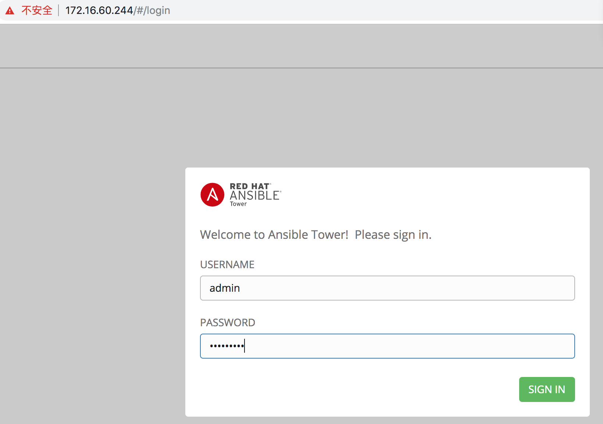
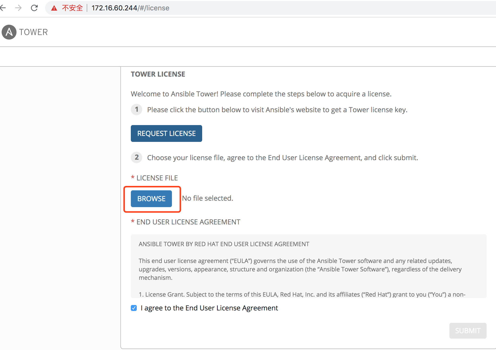
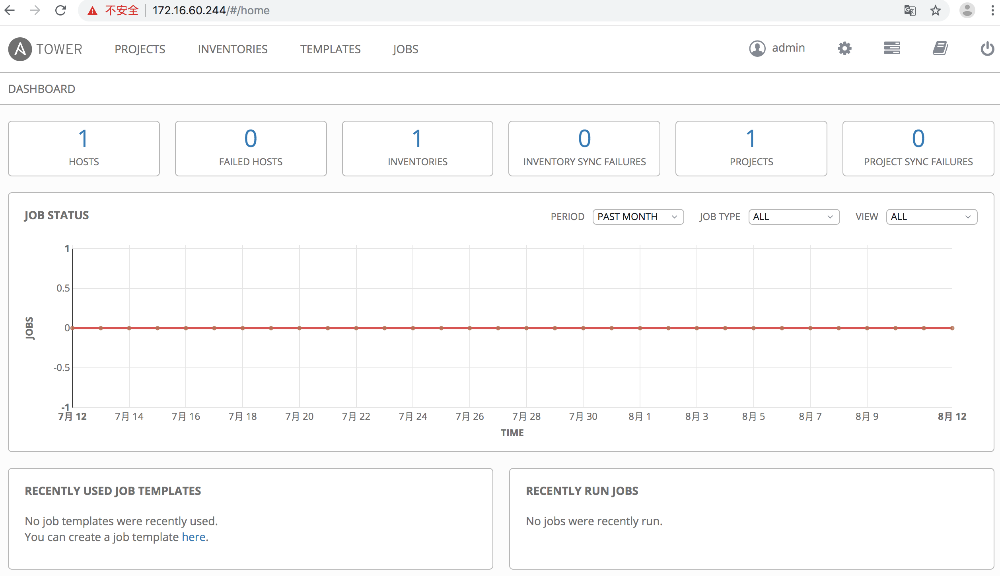
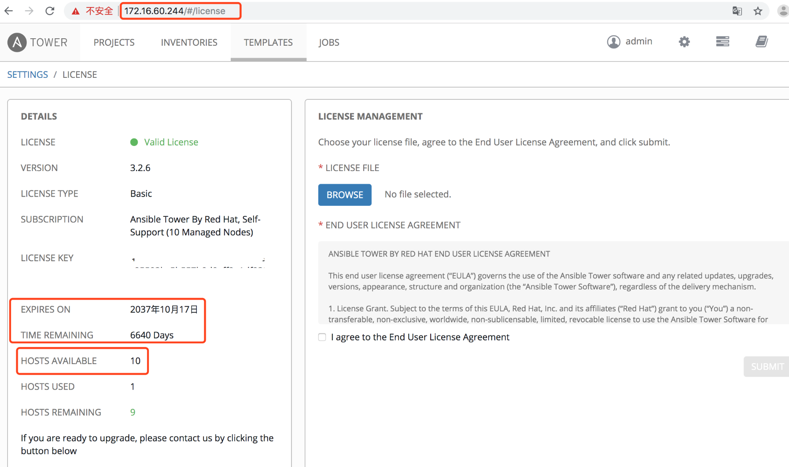
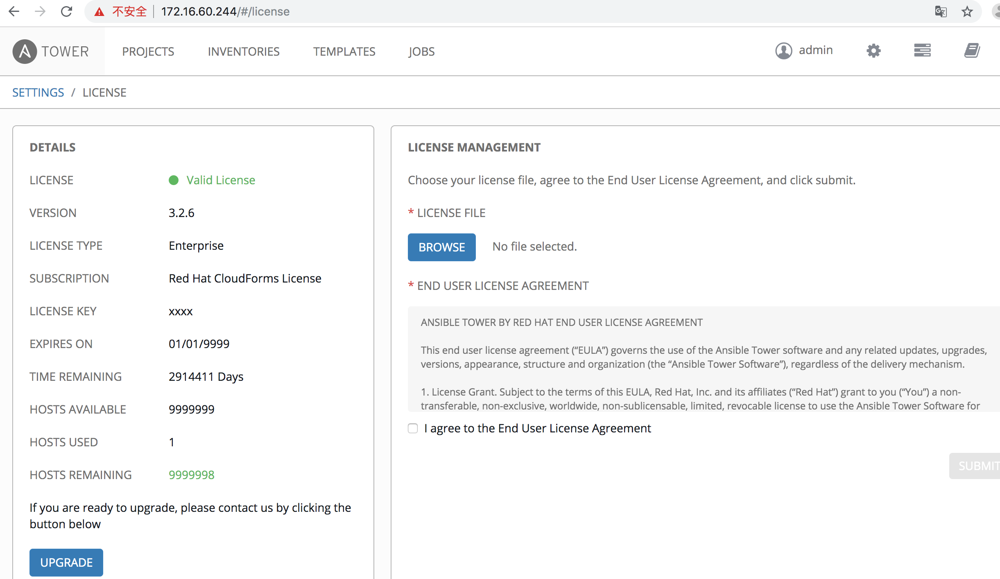

Ansible-Tower自动化运维管理环境 - 安装破解记录

 

公司中实现运维自动化的架构中主要用到ansible，ansible脚本在部署服务器指令行中显得不太直观。Ansible-Tower（之前叫做awx）是将ansible的指令界面化，简明直观，简单易用。Ansibke-tower其实就是一个图形化的任务调度，复杂服务部署，IT自动化的一个管理平台，属于发布配置管理系统，支持Api及界面操作，Django编写。Ansible-tower可以通过界面从github拉取最新playbook实施服务部署，提高生产效率。当然它也提供一个RESET API和命令行的CLI以供python脚本调用。下面是Ansible-Tower的搭建记录，在此分享下：

|   |   |
| - | - |
| 1 2 3 4 5 6 7 8 9 10 11 12 13 14 15 16 17 18 19 20 21 22 23 24 25 26 27 28 29 30 31 32 33 34 35 36 37 38 39 40 41 42 43 44 45 46 47 48 49 50 51 52 53 54 55 56 57 58 59 60 61 62 | Ansible-Tower目前支持7.4+的版本，可以使用yum update -y命令更新；      1. 安装Ansible的epel源 [root@ansible ~]\# cat /etc/redhat-release CentOS Linux release 7.5.1804 (Core)      [root@ansible ~]\# python -V Python 2.7.5     关闭selinux [root@ansible ansible-tower]\# vim /etc/sysconfig/selinux ......... SELINUX=disabled [root@ansible ansible-tower]\# setenforce 0 setenforce: SELinux is disabled [root@ansible ansible-tower]\# getenforce Disabled     关闭防火墙 [root@ansible ansible-tower]\# systemctl stop firewalld  [root@ansible ansible-tower]\# systemctl disable firewalld [root@ansible ansible-tower]\# firewall-cmd --state not running     ======================================================================================================== 需要注意：如果开启了防火墙，需要开放对应访问策略（这里是测试环境，就关闭了防火墙） [root@ansible ansible-tower]\# firewall-cmd --permanent --zone=public --add-port=80/tcp [root@ansible ansible-tower]\# systemctl restart firewalld.service ========================================================================================================     2. 安装Ansible [root@ansible ~]\# yum install -y ansible [root@ansible ~]\# ansible --version ansible 2.8.2   config file = /etc/ansible/ansible.cfg   configured module search path = [u'/root/.ansible/plugins/modules', u'/usr/share/ansible/plugins/modules']   ansible python module location = /usr/lib/python2.7/site-packages/ansible   executable location = /usr/bin/ansible   python version = 2.7.5 (default, Jun 20 2019, 20:27:34) [GCC 4.8.5 20150623 (Red Hat 4.8.5-36)]     3. 按照ansible-tower（官网下载地址: https://releases.ansible.com/ansible-tower/setup/） 下载地址：https://pan.baidu.com/s/1Uz-BFZXkjOr4FLg-lFF4fQ 提取密码：3e97     [root@ansible ~]\# cd /usr/local/src/ [root@ansible src]\# wget https://releases.ansible.com/ansible-tower/setup-bundle/ansible-tower-setup-bundle-3.2.6-1.el7.tar.gz [root@ansible src]\# tar -zvxf ansible-tower-setup-bundle-3.2.6-1.el7.tar.gz [root@ansible src]\# mv ansible-tower-setup-bundle-3.2.6-1.el7 /usr/local/ansible-tower [root@ansible src]\# cd /usr/local/ansible-tower [root@ansible ansible-tower]\# ls backup.yml  bundle  group\_vars  install.yml  inventory  licenses  README.md  restore.yml  roles  setup.sh     配置inventory文件 (注意：admin\_password处填写的就是ansible-tower登陆密码，密码可以自行设定) [root@ansible ansible-tower]\# sed -i "s\#password=''\#password='tower@123'\#g" inventory    [root@ansible ansible-tower]\# sed -i "s\#host=''\#host='127.0.0.1'\#g" inventory [root@ansible ansible-tower]\# sed -i "s\#port=''\#port='5432'\#g" inventory     安装前先创建/var/log/tower的日志目录，不然会报错 [root@ansible ansible-tower]\# mkdir -p /var/log/tower     接着执行ansible-tower的安装脚本，如果网络没有问题的话耐心等待安装完成即可. [root@ansible ansible-tower]\# ./setup.sh |

安装完成没报错的话即可访问web页面,这里测试机地址为172.16.60.244，则访问ansible-tower地址就是https://172.16.60.244, 默认初始页面如下:

默认用户为admin，密码为inventory文件admin_password字段配置的密码（如上设置的密码为"tower@123")。接着会提示让选择license文件，导入license，没有的话,点击REQUEST LICENSE，去官方 (https://www.ansible.com/license) 申请免费试用，填写个人信息后 (邮箱要填写正确,其他信息可随便填写) 会把license发到填写的邮箱。这里分享一个已经申请下来的license文件  (提取密码为: krwe)。提交license并登录成功后默认初始页面如下:

申请的免费版license最多只能添加10个主机, 且有时间限制。 下面记录下破解方法：

|   |   |
| - | - |
| 1 2 3 4 5 6 7 8 9 10 11 12 13 14 15 16 17 18 19 20 21 22 23 24 25 26 27 28 29 30 31 32 33 34 35 36 37 | [root@k8s-node01 ansible-tower]\# cd /var/lib/awx/venv/awx/lib/python2.7/site-packages/tower\_license [root@k8s-node01 tower\_license]\# ll total 28 -rw-r--r-- 1 root root 10417 Aug 11  2018 \_\_init\_\_.py -rw-r--r-- 1 root root  6352 Aug 11  2018 \_\_init\_\_.pyc -rw-r--r-- 1 root root  6352 Aug 11  2018 \_\_init\_\_.pyo   修改\_\_init\_\_.py文件 将119行和120行修改为如下内容,特别需要注意格式. 也就是在原文119和120行之间添加了一行"return True"内容，格式对齐即可 (即加入的"return True" 跟 后面的if语句保持对齐，不然后面重新编译会报错)。 [root@k8s-node01 tower\_license]\# vim \_\_init\_\_.py ......... 119     def \_check\_cloudforms\_subscription(self): 120         return True 121         if os.path.exists('/var/lib/awx/i18n.db'): 122             return True 123         if os.path.isdir("/opt/rh/cfme-appliance") and os.path.isdir("/opt/rh/cfme-gemset"): 124             try: .........   修改完重新编译一下: [root@k8s-node01 tower\_license]\# python -m py\_compile \_\_init\_\_.py [root@k8s-node01 tower\_license]\# python -O -m py\_compile \_\_init\_\_.py [root@k8s-node01 tower\_license]\#   重启服务: [root@k8s-node01 tower\_license]\# ansible-tower-service restart Restarting Tower Redirecting to /bin/systemctl stop postgresql-9.6.service Redirecting to /bin/systemctl stop rabbitmq-server.service Redirecting to /bin/systemctl stop nginx.service Redirecting to /bin/systemctl stop supervisord.service Redirecting to /bin/systemctl start postgresql-9.6.service Redirecting to /bin/systemctl start rabbitmq-server.service Redirecting to /bin/systemctl start nginx.service Redirecting to /bin/systemctl start supervisord.service [root@k8s-node01 tower\_license]\# |

重新打开ansible-tower界面的"settings"–>"VIEW YOUR LICENSE"，发现"Hosts Available"变成了9999999台,说明破解成功,如下:

                                                                                                                                              

需要注意：发现最新版本或者高版本的ansible-tower没有__init__.py文件，需要对__init__.pyc进行反编译，然后进行HOSTS限制破解操作：

|   |   |
| - | - |
| 1 2 3 4 5 6 7 8 9 10 11 12 13 14 15 16 17 18 19 20 21 22 23 24 25 26 27 28 29 30 31 32 33 34 35 36 37 38 39 40 41 42 43 44 45 46 47 48 49 50 51 52 53 54 55 56 57 58 59 60 61 62 | 比如下载ansible-tower-setup-latest.tar.gz最新的包，按照上面的按照部署，将ansible-tower部署到/usr/local目录下 [root@ansible ~]\# python --version Python 2.7.5   [root@ansible ~]\# cd /var/lib/awx/venv/awx/lib/python3.6/site-packages/tower\_license [root@ansible tower\_license]\# ll total 8 -rw-r--r-- 1 root root 5055 Aug 12 21:13 \_\_init\_\_.pyc drwxr-xr-x 2 root root   37 Aug 22 15:19 \_\_pycache\_\_   1）接下来进行反汇编init.pyc [root@ansible tower\_license]\# yum install python-pip [root@ansible tower\_license]\# pip -V pip 8.1.2 from /usr/lib/python2.7/site-packages (python 2.7)   [root@ansible tower\_license]\# pip install uncompyle6 [root@ansible tower\_license]\# uncompyle6 --version uncompyle6 3.3.5   [root@ansible tower\_license]\# uncompyle6 \_\_init\_\_.pyc &gt;\_\_init\_\_.py [root@ansible tower\_license]\# ll total 16 -rw-r--r-- 1 root root 7301 Aug 22 15:42 \_\_init\_\_.py -rw-r--r-- 1 root root 5055 Aug 12 21:13 \_\_init\_\_.pyc drwxr-xr-x 2 root root   37 Aug 22 15:19 \_\_pycache\_\_   2）修改\_\_init\_\_.py文件 [root@ansible tower\_license]\# vim \_\_init\_\_.py ........ \# \_check\_cloudforms\_subscription方法修改如下内容,特别需要注意格式。     def \_check\_cloudforms\_subscription(self): \# 只需要添加下面一行直接返回 True即可。注意格式要跟if对对齐。         return True         if os.path.exists('/var/lib/awx/i18n.db'):             return True         else:             if os.path.isdir('/opt/rh/cfme-appliance'):                 if os.path.isdir('/opt/rh/cfme-gemset'):                     pass             try: ........   \#修改"license\_date=253370764800L" 为 "license\_date=253370764800" ........       def \_generate\_cloudforms\_subscription(self):         self.\_attrs.update(dict(company\_name='Red Hat CloudForms License', instance\_count=9999999,           license\_date=253370764800,            \# 只需要修改这一行           license\_key='xxxx',           license\_type='enterprise',           subscription\_name='Red Hat CloudForms License')) ........   3）修改完重新编译一下 [root@ansible tower\_license]\# python -m py\_compile \_\_init\_\_.py [root@ansible tower\_license]\# python -O -m py\_compile \_\_init\_\_.py [root@ansible tower\_license]\#   4）重启服务 [root@ansible tower\_license]\# ansible-tower-service restart   5）最后打开url (https://your\_ip/\#/license) ,发现"Hosts Available"变成了"9999999"台, 到期时间变成了"01/01/9999", 说明破解成功了。 |

*************** 当你发现自己的才华撑不起野心时，就请安静下来学习吧！***************