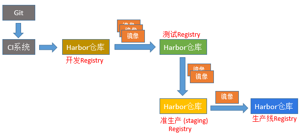
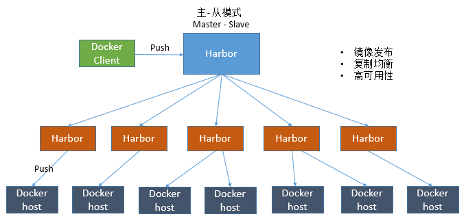
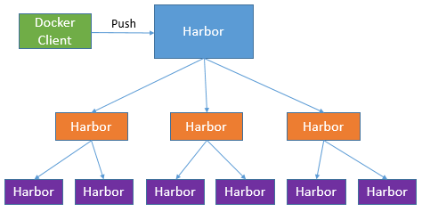
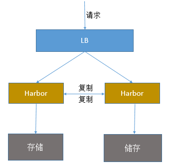
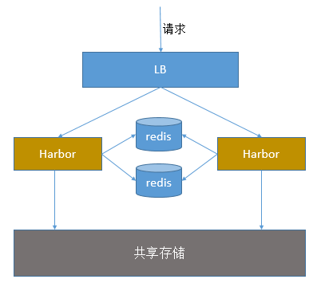

 

之前介绍Harbor私有仓库的安装和使用，这里重点说下Harbor高可用集群方案的部署，目前主要有两种主流的Harbor高可用集群方案：1）双主复制；2）多harbor实例共享后端存储。

一、Harbor双主复制高可用集群

1）主从同步

harbor官方默认提供主从复制的方案来解决镜像同步问题，通过复制的方式，我们可以实时将测试环境harbor仓库的镜像同步到生产环境harbor，类似于如下流程：

在实际生产运维的中，往往需要把镜像发布到几十或上百台集群节点上。这时，单个Registry已经无法满足大量节点的下载需求，因此要配置多个Registry实例做负载均衡。手工维护多个Registry实例上的镜像，将是十分繁琐的事情。Harbor可以支持一主多从的镜像发布模式，可以解决大规模镜像发布的难题：

只要往一台Harbor上发布，镜像就会像"仙女散花"般地同步到多个Registry中，高效可靠。

如果是地域分布较广的集群，还可以采用层次型发布方式，比如从集团总部机房同步到分公司1机房，再从分公司1机房同步到分公司2机房：

然而单靠主从同步，仍然解决不了harbor主节点的单点问题。

2）双主复制说明

所谓的双主复制其实就是复用主从同步实现两个harbor节点之间的双向同步，来保证数据的一致性，然后在两台harbor前端顶一个负载均衡器将进来的请求分流到不同的实例中去，只要有一个实例中有了新的镜像，就是自动的同步复制到另外的的实例中去，这样实现了负载均衡，也避免了单点故障，在一定程度上实现了Harbor的高可用性：

这个方案有一个问题就是有可能两个Harbor实例中的数据不一致。假设如果一个实例A挂掉了，这个时候有新的镜像进来，那么新的镜像就会在另外一个实例B中，后面即使恢复了挂掉的A实例，Harbor实例B也不会自动去同步镜像，这样只能手动的先关掉Harbor实例B的复制策略，然后再开启复制策略，才能让实例B数据同步，让两个实例的数据一致。另外，这里还需要多吐槽一句：在实际生产使用中，主从复制十分的不靠谱！！所以这里推荐使用下面要说的这种方案。

二、多harbor实例共享后端存储的高可用集群（推荐方案）

方案说明

共享后端存储算是一种比较标准的方案，就是多个Harbor实例共享同一个后端存储，任何一个实例持久化到存储的镜像，都可被其他实例中读取。通过前置LB进来的请求，可以分流到不同的实例中去处理，这样就实现了负载均衡，也避免了单点故障：

这个方案在实际生产环境中部署需要考虑三个问题：

1. 共享存储的选取，Harbor的后端存储目前支持AWS S3、Openstack Swift, Ceph等，在下面的实验环境里，暂且直接使用nfs。

2. Session在不同的实例上共享，这个现在其实已经不是问题了，在最新的harbor中，默认session会存放在redis中，只需要将redis独立出来即可。可以通过redis sentinel或者redis cluster等方式来保证redis的可用性。在下面的实验环境里，暂且使用单台redis。

3. Harbor多实例数据库问题，这个也只需要将harbor中的数据库拆出来独立部署即可。让多实例共用一个外部数据库，数据库的高可用也可以通过数据库的高可用方案保证。

部署记录

|   |   |
| - | - |
|  | 1. 环境说明 ======================================================================================== ip                  hostname         role 172.16.60.240       host-240         harbor 172.16.60.244       host-244         harbor 172.16.60.245       host-245         nfs      需要注意： 这里的环境中，不包括LB负载均衡器的配置，两台harbor前面需要架设一个LB层（比如Nginx+Keepalived），配置这里省略~      [root@host-240 ~]\# cat /etc/redhat-release CentOS Linux release 7.5.1804 (Core) [root@host-240 ~]\# systemctl stop firewalld [root@host-240 ~]\# systemctl disable firewalld [root@host-240 ~]\# firewall-cmd --state not running [root@host-240 ~]\# setenforce 0 [root@host-240 ~]\# cat /etc/sysconfig/selinux SELINUX=disabled    2. 172.16.60.245节点机操作 ======================================================================================= 1) 安装配置nfs [root@host-245 ~]\# yum install -y rpcbind nfs-utils      编辑/etc/exports文件 [root@host-245 ~]\# vim /etc/exports /kevin   \*(rw,no\_root\_squash)      [root@host-245 ~]\# mkdir /kevin [root@host-245 ~]\# chmod -R 777 /kevin      开启nfs的RCP服务和查看rpcbind服务端口 [root@host-245 ~]\# systemctl start rpcbind [root@host-245 ~]\# systemctl enable rpcbind      开启nfs服务 [root@host-245 ~]\# systemctl start nfs [root@host-245 ~]\# systemctl enable nfs    3. 172.16.60.240/244两台harbor节点机操作 ======================================================================================= 1）在两个harbor节点上挂载nfs目录 [root@host-240 harbor]\# mount -t nfs 172.16.60.245:/kevin /data mount: wrong fs type, bad option, bad superblock on 172.16.60.245:/kevin,        missing codepage or helper program, or other error        (for several filesystems (e.g. nfs, cifs) you might        need a /sbin/mount.&lt;type&gt; helper program)             In some cases useful info is found in syslog - try        dmesg | tail or so.     [root@host-240 harbor]\# yum install nfs-utils [root@host-240 harbor]\# mount -t nfs 172.16.60.245:/kevin /data   2）安装harbor 可以参考：https://www.cnblogs.com/kevingrace/p/6547616.html 两个节点harbor相互配置同步，实现harbor主主复制 安装harbor后，可以在host-240和host-245节点上查看harbor容器情况： [root@host-240 harbor]\# docker-compose ps       Name                     Command                  State                 Ports       --------------------------------------------------------------------------------------------- harbor-core         /harbor/start.sh                 Up (healthy)                         harbor-db           /entrypoint.sh postgres          Up (healthy)   5432/tcp              harbor-jobservice   /harbor/start.sh                 Up                                   harbor-log          /bin/sh -c /usr/local/bin/ ...   Up (healthy)   127.0.0.1:1514-&gt;10514/tcp harbor-portal       nginx -g daemon off;             Up (healthy)   80/tcp                nginx               nginx -g daemon off;             Up (healthy)   0.0.0.0:80-&gt;80/tcp    redis               docker-entrypoint.sh redis ...   Up             6379/tcp              registry            /entrypoint.sh /etc/regist ...   Up (healthy)   5000/tcp              registryctl         /harbor/start.sh                 Up (healthy)      可以尝试登录容器 [root@host-240 harbor]\# docker ps|grep harbor-db    680bd1ed9e48        goharbor/harbor-db:v1.8.0     "/entrypoint.sh post…"   6 days ago          Up 6 days (healthy)   5432/tcp                    harbor-db [root@host-240 harbor]\# docker exec -ti harbor-db bash root [ / ]\#      这里需要注意： harbor同步配置可以参考：https://www.cnblogs.com/kevingrace/p/10995648.html harbor主主复制(两个harbor节点相互配置到对方的同步策略)时，注意： "同步管理"规则里的"同步模式"（建议使用push推送模式。push模式是推到目标仓库，pull模式是从源仓库拉取过来） "同步管理"规则里的"触发模式" (建议采用定时模式，比如每10秒钟同步一次：\*/10 \* \* \* \* \*) "同步管理"规则里的"源资源过滤器"（如果没有过滤需求，就不要配置这一项）     4. LB配置 ======================================================================================= 在两个harbor节点的前面部署LB负载均衡层，通过VIP提供统一入口 (如域名)，实现harbor访问的负载均衡和高可用。 可以通过绑定hosts到不同的节点来验证两个节点的负载均衡效果。    5. 额外需要注意 ======================================================================================= 这里使用nfs作为harbor的后端，还可以使用ceph作为后端存储（ceph部署可参考：https://www.cnblogs.com/kevingrace/p/9141432.html） 这里没有考虑到harbor高可用时的session问题，如果要解决session问题，可以使用外部的mysql和redis！！    1）比如在172.16.60.245机器上再部署mysql和redis（需提前安全docker和docker和docker-compose）      docker-compose.yml文件内容如下： [root@host-245 ~]\# vim docker-compose.yml version: '3' services:   mysql-server:     hostname: mysql-server     container\_name: mysql-server     image: mysql:5.7     network\_mode: host     volumes:       - /mysql57/kevin:/var/lib/mysql     command: --character-set-server=utf8     environment:       MYSQL\_ROOT\_PASSWORD: 123456   redis:     hostname: redis-server     container\_name: redis-server     image: redis:3     network\_mode: host      启动docker-compose [root@host-245 ~]\# docker-compose up -d      启动后查看 [root@host-245 ~]\# docker-compose ps     Name                  Command               State   Ports ------------------------------------------------------------- mysql-server   docker-entrypoint.sh --cha ...   Up        redis-server   docker-entrypoint.sh redis ...   Up      可以尝试登录mysql容器数据库中 [root@host-245 ~]\# docker-compose exec mysql-server bash root@mysql-server:/\# mysql -p123456      或者直接登录 [root@host-245 ~]\# docker-compose exec mysql-server mysql -p123456    2）接着需要往172.16.60.245上部署的mysql数据库中导入harbor节点的registry数据库    在两台harbor节点上导出数据库，并将registry.dump复制出来 \# docker exec -it harbor\_db /bin/bash   登陆harbor\_db容器后执行：   mysqldump -uroot -p --databases registry &gt; registry.dump \# docker cp  harbor\_db:/registry.dump ./ 再将registry.dump复制到245节点的mysql容器中 \# scp ./registry.dump root@172.16.60.245:/root    在245节点上，将registry数据库导入到mysql容器中 \# docker cp /root/registry.dump mysql-server:/registry.dump \# docker exec -it mysql-server /bin/bash   登陆到mysql容器后执行：   mysql -uroot -p123456   mysql&gt; source /registry.dump    3) 在两个harbor节点上，修改harbor.yml文件，需要修改成使用外部数据库及redis db\_host = 172.16.60.245 db\_password = 123456 db\_port = 3306 db\_user = root redis\_url = 172.16.60.245:6379    修改docker-compose.yml配置 由于harbor集群已使用外部的数据库和redis解决session问题，故需要将docker-compose.yml文件里关于数据库和redis的配置去掉。    ==================================================================================== 由于Harbor新版本里增加了对PostgreSQL数据库的支持, 不使用mysql数据库。 可以在docker-compose.yml文件里将对应的postgresql容器改为mysql容器（参考之前的harbor版本配置） |

*************** 当你发现自己的才华撑不起野心时，就请安静下来学习吧！***************

分类: DRBD