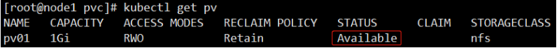
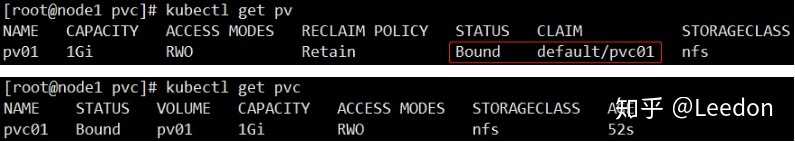
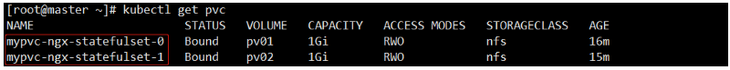

Kubernetes之StatefulSet

Leedon

IT界的奇葩

1 StateFulSet简介

Deployment 实际上并不足以覆盖所有的应用编排问题。 如果一个应用的所有 Pod是完全一样的，它们之间没有启动顺序要求，也无所谓运行在哪台宿主机上。对于这样的应用，Deployment 可以随时通过 Pod 模板创建新的 Pod；不需要的时候，可以“杀掉”任意一个 Pod。

在实际的场景中，并不是所有的应用都可以满足这样的要求。

例如 Mysql集群、MongoDB集群、ZooKeeper集群等，它的多个实例之间，可能有依赖关系 (比如：主从关系); 还有就是数据存储，它的多个实例，可能会在本地磁盘上保存一份自己独有的数据。如果还使用RC或Deployment这类控制器进行管理, 那么这些实例一旦被杀掉，再次重建出来后，实例与数据之间的对应关系也已经丢失，从而导致应用失败。这种实例之间有不对等关系，以及实例对外部数据有依赖关系的应用，被称为“有状态应用”。

StatefulSet 有如下一些特性：

- StatefulSet里的每个Pod都有稳定、唯一的网络标识，可以用来发现集群内的其他成员。假设 StatefulSet 的名字叫 kafka，那么第1个Pod叫 kafka-0，第2个叫kafka-1，以此类推。

- StatefulSet控制的Pod副本的启停顺序是受控的，创建一个Pod时，它的前1个Pod已经是运行且准备好的状态。

- StatefulSet 里的 Pod 采用稳定的持久化存储卷，通过 PV/PVC 来实现，删除 Pod 时默认不会删除与StatefulSet 相关的存储卷（为了保证数据的安全）。

StatefulSet 除了要与PV卷捆绑使用以存储 Pod 的状态数据，还要与 Headless Service(无头服务) 配合使用。

Headless Service 与普通 Service 的区别在于，它没有 Cluster IP，如果解析 Headless Service 的 DNS 域名，则返回的是该 Service 对应的全部 Pod 的 Endpoint列表。

StatefulSet 在 Headless Service 的基础上又为 StatefulSet 控制的每个 Pod 实例创建了一个 DNS 域名，这个域名的格式为：<pod-name>.<service-name>

比如一个 3 节点的 kafka 的 StatefulSet 集群，对应的 Headless Service 的名字为 kafkasvc，StatefulSet 的名字为kafka，则 StatefulSet 里面的 3 个 Pod 的 DNS 名称分别为kafka-0.kafkasvc、kafka-1.kafkasvc、kafka-2.kafkasvc，这些DNS 名称可以直接在集群的配置文件中固定下来。

2 StateFulSet设计思路

StatefulSet 把应用状态抽象为了两种情况：

拓扑状态

应用的多个实例必须按照一定的顺序启动。

比如: 应用的主节点 A 要先于从节点 B 启动，如果把 A 和 B 两个 Pod 删除掉，它们再次被创建出来时也必须严格按照这个顺序才行; 同时新创建出来的 Pod，必须和原来 Pod 的网络标识一样，这样原先的访问者才能使用同样的方法，访问到这个新 Pod。

存储状态

- 应用的多个实例分别绑定了不同的存储数据。

- 对于这些应用实例来说，Pod A 第一次读取到的数据，和重建后读取的数据应该是同一份

StatefulSet 的核心功能就是通过某种方式记录这些状态，在 Pod 被重建时，能够为新 Pod 恢复这些状态。

2.1 拓扑状态

下面是一个StateFulSet的例子

apiVersion: apps/v1
kind: StatefulSet
metadata:
  name: ngx-statefulset
spec:
  serviceName: mynginx         # 使用这个Headless Service来保证
  replicas: 2
  selector:
    matchLabels:
      app: nginx
  template:
    metadata:
      labels:
        app: nginx
    spec:
      containers:
      - name: nginx
        image: registry.cn-shenzhen.aliyuncs.com/leedon/nginx:1.12
        ports:
        - name: web-service
          containerPort: 80

这个 YAML 文件，和我们在前面文章中用到的 nginx-deployment 的区别，就是多了 serviceName=mynginx 字段. 这个字段的作用是告诉 StatefulSet 控制器使用 mynginx 这个 Headless Service 来保证 Pod 的“可解析身份”。

为上面的Statefulset创建一个Service:

apiVersion: v1
kind: Service
metadata:
  name: mynginx
spec:
  clusterIP: None       # 这是一个Headless Service
  ports:
  - port: 80
  selector:
    app: nginx

将它们创建出来并查看

[root@master ~]# kubectl get statefulset
NAME              READY   AGE
ngx-statefulset   2/2     8s
​
[root@master ~]# kubectl describe statefulset ngx-statefulset
...
Events:
  Type    Reason            Age    From                    Message
  ----    ------            ----   ----                    -------
  Normal  SuccessfulCreate  4m1s   statefulset-controller  create Pod ngx-statefulset-0 in StatefulSet ngx-statefulset successful
  Normal  SuccessfulCreate  3m59s  statefulset-controller  create Pod ngx-statefulset-1 in StatefulSet ngx-statefulset successful
---
# StatefulSet 给它所管理的所有 Pod 进行了编号，编号规则是：<name>-<number>。
# 编号从 0 开始累加，与 StatefulSet 的每个 Pod 实例一一对应，绝不重复。这些 Pod 的创建，也是严格按照编号顺序进行的。
# 这个例子中，在 ngx-statefulset-0 进入到 Running 状态、并且状态成为 Ready 之前，ngx-statefulset-1 会一直处于 Pending 状态。
---
  
[root@master ~]# kubectl get po
NAME                READY   STATUS    RESTARTS   AGE
ngx-statefulset-0   1/1     Running   0          5m
ngx-statefulset-1   1/1     Running   0          5m
​
[root@master ~]# kubectl get svc
NAME         TYPE        CLUSTER-IP   EXTERNAL-IP   PORT(S)   AGE
kubernetes   ClusterIP   10.0.0.1     <none>        443/TCP   10d
mynginx      ClusterIP   None         <none>        80/TCP    5m
​
[root@master ~]# kubectl get ep
NAME         ENDPOINTS                      AGE
kubernetes   192.168.10.10:6443             10d
mynginx      10.244.40.4:80,10.244.6.4:80   5m

我们创建一个测试Pod, 测试一下这两个Pod的 "唯一网络标识"

[root@master ~]# kubectl run -it test --image=registry.cn-shenzhen.aliyuncs.com/leedon/busybox-dig --rm
/ # nslookup ngx-statefulset-0.mynginx
Server:    10.0.0.2
Address 1: 10.0.0.2 kube-dns.kube-system.svc.cluster.local
​
Name:      ngx-statefulset-0.mynginx
Address 1: 10.244.6.4 ngx-statefulset-0.mynginx.default.svc.cluster.local
​
/ # nslookup ngx-statefulset-1.mynginx
Server:    10.0.0.2
Address 1: 10.0.0.2 kube-dns.kube-system.svc.cluster.local
​
Name:      ngx-statefulset-1.mynginx
Address 1: 10.244.40.4 ngx-statefulset-1.mynginx.default.svc.cluster.local
​
/ # nslookup mynginx
Server:    10.0.0.2
Address 1: 10.0.0.2 kube-dns.kube-system.svc.cluster.local
​
Name:      mynginx
Address 1: 10.244.40.4 ngx-statefulset-1.mynginx.default.svc.cluster.local
Address 2: 10.244.6.4 ngx-statefulset-0.mynginx.default.svc.cluster.local

总结: 拓扑型 StatefulSet 创建 Pod 的时候会对它们进行编号，并且按照编号顺序逐一完成创建工作。

2.2 存储状态

StatefulSet 对存储状态的管理，主要使用的是 PersistentVolume 的功能。

2.2.1 PV/PVC介绍

PersistentVolume（PV）是集群中由管理员配置的一段网络存储。 它是集群中的资源，就像节点是集群资源一样。 PV是容量插件，如Volumes，但其生命周期独立于使用PV的任何单个pod。 此API对象捕获存储实现的详细信息，包括NFS，iSCSI或特定于云提供程序的存储系统。

PersistentVolumeClaim（PVC）是由用户进行存储的请求。 它类似于pod。 Pod消耗节点资源，PVC消耗PV资源。Pod可以请求特定级别的资源（CPU和内存）。声明可以请求特定的大小和访问模式（例如，可以一次读/写 或多次只读）。

虽然PersistentVolumeClaims允许用户使用抽象存储资源，但是PersistentVolumes对于不同的问题，用户通常需要具有不同属性（例如性能）。群集管理员需要能够提供各种PersistentVolumes不同的方式，而不仅仅是大小和访问模式，而不会让用户了解这些卷的实现方式。对于这些需求，有StorageClass 资源。

StorageClass为管理员提供了一种描述他们提供的存储的“类”的方法。 不同的类可能映射到服务质量级别，或备份策略，或者由群集管理员确定的任意策略。

PVC和PV是一一对应的。

2.2.2 PV/PVC生命周期

PV是群集中的资源。PVC是对这些资源的请求，并且还充当对资源的检查。PV和PVC之间的相互作用遵循以下生命周期：Provisioning--> Binding--> Using--> Releasing--> Recycling

1 供应准备Provisioning --- 通过集群外的存储系统或者云平台来提供存储持久化支持。

- 静态提供Static：集群管理员创建多个PV。 它们携带可供集群用户使用的真实存储的详细信息。 它们 存在于Kubernetes API中，可用于消费

- 动态提供Dynamic：当管理员创建的静态PV都不匹配用户的PersistentVolumeClaim时，集群可能会 尝试为PVC动态配置卷。 此配置基于StorageClasses：PVC必须请求一个类，并且管理员必须已创建并 配置该类才能进行动态配置。 要求该类的声明有效地为自己禁用动态配置。

2 绑定Binding---用户创建pvc并指定需要的资源和访问模式。

在找到可用pv之前，pvc会保持未绑定状态。

3 使用Using---用户可在pod中像volume一样使用pvc。

4 释放Releasing---用户删除pvc来回收存储资源

pv将变成“released”状态。由于还保留着之前的数据，这些数据需要根据不同的策略来处理，否则这些存储资源无法被其他pvc使用。

5 回收Recycling---pv可以设置三种回收策略：保留（Retain），回收（Recycle）和删除（Delete）。

- 保留策略：允许人工处理保留的数据。

- 删除策略：将删除pv和外部关联的存储资源，需要插件支持。

- 回收策略：将执行清除操作，之后可以被新的pvc使用，需要插件支持。

目前 NFS和 HostPath类型卷支持回收策略，AWS EBS,GCE PD,Azure Disk和 Cinder支持删除(Delete)策略。

2.2.3 PV类型

- GCEPersistentDisk
- AWSElasticBlockStore
- AzureFile
- AzureDisk
- FC (Fibre Channel)
- Flexvolume
- Flocker
- NFS
- iSCSI
- RBD (Ceph Block Device)
- CephFS
- Cinder (OpenStack block storage)
- Glusterfs
- VsphereVolume
- Quobyte Volumes
- HostPath (Single node testing only – local storage is not supported in any way and WILL NOT WORK in a multi-node cluster)
- Portworx Volumes
- ScaleIO Volumes
- StorageOS

我们前面学习的 Volume 是定义在 Pod 上的，属于“计算资源”的一部分.

而“网络存储”则是相对独立于“计算资源”而存在的一种实体资源。比如在使用云主机的情况下，我们通常会先创建一个网络存储，然后从中划出一个“网盘”并挂载到云主机上。Persistent Volume（简称PV）和与之相关联的 Persistent Volume Claim（简称PVC）实现了类似的功能。

PV 与 Volume 的区别如下：

- PV 只能是网络存储，不属于任何 Node，但可以在每个 Node 上访问。
- PV 并不是定义在 Pod 上的，而是独立于 Pod 之外定义。

2.2.4 在Pod中使用PVC

有了PV/PVC这两个API, 我们就可以保证有状态应用的存储状态了. 上面的StatefulSet由两个Pod组成, 所以我们需要两份存储, 分别用于存储不同Pod上各自的数据.

1 准备NFS存储(过程略)

2 创建PV, 下面是一个例子:

apiVersion: v1
kind: PersistentVolume
metadata:
  name: pv01
spec:
  # PV的类, 特定类的PV只能绑定到请求该类的PVC。无此字段的PV没有类，只能绑定到不需要特定类的PVC。
  storageClassName: nfs      
  capacity:                  # PV容量
    storage: 1Gi
  accessModes:               # 访问模式
  - ReadWriteOnce
  nfs:
    path: /web1
    server: 192.168.10.20
    
#==================================
PV 的 accessModes 属性有以下类型：
- ReadWriteOnce：读写权限、并且只能被单个 Node 挂载。
- ReadOnlyMany：只读权限、允许被多个 Node 挂载。
- ReadWriteMany：读写权限、允许被多个 Node 挂载。

执行后查看:

PV 是有状态的对象，它有以下几种状态：

- Available：空闲状态。
- Bound：已经绑定到某个 PVC 上。
- Released：对应的 PVC 已经删除，但资源还没有被集群收回。
- Failed：PV 自动回收失败。

3 定义PVC

如果 Pod 想申请使用 PV 资源，则首先需要定义 PersistentVolumeClaim（PVC）对象：

apiVersion: v1
kind: PersistentVolumeClaim
metadata:
  name: pvc01
spec:
  storageClassName: nfs   # 只能绑定nfs类的PV
  accessModes:
  - ReadWriteOnce
  resources:
    requests:
      storage: 1Gi        # 请求的容量,只能绑定大于或等于此容量的PV

创建后查看:

4 在Pod中使用PVC

apiVersion: v1
kind: Pod
metadata:
  name: my-nginx-pod
spec:
  nodeName: 192.168.10.12
  containers:
    - name: nginx
      image: nginx
      imagePullPolicy: IfNotPresent
      ports:
        - containerPort: 80
      volumeMounts:
        - name: mypvc
          mountPath: /usr/share/nginx/html
  volumes:
    - name: mypvc
      persistentVolumeClaim:
        claimName: pvc01
​
---
# 在Pod 的 Volumes 定义中，只需要声明它的类型是 persistentVolumeClaim，然后指定 PVC 的名字，完全不必关心 Volume 本身的定义。这也为非运维部门的童鞋使用volume带来了极大的便利.

Kubernetes 中 PVC 和 PV 的设计，实际上类似于 接口 和 实现 的思想。开发者只要知道并会使用 接口，即PVC；而运维人员则负责给 接口 绑定具体的 实现，即 PV。这种解耦，避免了因为向开发者暴露过多的存储系统细节而带来的隐患。此外，这种职责的分离，往往也意味着出现事故时可以更容易定位问题和明确责任，从而避免“扯皮”现象的出现。

2.2.5 StatefulSet

PVC、PV 的设计，也使得 StatefulSet 对存储状态的管理成为了可能。

我们还是以上一篇"拓扑状态"中提到的 StatefulSet 为例:

apiVersion: apps/v1
kind: StatefulSet
metadata:
  name: ngx-statefulset
spec:
  serviceName: mynginx         # 使用这个Headless Service来保证
  replicas: 2
  selector:
    matchLabels:
      app: nginx
  template:
    metadata:
      labels:
        app: nginx
    spec:
      containers:
      - name: nginx
        image: registry.cn-shenzhen.aliyuncs.com/leedon/nginx:1.12
        ports:
        - name: web-service
          containerPort: 80
        volumeMounts:
          - name: mypvc
            mountPath: /usr/share/nginx/html
  volumeClaimTemplates:         # PVC模板,作用类似于Pod模板, 用于创建PVC
  - metadata:
      name: mypvc
    spec:
      storageClassName: nfs
      accessModes:
      - ReadWriteOnce
      resources:
        requests:
          storage: 1Gi
​
---
# 说明:
# volumeClaimTemplates: 跟Deployment里 Pod 模板的作用类似。凡是被这个 StatefulSet 管理的 Pod，都会声明一个对应的 PVC；而这个 PVC 的定义，就来自于 volumeClaimTemplates 这个模板字段。这个 PVC 的名字，会被分配一个与这个 Pod 完全一致的编号。
# 当自动创建的PVC与PV绑定成功后，就会进入Bound状态，这就意味着这个Pod可以挂载并使用这个PV了。
# 当然前提是要有足够的满足需求的PV , 以及与PV相应的储存资源。

我们将这个StatefulSet创建出来以后查看:

可以看到，这些 PVC，都以<PVC名字 >-<StatefulSet名字 >-<编号> 的方式命名，并且处于 Bound 状态。

我们在这两个Pod绑定的volume里写入不同的内容, 再手动delete掉这两个Pod, 待Pod被重建后, 再次查看它们所绑定的volume中的内容, 会发现依然没有任何变化.

StatefulSet 控制器恢复 Pod 的过程

1. 当Pod被删除之后，这个Pod对应的PVC和PV及它们的绑定关系并不会被删除(这点通过PV/PVC的"AGE"字段可以看出)，因此PV所对应的存储资源中所存储的内容当然也不会有任何改变；

1. StatefulSet控制器发现Pod消失了，它就会试图重建 Pod；

1. 重建的Pod还是叫同样的名字, 按照同样的顺序来创建；

1. 重建Pod时PVC也叫同样的名字, 因之前的PVC保留着, 所以直接挂载使用。

3 总结

1. StatefulSet 的控制器直接管理的是 Pod。这是因为，StatefulSet 里的不同 Pod 实例，不再像 ReplicaSet 中那样都是完全一样的，而是有了细微区别的。比如，每个 Pod 的 hostname、名字等都是不同的、携带了编号的。而 StatefulSet 区分这些实例的方式，就是通过在 Pod 的名字里加上事先约定好的编号。

2. Kubernetes 通过 Headless Service，为这些有编号的 Pod，在 DNS 服务器中生成带有同样编号的 DNS 记录。只要 StatefulSet 能够保证这些 Pod 名字里的编号不变，那么 Service 里类似于 web-0.nginx.default.svc.cluster.local 这样的 DNS 记录也就不会变，而这条记录解析出来的 Pod 的 IP 地址，则会随着后端 Pod 的删除和再创建而自动更新。这当然是 Service 的能力，不需要 StatefulSet 操心。

3. StatefulSet 为每一个 Pod 分配并创建一个同样编号的 PVC。这样，Kubernetes 就可以通过 Persistent Volume 机制为这个 PVC 绑定上对应的 PV，从而保证了每一个 Pod 都拥有一个独立的 Volume。在这种情况下，即使 Pod 被删除，它所对应的 PVC 和 PV 依然会保留下来。所以当这个 Pod 被重新创建出来之后，Kubernetes 会为它找到同样编号的 PVC，挂载这个 PVC 对应的 Volume，从而获取到以前保存在 Volume 里的数据。

编辑于 2020-04-09