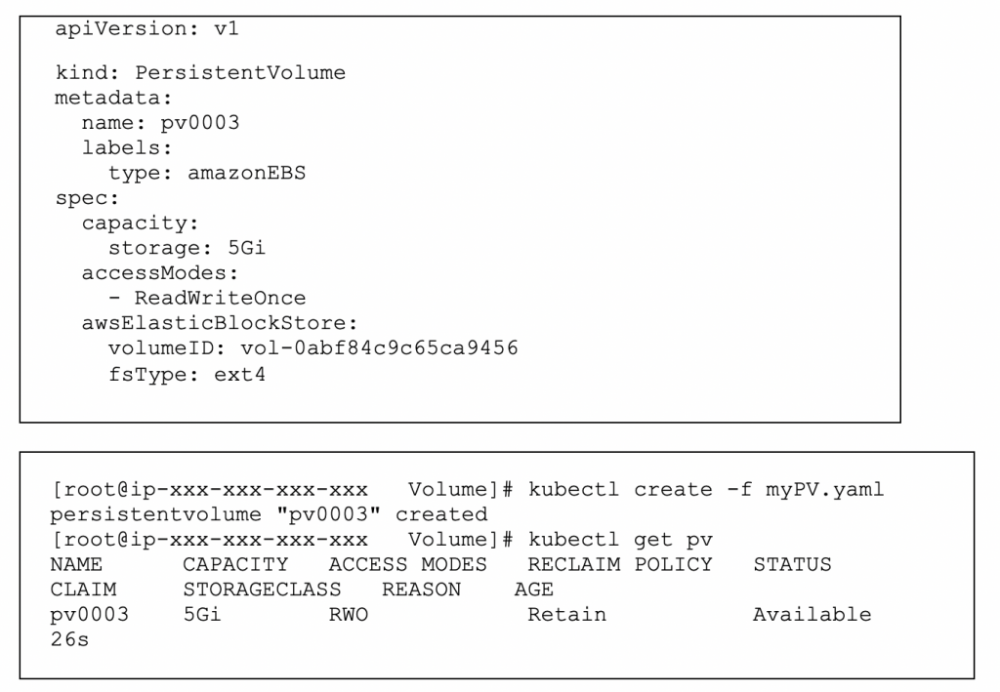
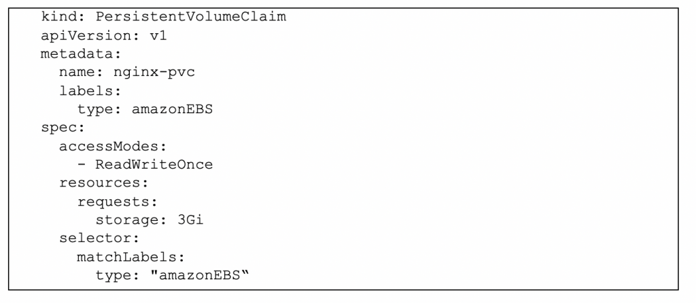
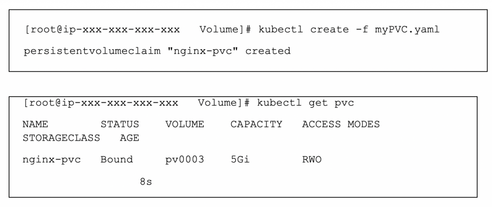
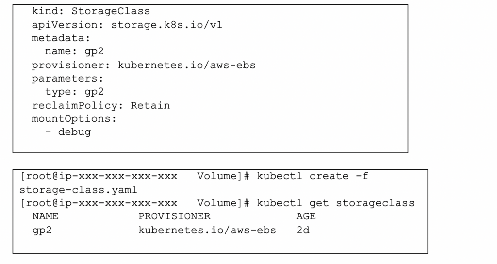
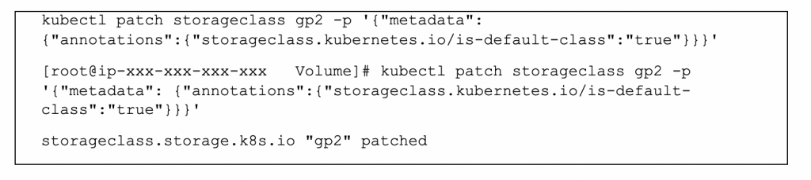
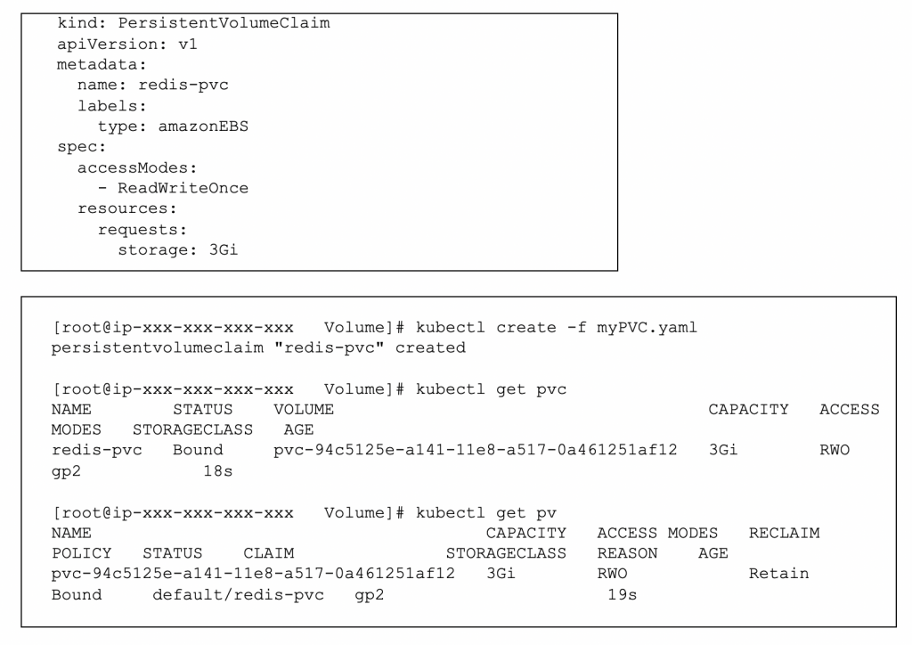
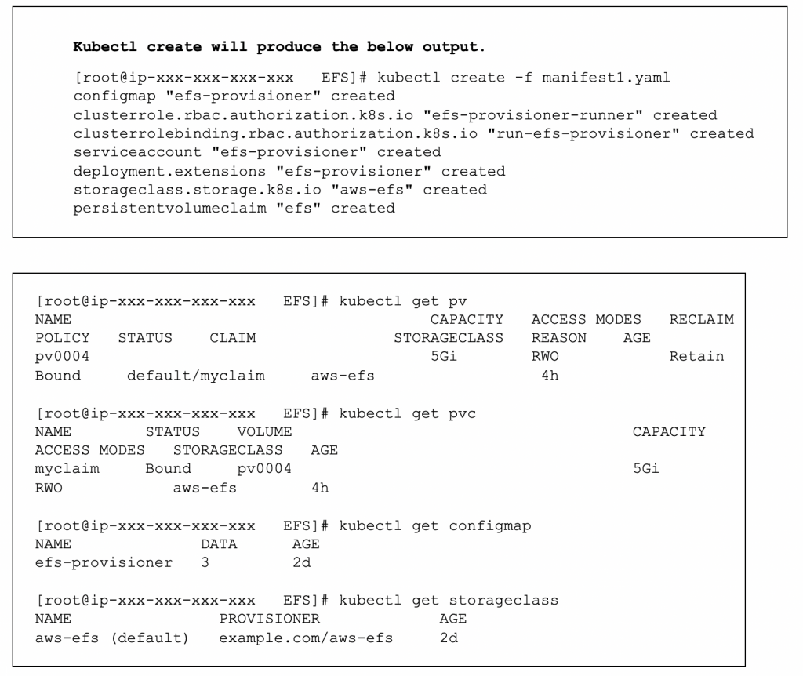

Using EBS and EFS as Persistent Volume in Kubernetes

 April 8, 2019 aws, EBS, EFS, Elastic Block Storage, Elastic File System, kubernetes

by Samson Gunalan

If your Kubernetes cluster is running in the cloud on Amazon Web Services (AWS), it comes with Elastic Block Storage (EBS). Or, Elastic File System (EFS) can be used for storage.

We know pods are ephemeral and in most of the cases we need to persist the data in the pods. To facilitate this, we can mount folders into our pods that are backed by EBS volumes on AWS using AWSElasticBlockStore, a volume plugin provided by Kubernetes.

We can also use EFS as storage by using efs-provisioner. Efs-provisioner runs as a pod in the Kubernetes cluster that has access to an AWS EFS resource.

In this blog we will see how to use EBS or EFS as a persistent volume for our Kubernetes cluster in AWS. Before that, we will discuss some common terms and the difference between EBS and EFS.

K8s Clusters in AWS

Kubernetes is an open source system for automating the deployment, scaling and management of containerized applications. There are multiple ways to create a Kubernetes cluster in AWS. The two most common ways are:

1. The traditional way of installing a master and worker nodes in the EC2 instances.

1. Using the AWS-provided Amazon Elastic Container Service for Kubernetes (EKS), which is a managed service that makes it easy for you to run Kubernetes on AWS without needing maintain your own Kubernetes control plane.

Why Storage Volumes in K8s??

Data in a container are ephemeral, which presents problems for non-trivial applications such as databases when running in containers. First, when a container crashes, Kubernetes will restart the container in a clean state where all the data is lost. Second, when running containers together in a pod, it is often necessary to share files between those containers. The Kubernetes Volume abstraction solves these problems.

Storage Class

A storage class provides a way for administrators to describe the “classes” of storage they offer. Different classes might map to quality-of-service levels or to backup policies or arbitrary policies determined by the cluster administrators.

Storage classes have a provisioner that determines what volume plugin is used for provisioning persistent volumes (PVs). This field must be specified. In our case, For EBS it will be “kubernetes.io/aws-ebs”—this storage provisioner will take care that a corresponding EBS volume with the correct parameters is created. Data will persist as long as the corresponding PV resource exists. Deleting the resource will also delete the corresponding EBS volume, which means that all stored data will be lost at that point.

For EFS we will create a efs_provisioner pod, which manages the EFS resources. The efs-provisioner container reads a configmap, which contains the EFS filesystem ID, the AWS region and the name you want to use for your efs-provisioner. This name will be used later when you create a storage class.

EBS vs. EFS

| EFS | EBS |
| - | - |
| Amazon EFS provides a shared file storage for use with compute instances in the AWS cloud and on premise servers. | Amazon EBS is a cloud block storage service that provides direct access from a single EC2 instance to a dedicated storage volume. |
| Applications that require shared file access can use Amazon EFS for reliable file storage delivering high aggregate throughput to thousands of clients simultaneously. | Application that require persistent dedicated block access for a single host can use EBS as a high available and low-latency block storage solution. |
| EFS PV provides ReadWriteMany access mode. | EBS PV provide only ReadWriteOnce access mode. |
| AN EFS file system can be accessed from multiple availability zones and it is the valuable for multi-AZ cluster. | EBS can be accessed by the host it is connected within the zone. EBS volume is automatically replicated within its Availability Zone to protect you from component failure, offering high availability and durability. |
| It is better to choose EFS when it is difficult to estimate the amount of storage the application will use because EFS is built to elastically scale. | Automatic scaling is not available in EBS but can scaled up down based on the need. |
| More costly than EBS. | Cost-efficient. |
| EFS is a file system; hence, it won’t support some applications such as databases that require block storage. | Can support all type of application. |
| EFS doesn’t support any backup mechanism we need to setup backup manually. | EBS on the other hand provides point-in-time snapshots of EBS volumes, which are backed up to Amazon S3 for long-term durability. |
| EFS doesn’t support snapshots. | Amazon EBS provides the ability to copy snapshots across AWS regions, enabling geographical expansion, data center migration, and disaster recovery providing flexibility and protecting for your business. |

 

How to create PV for EBS

Persistent volume in EBS with default storage class

Create a PV with an EBS volume:

Create a PVC to claim the PV:

Persistent volume in EBS with gp2 storage class

Create gp2 the storage class:

Set gp2 storage-class as the default storage-class (this is optional—the storage class can be specified in the PV Yaml as well):

Create the PVC using the gp2 storage class:

- Once we create a PVC, the kubelet will automatically create a PV and will be bound with the PVC.

- The PV created is not going to use the existing EBS volume; it will create a new EBS volume.

Persistent volume in EFS with aws-efs storage class

- Create EFS (only the first time): It includes the tasks—create the EFS in the right subnets, set up the security groups to allow Kubernetes nodes to access and enable DNS support/resolution in your VPC.

- Create storage class for EFS via efs-provisioner (only the first time): efs-provisioner runs as a container that plays the role of EFS broker. It allows other pods to mount EFS as the persistent volumes. Just be aware that EFS is built on top of NFS4, so you need to have nfs-common packages installed in your Kubernetes nodes.

- Create a PVC to use the storage class for EFS: Just note that EFS has unlimited storage, so the storage size request actually does not take any effects here. But you still have to keep it to pass the syntax check.

- Create a volume for the PVC, then mount the volume inside the pod.

- Download the manifest file yaml.

Conclusion

Handling EBS in AWS has been simplified by the Kubernetes volume plugin. Kubernetes automatically provisions your volume by the type of provisioner provided in the storage class. Even though mounting an EFS as a volume involves more setup, Kubernetes still handles it with ease once all your setup is done.

For more details on EFS provisioner please visit: https://github.com/kubernetes-incubator/external-storage/tree/master/aws/efs