如何用Gcov优雅地实现代码覆盖率可视化报告?

 冯王刚

 

代码测试过程中，覆盖率测试是十分必要的，形成的相关数据能很好地反映测试的广度和深度，量化了测试质量，也在此基础上能够定性地描述代码开发质量。

鉴于此，业界出现了各种开发语言的代码覆盖率统计工具，如java语言的jacoco、Pythony语言的coverage.py等等。当然，由于C/C++的良好性能，相关的覆盖率统计工具不胜枚举，其中最典型的莫过于Gcov。

【 Gcov的重要辅助工具--LTP】

讲到gcov一定是绕不开LTP，因为在使用Gcov的过程中需要Gcov和Lcov的配合。LTP包含这两个工具--Gcov和Lcov，下面简要介绍LTP的构成。

LTP，即Linux Test Project，是一组测试Linux系统稳定性、健壮性和可靠性的项目中包含一系列自动化测试工具。其中LTP测试linux系统的方法主要分为两个阶段如下图：1、初始阶段；2、压力测试。

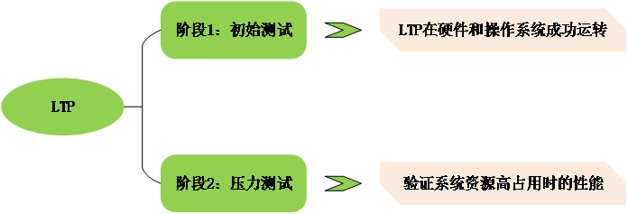

阶段1主要是保证LTP工具能够在linux平台上成功运转，主要涉及文件系统、硬盘I/O、命令验证等系统软件和硬件功能测试。如下图：

阶段2主要是在阶段1保证LTP工具能在硬件和操作系统正常运行基础上，进行压力测试，主要涉及NFS、多线程、内存管理、网络等的压力测试。如下图：

阶段2中，LTP开发团队将测试的方法进行了组合，在保持高强度系统压力的同时，尽量提高系统代码覆盖率。即让系统保持高压时候，确保更多的代码被执行到，让压力测试充分覆盖Linux内核代码，从系统资源占用情况和内核代码覆盖率多方面更有力地说明系统的稳定性、可靠性等。而其中统计Linux系统内核代码覆盖率的就是Gcov和Lcov两个工具。

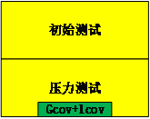

Gcov和Lcov组合工具对LTP的意义如上图所示，LTP包含Gcov和Lcov，两个主要在压力测试阶段发挥作用，配合压力测试数据对系统稳定性、健壮性、可靠性进行有力说明。

【如何解读Gcov、lcov、Gcovr三者关系】

Gcov is a test coverage program.这个是官方网站给出的最直观简洁的介绍，这句话也说明了其主要功能。

<主要功能&特点>

1. 统计每行代码的执行频率；

2. 统计实际执行代码行；

3. 统计代码执行效率（时间），可能需要配合其他工具；

4. 主要针对C/C++代码，其他语言代码请找对自己的坑；

5. 需要lcov等工具，将其转化为可视图形化覆盖率报告。

因为使用Gcov一般需要lcov和Gcovr两个工具，下文粗略介绍介绍lcov和Gcovr。

lcov，由一组构建于基于文本的 gcov 输出之上的 Perl 脚本构成，以实现基于 HTML 的输出。输出包括覆盖率百分比、图表以及概述页，可以快速浏览覆盖率数据。lcov 工具会生成一棵完整的HTML 树，其中包含代码的每一行以及关于每一行执行了多少次的数据（如果有的话）。这个工具会量化覆盖率数据并生成关于代码中每一部分和源码覆盖率的百分比。

Gcovr，主要是为了解决原配lcov数据量大的时候数据处理数据跟不上的问题。虽然说Gcovr和lcov形成报告形式不一样，但作用一样。其各自的样式如图5和图6，区别在于Gcovr生成覆盖率报告中并没有行数覆盖率。实际情况实际分析，不必深究。具体之间的关系如图7所示。

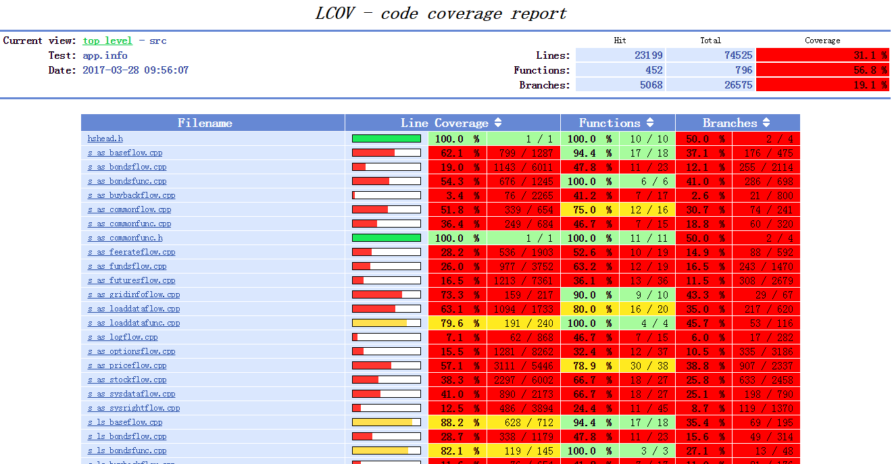

图5

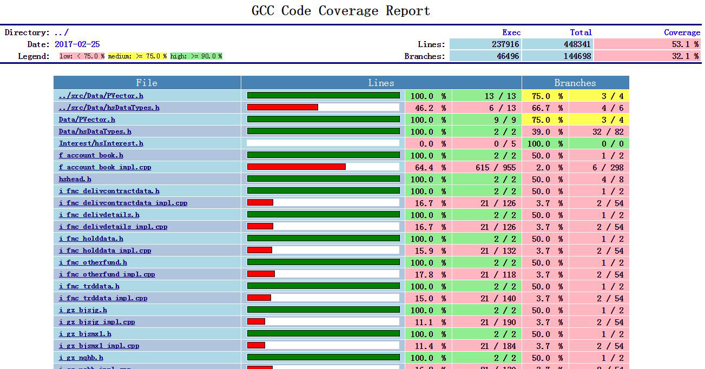

图6

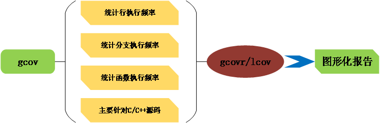

图7

【Gcov的工作原理】

首先，Gcov是集成在Gcc中的，随着Gcc一起发布。所以如果安装了完整的gcc，那么一般就安装了Gcov了。如图8，在Gcc源码中可以找到Gcov相关的源码。可以通过人为方式将Gcov源码提取出来，此处不做深究。

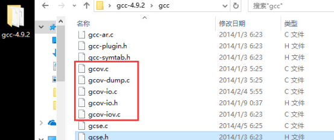

一. gcov实现根本：基本块BB、分支ARC、程序流图

● 基本块BB

Basic Block，程序中一个顺序执行的语句序列。只有一个出口语句和一个入口语句，执行时只能从入口语句入，从出口语句退出，基本块中的所有语句的执行次数一定是相同的，一般由多个顺序执行语句后跟一个跳转语句组成。

●分支ARC

从一个BB到另一个BB的跳转叫做一个ARC,要想知道程序中的每个语句和分支的执行次数，就必须知道每个BB和ARC的执行次数。

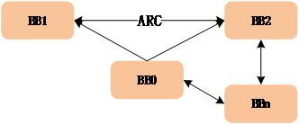

●程序流图

如果把BB作为一个节点，故同一函数中的所有BB就构成了有向图。要想知道程序中的每个语句和分支的执行次数，就必须知道每个BB和ARC的执行次数。根据图论可以知道有向图中BB的入度和出度是相同的，所以只要知道了部分的BB或者ARC大小，就可以推断所有的大小。Gcov选择由ARC的执行次数来推断BB的执行次数。故只需 统计部分ARC即可统计出所有BBheARC次数。

二. 编译选项和相关文件Gcda&Gcno

在编译前，必须在编译器参数中加入编译器参数-fprofile-arcs -ftest-coverage。其中，-ftest-coverage会生成.gcno文件，其中包含重建基本块图和相应的块的源码的行号的信息，主要负责程序流图的重构。.gcno文件在编译后就会出现。而.Gcda必须在执行完编译出的动态库才会产生，由-fprofile-arcs编译参数的编译后的文件运行所产生的，它包含了弧跳变的次数和其他的概要信息。

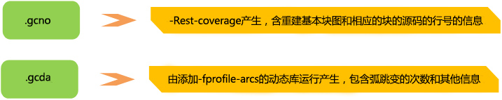

图10 .gcda/.gcno文件比较

其中.gcno和.gcda文件均为二进制文件，且这些处理均由gcc进行完成的，我们可采用16进制打开，如图11和图12所示，不具有可读性。

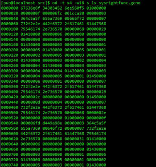

图11  gcno文件举例

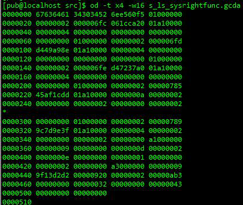

图12 gcda文件举例

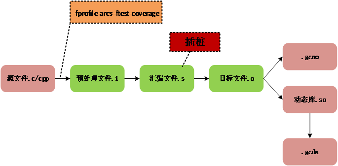

图13 生成.gcda/gcno工作流程

<主要工作流>

1. 编译前，在编译器中加入编译器参数-fprofile-arcs -ftest-coverage；

2. 源码经过编译预处理，然后编译成汇编文件，在生成汇编文件的同时完成插桩。插桩是在生成汇编文件的阶段完成的，因此插桩是汇编时候的插桩，每个桩点插入3~4条汇编语句，直接插入生成的*.s文件中，最后汇编文件汇编生成目标文件，链接成动态库；并且生成关联BB和ARC的.gcno文件；

3. 执行动态库，在运行过程中之前插入桩点负责收集程序的执行信息。所谓桩点，其实就是一个变量，内存中的一个格子，对应的代码执行一次，则其值增加一次；

4. 生成.gcda文件，其中有BB和ARC的执行统计次数等，由此经过加工可得到覆盖率。

*注意：直到生成.gcda文件，这些都是又gcc编译器进行处理。

三. 生成报告

其实前面一直都是Gcc进行处理，那么Gcov到底何用呢？其关键作用是对.gcno、.gcda、.C/CPP文件进行分析处理，因此这些文件必须保持一致配套。

Gcov分析的主要过程如下图：

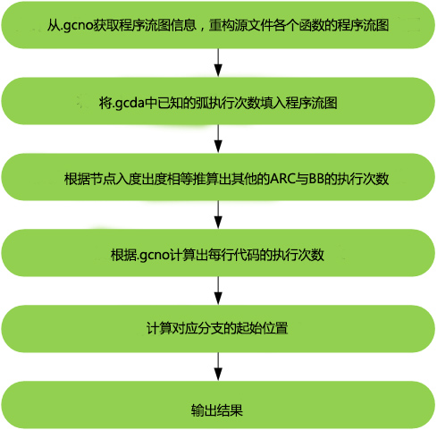

至此，可以采用Icov/Gcovr等将结果进一步处理成可视化的图形界面覆盖率报告，方便分析。