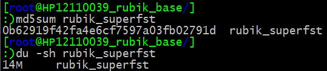
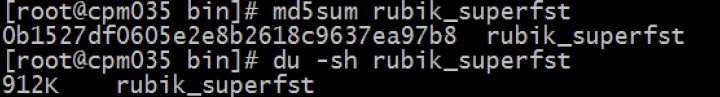
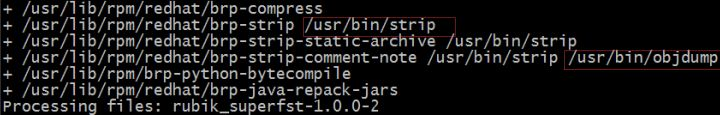
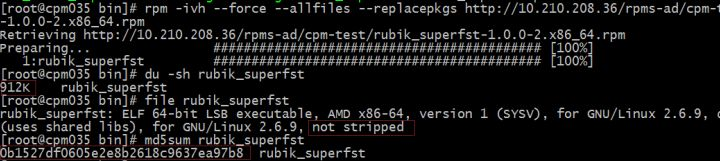
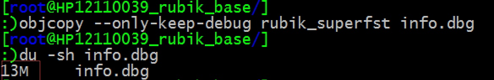
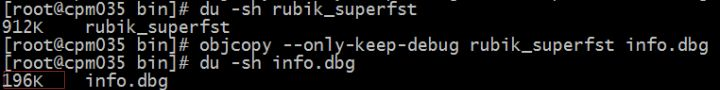
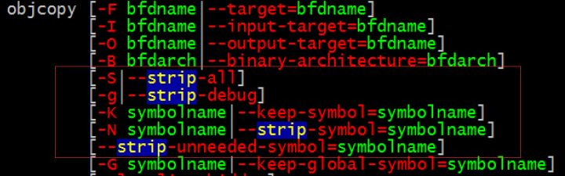
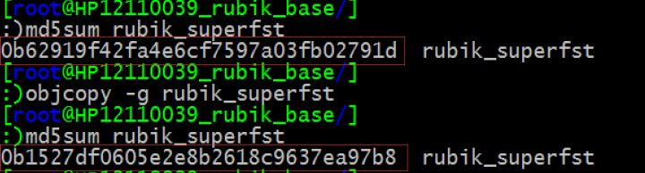
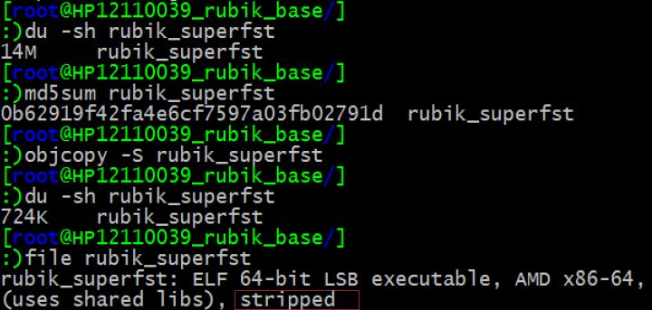

深入解析用rpmbuild 打rpm包时引起的打包前后文件大小变化的问题

转载fm_VAE 最后发布于2018-03-07 14:36:20 阅读数 1047  收藏

展开

源出处

缘起

你能看到的只是表面很少的一部分——冰山理论。

在编程排查问题时，我们经常遇到的情形就是，看似一个很小的点，深究起来却发现其背后隐藏着更深层次的技术逻辑。昨天的上线经历让我深有体会。

昨日上线，一切如旧。云淡风轻，茶香四溢。

焚香，沐浴，更衣，食素三日之后总该一切无忧了吧。

用 RPM 包在线上解包完成，轻泯了一口茶水，正准备手起键落重启服务。电光火石之间，感觉命运之神轻拍了一下我的肩膀：“还差点什么吧？” “额，好像是的，重启之前最好再得对比下文件内容，确保传输过程没问题”。例行公事而已，简直有些画蛇添足。

然而，对比文件内容之后，却发现 RPM 解包后得到的可执行文件和打包前文件的 md5 不一样。

前行

RPM 打包没报错，传输没报错，解包没报错。

看看文件大小，打包前可执行程序14M，但包中解出来的却只有900多 K，相差甚多。

这是打包前：

这是解包后：

处理过程没报错，但是文件内容不一样，一定是没看好，传错RPM包了。重新检查 spec 文件，重新打包，重新传输，每一步都小心翼翼。

解包之前先对比下RPM包的md5 吧。很好，这次传对了，两个RPM 包一样，刚才一定是传错文件了。

解包，品茗，手起键落，准备重启。又一次电光火石，感觉肩膀又被命运之神拍了一下。“好吧，再给你个面子”，对比一下可执行文件。

历史总是惊人的相似，解包后还是912 k。打包前14M，解包后大小缩减了这么多。

再来：打包没报错，传输没报错，解包没报错。但解出来程序却变小了，一定是幻觉。又对比了两次，幻觉依旧。

你信或不信，事实就在那里。各个过程都没错，可是就变小了。思考逻辑与事实的冲突，恐怕是最折磨人的吧。

再启航

过程没错，但文件却大小变化了，心中默念多次之后，突然想到：谁说文件变小了一定是错误？

对啊，变小不一定是错误。那一定是谁在某个过程中做了什么手脚。上面已经验证，传输前后RPM包内容一样，那只能是RPM在打包或解包时做了什么操作了，并且rpm 在做这个操作时没有报告。

决定从就从打包过程开始排查。打包输出信息中有这么几行：

strip，objdump，我们好像在哪见过。依稀记得strip 好像是用来去掉可执行文件中调试信息的，objdump 是用来处理可执行文件的。正好我程序中含有调试信息，那么会不会是rpm 调用的strip 把调试信息自作主张的去掉了呢？毕竟rpm 包通常是release 版本，调试信息的作用不大，自动删除也是有可能的。

曙光初现。用file 命令看一下解包后的文件信息：

”not stripped“ ，文件没有被strip。欲哭无泪，不禁想起了一句话—— 前途是光明的，道路是曲折的。

调试信息还在，那变小的原因是什么？你到底少了什么？！

调整心情，从头再来，一条路不行，再尝试另外一条路。创建包时的输出信息中，除了strip，还有objdump。这两个都是处理二进制可执行文件的。建包和解包都没有报错，但文件变小了，那少的只能是程序运行时无用的信息，无用的信息又只能是调试信息和无用的符号之类的，而file 显示额外信息还在，没被strip 掉。还在，还在。

又默念了多次之后，突然又灵光一闪：谁说strip信息还在就等于调试信息没变化呢？

strip 信息还在，并不代表调试信息没变化。思维定势害死人啊。那就看看打包前和解包后两个可执行文件中的调试信息数量有没有区别。

抱着试试看的心理，用如下命令把两个可执行文件中的调试信息写到了文件中：

objcopy --only-keep-debug rubik_superfst info.dbg

这是打包前程序生成的调试信息大小：

这是解包后程序生成调试信息大小：

果然不一样！已经隐约见到胜利灯塔上闪现的微光了。file 命令的障眼法，还是被我给瞧破了。

调试信息大小不一样，那么RPM 到底去除了哪些信息呢？看看objcopy 还有什么使用方法。

man objcopy

发现 objcopy 的参数中有好几个 strip 开头的选项：

既然是调试信息大小不一样，我们就先在打包前的程序上试试去除调试信息的选项 —strip-debug，即 -g 选项。

objcopy -g rubik_superfst

看看打包前的程序在执行这一命令后发生了哪些变化：

一次无意的尝试，竟获得了意想不到的结果。在未打包程序上执行完 objcopy -g 得到的文件，竟然和RPM 包解包后变小的程序完全一样。这说明了什么？这说明了 RPM 做的操作就是执行了 objcopy -g 命令！

既然调试信息还是被 strip 了，那么就 google 一下如何保留调试信息吧。只要在 spec 文件中加入：

%define __strip /bin/true

万事大吉。再对比打包前和解包后的可执行文件，md5 完全一样。

一切如旧。云淡风轻，茶香四溢。

RPM，终究你还是没逃出我的掌心。食素、焚香、沐浴、更衣，终究是有用的。

那么，file 命令为什么对已经去掉了调试信息的程序还会显示 “not stripped” 呢？file 命令的 man page 中并没有对 strip 进行明确的说明。发现上面 objcopy 命令有好几个strip 选项，那就试试吧。

梦想还是要有的，万一实现了呢？尝试的勇气还是要有的，万一有发现新大陆呢？

先看 strip-all 选项，这个看上去是去除了所有无用信息，应该对 file 有效：

果然有效！但是 strip-debug 对file 命令就无效，用gdb查看时，strip-all 也删除了调试信息的符号，看来strip-all 中应该还删除了除调试符号外的其他符号，而 file 命令关注的就是这些内容。感兴趣的同学可以继续研究。本篇就不做扩展了。

结语

此次调试，小有心得：

- 别看现在闹得欢，小心将来拉清单。别高兴的太早，码农前进的路上从来不缺的就是坑。

- 排除掉所有不可能的因素，剩下的即使再不可思议，也是真实答案。

- 吾爱吾师，但吾更爱真理。这个spec 文件是根据前辈使用的文件改进的，本来觉得万无一失，没想到还是会有一些问题。

- 世事洞明皆学问。文件大小变化看似是一个不起眼的小问题，但抽丝剥茧深究起来还真的学到不少东西。

- bug 一定有线索。要重视程序的输出或log，及早发现bug 的线索在排查问题时能节约不少时间。

- 排查问题时一定要深度思考，不要病急乱投医，东试一下，西试一下。想清楚当前问题的症结在哪，从症结出发一步步前进，直至找到问题的最根本原因。

- 跳出思维定势，跳出思维定势，跳出思维定势。换个角度考虑问题会有不一样的收获。