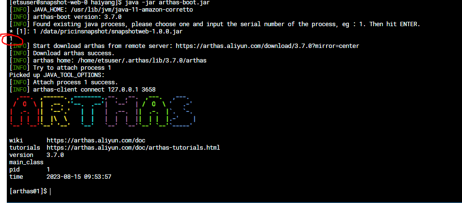
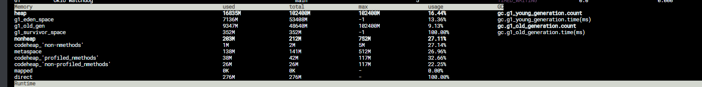

Arthas 分析工具

中文文档地址：[https://arthas.aliyun.com/doc/](https://arthas.aliyun.com/doc/)

二、生产环境安装使用

如果生产环境可以连接互联网，则可以使用在线下载使用的方式：

curl -O [https://alibaba.github.io/arthas/arthas-boot.jar](https://alibaba.github.io/arthas/arthas-boot.jar)

java -jar arthas-boot.jar

chmod 777  arthas-boot.jar

如果生产环境是内网的话，可以下载完整的安装包：

[https://github.com/alibaba/arthas/releases](https://github.com/alibaba/arthas/releases)

解压后进入目录启动arthas

**注意！！要使用跟运行程序相同的用户，先ps -aux确定用户，sudo su - 再su etsuser**

java -jar arthas-boot.jar

上面启动后给出了please choose one and hit RETURN的提示，表示让我选择粘连的应用，后面就可以对该应用做分析处理。

可以直接输入应用前面的序号：

现在就进入了arthas的控制终端，可以使用dashboard查看全局的线程及内容使用情况：

使用sc calss-name来查找某一个类是否存在

使用sm查看某一个类里面所有的方法

使用 vmtool --action getInstances --className com.refinitiv.timeseries.snapshot.message.SnapshotResponse 来查看这个类有多少个对象

Jmap 查看哪个实例占用大量内存

[etsuser@snapshot-web-0 haiyang]$ jmap -histo:live 1 | head -20
num     #instances         #bytes  class name (module)
-------------------------------------------------------
   1:        204858     5047689800  [B (java.base@11.0.15)
   2:         61892       73813096  [Ljava.lang.Object; (java.base@11.0.15)
   3:        458808       29363712  java.util.LinkedHashMap$Entry (java.base@11.0.15)
   4:        579752       18552064  java.lang.String (java.base@11.0.15)
   5:         20080       13654400  io.micrometer.shaded.io.netty.util.internal.shaded.org.jctools.queues.MpscArrayQueue
   6:         26835       11676992  [Ljava.util.HashMap$Node; (java.base@11.0.15)
   7:         13104        8910720  io.grpc.netty.shaded.io.netty.util.internal.shaded.org.jctools.queues.MpscArrayQueue
   8:          1842        8884304  [C (java.base@11.0.15)
   9:         32499        5199840  java.lang.reflect.Method (java.base@11.0.15)
  10:         24606        4748144  java.lang.Class (java.base@11.0.15)
  11:         96268        4620864  java.util.concurrent.ConcurrentHashMap$Node (java.base@11.0.15)
  12:          1266        2522320  [Ljava.util.concurrent.ConcurrentHashMap$Node; (java.base@11.0.15)
  13:         13840        2323056  [I (java.base@11.0.15)
  14:         24841        2186008  java.util.LinkedHashMap (java.base@11.0.15)
  15:         29346        1408608  java.util.HashMap$Node (java.base@11.0.15)
  16:         36147        1200512  [Ljava.lang.Class; (java.base@11.0.15)
  17:         53720         859520  java.lang.Object (java.base@11.0.15)
  18:         11204         806688  org.apache.tomcat.util.buf.ByteChunk

[Monday 11:38 AM] Wang, Haiyang

JDK_JAVA_OPTIONS: -server -XX:+UseG1GC -XX:+UnlockExperimentalVMOptions -XX:+PrintGC -XX:+PrintGCDetails -XX:InitialHeapSize=16g -XX:MaxHeapSize=100g -XX:MaxGCPauseMillis=400 -XX:G1HeapRegionSize=32M -XX:MaxDirectMemorySize=1g -XX:+HeapDumpOnOutOfMemoryError -XX:+ParallelRefProcEnabled -XX:MaxTenuringThreshold=10 -XX:InitiatingHeapOccupancyPercent=10 -XX:+UseStringDeduplication -XX:MaxMetaspaceSize=512M -XX:+UseContainerSupport -XX:G1MaxNewSizePercent=50 -XX:ParallelGCThreads=16 -XX:ConcGCThreads=12 -XX:G1MixedGCLiveThresholdPercent=30 -Xlog:gc*,age*,ergo*:file=./logs/$(MY_POD_NAME)/gc-%t.log:tags,utctime,level:filecount=30,filesize=10m 

I use the above opts, but the current memory usage exceed the 90g, Wang, Bingbing, as calculated, the memory will be recycled when usage > 100(XX:MaxHeapSize) * 50%(XX:G1MaxNewSizePercent) + 100 * 10%(XX:InitiatingHeapOccupancyPercent) = 60g, right? 

[Monday 11:39 AM] Wang, Haiyang

localCache.expireAfterWrite=10

localCache.maxCacheItems=20000

[Monday 11:39 AM] Wang, Bingbing

No XX:G1MaxNewSizePercent) is to limit eden generation size

[Monday 11:41 AM] Wang, Bingbing

young generation will be triggered after  100 * 10 (XX:InitiatingHeapOccupancyPercent) reached

[Monday 11:41 AM] Wang, Bingbing

old generation is be triggered after 100 * 30(-XX:G1MixedGCLiveThresholdPercent)% = 30G