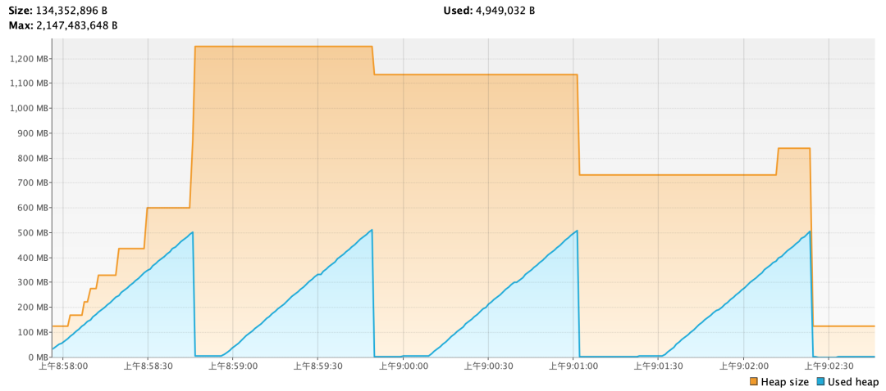
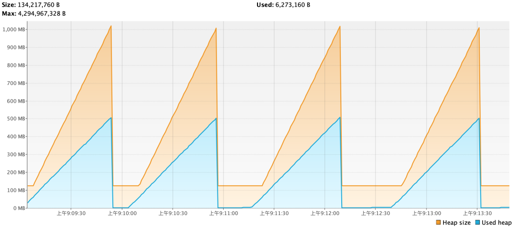
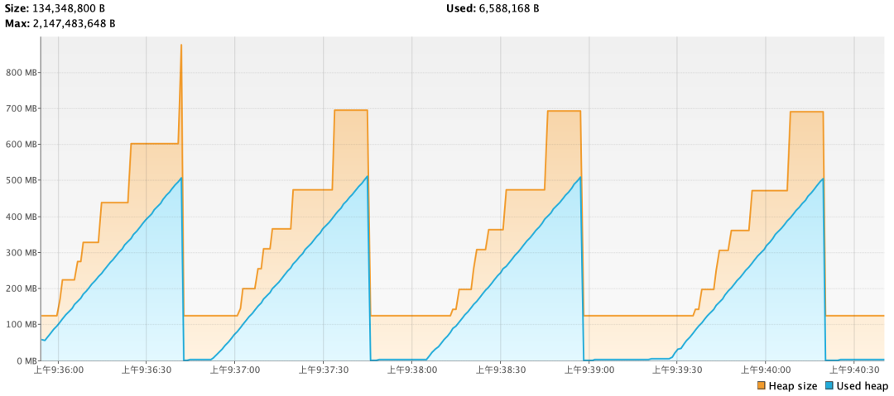
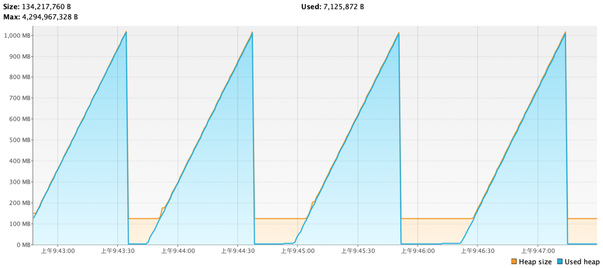

### 前言

公司众多系统中有一个系统使用的是 CMS 垃圾回收器，JVM 初始堆内存不等于最大堆内存，但通过监控信息发现：在经过一次 FullGC 之后，服务器物理内存剩余空间并未提升，运维同事告诉我说，有内存泄露，因为 GC 了之后，内存并没有被释放。按照大部分人的理解，FullGC 之后 JVM 进程会释放的内存一部分还给物理内存，下面通过几个实验来对比验证一下 CMS 和 G1 的物理内存归还机制。

### 测试代码

```go
public class MemoryRecycleTest {static volatile List<OOMobject> list = new ArrayList<>();public static void main(String[] args) {//指定要生产的对象大小为512Mint count = 512;//新建一条线程,负责生产对象new Thread(() -> {try {for (int i = 1; i <= 10; i++) {System.out.println(String.format("第%s次生产%s大小的对象", i, count));addObject(list, count);//休眠40秒Thread.sleep(i * 10000);}} catch (InterruptedException e) {e.printStackTrace();}}).start();//新建一条线程,负责清理List,回收JVM内存new Thread(() -> {for (; ; ) {//当List内存到达512M,就通知GC回收堆if (list.size() >= count) {System.out.println("清理list.... 回收jvm内存....");list.clear();//通知GC回收System.gc();//打印堆内存信息printJvmMemoryInfo();}}}).start();//阻止程序退出try {Thread.currentThread().join();} catch (InterruptedException e) {e.printStackTrace();}}public static void addObject(List<OOMobject> list, int count) {for (int i = 0; i < count; i++) {OOMobject ooMobject = new OOMobject();//向List添加一个1M的对象list.add(ooMobject);try {//休眠100毫秒Thread.sleep(100);} catch (InterruptedException e) {e.printStackTrace();}}}public static class OOMobject {//生成1M的对象private byte[] bytes = new byte[1024 * 1024];}public static void printJvmMemoryInfo() {//虚拟机级内存情况查询long vmFree = 0;long vmUse = 0;long vmTotal = 0;long vmMax = 0;int byteToMb = 1024 * 1024;Runtime rt = Runtime.getRuntime();vmTotal = rt.totalMemory() / byteToMb;vmFree = rt.freeMemory() / byteToMb;vmMax = rt.maxMemory() / byteToMb;vmUse = vmTotal - vmFree;System.out.println("");System.out.println("JVM内存已用的空间为：" + vmUse + " MB");System.out.println("JVM内存的空闲空间为：" + vmFree + " MB");System.out.println("JVM总内存空间为：" + vmTotal + " MB");System.out.println("JVM总内存最大堆空间为：" + vmMax + " MB");System.out.println("");}
}

```

### JDK8 CMS

「JVM参数」：

```go
-Xms128M -Xmx2048M -XX:+UseConcMarkSweepGC

```

「控制台打印的内容」：

```go
第1次生产512大小的对象
清理list.... 回收jvm内存....JVM内存已用的空间为：6 MB
JVM内存的空闲空间为：1202 MB
JVM总内存空间为：1208 MB
JVM总内存最大堆空间为：1979 MB第2次生产512大小的对象
清理list.... 回收jvm内存....JVM内存已用的空间为：3 MB
JVM内存的空闲空间为：1097 MB
JVM总内存空间为：1100 MB
JVM总内存最大堆空间为：1979 MB第3次生产512大小的对象
清理list.... 回收jvm内存....JVM内存已用的空间为：3 MB
JVM内存的空闲空间为：706 MB
JVM总内存空间为：709 MB
JVM总内存最大堆空间为：1979 MB第4次生产512大小的对象
清理list.... 回收jvm内存....JVM内存已用的空间为：3 MB
JVM内存的空闲空间为：120 MB
JVM总内存空间为：123 MB
JVM总内存最大堆空间为：1979 MB

```

「VisualVM监控的堆内存情况」：



VisualVM监控的堆内存情况

从图中堆内存的情况可以看出，在 JDK8 + CMS 的配置下，JVM 并不是立马归还内存给到操作系统，而是随着 FullGC 次数的增多逐渐归还，最终会全部归还

### JDK8 G1

「JVM参数」：

```go
-Xms128M -Xmx2048M -XX:+UseG1GC

```

「VisualVM监控的堆内存情况」：



VisualVM监控的堆内存情况

在 JDK8 + G1 的配置下，JVM 都是在每一次 FullGC 后全部归还物理内存。

### JDK11 CMS

「JVM参数」：

```go
-Xms128M -Xmx2048M -XX:+UseConcMarkSweepGC

```

「VisualVM监控的堆内存情况」：


VisualVM监控的堆内存情况

在 JDK11 + CMS 的配置下和 JDK8 + CMS 的情况相同（JVM 并不是立马归还内存给到操作系统，而是随着 FullGC 次数的增多逐渐归还，最终会全部归还）

JDK11 提供了一个 JVM 参数ShrinkHeapInSteps 。通过这个参数，可以在 GC 之后渐进式的归还内存给到操作系统。JDK11 下，此参数默认开启。可以把此参数关闭，看下堆内存的变化情况：

```go
-Xms128M -Xmx2048M -XX:+UseConcMarkSweepGC -XX:-ShrinkHeapInSteps

```

「VisualVM监控的堆内存情况」：



VisualVM监控的堆内存情况

在 JDK11 + CMS 的配置下，关闭ShrinkHeapInSteps参数后，JVM 都是在每一次 FullGC 后全部归还物理内存。

### JDK11 G1

由于 JDK11 默认使用的是 G1 垃圾回收器，所以这里只设置了初始堆内存和最大堆内存。

「JVM参数」：

```go
-Xms128M -Xmx2048M

```

「VisualVM监控的堆内存情况」：



VisualVM监控的堆内存情况

1. JDK11 默认的ShrinkHeapInSteps是默认开启的，但这里看堆内存变化并不是渐进的缩小的。所以在 G1 回收器下，ShrinkHeapInSteps是无效的。如果我们手动关闭ShrinkHeapInSteps参数，发现堆内存变化和上面这个类似

1. JDK11 下的 G1 和 JDK8 下的 G1 对内存的响应是不一样的。从堆内存变化来看,「JDK11 下 G1 更加倾向于尽可能的利用内存，不着急回收」。而 JDK8 下 G1 则是倾向于尽可能的先回收内存。从图中看，JDK8 下 G1 的实际使用的堆内存大小基本是 JDK11 下 G1 的一半。

### 小结

如果代码保持不变，但是JVM参数中设置Xms和Xmx相同的话，不管是否有FullGC，堆内存大小都不发生变化，也就不释放内存给操作系统

GC 后如何归还内存给操作系统：

- 能不能归还，主要依赖于 Xms 和 Xmx 是否相等

- 何时归还，主要依赖于 JDK 版本和垃圾回收器类型

只有 FullGC 的时候才能真正触发堆内存收缩归还 OS。YGC 是不能使 JVM 主动归还内存给操作系统的。

尽量保持 Xms 和 Xmx 一致，这样可以减少堆内存调整带来的性能损耗，也可以减少堆内存调整带来的无内存风险。

[http://www.taodudu.cc/news/show-4203580.html?action=onClick](http://www.taodudu.cc/news/show-4203580.html?action=onClick)