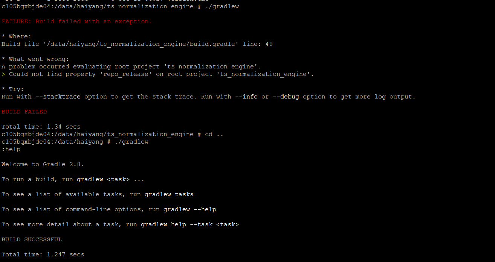

setting.gradle错误

如果出现[ERROR] [org.gradle.BuildExceptionReporter] groovy/lang/Closure

考虑重新放一份新的gradle文件夹，里面包含gradle-wrapper.properties和gradle-wrapper.jar两个文件。

临时挂代理env http_proxy=webproxy.lon.corp.services:80 https_proxy=webproxy.lon.corp.services:80 no_proxy=*.thomsonreuters.com