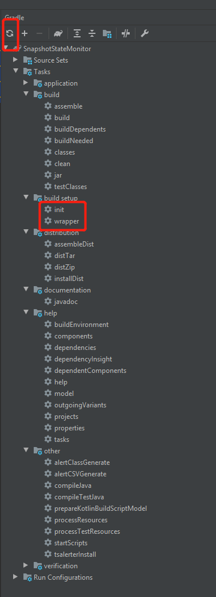

gradle/wrapper/gradle-wrapper.properties

```javascript
distributionBase=GRADLE_USER_HOME
distributionPath=wrapper/dists
distributionUrl=https\://services.gradle.org/distributions/gradle-6.4.1-bin.zip
zipStoreBase=GRADLE_USER_HOME
zipStorePath=wrapper/dists
```

在idea里，改了gradlew 要重新init和刷新



