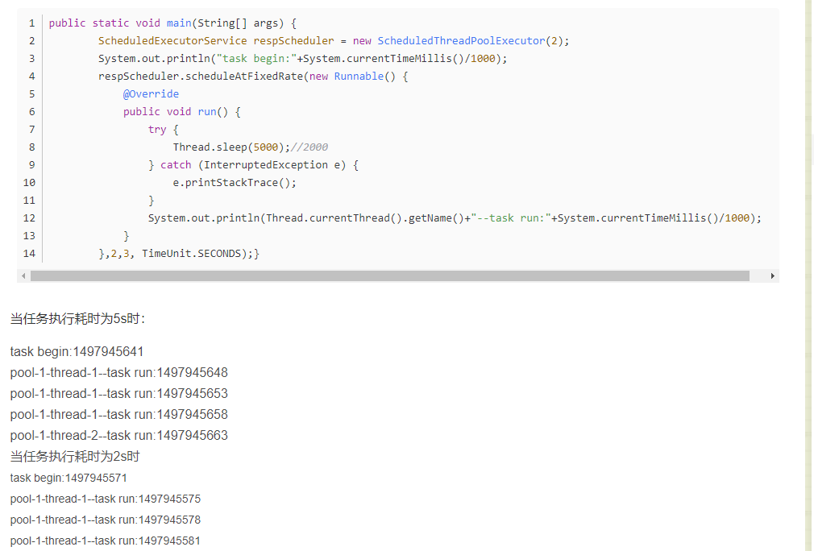
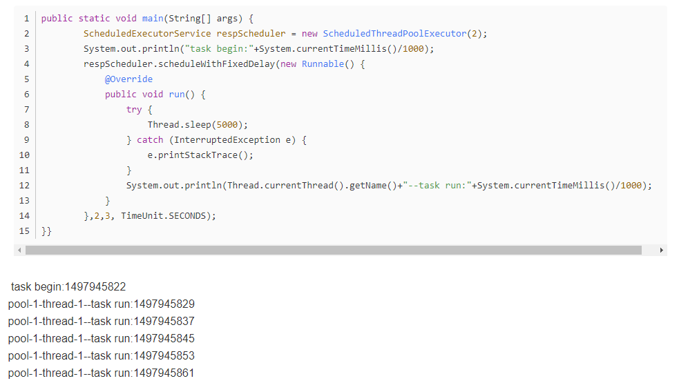
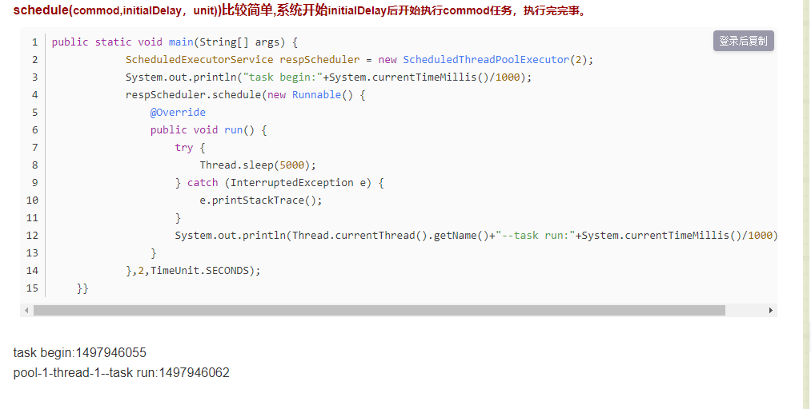
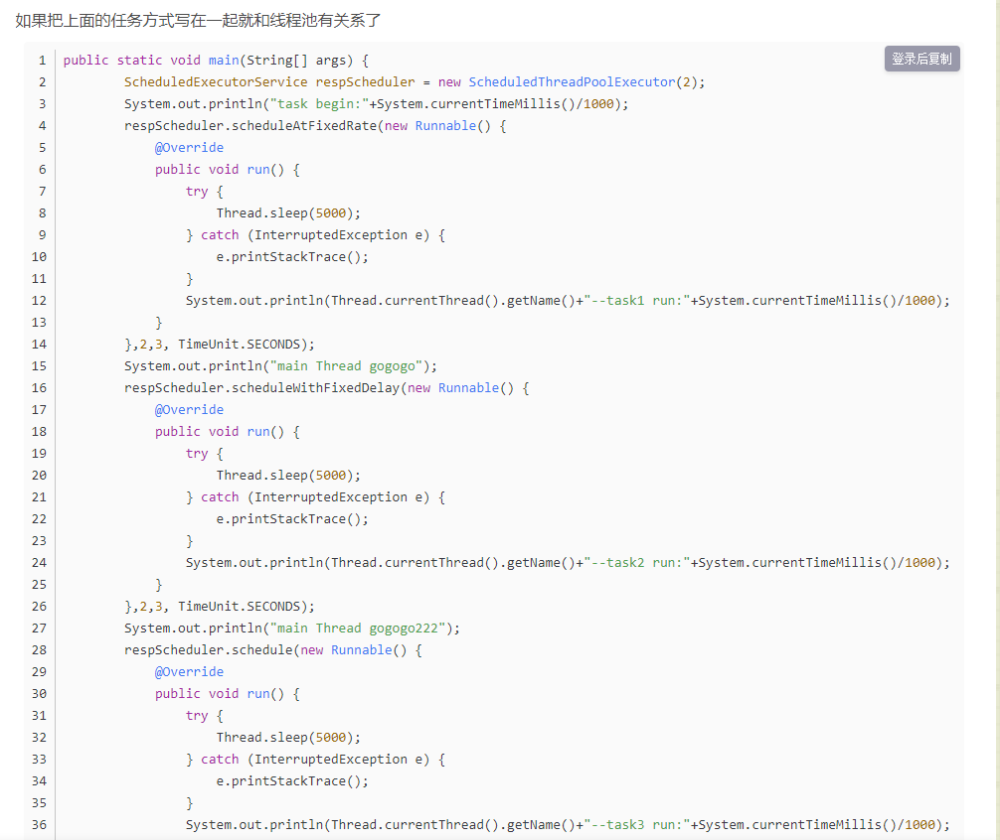
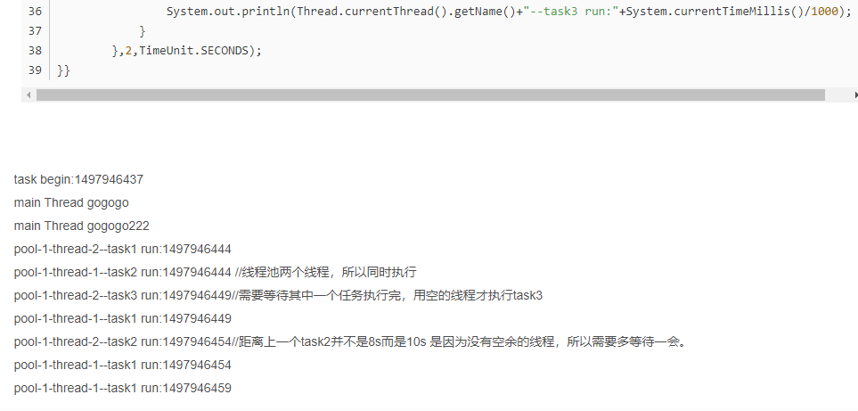

通过java在做定时任务的时候最好使用scheduleThreadPoolExecutor的方式，因为这样可以保证里面始终以后线程是活的。scheduleThreadPoolExecutor有三种任务

执行的方式：

scheduleAtFixedRate(commod,initialDelay,period,unit)

initialDelay是说系统启动后，需要等待多久才开始执行。

period为固定周期时间，按照一定频率来重复执行任务。

如果period设置的是3秒，系统执行要5秒；那么等上一次任务执行完就立即执行，也就是任务与任务之间的差异是5s；

如果period设置的是3s，系统执行要2s；那么需要等到3S后再次执行下一次任务。

scheduleWithFixedDelay(commod,initialDelay,delay,unit)

initialDelay是说系统启动后，需要等待多久才开始执行。

period为固定周期时间，按照一定频率来重复执行任务。

这个方式必须等待上一个任务结束才开始计时period。

如果设置的period为3s;任务执行耗时为5S那么下次任务执行时间为第8S

