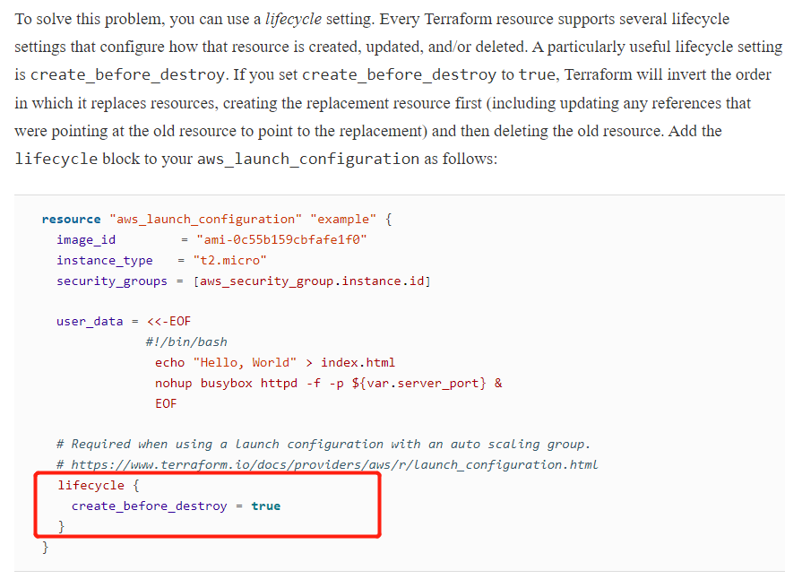

正常引用一个变量

```javascript
#optional
output "snapshot_web_service_dns" {
  value = kubernetes_service.snapshot-web-service.load_balancer_ingress.0.hostname
}
```

引用时

```javascript
data "aws_lb" "nlb" {
  name = split("-", kubernetes_service.snapshot-web-service.load_balancer_ingress.0.hostname)[0]
}
```


如果想用一个module的变量，需要将其output出来，才能引用

 /modules/services/webserver-cluster/outputs.tf

```javascript
output "asg_name" {
  value       = aws_autoscaling_group.example.name
  description = "The name of the Auto Scaling Group"
}
```

引用时

prod/services/webserver-cluster/main.tf

```javascript
resource "aws_autoscaling_schedule" "scale_out_during_business_hours" {
  scheduled_action_name = "scale-out-during-business-hours"
  min_size              = 2
  max_size              = 10
  desired_capacity      = 10
  recurrence            = "0 9 * * *"

  autoscaling_group_name = module.webserver_cluster.asg_name
}

resource "aws_autoscaling_schedule" "scale_in_at_night" {
  scheduled_action_name = "scale-in-at-night"
  min_size              = 2
  max_size              = 10
  desired_capacity      = 2
  recurrence            = "0 17 * * *"

  autoscaling_group_name = module.webserver_cluster.asg_name
}
```

