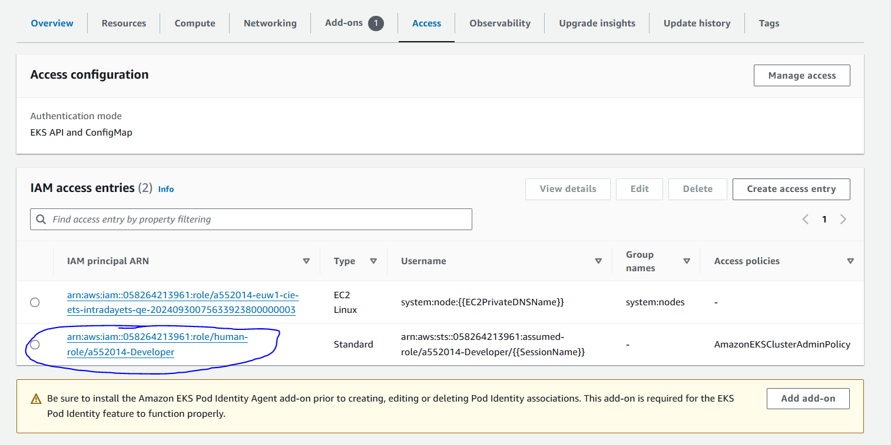

```
locals {
  iam_role_additional_policies = {
    AmazonSSMManagedInstanceCore = "arn:aws:iam::aws:policy/AmazonSSMManagedInstanceCore"
    CloudWatchAgentServerPolicy  = "arn:aws:iam::aws:policy/CloudWatchAgentServerPolicy"
  }

  post_bootstrap_user_data = <<EOF
    #!/bin/bash
    yum install -y aws-cli
    yum install -y amazon-ssm-agent
    systemctl enable amazon-ssm-agent
    systemctl start amazon-ssm-agent
  EOF

  self_managed_groups_default = {
    metadata_options = {
      http_endpoint               = "enabled"
      http_tokens                 = "required"
      http_put_response_hop_limit = 2
    }
    ebs_optimized         = true
    block_device_mappings = {
      xvda = {
        device_name = "/dev/xvda"
        ebs = {
          volume_size           = 100
          volume_type           = "gp3"
          iops                  = 3000
          encrypted             = true
          delete_on_termination = true
        }
      }
    }
    post_bootstrap_user_data     = "${local.post_bootstrap_user_data}\n${var.post_bootstrap_user_data}"
    iam_role_additional_policies = merge(local.iam_role_additional_policies, var.node_iam_role_additional_policies)
  }
}

self_managed_groups = {
  ets_qe = {
    # Auto scaling group
    name                      = replace(module.ts_tags.name_template, format("-%s", module.ts_tags.name_placeholder), "ets-qe-group")
    use_name_prefix           = true
    subnet_ids                = var.eks_subnet_enterprise_ids
    min_size                  = var.qe_node_min_size
    max_size                  = var.qe_node_max_size
    desired_size              = var.qe_node_desired_size
    health_check_grace_period = 300
    instance_refresh = {
      strategy = "Rolling"
      preferences = {
        min_healthy_percentage = 0
        instance_warmup        = 300
      }
    }
    autoscaling_group_tags     = yamldecode(replace(module.ts_tags.tags_template, module.ts_tags.name_placeholder, "ets-qe-group"))
    use_mixed_instances_policy = true
    mixed_instances_policy = {
      instances_distribution = {
        on_demand_allocation_strategy            = "prioritized"
        on_demand_base_capacity                  = "0"
        on_demand_percentage_above_base_capacity = "100"
        spot_allocation_strategy                 = "lowest-price"
        spot_instance_pools                      = 10
        spot_max_price                           = ""
      }
      override = var.override_instance_types
    }
    termination_policies = ["NewestInstance"]
    ami_type             = "AL2_x86_64"
    ami_id               = "ami-03ff53b0c01c8318c"
    instance_type        = var.instance_type
    bootstrap_extra_args = "--kubelet-extra-args '--node-labels=work-group=ets-qe-group'" # 注意是空格， 不是=
    # launch template
    launch_template_name       = replace(module.ts_tags.name_template, format("-%s", module.ts_tags.name_placeholder), "qe-lt")
    launch_template_tags       = yamldecode(replace(module.ts_tags.tags_template, module.ts_tags.name_placeholder, "ets-qe-group"))
    launch_template_use_name_prefix = true
    # IAM role
    iam_role_name                 = replace(module.ts_tags.name_template, format("-%s", module.ts_tags.name_placeholder), "ets-qe")
    iam_role_use_name_prefix      = false
    iam_role_tags                 = yamldecode(replace(module.ts_tags.tags_template, module.ts_tags.name_placeholder, "ets-qe-group"))
  }
}
```

```
module "eks" {
  source                                    = "terraform-aws-modules/eks/aws"
  version                                   = "20.24.2"
  cluster_name                              = local.cluster_name
#   authentication_mode                       = "CONFIG_MAP"
  enable_cluster_creator_admin_permissions  = true # if false will can't connect to the cluster
  cluster_enabled_log_types                 = var.cluster_enabled_log_types
  cloudwatch_log_group_retention_in_days    = var.cluster_log_retention_in_days
  cluster_addons                            = {
                                                ebs-csi = {
                                                  name = "aws-ebs-csi-driver",
                                                  addon_version = "v1.33.0-eksbuild.1",
                                                  resolve_conflicts_on_create = "OVERWRITE",
                                                  resolve_conflicts_on_update = "OVERWRITE"
                                                }
                                              }
#   cluster_addons_timeouts                   = {create = "30m"}
  cluster_version                           = "1.30"
  vpc_id                                    = var.vpc_id
  subnet_ids                                = var.eks_subnet_enterprise_ids
  cluster_endpoint_private_access           = false
  cluster_endpoint_public_access            = true
  cluster_endpoint_public_access_cidrs      = ["0.0.0.0/0"]
  node_security_group_id                    = aws_security_group.qe_node_sg.id
  cluster_security_group_use_name_prefix    = true
  iam_role_use_name_prefix                  = true
  create_cloudwatch_log_group               = false
  cluster_timeouts                          = {create=var.cluster_create_timeout, delete=var.cluster_delete_timeout}
  tags                                      = yamldecode(replace(module.ts_tags.tags_template, module.ts_tags.name_placeholder, "ets_intraday"))
#   warm_ip_target                            = var.warm_ip_target
#   minimum_ip_target                         = var.minimum_ip_target
  self_managed_node_group_defaults          = local.self_managed_groups_default
  self_managed_node_groups                  = local.self_managed_groups
  # kms
  create_kms_key                            = false
  cluster_encryption_config = {
    provider_key_arn = module.kms.key_arn
    resources        = ["secrets"]
  }
#   enable_kms_key_rotation                   = true
#   kms_key_administrators                    = local.kms_key_administrators
#   kms_key_deletion_window_in_days           = 7
#   kms_key_aliases                           = [local.cluster_name]
#   kms_key_enable_default_policy             = true
}
```

enable_cluster_creator_admin_permissions

参数在 Terraform EKS 模块中用于控制在创建 EKS 集群时，是否为集群创建者授予管理员权限。以下是对该参数的详细解释：

参数作用

- 参数名称: bootstrap_cluster_creator_admin_permissions

- 类型: 布尔值 (true 或 false)

- 默认值: 通常为 false，但具体取决于模块的实现和版本。

功能描述

当 **bootstrap_cluster_creator_admin_permissions** 设置为 **true** 时，创建 EKS 集群的用户（即集群创建者）将被授予管理员权限。这意味着该用户将能够管理集群中的所有资源和配置。这对于初始设置和配置集群非常重要，尤其是在使用 **CONFIG_MAP** 作为集群认证模式时。

使用场景

- 初始配置: 在创建 EKS 集群时，如果需要集群创建者拥有完全的管理员权限，可以将此参数设置为 true。

- 安全性: 确保只有特定用户或角色在集群创建时拥有管理员权限，以便进行初始配置和管理。

- 



查看boostrap log 

**/var/log/cloud-init-output.log**

**查看kubelet log**

**journalctl -u kubelet**

**如果有** --kubelet-extra-args，那么会相关的配置会声称在kubelet service的路径下， /etc/systemd/system/kubelet.service.d