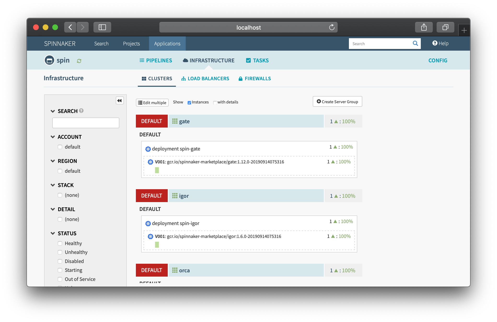

https://medium.com/swlh/deploying-helm-charts-w-terraform-58bd3a690e55

Deploying Helm Charts w. Terraform

Using Terraform Helm Provider to Deploy Helm Charts

Joaquín Menchaca (智裕)

Jan 1, 2020 · 7 min read

One interesting Terraform provider is the Helm provider that can install Helm Charts. This can be useful for situations like:

- Setting up Kubernetes cluster with some additional add-ons like nginx-ingress, external-dns, etc.

- Deploy Kubernetes application using values from resources provisioned outside of Kubernetes, such as an S3 bucket.

This article demonstrates how to use create a module that deploy Helm Chart onto an Amazon EKS cluster and will cover the following:

- Automatically use credentials for your AWS administration account to authorize access to Kubernetes. You don’t have to fuss with tokens, secrets, kubeconfig files, etc.

- Using Terraform template create Helm values file for use with deploying a Helm chart.

Installing the Tools

For this tutorial you need the following:

- AWS CLI needed to interact with AWS cloud resources. A profile with administrative access should be setup.

- EKSCtl (eks-cuttle or exseey-cuttle) tool to easily create an EKS cluster.

[Note: This is optional if you decide to use Terraform to stand up the cluster]

- KubeCtl (koob-cuttle), the Kubernetes client tool, to interact with EKS

- Helm v2 to install applications on a Kubernetes cluster (Helm 2 explicitly, see below)

- Terraform CLI to manage Kubernetes and AWS resources, as well as create an EKS cluster.

- Bash Shell is not strictly required, but the commands in this tutorial are tested with bash [Note: this is default in mac OS and popular Linux distros, or msys2 with Windows].

NOTE: The current version of Terraform Helm Provider requires Helm v2 + Tiller. Hopefully this will change soon with future update.

Helm2 on macOS

brew install helm@2

Helm2 on Windows

choco install kubernetes-helm --version=2.16.1

Helm2 on Linux

URL=https://raw.githubusercontent.com/helm/helm/master/scripts/get

curl $URL > get_helm.sh

chmod 700 get_helm.shDESIRED_VERSION="v2.16.1" ./get_helm.sh

Part 0: Setup Project Area

In order to organize project files for scripts in this article, we’ll store them in eks-helm directory:

export PROJECT_HOME=$HOME/projects/eks-helm

mkdir -p $PROJECT_HOME && cd $PROJECT_HOME

Part 1: Setup Amazon EKS Cluster

We can use either eksctl or terraform to create an initial cluster.

Method 1: Using eksctl

eksctl create cluster \

  --name=beautiful-hideout \

  --kubeconfig=beautiful-hideout-kubeconfig.yaml

This process will take about 20 minutes. Once completed, test the results:

# point KUBECONFIG to only our cluster

export KUBECONFIG=$PROJECT_HOME/beautiful-hideout-kubeconfig.yaml

# test kubectl works on new kubernetes cluster

kubectl get all --all-namespaces

Make note of the region you are using. You can see where it is installed using:

$ eksctl get clusters 

NAME                REGION

beautiful-hideout   us-east-2

You can set the some variables for use with Terraform by doing this:

export TF_VAR_region=$(

  eksctl get clusters | awk '/beautiful-hideout/{ print $2 }'

)export TF_VAR_eks_cluster_name=$(

  eksctl get clusters | awk '/beautiful-hideout/{ print $1 }'

)

We’ll use variables later.

Method 2: Using Terraform

We can create this small script that will create our cluster. Run this to create a eks_cluster.tf script:

cat <<-CLUSTER_EOF > eks_cluster.tf

variable region {}

variable eks_cluster_name {}                                               module "eks-cluster" {

  source           = "github.com/darkn3rd/eks-basic?ref=v0.0.1"                        

  region           = var.region                            

  eks_cluster_name = var.eks_cluster_name                       

}

CLUSTER_EOF

Now we should export some environment variables before we run this script:

export TF_VAR_region=us-east-2

export TF_VAR_eks_cluster_name=beautiful-hideout

Once these are set, we can initialize the modules and providers, then apply the script:

terraform init

terraform apply

This will take roughly 20 minutes, and afterward, we can test that the cluster works:

# point KUBECONFIG to only our cluster

export KUBECONFIG=$PROJECT_HOME/kubeconfig_beautiful-hideout

# test kubectl works on new kubernetes cluster

kubectl get all --all-namespaces

Part 2: Tiller Requirement

As of this writing, Tiller is still required for the Helm Provider. We can install Tiller using the Kubernetes Provider.

Create a small script for tiller:

cat <<-TILLER_EOF > eks_tiller.tf

variable region {}

variable eks_cluster_name {}module "eks_tiller" {

  source           = "github.com/darkn3rd/eks-tiller?ref=v0.0.1"                        

  region           = var.region                            

  eks_cluster_name = var.eks_cluster_name                       

}

TILLER_EOF

Now we need to initiliaze the module and providers and apply it:

terraform init

terraform apply

At this stage, you’ll want to verify that helm works (make sure you are using helm v2 for the helm command):

helm ls

If this works without returning an error, then Helm works.

Part 4: Setup Terraform Application Structure

We’ll use Spinnaker as an example application and configure Spinnaker to use S3 buckets instead of the default Minio.

1. Setup

Create this structure below with these files (output of tree -F my_modules):

my_modules/

└── spin_s3/

    ├── locals.tf

    ├── main.tf

    ├── provider.tf

    ├── values.yaml.tpl

    └── variables.tf

With Bash shell, you can do this using:

cd $PROJECT_HOME

mkdir -p my_modules/spin_s3/

pushd my_modules/spin_s3/

touch ./{provider.tf,variables.tf,main.tf,locals.tf,values.yaml.tpl}

popd

2. Versions

We want to specify the version of Terraform any any providers we will use for this module. Edit the spin_s3/version.tf and add the following:

spin_s3/version.tf

3. Providers

First we’ll define the providers we’ll use with this project, which are AWS and Helm providers. Edit the spin_s3/provider.tf and add the following:

spin_s3/provider.tf

4. Variables

Now we’ll define the variables we’ll use for this by editing spin_s3/variables.tf and add the following:

spin_s3/variables.tf

Part 5: S3 Bucket

Edit the spin_s3/bucket.tf file and add these contents:

spin_s3/bucket.tf

This will create an S3 bucket and IAM User with the name we specify with bucket_name. This uses some modules that I created earlier for this tutorial. These s3 modules were inspired from Cloud Posse git repositories.

Part 6: Helm Chart Values Template

We’ll use Terraform template to create our Helm Chart values.

1. Template

Edit the spin_s3/values.yaml.tpl file and add these contents.

spin_s3/values.yaml.tpl

We’ll need to pass the variables later using templatefile().

2. Locals

We’ll create some local variables that we can use to process data. Edit the spin_s3/locals.tf file and add these contents:

We’ll create our helm_char_values by using templatefile() and supplying the path to our template along with a map template_vars.

The template_vars map will contain variables supplied to the template, including module output from the s3_bucket module.

Part 7: Using Helm Chart

Edit the spin_s3/chart.tf file and add these contents:

First we add the repository to our charts in case it is not already available. Then we install are chart stable/spinnaker along with helm chart values that we rendered earlier using are template.

Part 8: Installing The Chart

1. Preparation

First we need to supply some variables for use with our project. We can initialize our variables using enviroment variables and setup these three:

1. TF_VAR_region

1. TF_VAR_eks_cluster_name

1. TF_VAR_bucket_name

We can set these values with this:

export TF_VAR_bucket_name=$(

  echo ${TF_VAR_eks_cluster_name}-$(date +'%s')-bucket

)

2. Initialization

Now we need to initialize the providers and modules we use in this project:

cd $PROJECT_HOME/my_modules/spin_s3 && terraform init

3. Installing the Helm Chart with Terraform

Now we can run this:

terraform plan

terraform apply

Part 9: Accessing the Application

Once this completes above, we will need to forward ports to localhost, so that we can access the service:

export DECK_POD=$(kubectl get pods \

  --namespace default \

  -l "cluster=spin-deck" \

  -o jsonpath="{.items[0].metadata.name}")export GATE_POD=$(kubectl get pods \

  --namespace default \

  -l "cluster=spin-gate" \

  -o jsonpath="{.items[0].metadata.name}"

)kubectl port-forward --namespace default $GATE_POD 8084 &

kubectl port-forward --namespace default $DECK_POD 9000 &

Afterwards, you can point your browser to localhost:9000:

Part 10: Clean Up

Remove Spinnaker Helm Chart and S3 Buckets

Remove Spinnaker application and persistence S3 Buckets

cd $PROJECT_HOME/my_modules/spin_s3

terraform destroy

Here’s something interesting to consider, if you only want to destroy the Spinnaker application, such as installing a new version of Spinnaker, but preserve all the pipelines you configured, you can target only the helm chart with this:

terraform destroy --target=helm_release.default

This allows you to reinstall a new version of Spinnaker, but have the underlying persistent pipelines intact.

Note: If this is something that needs to be done routinely, then the s3 bucket should be put into a separate module, so that it can be removed independent of the Spinnaker infrastructure.

Remove Tiller from Kuberenetes

This will remove the tiller from the Kubernetes cluster.

cd $PROJECT_HOME

terraform destroy --target=module.tiller

Note: normally, --target shouldn’t be used for routine use, but it done here to illustrate how to uniquely remove tiller.

Remove Amazon EKS Cluster

If we were using eksctl to create the cluster, we can do this:

cd $PROJECT_HOME

eksctl delete cluster --name=beautiful-hideout

Otherwise, if we used terraform to create the cluster, we can do this:

cd $PROJECT_HOME

terraform destroy

Conclusion

The purpose of this exercise is to introduce a new capability of Terraform through the Helm provider. The Spinnaker application is used here strictly for demonstration purposes.

The big question you should be asking is would I want to do this?

For the application layer, when installing a robust application like Spinnaker, I would hesitate to use interactive Terraform for orchestration as it adds an extra layer of troubleshooting.

This solution for application layer could be useful to get off the ground with infrastructure as code, but may be better to switch something like a Kubernetes operator that can provision AWS resources. This is one of those it depends scenariors, weighing the pros and cons of each solution.

For the infrastructure layer, especially where you can Kubernetes addons that integrate into AWS cloud, this could be useful to have a single module build a Kubernetes cluster with all the desired integration, such as kube2iam, ExternalDNS with Route53, or ALB ingress controller.