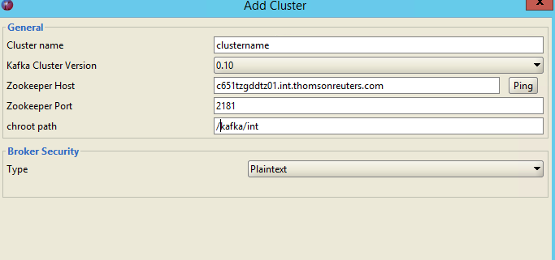

we can use kafkatool to create topic

1, check the kafka server on ingestor feeder config

ingestor_collectionbusadapterconfig.xml:   

 <metastreamconsumer bootstrap.servers="xetslamq01.int.thomsonreuters.com:9092,xetslamq02.int.thomsonreuters.com:9092,xetslamq03.int.thomsonreuters.com:9092" enable.auto.commit="true" kafkacommitcount="1"

2. login the xetslamq01.int.thomsonreuters.com by au account

check the config on /opt/kafka/kafka_2.11-1.1.0/config/server.properties

zookeeper.connect=c651tzgddtz01.int.thomsonreuters.com:2181,c211qpeddtz02.int.thomsonreuters.com:2181,c383gzyddtz03.int.thomsonreuters.com:2181/kafka/int

3.add cluster

4 right click topics, add topic