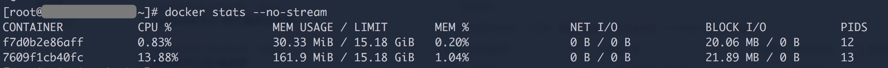
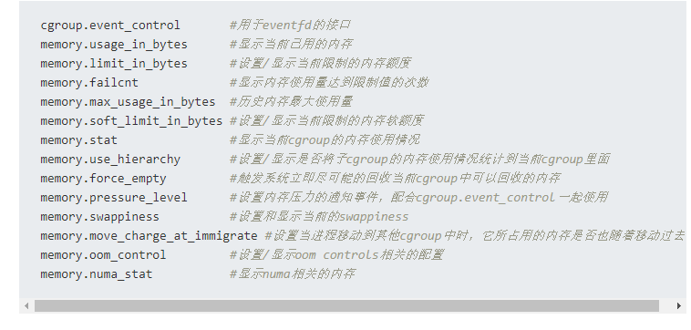

https://www.cnblogs.com/reposkeeper-wx/p/Docker-CPU-Usage.html

背景

当一台机器上跑有多个 Docker Container 的时候，我们需要知道，哪些容器占用了多少资源。采集这些指标，来让我们可以更加好的分配资源给每个 Container。

获取容器CPU使用率

正好，这两天碰到一个需求。需要我们在监控 Host 的 CPU 时候，同时将每个容器的 CPU使用率 也要拿到。

平常我们来看容器的资源占用，通过 stat 命令就可以





这里的字段 CPU 表示了CPU的使用率。

但是这样的命令结果我们要拿到并做处理的时候并不方便。不过，据说 Docker Daemon 还有 API 接口，可以用来直接获取JSON格式的数据。

来来来，接口搞起来……

当我拿到数据的时候，我是拒绝的：

"cpu_stats" : {
    "cpu_usage" : {
       "percpu_usage" : [
          8646879,
          24472255,
          36438778,
          30657443
       ],
       "usage_in_usermode" : 50000000,
       "total_usage" : 100215355,
       "usage_in_kernelmode" : 30000000
    },
    "system_cpu_usage" : 739306590000000,
    "throttling_data" : {"periods":0,"throttled_periods":0,"throttled_time":0}
 }


这都是些什么鬼……

其实，要理解上面的数据，要现有一些前序的知识

Linux 如何计算CPU使用率

在 Linux 中，CPU 可不是像一个有刻度的尺子一样，把百分比刻在上面，CPU使用了多少，就把刻度记录一下。

实际上，CPU使用率的计算是通过时间比率计算的。简单来说，CPU只会有两种状态： 忙(被占用)、闲(空闲)。当我们把1s的时间分成1000份，也就是以毫秒为单位来看待CPU的时候。

假设下面两种情况：

1. 假设有一个进程占用了 CPU 250ms；那么整个CPU在1s的维度上来看，他的使用率是25%。

1. 假设有两个进程一起使用CPU，每个都是用了 500ms；那么整个CPU使用率是 100%，每个进程占用了 50%


实际上，Linux对于CPU的使用分配和记录远比这个要复杂。比如，还要记录是系统调用的CPU占用呢 还是用户的CPU占用呢，还是等待IO的占用呢，等等。CPU时间的分配工作也是非常复杂，Linux中采用了完全公平调度器(Completely Fair Scheduler)来分配CPU。

继续深入就有点跑题了。这些东西会在今年后续的文章中陆续谈到。

那么，实际上， Linux Kernel 将 CPU 使用的信息记录在哪了呢？这个信息记录在了 /proc/stat 这个文件中。

它看起来就像下面这样：

# intr 那个字段太长，截断掉了
[root@sean ~]# cat /proc/stat
cpu  1344357 729 298522 107841813 41774 0 1754 0 0 0
cpu0 1344357 729 298522 107841813 41774 0 1754 0 0 0
intr 206534153 29 10 0 0 154 .......
ctxt 317949799
btime 1524823711
processes 677986
procs_running 3
procs_blocked 0
softirq 66031632 2 35326999 1 2928073 535817 0 32 0 0 27240708


我们关心的是第一行的意义。通过查看 man 5 proc，可以确定它的具体意义

user   (1) 用户模式花费的CPU时间
nice   (2) 低优先级用户态花费的CPU时间
system (3) 系统模式花费的CPU时间
idle   (4) 空闲的CPU时间
iowait (since Linux 2.5.41)
       (5) 等待IO的CPU时间
irq (since Linux 2.6.0-test4)
       (6) 中断花费的CPU时间
softirq (since Linux 2.6.0-test4)
       (7) 软中断花费的时间
steal (since Linux 2.6.11)
       (8) 被虚拟环境其他操作系统占用的CPU时间
guest (since Linux 2.6.24)
       (9) 在Linux内核的控制下为客户操作系统运行一个虚拟CPU花费的时间。
guest_nice (since Linux 2.6.33)
       (10) 同上，低优先级的。


这些加起来，就是花费的CPU总体时间。

Container 如何记录CPU使用

这个文件中，记录了所有的进程花费的总的开销，并不能标识出某一个 Container 总共花费了多少。那如何找出 Container 的开销呢？

这个就要看 CGroup 的了。

Linux下的Container技术依赖于 CGroup(Control Group)，它不仅仅追踪进程组，还会暴露 CPU、Memory、IO 使用率的指标出来。CGroup 通过伪文件系统的方式将它们记录下来。在最近几个版本的发行版中，一般会放在 /sys/fs/cgroup 中。

在这个文件夹下，可以看到多个子文件夹，代表了 cgroup 记录的各个分类

[root@test cgroup]# pwd
/sys/fs/cgroup
[root@test cgroup]# ll
total 0
dr-xr-xr-x 3 root root  0 May 10 12:59 blkio
lrwxrwxrwx 1 root root 11 Jan 29 12:07 cpu -> cpu,cpuacct
lrwxrwxrwx 1 root root 11 Jan 29 12:07 cpuacct -> cpu,cpuacct
dr-xr-xr-x 3 root root  0 May 10 12:59 cpu,cpuacct
dr-xr-xr-x 3 root root  0 May 10 12:59 cpuset
dr-xr-xr-x 3 root root  0 May 10 12:59 devices
dr-xr-xr-x 3 root root  0 May 10 12:59 freezer
dr-xr-xr-x 3 root root  0 May 10 12:59 hugetlb
dr-xr-xr-x 3 root root  0 May 10 12:59 memory
dr-xr-xr-x 3 root root  0 May 10 12:59 net_cls
dr-xr-xr-x 3 root root  0 May 10 12:59 perf_event
dr-xr-xr-x 3 root root  0 May 10 12:59 pids
dr-xr-xr-x 5 root root  0 May 10 12:59 systemd


对于 Docker 来说，在每一个分类下，都会有一个 docker 的文件夹，来记录docker相关的信息。而docker container 的信息，则记录在 更下一层的目录中，以 container 的 全ID 为目录名。以记录container CPU相关的信息为例，目录应该在 /sys/fs/cgroup/cpu/docker/<container-full-id>。

对于 CPU 来说，Linux 使用了 The CPU Accounting (cpuacct) 子系统。它会定期自动汇报有关 CGroup中 任务使用 CPU 资源的使用情况。

cpuacct 有三种汇报记录：

- cpuacct.stat Group中 CPU 总共的使用时间（纳秒为单位），包含所有类型的CPU消耗

- cpuacct.usage Group中 用户模式 和 系统模式 各自使用的 CPU时间。这个汇报的单位是 1/100 秒，在 Linux 中也叫"user jiffies"。文件中有两个字段

- user 用户使用的 CPU时间

- system 系统使用的 CPU 时间

- cpuacct.usage_percpu 每个 CPU 的使用时间

total 0
-rw-r--r-- 1 root root 0 May  9 18:22 cgroup.procs
-r--r--r-- 1 root root 0 May 10 13:07 cpuacct.stat
-rw-r--r-- 1 root root 0 May 10 13:07 cpuacct.usage


这就是，到现在为止，我们需要的所有前置知识啦。下面我们回到主题。

/container/<cid>/stats API 的CPU数据如何来的？

这些数据就是我们上面两个小节所讲的地方拿来的。

"cpu_stats" : {
    "cpu_usage" : {
       "percpu_usage" : [
          8646879,
          24472255,
          36438778,
          30657443
       ],
       "usage_in_usermode" : 50000000,
       "total_usage" : 100215355,
       "usage_in_kernelmode" : 30000000
    },
    "system_cpu_usage" : 739306590000000,
    "throttling_data" : {"periods":0,"throttled_periods":0,"throttled_time":0}
 }


cpu_usage 中的所有的值 是从 cpuacct.usage、cpuacct.usage_percpu、cpuacct.stat 获取。

system_cpu_usage 从 /proc/stat 中获取。

⚠️ 这里需要注意的是，这三个文件中，cpuacct.stat 使用的单位和 其他两个是不一样的，在获取数据的代码中，要将以 USER_HZ 单位的值转为 以纳秒为单位的值。

来看看代码

- 获取 usage_in_usermode 和 usage_in_kernelmode

- 获取 percpu_usage

- 获取 total_usage

- 获取 system_cpu_usage

有了数据，怎么计算 Container CPU 使用率

代码在此

我把它贴在下面，分析一下：

func calculateCPUPercentUnix(previousCPU, previousSystem uint64, v *types.StatsJSON) float64 {
    var (
        cpuPercent = 0.0
        // calculate the change for the cpu usage of the container in between readings
        cpuDelta = float64(v.CPUStats.CPUUsage.TotalUsage) - float64(previousCPU)
        // calculate the change for the entire system between readings
        systemDelta = float64(v.CPUStats.SystemUsage) - float64(previousSystem)
    )

    if systemDelta > 0.0 && cpuDelta > 0.0 {
        cpuPercent = (cpuDelta / systemDelta) * float64(len(v.CPUStats.CPUUsage.PercpuUsage)) * 100.0
    }
    return cpuPercent
}


有同学说，有了系统总时间，有了Container总时间，做一个简单的除法运算就可以完成比例的运算过程：

Container CPU使用率 = container CPU使用总时间 / 系统CPU的总时间 * CPU核数

注意，注意！这个是有问题的。

注意，注意！这个是有问题的。

注意，注意！这个是有问题的。

前面讲过了，这个数值是 使用CPU的时间，如果计算的时候抛开了时间的概念，那么肯定是不对的。在刚才那个算式中，有一个假设的前提：Container启动的时间 和 系统的启动时间 是一样的。这明显是不对的。

所以，参见上面的代码。Docker 在计算 Container 的 CPU使用率 的时候，会取两次数值，通过两次数值的差值再计算使用率。

其他 metrics

我们的文章主要介绍了如何获取CPU使用率。但是，其他的指标也是同样的方法，比如内存使用，IO使用。

源码在我贴出的代码片段附近就可以看到，有兴趣的同学可以继续深入研究下。

Reference

If you want to check pods cpu/memory usage without installing any third party tool then you can get memory and cpu usage of pod from cgroup.

1. Go to pod's exec mode kubectl exec pod_name -- /bin/bash

1. Go to cd /sys/fs/cgroup/cpu for cpu usage run cat cpuacct.usage

1. Go to cd /sys/fs/cgroup/memory for memory usage run cat memory.usage_in_bytes

1. cat /sys/fs/cgroup/memory/memory.usage_in_bytes

NOTE: This usage is in bytes.




Code

https://github.com/moby/moby/blob/eb131c5383db8cac633919f82abad86c99bffbe5/cli/command/container/stats_helpers.go#L175-L188


https://www.jianshu.com/p/eecd730f3482

```javascript

```

